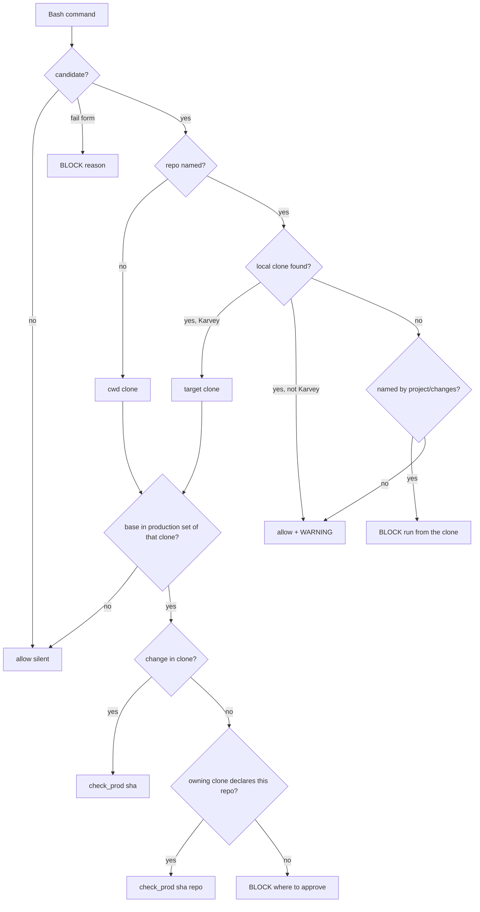

# Architecture: prod-gate-scope (hotfix 3.12.1)

**Lane:** hotfix · **Security Tier:** 2 · **Requirements:** REQ-HF-001..030 (approved, D-45) · **Decisions:**
D-15, D-34, D-35, D-37, D-43, D-45 · **Skipped:** mockup and design_graphic (no UI: hooks, guards, state tool and
skill text only), infra (no cloud, no pipeline change).

## Summary

Every change sits inside the plugin's existing components; no new process, no new dependency (Python 3 stdlib,
bash). Five areas:

| Area | Component | Requirements | Incidents |
|---|---|---|---|
| A. Approval hook scope and its one line | `karvey_lib/approval.py`, `guards.approval_hook` | HF-001..004, 029 | BUG-138, BUG-143 |
| B. State tool: multi-repo binding, refusal text | `karvey-state.py`, `schemas/spec.schema.json` | HF-005, 006, 009, 030 | BUG-144 |
| C. Prod-gate: target repo, owning repo, REST, outside a repo | `karvey_lib/guards.py` (+ new `karvey_lib/restcalls.py`, `karvey_lib/clones.py`) | HF-007, 008, 010..015, 024..026 | BUG-141 |
| D. Protect-paths read-only listings | `karvey_lib/guards.protect_paths` | HF-016 | BUG-139 |
| E. Session identity | `karvey_lib/karvey_hooks.py`, `karvey_lib/livestate.py`, `hooks/karvey-session-context.sh`, `karvey-checkpoint` skill | HF-020..023 | BUG-140 |
| F. Typed production OK | `karvey-deploy` skill, `lint-plugin.py` (new check) | HF-027, 028 | BUG-142 |

Fail modes are unchanged (REQ-HF-018): prod-gate and protect-paths fail closed, approval hook fails open with
its line, session hook never blocks and shows no profile content on an error.

## Engineering-standards conformance gate

Stdlib only; no `shell=True` (existing unit test); every subprocess with a timeout inside the pre-bash network
budget (`NET_BUDGET_S`); no credential from a command is logged, stored or sent (REST parsing keeps the URL
path and the body keys it needs, never headers or `user:pass@`); public text company-neutral; every new branch
of a guard has a guard-table row or a unit test written red first.

## 1. Components and boundaries

### 1.1 A — Approval hook (`approval.resolve_prod_scope`, `approval.answer_line`)

`approval_hook` keeps the plan path of 3.12.0 (`scope_for`). For `kind == prod` it calls the new
`resolve_prod_scope(root, cleaned, ids_here, active)` → `{scope | None, why, candidates, phrase}`:

1. Named ids in this tree (word-bounded, longest first, as `scope_for`): exactly one → that change (HF-001);
   two or more → no marker, "one approval covers one change; send one message per change" (HF-004).
2. Otherwise, *change-like tokens* (`[a-z0-9]+(-[a-z0-9]+)+`, 3..63 chars) that are not ids here are looked
   up: other worktrees of the clone (`git worktree list --porcelain` → `<wt>/docs/spec/changes/<tok>/spec.json`),
   then local and remote-tracking branches (`git for-each-ref` + one `git ls-tree --name-only <ref>
   docs/spec/changes/` per ref, cap 50 refs). Found → no marker, the line names the worktree path, else the
   branch (HF-002); not found anywhere → no marker, "not in this tree and no worktree or branch holds it".
3. No token → `pj.active_change`: exactly one active → that change, the line says "the only active change; your
   message named none" (HF-003); none or several → no marker, list the candidates.

`answer_line(verdict, result)` builds the single line (HF-029). The hook also prints one line when
`classify` did not approve but the de-quoted prompt holds an approval term anywhere **and** a prod term
(negation, question, position rule): `prod approval NOT recorded: <classify reason> — type: «<phrase>»`.
Phrase: `aprobado para producción <id>` when the prompt is Spanish-worded (a Spanish approve or prod term
matched), else `approved for production <id>`; `<id>` is the single candidate or `<change-id>`. Errors →
`prod approval NOT recorded: internal error (<type>)` and the audit record (fail open).

### 1.2 B — State tool

- `spec.json:repos` (optional): array of non-empty strings, schema + semantic check (HF-005).
- `approve <id> prod --repo <name> --sha <40|64-hex>` (HF-006): requires `check_prod(root, id)` ok without a
  sha (complete, audited, unexpired), `name ∈ spec.repos`, a full lowercase hex sha; writes
  `ledger.prod.repos[name] = sha` through `_update_ledger` (expiry untouched); same sha again is idempotent,
  another sha is refused ("a new commit needs a new OK", D-35). No marker is consumed (the binding is part of
  the one approval).
- `check_prod(root, id, sha=None, repo=None)`: with `repo`, the base approval must be ok (sha not compared with
  `head_sha`) and `prod.repos[repo] == sha`; else `missing=["repo"]` (HF-009). `check-prod --repo` exposes it.
- Refusal of `approve <id> prod` (HF-030): new `approval.describe_markers(root, ttl, now)` lists every marker
  file in the approvals dir: `<kind> <scope> <age> min (live|expired|consumed)`; the message is `found: … —
  missing: <piece>; the human types «aprobado para producción <id> PR #<n> v<version>»`. Pieces: no marker /
  a plan marker / a marker of another change / expired / consumed.

### 1.3 C — Prod-gate

New module `karvey_lib/clones.py` (local-clone lookup, no network):

- `repo_names(root)` → names a clone answers to: basename of the main clone (`git rev-parse
  --git-common-dir`'s parent), and the last path segment of each remote URL (`.git` stripped; Azure
  `_git/<name>`); plus `owner/name` for GitHub/GitLab URLs.
- `search_roots(ctx, cwd)` → the session project (`ctx.root`), its worktrees, the immediate children of the
  session project's parent and of the cwd's parent (cap 200 entries), paths listed in `project.json:repos`
  (entries with `/`), and the cwd's clone. Memoised per call.
- `find_clone(ctx, cwd, name)` → first clone whose names contain `name` (or `owner/name`).
- `is_karvey(root)` = `pj.is_karvey_project`. `karvey_named(ctx, name)` → named by the session project's
  `project.json:repos` or any of its changes' `spec.json:repos`.

New module `karvey_lib/restcalls.py` (pure parsing, no I/O except reading a `-d @file` body under the cwd,
max 256 KB): turns `curl`, `wget`, `http`/`https` (HTTPie), `Invoke-RestMethod`/`Invoke-WebRequest`
(`pwsh -c`), `az rest`, `gh api`, `glab api` segments into `Request(method, url, body, unreadable, variable)`;
and classifies a request against the endpoint table:

| Kind | Pattern (path) | Completing when |
|---|---|---|
| `pr-complete` Azure | `_apis/git/repositories/<repo>/pullrequests/<n>` PATCH | body `status: completed` or `autoCompleteSetBy` |
| `pr-complete` GitHub | `repos/<o>/<r>/pulls/<n>/merge` PUT | always (method not GET) |
| `pr-complete` GitLab | `projects/<id>/merge_requests/<n>/merge` PUT | always |
| `ref-write` | GitHub `repos/<o>/<r>/git/refs/…`, `…/merges`; Azure `…/repositories/<r>/refs` POST | write method |
| `pipeline-approve` Azure | `_apis/pipelines/approvals` PATCH | an item with `status: approved` |
| `pipeline-approve` GitHub | `repos/<o>/<r>/actions/runs/<id>/pending_deployments` POST | `state: approved` |
| `unsupported-approve` | `_apis/release/approvals`, GitLab `deployments/<id>/approval`, other hosts | approve |

Reads (GET/HEAD, no body), non-completing PATCHes and rejections → not a candidate (HF-013). A URL or body with
`$`/backticks that matches an endpoint, or a fully variable URL whose body holds a completing/approving key,
or a body from stdin / an unreadable file, → `fail` candidate (HF-015). `python -c`, `node -e`, `ruby -e`,
`perl -e` and PowerShell script text that names a completion/approval endpoint → `fail` candidate.

`_evaluate_candidate` gains a **target step** before `find_root` (HF-024, 014, 026):

1. `target_name` from the candidate: `-R/--repo`, a PR URL selector (`/<o>/<r>/pull/<n>`,
   `/_git/<r>/pullrequest/<n>`, `/-/merge_requests/<n>`), `az --repository`, the REST URL.
2. No name → 3.12.0 behaviour (the cwd's clone; outside a Karvey project → inert).
3. Name → the cwd's clone if it answers to the name, else `find_clone`. Found and Karvey → `root` = that clone
   (flow, production set, ledger, `pr_info` cwd all from it). Found and not Karvey → allow + one `prod-gate
   WARNING: <name> is not a Karvey repo — not gated` line (audited). Not found → `karvey_named` → block "cannot
   tie <name> to a local clone; run it from the clone"; else → the same warning, allow.
4. When the host's answer carries a URL (`gh … --json url`), its `<o>/<r>` must equal the named repo; a
   mismatch blocks.

Base gating (HF-025) is `production_set` evaluated in the target clone (unchanged rule, D-15).

**Owning repo** (HF-007, 008): when `released_change` finds no change in the target clone, the id is taken from
the head branch (`<prefix><id>`) or the `[Deploy] <id>` title; `find_owner(ctx, root, id)` searches
`search_roots` for a Karvey clone holding `docs/spec/changes/<id>/spec.json`. Found and `spec.repos` contains
one of the target's names → `check_prod(owner, id, sha=released, repo=<that name>)`; the ALLOW line names the
owning repo. Otherwise BLOCK with the HF-008 text (owner path, the human's step, `approve <id> prod --repo <name>
--sha <head>` to run there; or the places looked at and "clone the owning repo next to this one or list its
path in project.json repos").

**Pipeline approvals** (HF-012): Azure → `az rest --method get --url <org>/<project>/_apis/pipelines/approvals/
<id>?$expand=steps` gives the run id (`pipeline.owner.id`), then `az pipelines runs show --id <run>` gives
`sourceBranch`/`sourceVersion`; GitHub → `gh api repos/<o>/<r>/actions/runs/<id>` gives
`head_branch`/`head_sha`. A non-production branch passes; a production one needs a change in the target clone
whose `check_prod` is ok and whose `head_sha` is the run commit or one of its parents (`git rev-list --parents
-n 1 <sha>` in the clone; an unknown commit blocks with "fetch the clone"). Anything unresolved blocks.

### 1.4 D — Protect-paths (BL-64)

The final "needle split by quoting" check accepts a call when every segment is one of: `READ_ONLY`; `echo` /
`printf` / `true` / `:` without a write redirection; a formatter fed by a pipe with no path argument
(`python3 -m json.tool`, `jq`, `sort`, `uniq`, `column`, `head`, `tail`); `git` with a `READ_ONLY_GIT`
subcommand. Any mutator, write redirection into anything but `/dev/null`, or `xargs`/`tee`/shell/`sh -c`
segment keeps the block (HF-016). The per-segment checks above it are unchanged.

### 1.5 E — Session identity

`livestate.find_team_root` stays (used by `/karvey-checkpoint`); the session path uses the new
`livestate.resolve_session_profile(start, cwd)`:

1. `top(d)` = `git -C d rev-parse --show-toplevel` (timeout 2 s). `start` = `CLAUDE_PROJECT_DIR`, `cwd` =
   `PWD`/`os.getcwd()`. Different tops → `ambiguous` (HF-021).
2. No top → `none` (the line is printed only when the 3.12.0 walk would have found a profile; elsewhere the hook
   stays silent, as today).
3. Candidates for top `T` with name `N` (main clone basename): solo `T/docs/spec/agent/`; team: the nearest
   `docs/spec/team.json` at or above `T` whose `roles` has the key `N` (no `ceo` fallback, no folder-name
   mapping below `T`); legacy: `.ceo-agentes` at or above `T` with `AGENT_<N>`. 0 → `unmapped`; 2+ →
   `ambiguous`; 1 → that profile.
4. Sensitive handoff (HF-022): front matter `sensitive: true` (first `---` block, ≤ 20 lines).
   `profile_repos(profile)` = the repos the team/legacy config maps to that role, or the repo holding
   `docs/spec/agent/`. The body is emitted only when `N` ∈ `profile_repos`; else one withheld line.
5. Lines: `profile not loaded: <reason> — candidates <role (repo)>…; run /karvey-checkpoint restore --profile
   <role|path> in the repo you work in`.

`karvey_hooks.py restore-profile <role|path>` (HF-023) prints the same context for a named profile (role looked
up in the team/legacy config, or a directory path), applying rule 4, or the list of profiles found. The
checkpoint skill gains `--profile` and calls it; `karvey-checkpoint save --sensitive` writes the front matter.
The bash degraded path mirrors 1–3 for solo and legacy (team needs python: one line "team mapping needs
python3") and greps the front matter for rule 4.

### 1.6 F — Typed production OK

`karvey-deploy` 2.9 asks in plain text and prints the phrase `«aprobado para producción {change-id} PR #{pr}
v{version}»` with the head commit; `AskUserQuestion` stays in its allowed tools for other questions. Lint
check `L-80` (L-37..L-75 are held by unmerged branches) scans `skills/**/SKILL.md` and `skills/karvey/rules/*.md` paragraph by paragraph:
a paragraph naming a question tool (`AskUserQuestion`, "question tool") and the production OK (`prod OK`,
`production OK`, `production approval`, `prod approval`, `prod marker`) without a negation (`never`, `not`,
`no`) before the tool name is an error with file and line.

## 2. Data model

- `spec.json`: `repos?: string[]` (minItems 1, items minLength 1).
- Release ledger `prod`: `repos?: {<name>: <sha>}` added inside the existing record; `expires_at` unchanged.
- Handoff front matter: `sensitive: true|false` (optional; absent = false).
- No change to markers or audit records; new audit `reason` values: `not-karvey-target`, `owner-repo`.

## 3. Security (Tier 2)

| Threat | Control |
|---|---|
| Approval reaches an unnamed change (BUG-138) | named change wins; unknown named change records nothing |
| Agent fabricates an approval via a question tool answer | the prod OK must be typed (hook only); lint forbids the instruction |
| Merge evaluated against the wrong repo (BUG-141) | target repo resolved from the command/host answer; mismatch blocks |
| REST / outside-a-repo merges unseen | REST endpoint table; unreadable/variable forms block; inline scripts block |
| Declared repo released without its own commit bound | `repos[name] == released sha`, bound only under a live audited approval |
| Profile or sensitive handoff disclosed to another agent (BUG-140) | repo-scoped resolution, ambiguity → nothing, sensitive body gated by repo |
| Credential leakage | REST parser drops headers/userinfo; lookups use the host CLIs' login; audit holds no URL query |
| False "not Karvey" to dodge the gate | a repo named by project.json or any change's `repos` is Karvey even without a local clone → block |

STRIDE delta: spoofing (approval via question tool) and information disclosure (profile leak) are the new
items; tampering of the ledger stays covered by protect-paths.

## 4. Diagrams

## 5. Edge cases

- A phrase naming a change id and a hyphenated non-change word: the tree id wins (step 1 before step 2).
- A worktree of the clone on the same branch as the tree: listed once.
- `gh pr merge <url>` where the URL repo is the cwd's own: no lookup beyond the cwd.
- Two sibling clones answer to the same name: the session project's worktrees first, then siblings sorted; the
  first Karvey one wins; the ALLOW/BLOCK line names its path.
- Owner ledger expired after the binding: `check_prod` reports `expired` (the binding does not extend it).
- REST body file that is a directory or > 256 KB: unreadable → block.
- Session started in a linked worktree: `N` is the main clone's name, so the role mapping still applies.
- Handoff front matter malformed: treated as not sensitive only when no `sensitive:` key appears; a key with a
  value other than `false` counts as sensitive.

## 6. Test coverage plan (contract for `karvey-test`)

Red first on 3.12.0 for every BUG row.

| Requirement | Test |
|---|---|
| HF-001..004, 029 | `tables/approval.json` ap-hf-01..10; unit `test_approval_scope.py` (worktree/branch lookup) |
| HF-005, 006, 009, 030 | unit `test_state_approve.py` (repos binding, refusal text), `test_state_validate.py` (repos schema) |
| HF-007, 008 | unit `test_prodgate_multirepo.py` (two clones built with `_gitrepo`, `_run_cli` patched) |
| HF-010..015 | unit `test_restcalls.py` (parser + endpoint table); `tables/prod-gate.json` pg-hf-rest-* |
| HF-012 | unit `test_prodgate_pipeline.py` (patched CLI answers, merge-parent rule) |
| HF-014, 024..026 | unit `test_prodgate_target.py` (cwd ≠ target, integration base, non-Karvey warning, mismatch) |
| HF-016 | `tables/protect-paths.json` pp-hf-01..07 |
| HF-018 | unit timeouts (patched `_run_cli` timeout) and session error path |
| HF-020..023 | `tables/session.json` ss-hf-01..08 (python and nopy), unit `test_session_profile.py` |
| HF-027, 028 | unit `test_lint_plugin.py` (new fixture bad/good), lint on the real tree |
| HF-017 | `tests/regression/test_incidents.py` indexes BUG-138..144 |
| HF-019 | release gate (versions, CHANGELOG, full suites, CI) |

## 7. Migration and rollout

Additive: `spec.json:repos` and `ledger.prod.repos` are optional; a handoff without front matter behaves as
before. Behaviour changes for users (CHANGELOG 3.12.1): sessions in an unmapped repo or a non-repo folder no
longer get a default (`ceo`) profile; production REST completions are gated; a prod approval naming a change
that is not in the tree records nothing; production merges in other repos are checked against that repo.
