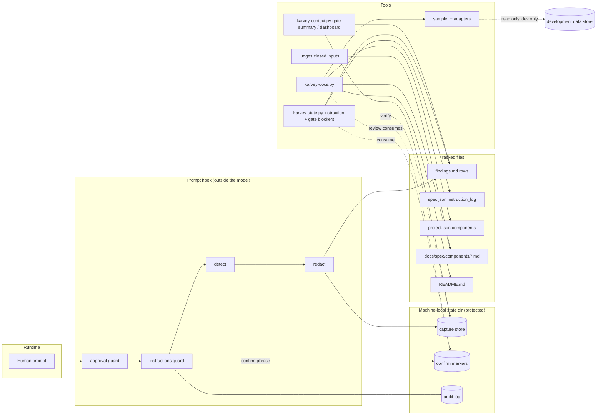

# Architecture: living-docs

> PHASE 5 (`karvey-architecture`, the skill as it is in this branch) · Security Tier **3** · Layers: Backend (the
> plugin's hooks, scripts, library, schemas, templates and skill/rule text) · Target: `cli` · Lane: `standard`
> (mockup and design-graphic skipped by the lane: sheets and READMEs are documents) · Complexity: **new
> capability** on top of the Wave 1 hook and state tool, the Wave 2 lanes, gates, judges and check modes, and the
> Wave 3 load lists, core and gate-close script — so both the component and the data-flow diagrams are included (§4).
>
> Inputs read in this session: `prd.md`, `requirements.md` (REQ-LD-001..063, approved at the *what* gate under
> D-21), `spec-delta.md`, `PLAN.md`, `spec.json`, `findings.md` (F-01..F-31, all closed), `docs/spec/project.json`,
> the Wave 1 design (`wave1-hardening/architecture.md` §3.3, the marker's integrity), the Wave 3 design and tasks
> (`wave3-optimization/architecture.md`, `tasks.md`), the project-upgrade catalogue on its own branch
> (`scripts/karvey_lib/upgrade-steps.json`, `upgrade_steps.py`, `schemas/upgrade-steps.schema.json`), and the real
> code listed in §1.1 (verified on `feature/living-docs` at `b50d34c`, whose base holds Wave 3 up to E1.F6.T3).

## Summary

The method already has a hook that runs outside the model on every prompt (it writes the approval marker), a state
tool that is the only writer of `spec.json` and refuses phase moves, a check-mode registry, closed judge inputs, a
leak check and a size tool. This change reuses exactly those parts and adds three capabilities, each with a
deterministic script at its core so that the model only classifies and writes prose:

- **Instruction capture.** A new prompt-hook guard, `instructions`, runs after the approval guard. It decides from a
  multilingual vocabulary (the approval vocabulary's file, same normalisation) whether a prompt is an instruction,
  strips pasted blocks, redacts secrets, e-mail addresses and international phone numbers, and writes a two-phase
  entry to a **capture store** under the machine-local state directory (protected like the approval markers) and an
  `instruction` row — with the text's SHA-256 — to the active change's `findings.md`. No change or several → the
  project inbox. It never blocks and gives up after 1 s; the human sees `captured as instruction F-NN` or
  `instruction not captured (…)`.
- **Classification gated by the state tool.** `karvey-state.py instruction classify|assign|remove|list`
  record the four classes with resolvable evidence and an append-only `instruction_log`; one function,
  `instructions.gate_blockers`, is called by `advance`, `approve` and `approve-gate` and refuses on an unclassified
  row, a tampered row, an unreadable `findings.md` or a waiting inbox entry. The gate summary, the dashboard and the
  session hook show the rows.
- **Component sheets and READMEs.** A component map in `project.json`, four sheet templates, and one new script,
  `karvey-docs.py`, with `components --check` (sections, references, leak, example vs schema, relational schema
  files, commit pairing), `components --check-schema` (a read-only, development-only, bounded, value-free sampler of
  document stores through declared adapters), `components --bootstrap` / `review`, and `readme
  --check|--bootstrap|--update`. Architecture declares a **component delta**; tasks pair code and sheet; impl, QA
  and QA-lite run the commit pairing; archive reconciles, stamps and retires.

Existing projects receive all three through three project-upgrade steps (`ld-1-capture`, `ld-2-components`,
`ld-3-readme`, shown as LD-1..LD-3). Every new check is a registered row with a `4.2` default; a project with no
map, capture off and README check off behaves as under 4.1.0. There is no cloud: infra is skipped (§12).

## Engineering-standards conformance gate (Step 4B)

**Not evaluated.** `docs/spec/project.json` declares no `standards` block and `docs/spec/standards/` does not exist.
As in Waves 1–3, "not evaluated" is not conformance: every non-trivial pattern choice is listed in §10.1 and taken
by the architect with the recommended option under D-21, for the owner to confirm at the *how* gate. No
`deviations.md` is created.

---

## 1. Components and boundaries

### 1.0 System boundary

**This spec owns:**
- New scripts: `plugins/karvey/scripts/karvey-docs.py` (components, schema check, bootstrap, review, README).
- New library modules: `karvey_lib/{instructions,redact,components,sheetcheck,relational,codescan,bootstrap,
  readme}.py` and the package `karvey_lib/sampler/` (`__init__.py`, `adapters/{fixture,jsonl_export}.py`).
- New data: `schemas/component-kinds.json`, `schemas/readme-sections.json`, `schemas/rule-loaders.json`; new lists
  in `karvey_lib/vocabulary.json`; one pattern in `karvey_lib/leak_patterns.json`; rows with a `4.2` default in
  `schemas/check-modes.json`; new fields in `project.schema.json` and `spec.schema.json`.
- New templates: `plugins/karvey/templates/components/{data-store,backend-service,frontend-module,infra-resource}.md`.
- Extensions: `karvey-state.py` (`instruction` command group; blockers in `advance`, `approve`, `approve-gate`;
  `validate` checks; `generated architecture` delta warning), `karvey_lib/guards.py` (the `instructions` guard,
  one protect-paths needle), `karvey_lib/karvey_hooks.py` (registry row, JSON output of the prompt event, session
  lines), `hooks/karvey-hook.sh` (no-python needle), `karvey-context.py` (gate summary, dashboard),
  `karvey_lib/judges.py` (closed inputs, findings lock), `karvey-context-budget.py` (`--fail-growth`),
  `lint-plugin.py` (L-76..L-81), `.github/workflows/lint.yml` (one step).
- New rule text: `rules/instructions.md`, `rules/components.md`, `rules/readme.md`; one contract in `rules/_core.md`
  and its row in `schemas/contracts.json` (both created by Wave 3, §13); `Load:` entries of the acting skills;
  skill text of `karvey-architecture`, `karvey-tasks`, `karvey-impl`, `karvey-qa`, `karvey-archive`, `karvey-docs`,
  `karvey-init`, `karvey-iterate`; the plugin README sections; `hooks/README.md`.
- Three steps in the project-upgrade catalogue (`upgrade-steps.json`, `upgrade_steps.py`) — §7.3.
- Tests under `plugins/karvey/tests/` (§6) and this change's dogfooding artifacts (§7.1): the component map and
  sheets of this repository, its README sections, capture on.

**This spec does NOT touch:**
- The approval vocabulary's approval, negation and production lists; the approval marker's format and consumption;
  the release ledger; the prod gate; the finding types of the iteration loop (`bug`, `spec-gap`, `emergent`) —
  `instruction` is a row type, not a finding type; the existing `karvey-docs` Diataxis modes.
- The project-upgrade engine (`karvey_lib/upgrade.py`), its schema and its checks L-37..L-39 — only catalogue rows
  and step functions are added.
- Any data store's data (the sampler reads; nothing writes), any production store, relational tables live.
- `CHANGELOG.md`, `docs/spec/decisions.md`, `docs/spec/backlog.md`, `docs/spec/agent/*` in this phase.
- The owner's personal global instructions or anything under the user's home directory.

**Changes that require revalidating this design:**
- Wave 3's final head changes the files listed in §13 differently from its approved design (core, load lists,
  gate-close script, lint ids).
- The runtime changes the `UserPromptSubmit` payload or stops honouring `systemMessage` / `additionalContext` in the
  prompt hook's JSON output (§1.5 would fall back to plain stdout).
- project-upgrade changes its catalogue schema (id pattern, the `human ⇒ fix null` invariant) before this change's
  implementation.
- A second prompt-hook writer of `findings.md` appears (the findings lock of §1.4 would need it too).

### 1.1 Code this design builds on (verified in this branch at `b50d34c`)

| What | Where (file:line) | Use here |
|---|---|---|
| Hook events and timeouts (prompt 5 s) | `plugins/karvey/hooks/hooks.json`; `karvey_lib/karvey_hooks.py:49` (`EVENTS`), `:51` (`BUDGET_S`, prompt 4.0 s) | capture's 1 s deadline sits inside the prompt budget |
| Guard registry, `dispatch` (stdout lines, fail open/closed) | `karvey_hooks.py:191` (`REGISTRY`), `:208` (approval guard), `:271` (`dispatch`) | `+` guard `instructions` after `approval`; prompt event emits one JSON object (§1.5) |
| Approval guard (never blocks, audit on error) | `karvey_lib/guards.py:1219` (`approval_hook`) | same shape for the capture guard; confirm phrases next to `classify_notify` |
| Reviewed setting (no fetch) | `guards.py:117` (`project_reviewed`), `:133` (`reviewed_setting`); `karvey_lib/project.py:208` (`read_reviewed_project_json`), `:251` (`reviewed_value`), `:257` (`opt_in_state`) | capture setting, vocabulary overrides (REQ-LD-003, 011) |
| Vocabulary file, normalisation, pasted lines | `karvey_lib/approval.py:532` (`VOCAB_FILE`), `:548` (`vocabulary`), `:562` (`normalise`), `:570` (`strip_quoted`), `:596` (`classify`), `:629` (`scope_for`); `vocabulary.json` `rules.pasted_line_chars = 200` | directive/question/confirm lists in the same file, same matcher (REQ-LD-002, 003, 063) |
| Markers: dir, write, one-use consume | `approval.py:125` (`approvals_dir`), `:129` (`marker_path`), `:140` (`write_marker`), `:252` (`consume`), `:414` (`write_notify_marker`) | removal and review markers (REQ-LD-012, 042, 063) |
| State dir `<git common dir>/karvey` (0700) | `karvey_lib/project.py:286` (`state_dir`) | capture store `<state>/instructions/` |
| Audit log (JSONL, drops prompt fields) | `karvey_lib/audit.py:20`, `:27` (`sanitize`), `:49` (`append`) | skipped / failed / ignored-override records, never the text |
| Protect-paths needles | `guards.py:167` (`STATE_NEEDLES`), `:238` (`protect_paths`), `:253` (edit tuple); `hooks/karvey-hook.sh:74` (`nopy_protect_paths`), `:80` (`needles=`) | `+ karvey/instructions` (REQ-LD-008) |
| Active change | `project.py:183` (`active_change`), `:156` (`list_changes`); `karvey-state.py:2369` (`active`) | one active change → its findings; else the inbox |
| Session context | `karvey_hooks.py:554` (`open_work_block`), `:577` (`session_text`), `:663` (`session_main`, `additionalContext`) | capture on/off/unavailable, counts, inbox (REQ-LD-009, 010, 018) |
| State tool subcommands | `karvey-state.py:2346` (`build_parser`); `cmd_validate` `:851`, `compute_next` `:1042`, `cmd_advance` `:1265` (refusals `:1279..:1323`), `cmd_generated` `:1439`, `cmd_approve` `:1712` (refusals `:1715..:1737`), `cmd_approve_gate` `:2068`, `cmd_risk` `:2283` | `+ instruction …`; one blocker call in advance/approve/approve-gate/next |
| Archive refusal pattern (Wave 3) | `karvey_lib/risks.py:160` (`archive_blockers`), called at `karvey-state.py:1321` | same pattern for `instructions.gate_blockers` |
| Exit codes | `karvey_lib/__init__.py:18..23` (`0 ok · 1 findings · 2 usage · 3 refused · 4 not found · 5 internal`) | the sampler's drift code is `1` (findings), §1.13 |
| Findings table header and parser | `karvey_lib/judges.py:162` (`FINDINGS_HEAD`), `:158` (`TYPES`), `:389` (`read_rows`), `:398` (`read_rows_text`) | instruction rows use this header; the rule text at `rules/iteration-loop.md:45` still shows an older header (§7.1) |
| Judge closed inputs | `karvey_lib/judges.py:96` (`build_inputs`); `karvey-judges.py:48` (`cmd_inputs`) | `+` sheets (REQ-LD-031) |
| Gate summary, dashboard | `karvey-context.py:945` (`gate_summary`), `:900` (`_judges_block`), `:497` (`open_work`), `:56` (`SECTIONS`), `:1436` (`build_parser`) | instruction block, parallel deltas, draft sheets |
| Check-mode registry | `schemas/check-modes.json:9` (rows), `karvey_lib/modes.py:28` (`registry`), `:102` (`resolve`), `:128` (`would_refuse`); `karvey-state.py:518` (`gate_mode`) | `4.2` defaults (REQ-LD-053) |
| Leak check | `karvey_lib/leakcheck.py:33` (`patterns`), `:100` (`_scan`), `:138` (`check`); `leak_patterns.json` (`secret`, `email`, `pii` …) | redaction, sheets, bootstrap, README, sampler output |
| JSON-Schema subset validator | `karvey_lib/schema_lite.py:32` (`VALIDATION_KEYWORDS`), `:41` (`SUPPORTED_KEYWORDS`) | example vs schema (REQ-LD-033) |
| Size tool | `karvey-context-budget.py:173` (`cmd_measure`), `:274` (`cmd_compare`), `:369`/`:374`; `karvey_lib/loadlist.py:25` (`LOAD_RE`), `:45` (`parse_load`) | base snapshot and `--fail-growth 10` (REQ-LD-051) |
| Gate-close script | `karvey-close.py:185` (`run`), steps `:76..:177` | unchanged; the gate-summary blocks carry the new content |
| Trailer | `karvey_lib/gitlog.py:15` (`TRAILER_KEY`); `karvey_lib/manifest.py:28-34` | multi-repo pairing by `Karvey-Change` (REQ-LD-028) |
| Linter | `lint-plugin.py:51` (`check`), L-62 `:2275`, L-73 `:2413`; Wave 3 reserves L-55..L-75 | new checks start at **L-76** |
| CI | `.github/workflows/lint.yml:28` (lint), `:31` (size compare), `:32` (`validate --all`), `:48..:52` (suites, tables, hooks) | `+` one `karvey-docs.py components --check --leak` step |

**Shared conventions** stay those of Wave 1 §1.1: stdlib Python ≥ 3.9 plus bash 3.2, the exit codes above, the
`--json` envelope, atomic writes under a lock, ISO 8601 times with an offset, argv lists only
(`test_no_shell_true.py`). `karvey-docs.py` follows them.

**Absent in this branch and created by Wave 3 before this change's implementation** (REQ-LD-057): `rules/_core.md`,
`schemas/contracts.json`, every `Load:` line, the references and adapters of Wave 3 F2, lint L-55..L-61, L-66 and
L-72. They are referenced here by role; §13 lists what to re-verify.

### 1.2 Plugin tree after this change (new ★, modified ✎)

```
plugins/karvey/
├── hooks/
│   ├── karvey-hook.sh                    ✎ no-python needle karvey/instructions
│   └── README.md                         ✎ capture guard, JSON output of the prompt event
├── schemas/
│   ├── check-modes.json                  ✎ "4.2" defaults + 19 rows (§1.17)
│   ├── component-kinds.json              ★ kind → mandatory sections, aliases, reference sections
│   ├── readme-sections.json              ★ six sections, multilingual aliases, trigger patterns
│   ├── rule-loaders.json                 ★ rule → skills allowed to load it (L-77)
│   ├── project.schema.json               ✎ instructions, components[], readme, environments
│   └── spec.schema.json                  ✎ instruction_log[]
├── scripts/
│   ├── karvey-docs.py                    ★ components / readme CLI
│   ├── karvey-state.py                   ✎ instruction …; gate blockers; validate; delta warning
│   ├── karvey-context.py                 ✎ gate summary, dashboard, session counts
│   ├── karvey-context-budget.py          ✎ compare --fail-growth
│   ├── lint-plugin.py                    ✎ L-76..L-81
│   └── karvey_lib/
│       ├── instructions.py               ★ detect, store, rows, verify, classify, gate_blockers
│       ├── redact.py                     ★ pasted blocks, truncation, typed redaction
│       ├── components.py                 ★ map, sheets, section/reference/leak/example checks, delta
│       ├── sheetcheck.py                 ★ commit and change pairing, skip trailer
│       ├── relational.py                 ★ SQL schema files → tables/columns
│       ├── codescan.py                   ★ env reads, routes, manifests, IaC, migrations (read-only scanners)
│       ├── bootstrap.py                  ★ proposal (pure) of map + draft sheets
│       ├── readme.py                     ★ sections, generated blocks, triggers, undocumented settings
│       ├── sampler/__init__.py           ★ read-only sampler core, bounds, value-free model
│       ├── sampler/adapters/fixture.py   ★ in-memory adapter for tests (records calls)
│       ├── sampler/adapters/jsonl_export.py ★ reads a development export directory
│       ├── sampler/resolvers.json        ★ allow-list of vault resolver argv templates
│       ├── guards.py                     ✎ instruction_capture guard; STATE_NEEDLES
│       ├── karvey_hooks.py               ✎ registry row; prompt JSON output; session lines
│       ├── judges.py                     ✎ sheets in closed inputs; findings lock in collect
│       ├── vocabulary.json               ✎ directive, question, markers, confirm (5 languages)
│       ├── leak_patterns.json            ✎ secret-assignment pattern
│       ├── upgrade-steps.json            ✎ ld-1-capture, ld-2-components, ld-3-readme
│       └── upgrade_steps.py              ✎ their check / fix functions
├── skills/
│   ├── karvey/rules/instructions.md      ★
│   ├── karvey/rules/components.md        ★
│   ├── karvey/rules/readme.md            ★
│   ├── karvey/rules/_core.md             ✎ contract `instruction` (file created by Wave 3)
│   └── karvey-{architecture,tasks,impl,qa,archive,docs,init,iterate}/SKILL.md ✎
├── templates/components/{data-store,backend-service,frontend-module,infra-resource}.md ★
└── tests/ (§6)
.github/workflows/lint.yml                ✎ components leak step
README.md                                 ✎ three sections (REQ-LD-055)
docs/spec/project.json                    ✎ instructions, components, readme (dogfooding)
docs/spec/components/*.md                 ★ eight sheets of this repository (§7.1)
```

### 1.3 C-01 — Capture vocabulary (`karvey_lib/vocabulary.json`)

**Satisfies:** REQ-LD-002, 003, 006 (pasted-line length), 058, 005 (markers), 063 (confirm phrases).

The file gains, next to the approval lists (unchanged):

| Key | Content | Override |
|---|---|---|
| `directive` | per language `en, es, pt, de, fr`: requirement modals (`must`, `shall`, `should`, `debe`, `tiene que`, `deve`, `muss`, `doit` …) and directive terms (`always`, `never`, `from now on`, `make sure`, `add`, `remove`, `change`, `siempre`, `nunca`, `a partir de ahora`, …) | `project.json:enforcement.instruction_vocabulary.directive`, reviewed line only |
| `question` | question openers per language (`why`, `how`, `what`, `por que`, `como`, `warum`, `pourquoi` …) | same, `.question` |
| `markers` | `{"off": "#off", "note": "#note"}` | `.markers`, reviewed line only |
| `confirm` | `{"remove": {"verbs": […], "nouns": [instruction, instruccion, instrucao, anweisung, consigne]}, "review": {"verbs": [reviewed, revisada, revisado, geprueft, relue …], "nouns": [sheet, ficha, blatt, fiche]}}` | not overridable (like `notify_confirm`) |
| `rules.capture_min_words` 4, `rules.capture_long_words` 40, `rules.capture_max_chars` 4000 | thresholds of REQ-LD-002/006 | `.rules`, reviewed line only |

The existing `rules.pasted_line_chars = 200` is the REQ-LD-006 threshold (one value for approval and capture). Lists are
stored per language for the linter (L-80: every shipped language has non-empty `directive`, `question`, `confirm`
lists) and matched as one union, after `approval.normalise` (`approval.py:562`) with `approval._term_re` word
boundaries. An override present only in the working copy is ignored and recorded `vocabulary override ignored (not
reviewed)` (the `reviewed_setting` path, `guards.py:133`).

### 1.4 C-02..C-04 — Detector, sanitiser, capture store and rows (`karvey_lib/instructions.py`, `redact.py`)

**Satisfies:** REQ-LD-001, 002, 004, 005, 006, 007, 008, 009, 012 (text replacement), 058 (force), 059 (verify), 063.

**Detector** `detect(prompt, vocab) → {capture: bool, reason, forced, confirm?}` — pure, no I/O, in this order:
1. `#off` opens the prompt (after leading whitespace) → `skip: off-the-record` (REQ-LD-005). A marker elsewhere is text.
2. Clean with `approval.strip_quoted` (pasted lines, quoted lines, `>` lines) and `normalise`.
3. A confirm phrase (§1.6) on the **cleaned** text → `confirm` and no capture (REQ-LD-063); a phrase inside a quoted
   or pasted line never writes a marker (judge F-56).
4. `#note` opens the prompt → `capture, forced` (REQ-LD-058); steps 5–6 are skipped.
5. Only a method command (`/karvey…` or `/<plugin>:<skill>` plus arguments), only approval/negation terms (the
   approval matcher returns the whole cleaned text as terms), fewer than 4 words without a directive term → no.
6. Directive term or modal present → yes (wins over the question form). Else question (ends in `?` or opens with a
   question term) → no. Else more than 40 words → yes. Else no.

The detector's quality is measured by a labelled table (REQ-LD-004): `tests/hooks/tables/instructions-detect.json`,
≥ 30 prompts per shipped language (≥ 150), each labelled `instruction` / `not`, covering questions, approvals,
chit-chat, mixed prompts, commands and instructions; `test_instructions_detect.py` prints recall and precision per
language and overall and fails below 0.90 / 0.80, naming the missed prompts.

**Sanitiser and redaction** (`redact.py`), run on the raw prompt of the prompt event only (the payload's `prompt`
field — never tool output, attachments or another agent's message, which do not arrive in that event, REQ-LD-006):
1. A fenced block → `[pasted block: N lines omitted]`; a line longer than `pasted_line_chars` → `[pasted line
   omitted]`, consecutive ones merged with their count.
2. Longer than 4,000 characters → cut at 4,000 and `[truncated: N characters omitted]`.
3. `leakcheck` secret patterns (`leak_patterns.json:secret`), the capture-only group `leak_patterns.json:capture`
   (a `secret-assignment` rule — `key=value` / `password: value` forms — and card numbers of 13–19 digits that pass
   the Luhn check; §10.1 A-06), the `email` pattern, and an international phone pattern `\+\d(?:[ .-]?\d){7,14}` →
   `[redacted:secret|email|phone]`. The `capture` group is read by `redact.py` and by the 4.2 leak checks of sheets,
   bootstrap and README only — never by the sponsor page's `leakcheck.check`, so no 4.1 output changes (judge
   F-32). Other numbers are kept verbatim ("retry 3 times within 30000 ms"). Returns `(text, counts)`.
4. Any exception (unreadable pattern file, bad regex) → `RedactionUnavailable`: nothing is written, the audit log
   records `capture skipped: redaction unavailable`, the human sees the not-captured notice (REQ-LD-007, 010).

**Capture store** — `<state_dir>/instructions/<scope>.jsonl`, where scope is a change id or `_project`; directory
0700, files 0600, one JSON object per line appended with `O_APPEND` under the findings lock; never tracked by git
(the state dir is inside the git common dir). Entry:
`{"v":1, "id":"F-12"|"I-3", "change":"…"|null, "at":"…", "phase":"impl", "text":"<redacted>", "sha256":"<hex of
text>", "clone":"<8 hex of approval.repo_id>", "redactions":{"secret":1}, "forced":false,
"state":"pending"|"written"|"failed"|"assigned"|"classified"|"removed", "class"?:"…", "evidence"?:"…",
"reason"?:"…", "to"?:"<change>/F-NN"}`. The latest line per id wins; lines are never rewritten except by the removal
(REQ-LD-012), which rewrites the file atomically with the entry's `text` replaced. Every classification the state
tool records is also appended here as a `classified` line: the **protected store, not the tracked `spec.json`, is the
authority** the classification check compares the row's cells with (judge F-54).

**Row writer.** Under the **findings lock** (`<state_dir>/instructions/locks/findings-<change>.lock`, inside the
protected directory; `O_EXCL`, the lock file holds pid and time and a lock older than 5 s is broken and audited;
0.5 s wait; also taken by `judges collect` and by the state tool's instruction commands, so the next `F-NN` is never
allocated twice — judge F-53): (a) append `pending` to the store; (b) read `findings.md` (create it with
`judges.FINDINGS_HEAD` when absent), allocate the next `F-NN`, append the row; (c) append `written`. Row, in the
header of `judges.py:162`:

```
| F-12 | 2026-10-02 | impl | hook:prompt | instruction | — | the export must also include the closing date <!-- karvey:capture clone=<8 hex> sha256=<64 hex> --> | unclassified | — |
```

The text cell is escaped (`|` → `\|`, newlines → `<br>`, `<!--` → `&lt;!--`, `-->` → `--&gt;`, so pasted text cannot
inject a second capture comment — judge F-57); the verifier reads only the one comment that ends the cell; the hash
is over the unescaped redacted text. A crash between (a) and (c) leaves a `pending` entry: with its row present it
verifies; without it, it is a **capture failure** (listed at the gate, REQ-LD-010), never a tamper.

**Verification** `verify(root, change) → {verified, not_verifiable, tampered[], missing[], extra[], failed[]}`
(REQ-LD-059): each `instruction` row with origin `hook:prompt` must match a store entry by id and hash, and its text
must hash to the hash in the row; each `written` entry must have its row. A row whose comment names **this** clone
and has no entry here → `extra` (tampered). A row naming **another** clone, with no entry here and a text that
matches its own hash → `not verifiable here` (REQ-LD-059 requires that it is not refused); mismatched → tampered. The
hash is computable by anyone, so `not verifiable here` is evidence of consistency, not of origin: every such row is
listed by id and clone in `validate` and in the gate summary, where the owner sees it (judges F-44, F-45; risk R-10).
A row `[removed at the owner's request]` with a `removed` entry → verified.

### 1.5 C-05 — Capture guard in the prompt hook (`guards.instruction_capture`)

**Satisfies:** REQ-LD-001, 005, 006, 009, 010, 011, 058, 063.

Registered as `Guard("instructions", ("prompt",), "open", False, wired=True, run=guards.instruction_capture,
enabled=guards.capture_enabled)` after the approval guard (`karvey_hooks.py:208`). Steps, with a monotonic deadline
of 1.0 s checked between steps and as the lock timeout:

1. **Setting** (REQ-LD-011): `reviewed = reviewed_setting(ctx, "instructions")` (no fetch), `wc` from the working-copy
   `project.json`. Effective `on` when `reviewed.capture == "on"` or `wc.capture == "on"`; `wc == "off"` against a
   reviewed `on` is ignored and audited `capture off ignored (not reviewed)`. Effective off → `#note` prompts get
   `instruction capture is off for this project`; everything else is silent.
2. `detect` (§1.4). `skip: off-the-record` → audit `{guard: instructions, skipped: off-the-record, at}` only.
   `confirm` → write the one-use marker (§1.6), print `[karvey] removal confirmed (F-14)` / `review confirmed
   (orders-api)`.
3. Scope: the existing active-change rule `project.active_change` (`project.py:183`): the change of the current
   `feature/<id>` branch first, else the single non-implemented change, else none/several → `_project` (inbox,
   `I-N`). On a change's feature branch — the usual place to work — there is always exactly one.
4. `redact`, then the store and the row (§1.4). Inbox entries write no tracked file.
5. Output: `captured as instruction F-12` / `instruction waiting in the project inbox as I-3 (no single active
   change)`.

**Failure path** (REQ-LD-010): any exception, deadline or lock timeout → the prompt passes (exit 0); audit
`{guard: instructions, decision: error, reason}` when the audit log is writable; the line `instruction not captured
(<short reason>)` is shown; a `failed` entry with no text (`{id: null, change, at, state: failed, reason}`) is
appended when the store is writable, so the next gate summary lists it; `<state>/instructions/_health.json`
records the last failure and the next success clears it, so the session hook reports `instruction capture
unavailable` while the cause persists. With no Python the bash fallback (`karvey-hook.sh:45`) cannot capture; it
prints `[karvey] instruction capture unavailable (no python)` when `project.json` contains `"capture": "on"` (a
plain `grep`, no parsing).

**Output of the prompt event.** `dispatch` (`karvey_hooks.py:271`) today writes each guard's stdout lines as plain
text, which the runtime adds to the model's context. **Where capture is effectively on**, the prompt event collects
every guard's lines and prints one JSON object `{"systemMessage": "<lines>", "hookSpecificOutput": {"hookEventName":
"UserPromptSubmit", "additionalContext": "<lines>"}}` — the human sees the acknowledgement and the not-captured notice
at once, and the model sees the same lines (REQ-LD-010, 058); the approval guard's `approval recorded` line keeps its
text and travels the same way. **Where capture is off**, the output stays plain text, byte for byte as in 4.1, so the
existing prompt tables and every 4.1 project are unchanged (REQ-LD-054, judge F-33; architect decision A-02).

### 1.6 C-06 — Confirm phrases and one-use markers

**Satisfies:** REQ-LD-012, 042, 063.

`instructions.classify_confirm(prompt, vocab)` recognises, after normalisation, `<remove verb> <instruction noun>
F-NN` and `<review verb> <sheet noun> <component-id>` in any shipped language, with nothing but punctuation around
them (mirrors `approval.classify_notify`, `approval.py:386`). It writes `approvals/confirm/<kind>-<target>.json`
through `approval._write_private` with `{v:1, kind: remove|review, target, prompt_sha256, created_at, ttl_min,
consumed_at: null}` (the approval dir is already protected, `guards.py:167`). The state tool's `instruction remove`
and `karvey-docs.py review` consume it (`approval.consume` semantics) or refuse `removal needs the owner's own
message (D-01)` / `review needs the owner's own message (D-01)`.

### 1.7 C-07 — State tool `instruction` commands and the gate blockers

**Satisfies:** REQ-LD-009 (assign, classify an inbox entry), 012, 013, 014, 015, 016, 050, 059, 060.

`karvey-state.py instruction <sub>`:

| Sub | Arguments | Effect | Refuses |
|---|---|---|---|
| `classify` | `<change> <F-NN> --as requirement-revision --ref REQ-…[,…]` · `--as finding --ref F-NN` · `--as no-spec-impact --reason "…"` · `--as not-instruction --reason "…"`; and `_project <I-N> --as not-instruction --reason "…"` for an inbox entry | rewrites the row's Status (class) and Routed-to (evidence) cells under the findings lock; appends a `classified` line to the protected store (the authority) and `{row, from, to, evidence, at, by_role: agent}` to `spec.json:instruction_log[]` (lock + CAS, the tracked copy); an inbox entry → `classified not-instruction` with reason and time, listed by the next gate summary of any change | unknown row; evidence missing or not resolving (REQ id not in `requirements.md`, F id not in `findings.md`, reason < 10 chars); `requirement-revision` after the first `approvals.requirements.approved` without a `revision_history` entry citing the row id (REQ-LD-014); a tampered row; an inbox entry classified other than `not-instruction` |
| `assign` | `<I-N> <change>` | writes the row from the stored text (never from an argument) into the change's `findings.md`, a `written` entry in the change's store with `from: _project/I-N`, and `assigned` in the inbox | unknown entry; any text argument; change not active |
| `remove` | `<change> <F-NN>` | with the removal marker: row text and store text → `[removed at the owner's request]`, id/time/class kept, audit record; when the row's text is already in a commit (`git log -S` on `findings.md`, argv), it also prints `the text remains in commit <sha>; rewriting history is the owner's decision` (judge F-52) | no valid marker |
| `list` | `[<change>] [--inbox] [--json]` | rows with class and verification state; inbox entries | — |

`validate` adds the verification summary (`instructions: 3 verified, 1 not verifiable here (F-9, clone 3fa2c1d0)`)
and reports rows whose Status differs from the last `classified` line of the protected store as `classification not
recorded by the state tool` (the row then counts as unclassified, REQ-LD-015); a `spec.json:instruction_log` that
disagrees with the store is reported the same way. For a row from another clone the store has no line, so the
tracked `instruction_log` is the only record and the row is listed as `not verifiable here` (judge F-54).

**Gate blockers.** `instructions.gate_blockers(root, change, call_time)` returns refusal lines; `cmd_advance`
(next to the risk refusal, `karvey-state.py:1323`), `cmd_approve` (`:1715..:1737`, every phase including `prod`),
`cmd_approve_gate` (`:2068`) raise `Refused` on any line, and `compute_next` (`:1042`) lists them as blockers. Order:
1. `findings.md` unreadable while capture is effectively on → `findings.md unreadable — instructions cannot be
   checked` (REQ-LD-016).
2. Tampered/missing/extra rows → `instruction F-12 tampered (text does not match the capture)` (REQ-LD-059).
3. Unclassified rows captured before `call_time` → `1 instruction unclassified: F-12 — classify it first
   (karvey-state.py instruction classify)` (REQ-LD-016).
4. Inbox entries `pending|written` captured before `call_time` → `1 instruction waiting in the project inbox: I-3 —
   assign it or classify it` (REQ-LD-060; the two commands are `instruction assign` and `instruction classify
   _project I-3 --as not-instruction`), for every change of the project in this clone (architect decision A-19).

Each line carries its check id (`instructions.tamper`, `instructions.classified`, `instructions.inbox`) and is
resolved through `modes.resolve`; in 4.2 all three are `blocking` where capture is on and silent where it is off
(REQ-LD-053, 054). The blockers apply in every lane at every human gate (merged or granular) and at QA's pass, since
all of them go through these three commands (REQ-LD-050). Capture failures (`failed` entries) never block; they are
listed.

### 1.8 C-08 — Views: gate summary, dashboard, session hook

**Satisfies:** REQ-LD-009 (listing), 010, 017, 018, 030 (at the architecture gate), 042 (draft sheets).

- `gate_summary` (`karvey-context.py:945`) gains the block **Instructions since the last gate**: rows captured or
  (re)classified after the previous gate outcome's `at` (from `spec.json:gate_outcomes`), `not-instruction` and
  `no-spec-impact` first with their reasons, then the rest with their evidence; the project-inbox entries classified `not-instruction`
  since then; the capture failures of the change since then. Text excerpts ≤ 120 characters. At the architecture gate
  it also shows **Parallel deltas** (§1.10). The block is data for `karvey-close.py`, which is unchanged.
- The dashboard (`open_work`, `:497`) and the session hook (`open_work_block`, `karvey_hooks.py:554`) add per active
  change `N instructions unclassified`, and per project `N instruction(s) waiting for a change`, `instruction capture
  on|off|unavailable`, `N draft sheet(s)`; an unreadable store prints `instructions: store unreadable`. The session
  addition is bounded (≤ 4 lines, counts only, no text).

### 1.9 C-09 — Settings and schemas

**Satisfies:** REQ-LD-011, 019, 035, 044, 054.

`project.schema.json` (`properties`, `:14`), all optional:
- `instructions: {capture: "on"|"off"}`; `enforcement.instruction_vocabulary` (same shape as the vocabulary lists).
- `components: [{id: ^[a-z][a-z0-9-]{1,48}$, kind: data-store|backend-service|frontend-module|infra-resource,
  repo?: string, paths: [glob, ≥1], exclude?: [glob], sheet?: "docs/spec/components/<id>.md", sample?: {environment,
  connection_ref: ^(env|vault):[A-Za-z0-9_./-]+$, adapter, containers?: [string]}}]`; `components_settings:
  {sheet_check: "warn"|"blocking", vault_resolver?: <id from the plugin's resolver list>}`.
- `environments: {<name>: {production: bool, hosts?: [hostname], export_paths?: [relative or absolute dir]}}` (host
  names and directories only — never a connection string).
- `readme: {check: "on"|"off", triggers?: {…}}`.
`spec.schema.json`: `instruction_log[]` `{row, from, to, evidence, at, by_role}`.

Traceability of the fields beyond REQ-LD-019's minimum (judge F-40): `sample` is the "reference declared on the
component" of REQ-LD-035; `components_settings.sheet_check` is REQ-LD-028's project opt-in; `environments` is REQ-LD-035's
"environment declared as non-production" and "host the project declares for production"; `exclude` is additive and
optional (A-15). No requirement text changes.

**Sampler settings are read from the reviewed line only** (`environments`, every `components[].sample`,
`components_settings.vault_resolver`), through `reviewed_setting` like the approval vocabulary; a working-copy value
that differs is ignored and audited, and a project whose reviewed line has none of them cannot sample (`schema check
needs its settings on origin/<production>`). An agent cannot turn a production target into a development one by
editing the working copy (judge F-47).

`validate` adds the map rules of REQ-LD-019 (unknown kind, duplicate id, sheet outside `docs/spec/components/`, an
absolute path or `..` in a pattern), a literal connection value (`sample.connection_ref` not matching the reference
pattern) and an environment named in `sample` that is not declared. All new fields are optional: a 4.1.0
`project.json` and `spec.json` stay valid (REQ-LD-054).

### 1.10 C-10 — Component map, sheets and their checks (`karvey_lib/components.py`, templates)

**Satisfies:** REQ-LD-019..025, 033, 026 (delta parser), 030.

- **Kinds as data.** `schemas/component-kinds.json` lists per kind the mandatory sections with their heading aliases
  (English plus the shipped languages), which sections hold references (writers, readers, dependencies, APIs
  consumed), and structural rules (`settings` table has no value column; data store: per container keys; document
  container: a fenced `json` schema block and a fenced `json` example block; relational table: columns). The four
  templates in `templates/components/` are generated from it and L-79 keeps them equal.
- **Sheet parsing.** Front matter (`id`, `kind`, `status: draft|reviewed`, `last_change`), `##` sections matched by
  alias, `###` containers inside the data-store's containers section. A section whose only content is `n/a — {reason}`
  is complete.
- **Section check** (`components.check_sections`, check id `sheets.sections`, warn): absent or empty mandatory
  section; front-matter id ≠ map id; settings value column (`settings: values are not allowed, names only`); document
  container without a schema.
- **References** (`sheets.references`, warn): every writer/reader/dependency/API names a map id or `external:
  {role}`; unknown names get a `did you mean` suggestion by edit distance ≤ 2.
- **Leak** (`sheets.secret`, blocking): `leakcheck` secret rules over every sheet, reported as `sheet:line rule`,
  never the value; upper-case setting names and `vault:`/`env:` references pass.
- **Example vs schema** (`sheets.example`, warn, part of the section check, REQ-LD-033): the example is validated with
  `schema_lite`; failing schema paths are listed (`events example: /closedAt required`); a keyword outside the
  `schema_lite` subset is reported `unchecked keyword <k>` (§10.1 A-09).
- **Component delta parser** (`components.parse_delta(architecture.md)`): the `## Component delta` section, rows
  `ADDED|MODIFIED|REMOVED <id>: <sections>` or `none — <reason>`.

### 1.11 C-11 — `karvey-docs.py` (the CLI)

**Satisfies:** the commands of REQ-LD-023..025, 028, 029, 033..048, 061, 062.

```
karvey-docs.py components --check [--change ID] [--range BASE..HEAD] [--sections] [--commits] [--leak] [--relational] [--json]
karvey-docs.py components --delta-coverage <change>            # tasks review gate (REQ-LD-027)
karvey-docs.py components --reconcile <change> [--apply]       # archive (REQ-LD-029, 062)
karvey-docs.py components --parallel <change>                  # REQ-LD-030
karvey-docs.py components --check-schema <id> [--sample N] [--dry-run] [--json]
karvey-docs.py components --bootstrap [--dry-run]
karvey-docs.py review <component-id>
karvey-docs.py readme --check [--range BASE..HEAD] [--repo PATH] | --bootstrap [--dry-run] | --update [--dry-run]
```

Exit codes: `0` clean · `1` findings (a warn check with hits exits 0 unless `--strict`; blocking hits and drift exit
1) · `3` refused (production target, literal connection, sample above 1,000, wrong branch, leak) · `4` input missing.
Every check records its hit through `modes.record_hit` (gate-time only, never from a hook). The `karvey-docs` skill
calls it; `karvey-impl` (task close), `karvey-qa` (and QA-lite), `karvey-archive`, `karvey-tasks` and CI call the
listed subcommands.

### 1.12 C-12 — Sheet lifecycle (`karvey_lib/sheetcheck.py`, skills, judges)

**Satisfies:** REQ-LD-026..032, 062.

- **Delta at architecture** (REQ-LD-026): `karvey-architecture` writes `## Component delta`; `cmd_generated` (`:1439`)
  for `architecture` calls `components.parse_delta` and warns `component delta missing — declare it or write none
  with a reason` (check `components.delta`, warn) when the project has a map or the change adds components.
- **Tasks** (REQ-LD-027): each task that changes a mapped path lists `Sheet: <id>: <sections>` in its acceptance;
  `--delta-coverage` reports each delta item no task names (`delta item orders-store/invariants has no task`, check
  `components.delta_coverage`, warn); the tasks skill's review gate runs it.
- **Commit pairing** (REQ-LD-028, check `sheets.commit`, warn; blocking with `components_settings.sheet_check:
  blocking`): over `git log --name-only` of the range, each commit that touches a component's `paths` (minus
  `exclude`) must touch its sheet, unless it carries `Karvey-Sheet-Skip: <id> — <reason>` (listed). When the
  component's `repo` differs from the spec repository, pairing is **by change**: the change's commits in the
  component's repository (selected by `Karvey-Change: <id>`, `gitlog.py:15`) and in the spec repository must both
  touch it; an unreachable repository gives `not checked (repository not reachable)`. Run at every impl task close,
  at QA and QA-lite over the change range, on demand.
- **Lanes without architecture** (REQ-LD-032): no delta required; pairing and sections still run in QA-lite.
- **Archive** (REQ-LD-029, 062; check `components.reconcile`, warn): `--reconcile` compares the delta with the sheets
  changed in the range → `applied`, `declared but not applied`, `changed but not declared`; with `--apply` (run by the
  archive skill on its branch) it stamps `last_change: <change> (<date>)` on each changed sheet and, for each
  `REMOVED` component, moves the sheet to `docs/spec/components/archive/` and drops the map entry — unless its paths
  still match files (`legacy-queue removed but its code paths still match 4 files`: kept).
- **Parallel deltas** (REQ-LD-030, check `components.parallel`, advisory): `--parallel` reads the delta of every other
  active change; shown at the architecture gate and in the archive reconciliation; an unreadable
  `architecture.md` → `parallel deltas: not checked (<change> unreadable)`.
- **Judges** (REQ-LD-031, MODIFIES REQ-W2-023): `judges.build_inputs` (`judges.py:96`) adds, at `architecture`, the
  sheets named in the delta and, at `qa`, the sheets of the components whose paths the diff touches; a missing
  sheet prints `missing sheet: <id>` and the run continues. They are appended after the phase's own inputs and count
  against the existing closed-input budget; a sheet the budget leaves out is printed as a `dropped:` line (the
  judges skill shows every `dropped:` line, step 1) and the gate summary's judges block repeats it, so a weakened
  input set is visible, never silent (judge F-43).

### 1.13 C-13 — Schema sampler (`karvey_lib/sampler/`)

**Satisfies:** REQ-LD-034..038.

- **Adapter contract.** An adapter module exports `FAMILY` (e.g. `document`), `ALLOWED = frozenset({"read",
  "query"})` and a class with `open(connection)`, `containers()`, `sample(container, limit, deadline)`, `close()`.
  The core never calls the adapter's client directly: it wraps it in a proxy that raises on any operation name not in
  `ALLOWED`. Shipped adapters: `fixture` (in-memory, records every call; tests) and `jsonl_export` (reads a directory
  of `<container>.jsonl` files exported from a development store; the connection reference names the directory).
  Driver-backed adapters for specific engines are an extension point (§10.1 A-10). `test_sampler_adapters_readonly.py`
  and L-81 parse every shipped adapter's AST and fail on a call or attribute named like a write, update, delete or
  administrative operation (`insert*`, `update*`, `delete*`, `remove*`, `replace*`, `upsert*`, `drop*`, `create*`,
  `bulk*`, `write*`, `command`, `admin*`, `exec*`), naming the adapter and the operation (REQ-LD-034).
- **Target guard** (REQ-LD-035), every setting from the reviewed line (§1.9):
  - `sample.connection_ref` is `env:NAME` (read from `os.environ`) or `vault:NAME`. A `vault:` reference is resolved
    only through a resolver chosen by `components_settings.vault_resolver` from a **plugin-shipped allow-list**
    (`karvey_lib/sampler/resolvers.json`: fixed argv templates of common secret-manager command-line tools, one
    placeholder for NAME, NAME matched against `^[A-Za-z0-9_./-]{1,128}$`, argv list, no shell, 10 s timeout); the
    project cannot supply a command (judge F-46). The value is kept in memory, never printed, logged or written.
  - The environment must be declared `production: false` **and** list its `hosts`; the resolved host (parsed in
    memory) must be one of **that development environment's hosts** (allow-list) and none of any production
    environment's hosts; an unparsable connection or a host outside the list → refused, printing only environment
    names (judge F-48). `production: true` → refused `schema check reads development data only`.
  - For the `jsonl_export` adapter the connection names a directory: it must lie under one of the development
    environment's `export_paths` (realpath, no symlink escape) and outside every production environment's
    `export_paths`; the directory's provenance is the declaring person's responsibility, and the value-free output
    bounds what any mistake can reveal (judge F-49, risk R-13).
- **Bounds** (REQ-LD-036): default 100 documents per container, `--sample` up to 1,000 (above → refused `sample above
  1000`), 30 s per container (deadline passed to the adapter; hit → `stopped at 30 s`). Report: `sample 100 of an
  unknown total (limit)`.
- **Value-free model** (REQ-LD-037): per container the sample size; per JSON path the declared type, observed types
  with counts, missing-required count, undeclared-path count. Paths only — never a value, id or key value. A path
  segment is printed only when it is a property name the declared schema lists, or an undeclared name shaped like an
  identifier (`^[A-Za-z_][A-Za-z0-9_]{0,31}$` with no run of 4 or more digits and no personal-data pattern); every
  other segment — a key of a map-typed level, a level with more than 20 distinct keys, anything id-like, e-mail- or
  phone-like — collapses to `{key}`, and the report states how many segments were masked (judge F-50). The rendered output then passes `leakcheck.check`; a hit → nothing printed or
  written but `refused: <container> <rule>`.
- **Drift** (REQ-LD-038, check `schema.drift`, advisory): differences → report with a proposal (`update the sheet` or
  `open a finding`), exit 1; the sheet and the data are never modified. No adapter for the family → exit 4 `no adapter
  for engine family graph`, nothing read. `--dry-run` lists the operations and containers it would read.

### 1.14 C-14 — Relational sheets vs schema files (`karvey_lib/relational.py`)

**Satisfies:** REQ-LD-061 (check `schema.relational`, advisory).

For a data-store sheet with engine family `relational`, the files under its `paths` ending in `.sql` are parsed with a
small tokenizer (comments and strings stripped): `CREATE TABLE name (col …)`, `ALTER TABLE name ADD [COLUMN] col`,
`ALTER TABLE name DROP [COLUMN] col`, `DROP TABLE name`, applied in file-name order. The result is compared with the
tables and columns the sheet declares → `orders.refund_id: in the schema files, not in the sheet` and the reverse.
No readable format → `relational check: no readable schema files`. Other formats (ORM models, migration DSLs) are a
follow-up (§10.1 A-11).

### 1.15 C-15 — Bootstrap (`karvey_lib/codescan.py`, `bootstrap.py`)

**Satisfies:** REQ-LD-039..043.

- **Scanners** (`codescan.py`, read-only, bounded to 5,000 files and 1 MB per file, `.git` and vendored dirs skipped):
  IaC files (`*.tf`, `*.bicep`, template YAML with a resources key, container orchestration manifests), migration and
  schema dirs (`migrations/`, `*.sql`, `schema.*`), container and service manifests (`Dockerfile`, compose files,
  dependency manifests), route definitions (decorator and router-call patterns of common web frameworks, as a data
  table in `codescan.py`), environment reads (`os.environ[…]`, `getenv(…)`, `process.env.X`, `ENV[…]`, `${VAR}` in
  compose), frontend route tables (`path:` entries of router definitions). Each hit carries `file:line`.
- **Proposal** (`bootstrap.propose(root) → {components, sheets: {path: text}}`) is pure — it returns text, never
  writes — so the same function serves `karvey-docs.py components --bootstrap` and the upgrade step `ld-2-components`
  (whose fix functions must not write, `upgrade_steps.py` docstring). Sheets come from the kind's template with status
  `draft`, a `source: file:line` per filled section, `unknown — to fill` elsewhere, setting names without values,
  draft document schemas from code types when a typed model is recognised.
- **Write** (CLI only): shows the proposal first; refuses on the integration or production branch naming `docs/<id>`
  to create (REQ-LD-040); runs `leakcheck` over every file it would write and writes nothing if any fails (`service-a.md:
  secret pattern (source config/app.yaml:7)`, REQ-LD-041). "A docs branch" means any branch that is neither the
  integration nor the production branch: the project-upgrade branch of LD-2 qualifies, and the CLI proposes
  `docs/<id>` only when run on one of those two (judge F-39).
- **Review** (REQ-LD-042): `karvey-docs.py review <id>` flips `status: draft → reviewed` only with the review marker
  (§1.6), writes `review: {at, marker: <first 16 hex of the marker's prompt_sha256>}` into the front matter, and
  appends `{component, at, marker}` to the protected `<state>/instructions/reviews.jsonl`. The section check reports a
  `reviewed` sheet without a `review` block as `review not recorded by the command` and treats it as `draft` for every
  check (bootstrap still never overwrites it); a `review` block with no record in this clone is `reviewed (not
  verifiable here)` and listed on the dashboard (judge F-55). The dashboard lists drafts.
- **Re-run** (REQ-LD-043): `reviewed` sheets are never overwritten — the additions are printed as a unified diff;
  `draft` sheets are regenerated; unparsable front matter → treated as reviewed, `front matter unreadable — kept`.

### 1.16 C-16 — README (`karvey_lib/readme.py`, `schemas/readme-sections.json`)

**Satisfies:** REQ-LD-044..048.

- Sections `purpose`, `quick-start`, `tests`, `configuration`, `components`, `deploy`, each recognised by a heading alias
  (English, Spanish, Portuguese, German, French) or by `<!-- karvey:section <name> -->` (check `readme.sections`, warn).
- **Trigger** (`readme.trigger`, warn): in a change range, per repository, a setup file (patterns in the data file:
  dependency manifests, container files, task-runner files; overridable in `project.json:readme.triggers`), a command
  definition, a newly read environment variable (a `codescan` diff between base and head) or a map change for that
  repository, without that repository's README → `README not updated: setup file package manifest changed`.
- **Undocumented settings** (`readme.settings`, warn): names `codescan` finds in code that are neither in the README
  configuration section nor in a sheet's settings of that repository → `undocumented setting ORDERS_RETRY
  (services/orders/config.py:12)`.
- **Bootstrap / update** (REQ-LD-047): missing sections added as blocks between `<!-- karvey:generated readme-<name>
  -->` markers with a content hash; `--update` refreshes only the components list and the settings table blocks; a
  block whose hash no longer matches is reported `generated block edited by hand: configuration — move the text out or
  accept regeneration` and left alone. Leak check and docs-branch rule as the bootstrap (check `readme.secret`,
  blocking).
- **Every repository** (REQ-LD-048): `--check` runs per repository in `project.json:repos` reachable from the session;
  the QA summary prints one line per repository or `README: not checked (repository not reachable)`.
- **Setting**: `readme.check` read like the capture setting; absent = off (REQ-LD-044, 054).

### 1.17 C-17 — Check modes 4.2 and compatibility

**Satisfies:** REQ-LD-053, 054.

`check-modes.json` gains a `"4.2"` key in every existing row (equal to its `4.1` value) and these rows
(`modes.release_line` maps 4.2.x to `"4.2"`):

| Check id | Refuses / reports | 4.2 default |
|---|---|---|
| `instructions.classified` | unclassified row at advance/approve/approve-gate | **blocking** where capture is on |
| `instructions.inbox` | waiting inbox entry | **blocking** where capture is on |
| `instructions.tamper` | tampered/missing/extra row | **blocking** where capture is on |
| `sheets.secret` · `bootstrap.secret` · `readme.secret` | secret-shaped value | **blocking** |
| `sheets.commit` | code without its sheet (`project_key`: `components_settings.sheet_check`) | warn (blocking by opt-in) |
| `sheets.sections` · `sheets.references` · `sheets.example` | sheet content | warn |
| `components.delta` · `components.delta_coverage` · `components.reconcile` | lifecycle | warn |
| `components.parallel` | another change on the same component | advisory |
| `readme.sections` · `readme.trigger` · `readme.settings` | README | warn |
| `schema.drift` · `schema.relational` | data shape | advisory |

"Where capture is on" is the check's own `enabled_when` guard (`instructions.capture` effective on); with capture off
the three instruction checks are silent. L-76 fails on a check id used by this change's code but absent from the
registry or without a `4.2` default. Compatibility (REQ-LD-054): `tests/unit/test_compat_ld.py` replays the 4.1
fixtures under 4.2 defaults (`validate --strict`, the linter over a fixture project, the guard tables, the gates) with
no map, capture off and README check off — results unchanged; a 4.1 change with no instruction rows is never refused
after capture is turned on.

### 1.18 C-18 — Rules, core contract, load lists and size

**Satisfies:** REQ-LD-050, 051, 052, 055.

- **Rules** (each ≤ 700 words; the scripts carry the detail): `rules/instructions.md` (capture, markers, the four
  classes, removal, inbox) is **named in no skill's `Load:` list**: every phase reaches the instruction contract
  through the core, whose contract cites the rule only as a footnote (read on demand), exactly as REQ-LD-051 says;
  `karvey-iterate` names the command `karvey-state.py instruction classify` in its own text without loading the rule
  (judge F-36). `rules/components.md` (map, kinds, sheet lifecycle, sampler rules) is loaded by architecture, tasks,
  impl, qa, archive and docs; `rules/readme.md` by qa, archive and docs. `karvey-init` asks the
  two settings from its settings reference (Wave 3 moved init settings to `skills/karvey-init/references/`).
  `schemas/rule-loaders.json` lists the allowed loaders and **L-77** fails when any other skill's `Load:` names one of
  the three rules (REQ-LD-051).
- **Core** (REQ-LD-052, MODIFIES REQ-W3-003): one contract in `rules/_core.md` with slug id `instruction`: "An
  instruction captured by the hook is classified before its phase closes; the agent never writes or edits an
  instruction row." Its row in `schemas/contracts.json` names the state tool's blockers as its enforcement; the core
  stays ≤ 1,000 words (L-55): if the addition crosses the limit the text of other contracts is shortened, never the
  limit raised.
- **Size** (REQ-LD-051): the first implementation commit after the base check stores
  `docs/spec/retros/context-size-4.2.0-base.json` (`karvey-context-budget.py measure --label 4.2.0-base`); the size tool
  gains `compare … --fail-growth PCT` (exit 1 naming each phase above PCT); the test phase runs `compare
  context-size-4.2.0-base.json --live --fail-growth 10`. CI keeps `--warn-growth 10`.
- **Lanes and gates** (REQ-LD-050): no lane table changes. `rules/lanes.md`'s per-lane paragraph gains one sentence
  (the blockers at every human gate; delta only where architecture runs; pairing, sections and README in QA-lite; the
  `docs` lane runs sections and README on its own documents).
- **Documentation** (REQ-LD-055): the repository README (the plugin's public README) gains three sections — "Captured
  instructions", "Component sheets", "README kept current" — each naming its setting (`instructions.capture`,
  `components`, `readme.check`), its commands and its upgrade step (LD-1, LD-2, LD-3); **L-78** checks them, and also
  that `karvey-init`'s settings text asks `instructions.capture` and `readme.check` with `on` as the recommended
  answer (REQ-LD-011, 044; judge F-38). The
  `karvey-docs` skill gains the `components` and `readme` modes; `hooks/README.md` documents the guard and the JSON
  output.

### 1.19 C-19 — Project-upgrade steps LD-1..LD-3

**Satisfies:** REQ-LD-049. §7.3 has the rows. The catalogue id pattern is `^[a-z][a-z0-9-]{1,40}$`
(`upgrade-steps.schema.json`), so the public labels LD-1..LD-3 are titles and the ids are `ld-1-capture`,
`ld-2-components`, `ld-3-readme` (§10.1 A-12). All three are pure functions over the upgrade `Probe`, idempotent
(a second plan lists nothing that applies) and applied on the upgrade branch only (the engine's rule, REQ-UP-013).

### 1.20 C-20 — Linter checks (L-76..L-81)

| Id | Check | REQ | Mode |
|---|---|---|---|
| L-76 | every check id this change uses is in `check-modes.json` with a `4.2` default | 053 | error (plugin source) |
| L-77 | the three new rules are loaded only by the skills `rule-loaders.json` names | 051 | error |
| L-78 | the README has the three sections, each naming its setting, its commands and LD-1/2/3 | 055 | error |
| L-79 | the four templates' sections equal `component-kinds.json` | 020..022 | error |
| L-80 | the vocabulary ships non-empty `directive`, `question` and `confirm` lists in en, es, pt, de, fr | 003 | error |
| L-81 | shipped sampler adapters declare `ALLOWED ⊆ {read, query}` and name no write/admin operation | 034 | error |

The neutrality checks that exist when this change is implemented (Wave 3's L-66 and L-72, and
`test_fixtures_anonymous.py`) run over every new file (REQ-LD-055). Each L-id lands in the task that makes its rule
true, so the whole-repo lint stays at 0 errors after every task.

### 1.21 C-21 — Dogfooding and sequencing

**Satisfies:** REQ-LD-056, 057. See §7.1.

---

## 2. Data model

### 2.1 Files

| File | Tracked | Written by | Content |
|---|---|---|---|
| `<state>/instructions/<change>.jsonl`, `_project.jsonl` | no (git common dir) | the hook; the state tool (assign/classify/remove; `classified` lines are the authority) | capture entries (§1.4) |
| `<state>/instructions/_health.json` | no | the hook | last failure / last success time |
| `<state>/approvals/confirm/<kind>-<target>.json` | no | the hook | one-use confirm markers |
| `<state>/instructions/locks/findings-<change>.lock` | no (protected) | hook, state tool, judges collect | lock file (pid, time; stale after 5 s) |
| `<state>/instructions/reviews.jsonl` | no (protected) | `karvey-docs.py review` | sheet review records |
| `docs/spec/changes/<id>/findings.md` | yes | the hook (rows), the state tool (class cells) | `instruction` rows |
| `docs/spec/changes/<id>/spec.json:instruction_log[]` | yes | the state tool | classification history |
| `docs/spec/components/<id>.md`, `archive/` | yes | people, agents, bootstrap, archive (stamp/retire) | sheets |
| `docs/spec/retros/context-size-4.2.0-base.json` | yes | size tool | base snapshot |

### 2.2 The instruction row

Header `| ID | Date | Phase | Origin | Type | Severity | Finding | Status | Routed to |` (`judges.py:162`). Type
`instruction`, origin `hook:prompt`, severity `—`, Status one of `unclassified`, `requirement-revision`, `finding`,
`no-spec-impact`, `not-instruction`, Routed-to the evidence (`→ REQ-LD-021`, `→ F-33`, `reason: …`). The capture
hash sits in an HTML comment at the end of the Finding cell. `judges.TYPES` stays `bug, spec-gap, emergent`:
`instruction` is recognised by the instruction module and ignored by the finding router's type checks.

---

## 3. Security per tier (Tier 3) and trust boundaries

Waves 1–3 controls remain. This change adds:

| # | Control | Component | REQ |
|---|---|---|---|
| S-1 | **Only the human's prompt is read**: the guard reads the prompt event's `prompt` field; no tool output, file, attachment or subagent message reaches it. Pasted blocks and long lines are replaced, the text is capped at 4,000 chars. | C-05, C-03 | 006 |
| S-2 | **Redaction before any write**, fail closed: secret patterns (+ assignment form), e-mail, international phone; if redaction cannot run nothing is written. The audit log never holds prompt text (`audit.py:20`). Off-the-record keeps no text and no hash. | C-03 | 005, 007 |
| S-3 | **Rows only from the hook, verified against a protected store**: the store and its locks live in the git common dir (not tracked), 0700/0600; protect-paths blocks tool calls on `karvey/instructions` (python and bash paths); every advance/approve verifies id + hash; a row claiming this clone without an entry is `extra`; tampered → refused. Rows from another clone pass only as `not verifiable here` and are listed by id and clone to the owner (REQ-LD-059 keeps them unrefused). Honest limit as Wave 1 §3.3: same OS user, so a deliberate multi-step forgery is possible and leaves traces (audit log without a capture record, a clone id no clone knows). | C-04, C-07 | 008, 059 |
| S-4 | **Owner-only actions need the owner's words**: removal and sheet review require a one-use confirm marker written by the hook from the human's prompt (D-01); the agent cannot produce one by any text it writes. | C-06 | 012, 042, 063 |
| S-5 | **Settings from the reviewed line**; the working copy may only turn capture on (the safe direction); vocabulary overrides only from the reviewed line. | C-05, C-01 | 003, 011 |
| S-6 | **Sampler read-only by construction**: allowed-operation proxy, AST test and L-81 on shipped adapters; development environments only; production host comparison; connection by `env:`/`vault:` reference, resolved in memory, never printed or stored; bounded sample and time. | C-13 | 034..036 |
| S-7 | **No value leaves the sampler**: paths, types and counts only; `{key}` for high-cardinality or personal-data segments; leak check over the output; a hit prints only the refusal. | C-13 | 037 |
| S-8 | **Generated documents carry no secret**: leak check over sheets (blocking), bootstrap output and README blocks (all-or-nothing, report without the value); settings tables hold names only. | C-10, C-15, C-16 | 024, 040, 041, 047 |
| S-9 | **No agent-controlled value reaches a command**: component ids, globs and connection references validated by schema patterns (`safe_values` style) before use; git called with argv lists; project-local adapters are not loaded in 4.2 (A-10). | C-09, C-11, C-13 | 019, 035 |
| S-10 | **Classification cannot be forged by editing**: the state tool writes the class cells, the tracked `instruction_log` and a `classified` line in the protected store; the store is the authority, so editing both tracked files consistently is still reported and the row counts as unclassified. | C-07 | 015 |
| S-11 | **Sampler settings only from the reviewed line; allow-listed targets and resolvers**: environments, samples and the vault resolver come from `origin/<production>`; development hosts and export paths are allow-lists; a `vault:` reference runs only a plugin-shipped argv template. | C-09, C-13 | 035 |
| S-12 | **A sheet's review is recorded by the command**: `review` block in the front matter plus a protected review log; a hand-set `reviewed` is reported and treated as draft. | C-15 | 042 |

| Trust boundary | What crosses | Untrusted side | Validated at | Control |
|---|---|---|---|---|
| Human prompt → hook | prompt text | the runtime payload (may carry pasted third-party text) | `redact.py` before any write | S-1, S-2 |
| Hook ↔ agent's shell | capture store, markers | the agent (same OS user) | protect-paths; `verify` at every gate | S-3, S-4 |
| Working copy → hook / state tool | `project.json` settings, vocabulary | the agent's edits | `reviewed_setting`, on-only rule | S-5 |
| `findings.md` → state tool | rows, class cells | the agent's edits | `verify`, `instruction_log` | S-3, S-10 |
| Development data store → sampler | documents | the data (may hold PII) | value-free model + leak check | S-6, S-7 |
| Repository code/config → bootstrap/README | env reads, config files | code may contain literals | leak check before write | S-8 |
| Other repositories → sheet check | commit lists | other clones | trailer parse, argv git, read-only | S-9 |
| `project.json` (sample, environments, vault resolver) → sampler | targets, references, resolver id | the agent's working-copy edits | reviewed line only; allow-lists; NAME pattern | S-9, S-11 |
| Sheet front matter → review status | `status: reviewed` | the agent's edits | `review` block + protected review log | S-12 |
| Rows from another clone → verifier | text + hash + clone id | any writer of the tracked file | `not verifiable here` listed to the owner | S-3 |

Logging: the audit log records decisions, counts and reasons only (never prompt text, values or connection strings);
the sampler prints nothing but the model; no PII in any output (PRD §9).

---

## 4. Diagrams

### 4.1 Components



### 4.2 Data flow: an instruction from prompt to gate

```mermaid
sequenceDiagram
  participant H as Human
  participant K as Prompt hook
  participant S as Capture store
  participant F as findings.md
  participant A as Agent
  participant T as State tool
  H->>K: "the export must also include the closing date"
  Note over K: untrusted text crosses here -> detect, strip, redact (1 s deadline)
  K->>S: pending entry (sha256)
  K->>F: row F-12 unclassified + hash
  K->>S: written
  K-->>H: captured as instruction F-12
  A->>T: instruction classify F-12 --as requirement-revision --ref REQ-...
  T->>F: class cells
  T->>T: instruction_log append (lock + CAS)
  A->>T: approve change architecture
  T->>S: verify ids + hashes
  T-->>A: refused if tampered / unclassified / inbox waiting
  T->>A: recorded; gate summary lists F-12 with its class
```

### 4.3 Data flow: schema check of a document store

```mermaid
flowchart LR
  CFG[components[].sample: env + connection_ref] --> G{environment production?}
  G -- yes --> R1[refuse: development data only]
  G -- no --> RES[resolve env:/vault: in memory] --> H{host in production hosts?}
  H -- yes --> R2[refuse]
  H -- no --> AD[adapter via allowed-ops proxy]
  AD -. read/query only, <=100 docs, 30 s .-> DS[(dev store)]
  AD --> M[value-free model: paths, types, counts]
  M --> L{leak check}
  L -- hit --> R3[refuse: container + rule]
  L -- clean --> D[drift report vs sheet schema, exit 0/1]
```

---

## 5. Edge cases

| Edge case | How it is handled | Component |
|---|---|---|
| Empty prompt, whitespace only | no capture, silent | C-05 |
| Prompt only a command `/karvey-qa x` | not captured | C-02 |
| "ok, and the export must include X" (approval + directive) | approval marker recorded **and** row captured | C-05 |
| Directive term inside a question | captured (directive wins) | C-02 |
| `#off` not at the start | ignored as marker; normal rules | C-02 |
| `#note` with capture off | notice `instruction capture is off for this project` | C-05 |
| Pasted 60-line log + one sentence | sentence + `[pasted block: 60 lines omitted]` | C-03 |
| Prompt > 4,000 chars after stripping | truncated with marker | C-03 |
| Text with `|` or newlines | escaped in the cell; hash over unescaped text | C-04 |
| Corrupt pattern file | nothing written; audit + human notice | C-03, C-05 |
| Store dir not writable / lock held > 0.5 s / deadline 1 s | prompt passes; `instruction not captured (…)`; health file; gate lists failure | C-05 |
| Two sessions capture at once on one change | findings lock serialises F-NN allocation; second waits ≤ 0.5 s or fails visibly | C-04 |
| A lock file left behind (crash or on purpose) | lock older than 5 s broken and audited; the locks dir is protected | C-04 |
| A row claiming this clone with no store entry | `extra` → refused | C-04, C-07 |
| A quoted `> remove instruction F-14` line | stripped before confirm matching: no marker | C-02, C-06 |
| Judge `collect` writes findings while the hook captures | same lock | C-04, C-12 |
| Crash between row and `written` | `pending` + row → verified; `pending` without row → failure listed | C-04 |
| No change / several active | inbox `I-N`; every gate of the project held until assigned or classified `not-instruction` | C-05, C-07 |
| Inbox entry assigned to an archived change | refused (change not active) | C-07 |
| Row captured in another clone | `not verifiable here`, passes if own hash matches | C-04 |
| Agent edits row text / deletes a row / adds a fake row | tampered / missing / extra → refused | C-07 |
| Agent edits the class cell | `classification not recorded by the state tool`, counts unclassified | C-07 |
| `findings.md` missing while capture on and no rows | not a refusal (no rows, store empty); unreadable (permission, parse) → refused | C-07 |
| Capture turned on mid-change | only rows after that count; nothing retroactive | C-05 |
| Working copy says `off`, reviewed `on` | stays on; audited | C-05 |
| Confirm phrase for a row that does not exist | marker written; `remove` refuses `unknown row` and the marker expires | C-06 |
| Duplicate component id / unknown kind / `../` path | `validate` refuses naming the index | C-09 |
| Overlapping paths between two components | both sheets required for a commit touching the overlap; `exclude` narrows | C-12 |
| Sheet front matter unparsable | section check reports; bootstrap keeps it | C-10, C-15 |
| Example uses a JSON-Schema keyword outside the subset | `unchecked keyword` reported, rest validated | C-10 |
| Sampler: empty container | sample 0, no drift | C-13 |
| Sampler: 50,000 docs | 100 read, `(limit)` | C-13 |
| Sampler: adapter timeout / connection error | container reported `not sampled (<error class>)`, no value, next container continues | C-13 |
| Sampler: `env:` variable unset | refused `connection reference not set: env:NAME` (name only) | C-13 |
| Sampler settings only in the working copy | ignored and audited; `schema check needs its settings on origin/<production>` | C-13 |
| Resolved host not in the development hosts, or unparsable | refused, environment names only | C-13 |
| Map keyed by customer ids | `/balances/{key}/amount` | C-13 |
| Bootstrap on integration branch | refused, names `docs/<id>` | C-15 |
| Bootstrap finds nothing | `no component recognised — declare them by hand` | C-15 |
| README heading in Spanish | alias matched | C-16 |
| Hand edit inside a generated README block | reported, not overwritten | C-16 |
| Repository of a multi-repo project not reachable | `not checked (repository not reachable)` | C-12, C-16 |
| REMOVED component still has matching files | kept, reported | C-12 |
| Two changes' deltas on one component | shown at architecture gate and archive | C-12 |
| Other change's architecture unreadable | `parallel deltas: not checked (…)` | C-12 |

## 6. Test coverage plan (contract for `karvey-test`)

### 6.1 Unit suites (`plugins/karvey/tests/unit/`, tests tagged `@req REQ-LD-NNN`)

| Suite | Level | Covers |
|---|---|---|
| `test_instructions_detect.py` + table `instructions-detect.json` | unit | 002, 003, 004 (recall ≥ 0.90, precision ≥ 0.80 per language), 005, 058, 063 |
| `test_base_wave3.py` (change-scoped) | unit | 057 (Wave 3 and the upgrade engine in the base) |
| `test_redact.py` | unit | 006, 007 (patterns, phone form, card numbers, fail closed; the sponsor leak check unchanged) |
| `test_instructions_store.py` | unit | 001, 008, 012 (store), 059 (verify: verified, not verifiable, tampered, missing, extra, pending) |
| `test_instructions_state.py` | unit (CLI) | 009, 012, 013, 014, 015, 016, 050, 059, 060 |
| `test_context_instructions.py` | unit | 010 (gate lists failures), 017, 018 |
| `test_schema_ld.py` | unit | 011, 019, 035 (schema), 044, 054 (optional fields) |
| `test_components.py` | unit | 019..025, 033 |
| `test_sheetcheck.py` | unit (git fixture repos) | 028 (single and multi-repo), 032 |
| `test_component_lifecycle.py` | unit | 026, 027, 029, 030, 062 |
| `test_judges.py` (cases) | unit | 031 |
| `test_sampler.py` | unit | 034 (proxy), 035, 036, 037, 038 |
| `test_sampler_adapters_readonly.py` | unit | 034 (AST of shipped adapters) |
| `test_relational.py` | unit | 061 |
| `test_bootstrap.py` + fixture repo `tests/fixtures/bootstrap-repo/` | unit | 039..043 |
| `test_readme.py` | unit | 044..048 |
| `test_upgrade_ld.py` | unit (the engine's `Probe` fixtures) | 049 |
| `test_modes.py` (cases), `test_lint_ld.py` | unit | 053, L-76..L-81, 051 (L-77), 055 (L-78) |
| `test_compat_ld.py` | unit | 054 |
| `test_context_budget.py` (cases) | unit | 051 (`--fail-growth`) |
| `test_contracts.py` (case added to the Wave 3 suite, present in the base by REQ-LD-057) | unit | 052 |

### 6.2 Hook tables (`plugins/karvey/tests/hooks/tables/`)

`capture.json` (prompt event end-to-end: capture, off-the-record, force, pasted block, redaction, capture off,
reviewed vs working copy, inbox, deadline, unwritable store, JSON output with `systemMessage`), `protect-paths` cases
for `karvey/instructions` (python and no-python paths), `session.json` cases (counts, unavailable, store unreadable).
`hooks/tests/test-hooks.sh` gains the no-python notice.

### 6.3 Manual (`tests/manual/`, `manual:` reason in each file)

- `capture-visible.md` — the acknowledgement and the not-captured notice are shown to the human in the runtime UI
  (REQ-LD-010, 058): the runtime's display is not scriptable.
- `sampler-dev-store.md` — one run of the `jsonl_export` adapter over a real development export, reading the output
  for values (REQ-LD-037), by the owner's role.

### 6.4 Change-scoped verification (test phase of this change)

`karvey-trace.py living-docs --check` 63/63; `karvey-context-budget.py compare docs/spec/retros/context-size-4.2.0-base.json
--live --fail-growth 10` (REQ-LD-051); `karvey-docs.py components --check` and `readme --check` green on this
repository (REQ-LD-056); base holds Wave 3 (REQ-LD-057, first impl task).

## 7. Migration and rollout

### 7.1 This repository (dogfooding, REQ-LD-056, 057)

1. **Base first**: the first impl task verifies `wave3-optimization`'s implementation is merged into this branch's
   base (its last task's commit is an ancestor, `rules/_core.md`, `schemas/contracts.json` and the `Load:` lines
   exist) and that the project-upgrade engine is there (`karvey_lib/upgrade.py`, `upgrade-steps.json`), and rebases;
   else impl waits (REQ-LD-057). Then the size base snapshot, in a commit of its own.
2. **Capture on** in `docs/spec/project.json` (`instructions.capture: on`) as soon as the guard exists (after the F1
   hook task): the working copy turns it on at once (REQ-LD-011); earlier impl commits of this change predate the
   guard and say so in the PLAN history (§10.1 A-14).
3. **Component map** of this repository (the §Component delta below, eight components) and draft sheets via the
   bootstrap, filled by the agent, then **reviewed by the owner** with `reviewed sheet <id>` (a `[human]` task).
4. **README** of this repository brought to the six sections (`readme --bootstrap`), `readme.check: on`.
5. The findings-header drift (`rules/iteration-loop.md:45` vs `judges.py:162`) is aligned in the rule text by the task
   that writes `rules/instructions.md` (the row format depends on it).

### 7.2 4.1 → 4.2 for other projects

Nothing refuses by default: the three blocking instruction checks need capture on (a 4.2 setting), and the three
blocking secret checks need sheets, bootstrap or README blocks (4.2 artifacts). New fields are optional.

### 7.3 Project-upgrade steps (catalogue rows added by this change)

The project-upgrade engine and catalogue are merged before this change's implementation (merge order in
`spec-delta.md`); the rows below are added to `karvey_lib/upgrade-steps.json` with functions in `upgrade_steps.py`
(`since` fixed at release by `karvey-deploy`). The base check (first impl task) also requires the engine
(`karvey_lib/upgrade.py`, the catalogue and its schema) in the base; without it the LD tasks stay blocked and the
change cannot pass its test phase, so 4.2.0 never ships without REQ-LD-049 — there is no hand-off fallback (judge
F-37).

| Step (label) | id | check (read-only) | fix | dry_run | human | risk | report_only | cost |
|---|---|---|---|---|---|---|---|---|
| LD-1 | `ld-1-capture` | `project.json` without `instructions.capture` (or `off` with no reviewed value) | none: prints the one-line diff `"instructions": {"capture": "on"}` and why (it records the owner's words); the human applies it on the upgrade branch | false | **true** | medium | — | low |
| LD-2 | `ld-2-components` | `project.json` without `components`, or map entries without a sheet | `bootstrap.propose` → map + draft sheets as planned edits (never on integration/production; leak check first) | true | false | medium | — | scan |
| LD-3 | `ld-3-readme` | README missing any of the six sections, or `readme.check` absent | add missing sections as generated blocks + `readme.check: on` | true | false | low | — | scan |

`human: true ⇒ fix: null` is the catalogue's invariant (L-38), so LD-1's "fix" is the human's own edit (REQ-LD-049's
"needs a human: yes"). A project with capture on and a complete map lists neither LD-1 nor LD-2.

## 8. Skill and rule text changes

| File | Change | REQ |
|---|---|---|
| `skills/karvey/rules/_core.md` | contract `instruction` | 052 |
| `rules/instructions.md` ★, `rules/components.md` ★, `rules/readme.md` ★ | the three parts, short; commands; check ids | 001..063 |
| `rules/iteration-loop.md` | findings header aligned; `instruction` rows are classified, not routed as findings | 013 |
| `rules/lanes.md` | one sentence per §1.18 | 050 |
| `skills/karvey-architecture/SKILL.md` | `## Component delta` in the template and review gate; sheets to judges | 026, 030, 031 |
| `skills/karvey-tasks/SKILL.md` | `Sheet:` line per task; `--delta-coverage` in the review gate | 027 |
| `skills/karvey-impl/SKILL.md` | `components --check --commits` at task close | 028 |
| `skills/karvey-qa/SKILL.md` (and QA-lite) | pairing, sections, README per repository in the summary | 028, 032, 045, 048 |
| `skills/karvey-archive/SKILL.md` | `--reconcile --apply`, parallel deltas | 029, 030, 062 |
| `skills/karvey-docs/SKILL.md` | `components` and `readme` modes, bootstrap, review phrase | 039..048, 055 |
| `skills/karvey-init/SKILL.md` (its settings reference) | ask `instructions.capture` and `readme.check`, `on` recommended | 011, 044 |
| `skills/karvey-iterate/SKILL.md` | an `instruction` row is classified with `instruction classify` | 013 |
| `README.md` | three sections | 055 |
| `hooks/README.md` | guard, JSON output, failure notice | 010, 058 |

All new text is organisation-neutral: roles and `{placeholders}`, fictional examples (`orders-api`, `orders-store`),
data-store families rather than vendors.

## 9. Observability strategy

- **Per-change records**: `instruction` rows, `instruction_log[]`, capture failures in the store, `checks.jsonl` hits
  of the new checks (gate-time scripts only, never hooks).
- **Audit log** (machine-local): capture decisions (`captured`, `skipped: off-the-record`, `failed: <reason>`,
  `override ignored`), redaction counts — never text.
- **Dashboard / session**: unclassified counts, inbox, capture on/off/unavailable, draft sheets.
- **Metrics**: none new in 4.2; the detector's recall and precision are printed by its test.
- **Traceability**: every row carries change, phase and time; every classification carries time and role.

## 10. Architectural decisions

| Decision | Alternative considered | Why this one |
|---|---|---|
| Capture as a guard of the existing prompt hook | a separate hook script | one event handler, one budget, one registry; the approval guard's fail-open shape |
| Two-phase store entries | single write | a crash never looks like a tamper |
| Hash in an HTML comment in the row | a separate column | the findings header stays the one every tool parses |
| One `gate_blockers` function called by three commands | checks in skill text | the state tool is the one writer; text can be skipped (D-38 "enforced by the state tool") |
| One CLI `karvey-docs.py` | one script per part | shared map, leak check, branch rule and envelope |
| Sampler adapters with a declared allow-list + proxy + AST test | trust the adapter | read-only is testable, not promised |
| Pure `bootstrap.propose` | writer inside the scanner | the upgrade step's fix must not write; one function serves both |
| Kinds and README sections as data | hard-coded lists | templates, checks and lint read one source |

### 10.1 Decisions taken by the architect (D-21: the recommended default, for the owner to confirm at the *how* gate)

- **A-01 Capture is a guard, not a hook script.** *Alternative:* a new `karvey-capture.sh` on UserPromptSubmit.
  *Recommended because* the registry already gives fail-open, audit and a budget, and the approval and capture
  decisions read the same vocabulary once.
- **A-02 JSON output for the prompt event where capture is on** (`systemMessage` + `additionalContext`); plain stdout,
  unchanged, where it is off. *Alternative:* JSON always, or plain stdout always. *Recommended because* REQ-LD-010/058
  require the human to see the line at once (plain stdout goes to the model's context), and REQ-LD-054 requires a 4.1
  project to see no change (judge F-33). Fallback: if the runtime ignores `systemMessage`, the line still reaches the
  model, which relays it (manual test `capture-visible.md`).
- **A-03 Store under `<git common dir>/karvey/instructions/`** (one per clone, shared by worktrees). *Alternative:* per
  worktree. *Recommended because* a change's rows can be written in any worktree of the clone and verified in another.
- **A-04 Row ids are the change's `F-NN`; inbox ids `I-N`.** *Alternative:* a separate `I-NN` column in every change.
  *Recommended because* rows live in `findings.md` and every tool already addresses them by `F-NN`.
- **A-05 Classification history in `spec.json:instruction_log[]`**, cells in the row. *Alternative:* history inside the
  row. *Recommended because* the state tool already writes `spec.json` under lock + CAS and the row stays one line.
- **A-06 A capture-only group `capture` in `leak_patterns.json`**: `secret-assignment`
  (`(?i)\b(api[_-]?key|token|secret|password|passwd|pwd|client[_-]?secret)\s*(?:[:=]|\bis\b)\s*\S{6,}`) and
  Luhn-valid card numbers. *Alternative:* add them to the shared `secret` list (the first draft), or a separate
  pattern file. *Recommended because* one file stays "the method's secret patterns" (REQ-LD-007) while the sponsor
  page's 4.1 behaviour does not change (REQ-LD-054, judge F-32); the 4.2 checks (capture, sheets, bootstrap, README)
  read both groups.
- **A-07 International phone form only** (`+` and 8–15 digits). *Alternative:* any long digit run. *Recommended
  because* REQ-LD-007 and F-12 keep instruction numbers verbatim.
- **A-08 Findings lock with 0.5 s wait**, also in `judges collect`. *Alternative:* no lock (append races). *Recommended
  because* two writers of one file need one lock, and 0.5 s keeps the 1 s capture budget.
- **A-09 Example validation with `schema_lite`** (the stdlib subset), unsupported keywords reported. *Alternative:* a
  full JSON Schema library. *Recommended because* the plugin is stdlib-only; the subset covers types, required,
  properties, items, enums and patterns.
- **A-10 Shipped adapters: `fixture` and `jsonl_export`; no project-local adapter loading in 4.2.** *Alternative:*
  load adapters from the project repository, or ship driver-backed adapters for specific engines. *Recommended
  because* loading project code into the method is a new code-execution surface, and a driver is a dependency; an
  export directory from a development store is engine-neutral. Driver adapters and project-local adapters (AST-scanned,
  reviewed line only) are a follow-up item recorded at archive.
- **A-11 Relational check reads `.sql` files only.** *Alternative:* ORM model parsers. *Recommended because* SQL DDL is
  the common denominator; other formats say `no readable schema files` (REQ-LD-061 allows it).
- **A-12 Catalogue ids `ld-1-capture`, `ld-2-components`, `ld-3-readme`**, labels LD-1..LD-3 in titles and README.
  *Alternative:* `LD-1` as id. *Recommended because* the catalogue schema's id pattern is lower-case.
- **A-13 Drift exits 1 (findings)**, not a new code. *Alternative:* a new exit code 6. *Recommended because* the
  shared envelope defines 0..5; drift is a finding, and the JSON result says `drift: true`.
- **A-14 Dogfooding capture starts when the guard exists** (after the F1 hook task), set by an agent task.
  *Alternative:* a `[human]` task to turn it on, as LD-1 requires for other projects. *Recommended because* LD-1 is
  human-only since, in another project, nobody has consented to having the owner's words recorded; here the owner's
  consent is on record — D-38 asks for it and REQ-LD-056 ("run with capture on from the start of its
  implementation") was approved at the *what* gate. The effect on other in-flight changes of this repository is
  bounded: each works on its own `feature/<id>` branch, where the active-change rule gives exactly one change, and
  only rows captured after the setting count (REQ-LD-054) (judge F-35). The earlier commits of this change cannot be
  captured by code that does not exist yet.
- **A-15 Component `exclude` globs** (optional). *Alternative:* enumerate every file. *Recommended because* this
  repository's catch-all `method-scripts` component would otherwise overlap the state tool and the hooks.
- **A-16 Eight components for this repository** (§Component delta). *Alternative:* one component per script.
  *Recommended because* sheets describe units a newcomer operates, not files.
- **A-17 The README of REQ-LD-055 is the repository README** (the plugin's public page); `plugins/karvey/README.md`
  keeps pointing to it. *Alternative:* the 10-line plugin README. *Recommended because* that is where people look.
- **A-18 Infra skipped** (no cloud); one step joins the existing `lint` job. *Alternative:* a separate workflow.
  *Recommended because* `project.json:cloud.provider = none` and the step needs no secret.
- **A-19 The inbox and the capture store are per clone**; REQ-LD-060's hold applies to every change of the project in
  the clone where the entry waits. *Alternative:* a tracked, text-free inbox index (id, time, clone) that other clones
  also read after a pull. *Recommended because* an instruction is given in a session of one clone, which is where the
  owner approves next; a tracked index would put an entry that may never be assigned into every clone's history and
  make the hook write a project-level tracked file. The limit is recorded as risk R-9 (judge F-34); the requirement
  text is unchanged because the capture store is, by REQ-LD-008, machine-local.
- **A-20 `vault:` references resolve only through a plugin-shipped allow-list of argv templates**, chosen on the
  reviewed line. *Alternative:* a command declared by the project. *Recommended because* a command from a file the
  agent can edit is a command-execution path (judge F-46); the allow-list is data, so a new secret manager is a data
  change reviewed like code.
- **A-21 Development targets are an allow-list** (hosts, export paths of a `production: false` environment) and the
  sampler settings come from the reviewed line. *Alternative:* the denylist of production hosts only (the first
  draft). *Recommended because* an undeclared or aliased production host passed the denylist (judges F-47, F-48,
  F-49); REQ-LD-035's production refusals still hold on top.
- **A-22 Only schema-declared or identifier-shaped path segments are printed**; everything else is `{key}`.
  *Alternative:* collapse only above 20 keys or on personal-data patterns (the first draft). *Recommended because* a
  small map keyed by customer ids would print them (judge F-50), and REQ-LD-037 forbids any key value.

## 11. REQ coverage matrix

| REQ-LD | Component | Test / check |
|---|---|---|
| 001 | C-04, C-05 | test_instructions_store, capture table |
| 002 | C-01, C-02 | test_instructions_detect |
| 003 | C-01 | test_instructions_detect, L-80, capture table (override) |
| 004 | C-02 | test_instructions_detect (recall/precision) |
| 005 | C-02, C-05 | test_instructions_detect, capture table |
| 006 | C-03 | test_redact, capture table |
| 007 | C-03 | test_redact |
| 008 | C-04, C-05 | test_instructions_store, protect-paths table |
| 009 | C-05, C-07, C-08 | test_instructions_state, capture table, session table |
| 010 | C-05, C-08 | capture table, test_context_instructions, manual capture-visible |
| 011 | C-05, C-09 | capture table, test_schema_ld, L-78 (init text) |
| 012 | C-06, C-07 | test_instructions_state |
| 013 | C-07 | test_instructions_state |
| 014 | C-07 | test_instructions_state |
| 015 | C-07 | test_instructions_state |
| 016 | C-07 | test_instructions_state |
| 017 | C-08 | test_context_instructions |
| 018 | C-08 | test_context_instructions, session table |
| 019 | C-09, C-10 | test_schema_ld, test_components |
| 020 | C-10 | test_components, L-79 |
| 021 | C-10 | test_components, L-79 |
| 022 | C-10 | test_components, L-79 |
| 023 | C-10 | test_components |
| 024 | C-10 | test_components, CI step |
| 025 | C-10 | test_components |
| 026 | C-12 | test_component_lifecycle |
| 027 | C-12 | test_component_lifecycle |
| 028 | C-12 | test_sheetcheck |
| 029 | C-12 | test_component_lifecycle |
| 030 | C-12, C-08 | test_component_lifecycle |
| 031 | C-12 | test_judges |
| 032 | C-12 | test_sheetcheck |
| 033 | C-10 | test_components |
| 034 | C-13 | test_sampler, test_sampler_adapters_readonly, L-81 |
| 035 | C-13, C-09 | test_sampler |
| 036 | C-13 | test_sampler |
| 037 | C-13 | test_sampler, manual sampler-dev-store |
| 038 | C-13 | test_sampler |
| 039 | C-15 | test_bootstrap |
| 040 | C-15 | test_bootstrap |
| 041 | C-15 | test_bootstrap |
| 042 | C-15, C-06 | test_bootstrap |
| 043 | C-15 | test_bootstrap |
| 044 | C-16 | test_readme, L-78 (init text) |
| 045 | C-16 | test_readme |
| 046 | C-16 | test_readme |
| 047 | C-16 | test_readme |
| 048 | C-16 | test_readme |
| 049 | C-19 | test_upgrade_ld |
| 050 | C-07, C-18 | test_instructions_state (lanes), test_sheetcheck (QA-lite) |
| 051 | C-18, C-20 | L-77, test_context_budget (`--fail-growth`), change-scoped compare |
| 052 | C-18 | test_contracts (Wave 3 suite in the base), L-55 |
| 053 | C-17, C-20 | test_modes, L-76 |
| 054 | C-17, C-09 | test_compat_ld |
| 055 | C-18, C-20 | L-78, neutrality checks |
| 056 | C-21 | whole-repo gate: `components --check`, `readme --check` on this repo (integration) |
| 057 | C-21 | test_base_wave3 (unit, change-scoped) |
| 058 | C-02, C-05 | test_instructions_detect, capture table |
| 059 | C-04, C-07 | test_instructions_store, test_instructions_state |
| 060 | C-07 | test_instructions_state |
| 061 | C-14 | test_relational |
| 062 | C-12 | test_component_lifecycle |
| 063 | C-06, C-01 | test_instructions_detect, test_instructions_state |

**Coverage: 63/63** — every REQ-LD maps to at least one component and one test or check.

## Component delta

This repository gets its first component map in this change (REQ-LD-056). Sections of each sheet are those of its
kind; all ADDED.

| Delta | Component | Kind | Paths (exclude) | Sheet sections this change fills |
|---|---|---|---|---|
| ADDED | `hooks` | backend-service | `plugins/karvey/hooks/**`, `karvey_lib/{karvey_hooks,guards,hookio,approval,audit,instructions,redact}.py` | all |
| ADDED | `state-tool` | backend-service | `plugins/karvey/scripts/karvey-state.py`, `karvey_lib/{modes,lanes,risks,questions,effort,livestate,project,atomicio,safe_values,schema_lite}.py` | all |
| ADDED | `docs-tool` | backend-service | `plugins/karvey/scripts/karvey-docs.py`, `karvey_lib/{components,sheetcheck,relational,codescan,bootstrap,readme}.py`, `karvey_lib/sampler/**` | all |
| ADDED | `method-scripts` | backend-service | `plugins/karvey/scripts/**` (exclude the paths of `hooks`, `state-tool`, `docs-tool`) | all |
| ADDED | `method-text` | backend-service | `plugins/karvey/skills/**`, `plugins/karvey/templates/components/**` | all (operations = the skills) |
| ADDED | `spec-store` | data-store (family `document`) | `plugins/karvey/schemas/**`, `plugins/karvey/scripts/karvey_lib/*.json` | all (containers: `spec.json`, `project.json`, `check-modes.json`, capture store — machine-local) |
| ADDED | `method-page` | frontend-module | `docs/karvey.html`, `plugins/karvey/templates/sponsor.html` | all |
| ADDED | `ci` | infra-resource | `.github/workflows/**` | all |

Parallel deltas: none (no other active change declares a component delta; the map does not exist before this change).

## 12. Risks, open questions and cloud infrastructure

### Risks and mitigations

This table is written as this change's register `risks.md` (rule `risks.md`).

| Id | Risk | Likelihood | Impact | Owner | Trigger | Mitigation |
|---|---|---|---|---|---|---|
| R-1 | The detector misses instructions (vocabulary heuristic, recall target 0.90) | Medium | Medium | method owner | a human repeats an instruction that got no acknowledgement | acknowledgement per capture + `#note` force marker; labelled table in CI; misses added to the table |
| R-2 | A secret or personal datum outside the patterns (names, national ids, local phone numbers, free-form secrets) reaches a tracked `findings.md` | Medium | High | method owner | a secret or personal datum found in a row in review | secret + capture patterns (assignment, `is` form, card numbers) + e-mail/phone; off-the-record marker; removal on request (R-11); QA security judge reviews the patterns |
| R-3 | The runtime ignores `systemMessage` in the prompt hook output, so the human does not see the acknowledgement | Low | Medium | method owner | manual `capture-visible.md` fails | the line also reaches the model, which relays it; revalidation condition §1.0 |
| R-4 | Capture exceeds its 1 s budget on a slow disk or large `findings.md` | Low | Low | method owner | `failed: deadline` in the audit log | append-only writes, lock wait 0.5 s, failure visible, never blocks |
| R-5 | Gates of every change stop while an inbox entry waits, annoying teams with several active changes | Medium | Low | method owner | repeated inbox refusals | refusal names the two commands to run; `classify _project I-N --as not-instruction` with reason |
| R-6 | The three new rules push a phase's closure above +10% | Medium | Medium | method owner | `compare --fail-growth 10` red | rules ≤ 700 words, detail in scripts, loaded only by acting skills (L-77) |
| R-7 | A sampler adapter gains a write path in a later edit | Low | High | method owner | L-81 or the AST test red | allowed-ops proxy + AST test + lint; no project-local adapters in 4.2 |
| R-8 | Rebasing onto Wave 3's final head moves the core, load lists or line numbers this design cites | High | Low | method owner | wave3 F2 merged | §13 re-verification list; first impl task |
| R-9 | Several clones: the inbox and the store are per clone, so another clone does not see a waiting entry | Medium | Low | method owner | a gate passes in clone B while clone A holds an inbox entry | A-19; rows cross clones through `findings.md` and verify by their own hash |
| R-10 | A row forged to look like another clone's capture passes as `not verifiable here` (REQ-LD-059 does not refuse it; the hash is not a signature) | Low | Medium | method owner | a `not verifiable here` row with a clone id no clone knows | every such row listed by id and clone in `validate` and the gate summary; same-clone rows must match the store |
| R-11 | A removed row's text stays in git history once committed or pushed | Medium | Medium | method owner | `instruction remove` on a committed row | the command says so and names the commit; off-the-record marker for private text; history rewrite is the owner's decision |
| R-12 | The agent alone classifies a real instruction `not-instruction` or dismisses an inbox entry | Low | Medium | method owner | the owner disagrees with a listed dismissal at a gate | dismissals listed first, with reasons, at the next gate; reclassification keeps history |
| R-13 | A production export directory declared as a development export path is sampled | Low | Medium | method owner | a path in `export_paths` fed from production | export paths on the reviewed line; value-free output bounds the exposure |

### Open questions for the owner

None beyond §10.1 (each A-NN can be changed at the *how* gate).

### Cloud infrastructure

**Cloud provider:** none (`project.json:cloud.provider = "none"`). No cloud service, region or IaC. The only pipeline
change is one step in the existing `.github/workflows/lint.yml` `lint` job (§1.10, leak over sheets), made by an impl
task. **Infra phase: skipped** with this reason.

## 13. Integration after wave3

`wave3-optimization` is still implementing (its F2 reorganises skills and rules later). When this branch is rebased
onto Wave 3's final head (REQ-LD-057, first impl task), re-verify these files and sections before any task that edits
them; line numbers in §1.1 are from `b50d34c` and are expected to move.

| File / section | What to re-verify | Tasks affected |
|---|---|---|
| `skills/karvey/rules/_core.md`, `schemas/contracts.json` | exist; word count left under 1,000; contract id style (slugs, A-04 of Wave 3) | the core contract task |
| `Load:` lines of `karvey-architecture`, `karvey-tasks`, `karvey-impl`, `karvey-qa`, `karvey-archive`, `karvey-docs`, `karvey-iterate`, `karvey-context`; L-56, L-61 generated blocks | where each new rule is added; generated load-list blocks re-rendered | the rules/load-list task |
| `skills/*/references/` (init settings, deploy rare paths) | where `karvey-init`'s settings questions now live | the init text task |
| `rules/gates.md` closing block, `karvey-close.py` steps | the gate summary still feeds the close; no new close step needed | gate-summary task |
| `karvey-context.py` (`gate_summary`, `open_work`, `SECTIONS`) | line numbers; Wave 3 `--report` / portfolio additions | gate-summary and dashboard tasks |
| `karvey-state.py` (`cmd_advance`, `cmd_approve`, `cmd_approve_gate`, `compute_next`, `cmd_generated`, `build_parser`) | line numbers; Wave 3 refusals order | the blocker and `instruction` tasks |
| `karvey_hooks.py` (`REGISTRY`, `dispatch`, `session_text`, `open_work_block`) and `hooks.json` | registry order; Wave 3 session-output bound (F-50) | the guard, JSON output and session tasks |
| `lint-plugin.py` | last used L-id (Wave 3 plans L-55..L-75); L-66, L-72 neutrality checks present | every lint task (ids L-76..L-81 shift if taken) |
| `schemas/check-modes.json`, `modes.release_line` | `4.1` column present; add `4.2` | the modes task |
| `karvey_lib/leakcheck.py`, `leak_patterns.json` | API (`check(fields, ctx)`), rule families | redaction and leak tasks |
| `karvey-context-budget.py` | `compare` flags; the Wave 3 after-snapshot name | the size tasks |
| `karvey_lib/judges.py` (`build_inputs`, `FINDINGS_HEAD`, collect) | closed-input budget; header | judges and lock tasks |
| `docs/portability.md` (Wave 3), L-69 | lists hook events and outputs: add the prompt JSON output | the hooks README task |
| `.github/workflows/lint.yml` | job layout after Wave 3's size and contracts steps | the CI task |
| `karvey_lib/upgrade-steps.json`, `upgrade_steps.py` (project-upgrade) | present in the base; else the hand-off file (§7.3) | the upgrade-step tasks |

## Revision history

| Date | Author | Change |
|---|---|---|
| 2026-09-26 | architect (karvey-architecture) | First version; generated for the merged *how* gate (D-21). |
| 2026-09-26 | architect, after the judges (security, methods; intra-model) | Fixed in place: capture-only leak group, sponsor page unchanged (F-32); JSON prompt output only where capture is on (F-33); inbox per clone as decision A-19 (F-34); dogfooding consent reasoning (F-35); `instructions.md` in no `Load:` list (F-36); no hand-off fallback, engine in the base check (F-37); init text checked by L-78 (F-38); docs-branch meaning (F-39); field traceability (F-40); inbox classified with `classify`, `dismiss` dropped (F-41); change-scoped tests named (F-42); dropped sheets visible (F-43); clone id in the row, same-clone strictness, `not verifiable here` listed (F-44, F-45 → R-10); vault resolver allow-list (F-46); sampler settings from the reviewed line, development allow-lists (F-47..F-49 → R-13); identifier-only path segments (F-50); card numbers and `is` form redacted (F-51 → R-2); committed-text notice on removal (F-52 → R-11); locks protected, stale-lock recovery (F-53); protected store authoritative for classification (F-54); review recorded by the command (F-55); confirm phrases after stripping (F-56); comment escaping (F-57); agent dismissals as R-12 (F-58); two trust boundaries added (F-59). |
