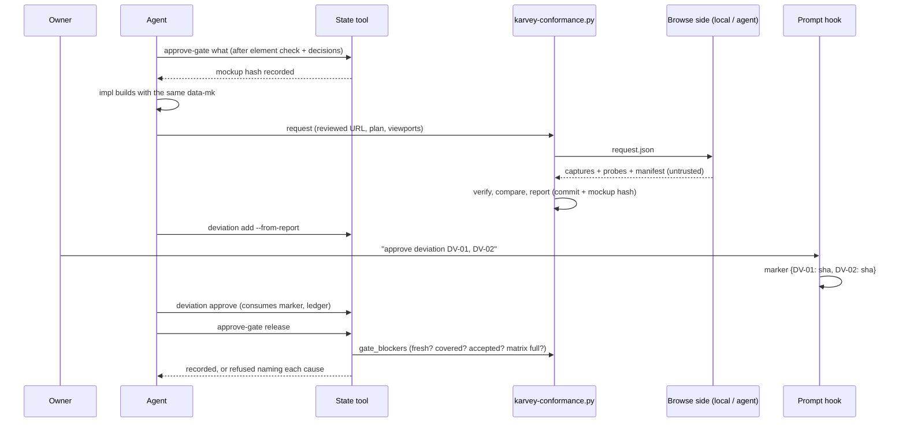

# Architecture: mockup-conformance

> PHASE 5 (`karvey-architecture`, the skill as it is in this branch) · Security Tier **3** · Layers: Backend (the
> plugin's hooks, scripts, library, schemas, templates and skill/rule text) · Target of this repository: `cli` ·
> Lane: `standard` (mockup and design-graphic skipped by the lane: this repository has no UI; the change is proven on
> fixture UI projects, REQ-MC-052) · Complexity: **new capability** on top of the Wave 1 hook and state tool, the
> Wave 2 lanes, gates, judges, traceability and check modes, the Wave 3 design system, load lists and `browse.via`,
> and the `living-docs` confirm phrases, reviewed settings and component sheets — so both the component and the
> data-flow diagrams are included (§4).
>
> Revised 2026-09-28 for D-42 (finding F-55, spec revision): `requirements.md` now REQ-MC-001..057 — 016, 030 and 055
> revised, 056 and 057 added; the parts touched are §1.7, §1.12, §2.2, §6.1, §11 and the revision history.
>
> Inputs read in this session: `prd.md`, `requirements.md` (REQ-MC-001..055, approved at the *what* gate under
> D-21, commit `1eb6e9c`), `spec-delta.md`, `PLAN.md`, `spec.json`, `findings.md` (F-01..F-31, all closed),
> `docs/spec/project.json`, the `living-docs` design (`living-docs/architecture.md`, §1.1, §1.6, §1.7, §1.9, §1.10,
> §1.17, §1.19, §3, §13) and tasks, the Wave 3 and Wave 2 spec-deltas, and the real code listed in §1.1 (verified on
> `feature/mockup-conformance` at `1eb6e9c`, whose base holds Waves 1–2, part of Wave 3 and the `living-docs` spec —
> not its code).

## Summary

The method already has everything a conformance gate needs except the link between the mockup and the build: a
prompt hook that writes one-use markers from the owner's own words (D-01; the `living-docs` confirm phrases), a state
tool that is the only writer of `spec.json` and refuses phase moves and approvals, a check-mode registry, a
traceability script, a release-gate script, a browse skill that runs locally or through a named agent
(`browse.via`), a design-system parser, and (after `living-docs`) component sheets. This change adds that link as
data plus two deterministic scripts, so that the model only builds and explains while scripts decide:

- **Element ids in the mockup.** A written contract (`data-mk`, `data-mk-req`, `data-mk-repeat`,
  `data-mk-dynamic`; `[mk:<id>]` lines for CLI transcripts) and a new script, `karvey-mockup.py check`, that parses
  the mockup with the standard library's HTML parser, writes `mockup-map.json` (kind, screen, state, parent, order,
  text, requirements, repeat, dynamic, history of ids and renames) and reports every violation of REQ-MC-001..008.
- **Decisions written back.** A decision log `mockup-log.md` written only by `karvey-state.py mockup decision
  add|resolve`, whose resolution is checked against `revision_history`; one function, `mockup.gate_blockers`, is
  called by `approve mockup`, `approve design_graphic` and `approve-gate what`. The mockup hash is recorded at the
  mockup and design approvals and checked by `validate` and `advance … impl`.
- **The mockup as the input of implementation.** `advance … impl` refuses without a matching hash; tasks carry an
  `Elements:` line checked by `karvey-mockup.py assign`; the conformance plan is generated from the map
  (`karvey-conformance.py plan`); the impl skill loads the map and builds with the same ids, taking structure,
  layout, content and style from the mockup and behaviour from the requirements (D-42): equal or better, never
  different — an improvement is a declared deviation the owner approves, and a requirement/mockup conflict is an
  open finding the task cannot close over.
- **The conformance gate.** `karvey-conformance.py` splits capture from comparison. Captures are taken where
  `browse.via` says, by the browse skill, following a request file; each capture comes back with a manifest and an
  **element probe** (a shipped in-page script for web; the accessibility-tree dump for native; the real transcript for
  CLI). The comparison is pure standard library — a small PNG codec, per-pixel and per-element differences, a
  side-by-side image with outlined regions, text and style comparison — and writes `conformance/report.json` bound
  to the build commit and the mockup hash.
- **Deviations the owner approves through the hook.** `## Mockup deviations` in `deviations.md`, managed by
  `karvey-state.py deviation add|list|approve`; the hook recognises `approve deviation DV-NN` in the owner's own
  prompt and writes a one-use marker holding the SHA-256 of each named entry; the state tool records the approval
  only from that marker, in a protected ledger that is the authority. `conformance.gate_blockers` refuses QA, the
  release gate, the production approval, the release-gate script and the deploy skill while anything is uncovered,
  pending, tampered, stale or missing.
- **Traceability to evidence.** `karvey-trace.py` gains the element, plan-entry and conformance-result columns; the
  release gate refuses an empty cell of a `ui` requirement.

Existing projects receive it through three project-upgrade steps (`mc-1-settings`, `mc-2-mockup-ids`,
`mc-3-capture`, shown as MC-1..MC-3). Every new check is a registered row with a `4.3` default; a project with no UI
change behaves as under 4.2.0. There is no cloud: infra is skipped (§12).

## Engineering-standards conformance gate (Step 4B)

**Not evaluated.** `docs/spec/project.json` declares no `standards` block and `docs/spec/standards/` does not exist.
As in Waves 1–3 and `living-docs`, "not evaluated" is not conformance: every non-trivial pattern choice is listed in
§10.1 and taken by the architect with the recommended option under D-21, for the owner to confirm at the *how* gate.
No `deviations.md` is created for this change.

---

## 1. Components and boundaries

### 1.0 System boundary

**This spec owns:**
- New scripts: `plugins/karvey/scripts/karvey-mockup.py` (element check, map, assignment check, id proposal for
  MC-2) and `plugins/karvey/scripts/karvey-conformance.py` (plan, request, verify-captures, compare, report, status).
- New library modules: `karvey_lib/mockup.py` (HTML and transcript parsing, element rules, map, history, decision
  log, gate blockers of the *what* gate), `karvey_lib/conformance/` (`__init__.py` gate blockers and staleness,
  `png.py` codec, `imgdiff.py` pixel and box difference, `render.py` side-by-side and overlay, `elements.py`
  presence/text/style, `textdiff.py` CLI transcripts, `plan.py`, `captures.py` request and manifest verification),
  `karvey_lib/deviations.py` (parser, coverage, ledger, approval from the marker).
- New shipped assets: `plugins/karvey/templates/conformance/mk-probe.js` (in-page element probe for web, read-only),
  `plugins/karvey/templates/conformance/request.schema.json`, `manifest.schema.json`, `probe.schema.json`.
- New data: `confirm.deviation` phrases in `karvey_lib/vocabulary.json`; rows with a `4.3` default in
  `schemas/check-modes.json`; `conformance` in `project.schema.json`; `mockup`, `conformance`, `deviation_log` in
  `spec.schema.json`.
- Extensions: `karvey-state.py` (`mockup` and `deviation` command groups; blockers in `advance`, `approve`,
  `approve-gate`, `next`; hash at mockup and design approvals; `validate` checks), `karvey_lib/guards.py` and
  `approval.py` (the deviation confirm phrase next to the `living-docs` confirm phrases, protect-paths needle for the
  deviation ledger), `karvey-context.py` (gate summaries of the *what*, *how* and *release* gates), `karvey-trace.py`
  (element columns), `karvey-release-gate.py` (one item), `karvey_lib/components.py` of `living-docs` (the
  `Mockup elements` section, archive merge, sheet element check), `karvey-context-budget.py` (nothing new: the
  `living-docs` `--fail-growth` is reused), `lint-plugin.py` (L-82..L-87), the upgrade catalogue.
- New rule text: `rules/mockup-conformance.md`; `Load:` entries of the acting skills; skill text of `karvey-mockup`,
  `karvey-design-graphic`, `karvey-tasks`, `karvey-impl`, `karvey-test`, `karvey-qa`, `karvey-deploy`,
  `karvey-archive`, `karvey-browse`; the fiscal rubric `rules/judges/qa.md`; `rules/targets.md` (element id and
  capture per target); the plugin README section; `hooks/README.md`.
- Tests under `plugins/karvey/tests/` (§6), including the two fixture projects (§6.4, REQ-MC-052).

**This spec does NOT touch:**
- The engineering-standards entries of `deviations.md` and their design-time approval (a new section is added; the
  existing one is read-only for this change's code).
- The approval vocabulary's approval, negation and production lists; the approval and `living-docs` confirm markers'
  format (a new kind is added); the release ledger; the prod-gate hook.
- The design judge's closed inputs (REQ-W3-039); the finding types of the iteration loop; the lane table.
- Any browser, simulator or image tool as a dependency of the plugin: captures come from the environment the browse
  settings name (A-03); the plugin's code stays standard-library Python.
- `CHANGELOG.md`, `docs/spec/decisions.md`, `docs/spec/backlog.md`, `docs/spec/agent/*` in this phase.
- The owner's personal global instructions or anything under the user's home directory.

**Changes that require revalidating this design:**
- `living-docs`' final head changes the confirm-phrase markers, the reviewed-setting reader, `environments`, the
  component map or the frontend-module template differently from its approved design (§13).
- Wave 3's final head changes `browse.via`, the design-system parser or the load-list format.
- The runtime stops delivering the owner's prompt to the `UserPromptSubmit` hook (the approval path depends on it).
- A target gains an element-id convention that the probe contract (§1.8) cannot express.

### 1.1 Code this design builds on (verified in this branch at `1eb6e9c`)

| What | Where (file:line) | Use here |
|---|---|---|
| State tool subcommands | `karvey-state.py:2346` (`build_parser`); `cmd_validate` `:851`, `compute_next` `:1042`, `cmd_advance` `:1265`, `cmd_generated` `:1439`, `cmd_reopen` `:1498`, `cmd_approve` `:1712`, `cmd_approve_gate` `:2068`; `gate_mode` `:518` | `+ mockup …`, `+ deviation …`; blocker calls; hash at approvals |
| Revision history writer | `karvey-state.py:1522` (`revision_history` append in `cmd_reopen`) | resolution check of REQ-MC-009 reads it |
| Markers, scopes, one-use consume | `karvey_lib/approval.py:125` (`approvals_dir`), `:140` (`write_marker`), `:252` (`consume`), `:386` (`classify_notify`), `:414` (`write_notify_marker`), `:41` (`SCOPE_PROJECT`) | the deviation marker follows the notify/confirm pattern |
| Approval guard, protect-paths | `karvey_lib/guards.py:1219` (`approval_hook`), `:167` (`STATE_NEEDLES`), `:238` (`protect_paths`) | deviation phrase recognised in the same guard pass; `+` needle `karvey/deviations` |
| Gate summary | `karvey-context.py:945` (`gate_summary`), `:900` (`_judges_block`) | mockup, plan and conformance blocks |
| Traceability model | `karvey-trace.py:309` (`build`), `:66` (`requirement_ids`), `:85` (`parse_tasks`), `:370` (`render`), `:408` (`check`) | element columns (REQ-MC-036, 037) |
| Release-gate items | `karvey-release-gate.py:112` (`item_qa`), `:117` (`item_tests`), `:276` (`cmd_check`), `:105` (`_trace_module`) | `+ item_conformance` |
| Design-system tables | `karvey_lib/designsys.py:113` (`parse`), `:180` (`parse_delta`), `:160` (`resolved`) | token names and resolved values (REQ-MC-044) |
| Check-mode registry | `schemas/check-modes.json`; `karvey_lib/modes.py` (`registry`, `resolve`, `would_refuse`) | `4.3` rows (REQ-MC-049) |
| Leak patterns | `karvey_lib/leakcheck.py`, `leak_patterns.json` (`secret`) | id rule of REQ-MC-002; request files |
| Evidence runner | `karvey-evidence.py:48` (`run_streamed`) | the CLI capture runs the declared command through it (argv, no shell) |
| Lint | `lint-plugin.py` (checks up to L-73 here; `living-docs` takes L-76..L-81) | new checks start at **L-82** (§13) |
| Created by `living-docs` (not in this branch) | confirm phrases and markers (`classify_confirm`, `approvals/confirm/`), `project.reviewed_value` use for settings, `project.json:environments`, `components.py`, the frontend-module template, `4.2` check-mode column, `--fail-growth` | referenced by role; §13 lists what to re-verify |
| Created by Wave 3 (not all in this branch) | `browse.via` resolution in `karvey-browse`, `Load:` lines, `rules/_core.md` | referenced by role; §13 |

**Shared conventions** stay those of Wave 1 §1.1: standard-library Python ≥ 3.9 plus bash 3.2, the exit codes
`0 ok · 1 findings · 2 usage · 3 refused · 4 not found · 5 internal`, the `--json` envelope, atomic writes under a
lock, ISO 8601 times with an offset, argv lists only.

### 1.2 Plugin tree after this change (new ★, modified ✎)

```
plugins/karvey/
├── hooks/README.md                          ✎ deviation confirm phrase
├── schemas/
│   ├── check-modes.json                     ✎ "4.3" column + 21 rows (§1.16)
│   ├── project.schema.json                  ✎ conformance {…}
│   └── spec.schema.json                     ✎ mockup {…}, conformance {…}, deviation_log[]
├── scripts/
│   ├── karvey-mockup.py                     ★ check · assign · propose
│   ├── karvey-conformance.py                ★ plan · request · verify-captures · compare · status
│   ├── karvey-state.py                      ✎ mockup / deviation groups; blockers; hashes
│   ├── karvey-context.py                    ✎ gate-summary blocks
│   ├── karvey-trace.py                      ✎ element, entry, result columns
│   ├── karvey-release-gate.py               ✎ item_conformance
│   ├── lint-plugin.py                       ✎ L-82..L-87
│   └── karvey_lib/
│       ├── mockup.py                        ★ parse, rules, map, history, decision log, what-gate blockers
│       ├── deviations.py                    ★ entries, coverage, ledger, approval from the marker
│       ├── conformance/__init__.py          ★ report model, staleness, release blockers
│       ├── conformance/png.py               ★ PNG decode/encode (zlib, filters 0–4, RGBA8/RGB8)
│       ├── conformance/imgdiff.py           ★ masked pixel ratio, colour distance
│       ├── conformance/render.py            ★ side-by-side, overlay, outlines
│       ├── conformance/elements.py          ★ presence, visibility, box, text, style
│       ├── conformance/textdiff.py          ★ CLI transcript normalisation and difference
│       ├── conformance/plan.py              ★ plan from the map
│       ├── conformance/captures.py          ★ request file, manifest and probe verification
│       ├── approval.py / guards.py          ✎ deviation phrase → marker; needle karvey/deviations
│       ├── components.py (living-docs)      ✎ Mockup elements section, archive merge, element check
│       ├── vocabulary.json                  ✎ confirm.deviation (en, es, pt, de, fr)
│       ├── upgrade-steps.json               ✎ mc-1-settings, mc-2-mockup-ids, mc-3-capture
│       └── upgrade_steps.py                 ✎ their check / fix functions
├── skills/
│   ├── karvey/rules/mockup-conformance.md   ★
│   ├── karvey/rules/targets.md              ✎ element id and capture per target
│   ├── karvey/rules/judges/qa.md            ✎ fiscal: conformance claims cite the report
│   └── karvey-{mockup,design-graphic,tasks,impl,test,qa,deploy,archive,browse}/SKILL.md ✎
├── templates/
│   ├── conformance/mk-probe.js              ★ in-page probe (read-only)
│   ├── conformance/{request,manifest,probe}.schema.json ★
│   └── components/frontend-module.md        ✎ Mockup elements (template created by living-docs)
└── tests/ (§6), incl. fixtures/conformance/{web,cli}/ ★
README.md                                    ✎ one section (REQ-MC-051)
```

### 1.3 C-01 — Element contract and element check (`karvey_lib/mockup.py`, `karvey-mockup.py check`)

**Contract** (written in `rules/mockup-conformance.md`, REQ-MC-001..004):

| Attribute | Value | Rule |
|---|---|---|
| `data-mk` | id `[a-z0-9]+(-[a-z0-9]+)*`, ≤ 48 chars, no digit run ≥ 6, no `secret` leak-pattern match | unique per mockup except repeats |
| `data-mk-req` | space-separated requirement ids, or `gap` | ≥ 1; ids resolve in `requirements.md` or the living spec |
| `data-mk-kind` | `screen · overlay · region · control · message · state` | optional: inferred from the tag and ARIA role (`button`, `a`, `input`, `select`, `[role=dialog]`, …); required when not inferable |
| `data-mk-repeat` | present | every instance of a repeated id |
| `data-mk-dynamic` | present | content varies; masked at comparison |
| `data-mk-screen` / `data-mk-state` | on screen and Level-4 containers | give each element its screen and state (nearest ancestor) |

**Required elements** (REQ-MC-001): elements whose inferred kind is `control` (interactive tags and roles), every
container the mockup skill marks as a screen, overlay, region, message or state; a decorative or layout element is
never required. **Surface** (REQ-MC-004): read from each requirement's trace line in `requirements.md`
(`Surface: ui|none`); a requirement cited from the living spec counts as `ui` for that element and outside coverage.

**Parsing:** `html.parser.HTMLParser` (standard library) over each mockup file (`mockup.html`, `mockup/*.html`);
positions reported as `file:line:col` plus a CSS-like path; unparsable input → exit 5 with the position, no map
written. CLI transcripts (`mockup.md`, target `cli`) parse `[mk:<id>]` lines, the following `anchor:` line (literal or
`/regex/`) and the block up to the next marker (§1.8).

**Map** (`mockup-map.json`, deterministic: sorted keys, stable order, no times): `{version, files[{path, sha256}],
elements{id: {kind, screen, state, parent, order, text, reqs[], repeat, instances, dynamic, path}}, coverage{ui[],
uncovered[]}, history{iteration, removed[], renamed{old: new}, retired{id: {kind, screen}}}}`. `history.retired`
keeps every id ever removed with its kind and screen, so REQ-MC-006's reuse check spans all iterations. A rename is
declared by the mockup skill through `karvey-mockup.py check --rename old=new` (recorded in the map; never inferred).

**Unlogged changes** (REQ-MC-008): the check compares the new map with the previous iteration's (kept as
`mockup-map.prev.json` by the check itself) and lists ids added, removed, or with changed text or requirements;
the state tool refuses `generated mockup` and the approval while such an id is cited by no decision row.

**Output:** errors (exit 1) and the map; `--json` envelope. The check runs at every generated iteration
(`generated mockup` refuses `element check not run` when the map's file hashes do not match the mockup files), after
design-graphic, and inside every blocker call (§1.5).

### 1.4 C-02 — Decision log (`mockup-log.md`) and the `mockup` command group

`karvey-state.py mockup decision add <change> --iteration N --elements a,b --origin owner|agent (--quote "…" |
--instruction F-NN)` appends `MD-NN` rows; `mockup decision resolve <change> MD-NN --as requirement-revision --reqs
REQ-… --revision <at>` or `--as no-spec-impact --reason "…"` (reason ≥ 10 chars). The file is written only by the tool
(table header fixed; quote capped at 200 chars and leak-checked; cells escaped as in `judges.py`), and the tool
records the file's SHA-256 in `spec.json:mockup.log_sha256` on every write; `validate` reports a mismatch as
`decision log not written by the state tool` (REQ-MC-008 error scenario). A `requirement-revision` resolution is
refused unless `revision_history` has an entry at `<at>` whose `reason` or `findings` names the MD id and whose
requirement ids exist (REQ-MC-009). `mockup decision list` prints the rows and their state.

The captured-instruction link (REQ-MC-011) reads the `instruction` rows of `living-docs` (`instructions.read_rows`):
a row captured while `phase == mockup` and classified `requirement-revision` must be cited by an MD row.

### 1.5 C-03 — The *what*-gate blockers and the mockup hash

`mockup.gate_blockers(root, change, phase)` returns named causes: element-check errors, unresolved MD rows, missing
revision entries, uncited `requirement-revision` instruction rows, requirements cited by the map that no longer
exist, unlogged element changes. It is called by `cmd_approve` for `mockup` and `design_graphic`, by
`cmd_approve_gate` when the gate covers either, and by `compute_next` (so `next` shows them). The refusal lists every
cause, exit 3 (REQ-MC-010, 011).

**Hash** (REQ-MC-012): on a successful `approve mockup` and `approve design_graphic`, the state tool writes
`approvals.<phase>.artifact_sha256` = SHA-256 over the sorted `(path, sha256)` of the mockup files plus the map, and
`spec.json:mockup.hash` = the latest. `validate` recomputes it (`mockup changed after approval`), `cmd_advance` to
`impl` refuses on mismatch or on a UI change without an approved mockup (REQ-MC-014). The only sanctioned way back is
`reopen` through `/karvey-iterate` (existing backward edge).

**Gate summary** (REQ-MC-013): `karvey-context.py` adds a *Mockup decisions* block to the gate that approves the
mockup: requirement revisions with their REQ and MD ids, then `no-spec-impact` dismissals with reasons; the approval
`ref` records the MD ids (`approve-gate … --ref "D-NN; MD-03, MD-05"` is composed by the tool, not typed). If the
block cannot be built (a revision without its MD), the summary reports it and the gate question is not asked.

### 1.6 C-04 — Tasks and the conformance plan (`karvey-mockup.py assign`, `karvey-conformance.py plan`)

- **`Elements:` line** in each UI task of `tasks.md` (parsed next to `**Requirements:**` by `karvey-trace.py`'s
  `parse_tasks`). `karvey-mockup.py assign <change>` lists ids of the map in no task and tasks naming unknown ids;
  `approve tasks` / `approve-gate how` refuse on either (REQ-MC-015). The tasks skill writes one `[Test]` presence task
  per screen before its first UI task.
- **Plan** (`conformance/plan.json`, REQ-MC-019, 020): generated from the map — one entry per `screen` and per
  `state` container: `{id, mockup: {file, anchor | steps}, build: {route | command, steps[], fixture}, viewports[],
  elements[]}`. The generator fills the mockup side and the element lists; the build side is written by the tasks
  skill (routes, steps, fixture names) and validated: every map id in ≥ 1 entry, steps from a closed vocabulary
  (`click <id>`, `fill <id> <fixture-key>`, `select <id> <fixture-key>`, `wait <id>`, `key <name>`), fixture keys
  resolved from `conformance/fixtures.json` (fictional data only; each value ≤ 200 printable characters, no control
  characters, leak-checked — S-10). Viewports default from
  `conformance.viewports` (1280×800 and 390×844 for web; device profiles for native).

### 1.7 C-05 — Implementation inputs

The impl skill's `Load:` gains the rule; its Step 1 reads `mockup-map.json` and the mockup files (hash-checked by
`advance`), and per UI task the elements named in `Elements:` with their parent, order, text, states and the tokens
their styles reference. **Source order (REQ-MC-016, D-42):** the approved mockup is the primary source of structure,
layout, content and style; the requirements cited by each element (`reqs` in the map) are the source of behaviour.
The skill text states it as a rule, not a hint: a UI element the mockup shows is never built from the requirements'
prose alone, and the expected build is equal to the mockup or better, never different. The skill text makes five
duties explicit: the same `data-mk` (or the target's equivalent) on the built element (REQ-MC-017);
`karvey-state.py deviation add … --origin impl --kind forced` when the stack forces a difference (REQ-MC-055);
`deviation add … --origin impl --kind improvement --better "<reason>" --image <sbs>` when the agent judges a
difference better (REQ-MC-056 — no other way to ship it); on a requirement/mockup conflict, stop the task, ask the
owner and record a `spec-gap` finding whose text names `REQ-…` and `mk:<id>` (REQ-MC-057), never choosing a side; the
presence test of the task green at task close (`karvey-conformance.py compare --entry <screen> --presence-only` over a
local probe when `browse.via` allows, or the unit test that asserts the ids in the rendered component where the
project's test runner can render). The presence-only compare also reads `findings.md` and exits non-zero with
`conflict open: F-NN (<element id>)` while an `open` `spec-gap` names an element of the entry, so the task cannot close
over an unanswered conflict (REQ-MC-057); the convergence rule of the iteration loop keeps it out of deploy as well.
Stripping ids in production is a build setting of the project; the gate reads `conformance.strip_in_production` from
the reviewed line only (REQ-MC-017) and never strips anything itself.

### 1.8 C-06 — Probe contract per target (`templates/conformance/`)

Every capture carries a **probe** (`probe.schema.json`): `{entry, viewport, pixel_ratio, elements: [{id, instance,
present, visible, box: {x, y, w, h}, text, style: {color, font_size, font_weight}, dynamic}]}`.

| Target | Element id | Probe source | Capture | Pixel diff |
|---|---|---|---|---|
| web | `data-mk` attribute | `mk-probe.js` run in the page after the entry's steps: `querySelectorAll('[data-mk]')`, `getBoundingClientRect`, `innerText`, `getComputedStyle`, visibility (display, visibility, opacity, zero box, off-viewport) — reads only, sets `animation`/`transition`/`caret-color` to none via an injected stylesheet before the screenshot | viewport screenshot (PNG) | yes (REQ-MC-024) |
| mobile, desktop | accessibility / test identifier = the id | the platform's accessibility-tree dump, converted by the browse adapter to the probe shape; no tree → `present: null` (`not evaluated`, REQ-MC-039) | simulator / emulator / window screenshot at the device profile | only when both images have the same pixel size, else `unmeasured` |
| cli | `[mk:<id>]` block anchor | the real transcript: the declared command run with the entry's inputs through `karvey-evidence.run_streamed` (argv, no shell, working directory = repo, timeout 30 s), `TERM=dumb COLUMNS=<width>` | the transcript text | none; normalised text difference (§1.10) |
| any other | — | — | — | `not applicable: target <t>` (REQ-MC-041) |

The mockup side is probed the same way (web and native frames are HTML rendered by the same browser at the same
viewport; CLI mockups are the transcript itself), so both sides of a pair share one shape.

### 1.9 C-07 — Captures where `browse.via` says (`captures.py`, `karvey-browse`)

`karvey-conformance.py request <change>` writes `conformance/request.json` (`request.schema.json`): the plan's
entries, viewports, colour scheme `light`, locale from the project, the development base URL or CLI command **taken
from the reviewed line** (`project.json:environments.<name>.url` of an environment not marked production, or
`conformance.cli_command`), the probe script's SHA-256, the build commit (`git rev-parse HEAD`; the probe reads the build's own commit from a
`<meta name="karvey-build">` tag, a native build setting or, for CLI, runs in the repository at HEAD — a mismatch makes
the capture `unverified`, an absent tag is `build commit unproven`, listed at the gate), the mockup hash, and
the fixture user **by name** (credentials stay in the receiving environment). The request is leak-checked and refused
if it holds a secret-shaped value (REQ-MC-026). Production targets are refused before writing (REQ-MC-027), fail
closed: the base URL's host must be in the reviewed allow-list `conformance.dev_hosts` (default `localhost`,
`127.0.0.1`); it is also compared with every environment marked `production` (host and path prefix) and with
`conformance.forbid`; an empty allow-list refuses. A development front end that calls production services is outside
what the run can see: the rule requires fixture-backed development services and R-5 records the limit.

`karvey-browse` (skill text, Wave 3 `browse.via`):
- `local`: runs the request with whatever browser automation the environment provides (the skill names examples only;
  A-03), writes `captures/<entry>@<w>x<h>.{mockup,build}.png` and `.probe.json`, and a `manifest.json`
  (`manifest.schema.json`): per file `{sha256, entry, viewport, side, commit, mockup_hash, bytes}`.
- `agent:<name>`: sends the named agent the request file's content as a self-contained instruction (no secret, no
  path outside the change) and receives the files and manifest into `captures/`.
- `none`: writes nothing; the report becomes `not evaluated` (REQ-MC-026).

`karvey-conformance.py verify-captures <change>` checks each file against the manifest (hash; PNG ≤ 8 MB, probe ≤ 1 MB,
manifest ≤ 256 KB; the PNG header's dimensions are checked against the viewport before any inflation, and inflation
is bounded to `w × h × 4 + h` bytes),
the manifest against the request (entry, viewport, commit, mockup hash, probe hash), and the PNG header dimensions
against `viewport × pixel_ratio`; a failing capture is `unverified` and its entry has no result.

### 1.10 C-08 — Comparison (`imgdiff.py`, `render.py`, `elements.py`, `textdiff.py`, `png.py`)

- **PNG codec** (standard library): decode 8-bit RGB/RGBA, non-interlaced, filters 0–4; encode RGBA with filter 0;
  anything else → `unmeasured (unsupported image)`. **Text layers are leak-checked** (probe text, CLI transcripts) before
  the report is written: a hit refuses the report and names the capture and rule, never the value (S-4). Pixel loops run over `bytes`/`memoryview` rows; a 1280×800 pair
  compares in a few seconds (A-05).
- **Masking:** boxes of elements the **approved map** marks dynamic (from each side's probe) are filled with one colour
  on both images; a dynamic marker present only in the build's probe is ignored and reported (REQ-MC-022).
- **Pixel ratio** (REQ-MC-024): a pixel differs when its Euclidean RGBA distance / max > `pixel_tolerance` (0.1);
  ratio = differing / total; `over threshold` when ratio > `pixel_threshold` (0.5%) or any element box differs by more
  than `box_tolerance_px` (4) in x, y, w or h (CSS px × pixel ratio). The three values come from the reviewed line
  (`reviewed_value`); working-copy values are ignored and audited.
- **Elements** (REQ-MC-021, 023, 054): `present` / `missing` / `hidden` from the probes; `extra` = ids in the build's
  probe not in the map (REQ-MC-018); `text differs` after whitespace normalisation; `style differs` on colour (exact
  after resolving both to RGBA), font size (±0.5 px) and font weight; `box Δx/Δy/Δw/Δh`; tokens: the build's
  computed values are matched to design-system tokens (`designsys.resolved`) and an unknown value on a styled
  property is `undeclared token` (warn, REQ-MC-044).
- **Side-by-side** (REQ-MC-023): one PNG per pair: mockup | build | overlay (build dimmed to 30%, differing pixels
  red, each differing element outlined 2 px with its id in the report, not drawn text). Size mismatch →
  side-by-side only, `unmeasured (size differs)` (REQ-MC-025).
- **CLI** (REQ-MC-040): both transcripts normalised (trailing spaces, ANSI sequences removed, declared dynamic
  patterns → `<dyn>`), presence = anchor found, difference = `difflib.unified_diff` of each block. Anchors and dynamic
  patterns live **in the mockup transcript** (so they are covered by the mockup hash and the owner's approval); a
  pattern is a restricted regex (≤ 80 chars, no backreferences, no nested quantifiers, must contain a literal of ≥ 3
  characters, matches within one line) checked by the element check; anything else is refused. The command runs with a
  minimal environment (`PATH`, `LANG=C.UTF-8`, `TERM=dumb`, `COLUMNS`, `HOME` = a temporary directory).

### 1.11 C-09 — Report, staleness and evidence (`conformance/__init__.py`)

`karvey-conformance.py compare <change>` writes `conformance/report.json` (+ `report.md` rendered from it):
`{commit, mockup_hash, settings (reviewed values), target_results, entries[{id, viewport, result: pass | over
threshold | unmeasured | state not reached | not evaluated | not applicable, ratio, elements{id: [findings]}, images
{mockup, build, side_by_side: {path, sha256}}}], deviations_covering{}, generated_by}`. The report is **never
trusted as written**: `conformance.gate_blockers` recomputes it from the verified captures, the approved map, the
plan and the reviewed settings (the comparison is deterministic) and refuses when the recomputation differs from
`report.json` (`report does not match its captures`); `spec.json:conformance.report_sha256` is a cache of the last
recomputation, not an authority. `fix-build` entries close only in a recomputation (REQ-MC-031). Recomputation costs
one comparison pass per gate call (R-2).

**Staleness** (REQ-MC-028): `status` computes stale when `git log <report.commit>..HEAD -- <UI code>` is non-empty
(UI code = the frontend-module paths of the component map; else `conformance.ui_paths`; else every path outside
`docs/`) or when `spec.json:mockup.hash` ≠ `report.mockup_hash`. **Storage** (REQ-MC-029): `captures: commit`
(default) keeps images under `conformance/captures/`; `local` writes them to `<state>/conformance/<change>/` and the
report keeps hashes; a missing local image at a gate → `capture missing: <name>`.

### 1.12 C-10 — Mockup deviations (`deviations.py`, `deviation` command group)

`deviations.md` gains `## Mockup deviations`; each entry is a fixed block (`### DV-NN — <title>`, then `Elements:`,
`Entries:`, `Images:`, `Differs:`, `Kind: forced | improvement | found`, `Why:`, `Better because:` (only and always
for `improvement`), `Resolution: fix-build | accept | revise-mockup`, `Origin: impl | gate | agent`, `Status:`).
`deviation add --kind improvement` is refused with `improvement without reason` when `--better` is empty (< 10
characters) and with `improvement without side-by-side image` when its `Images:` path does not exist; an improvement
is proposed `accept` and counts only through the owner's marker (REQ-MC-032); when the owner does not approve it, the
agent records `deviation update DV-NN --resolution fix-build` (the conservative direction needs no marker; the reverse
does) and the entry then closes only as `fixed` in a recomputation (REQ-MC-056, 031). Entries
created by `--from-report` carry `Kind: found`. Only `karvey-state.py deviation add|update|close` writes it; `deviation add --from-report` creates
one entry per uncovered difference (one per screen for `unmeasured`, REQ-MC-025). Coverage (REQ-MC-030) maps every
report finding to the entry whose `Elements`/`Entries` cover it. `fix-build` entries close to `fixed` only inside
`compare`, when the difference is gone (REQ-MC-031); `revise-mockup` entries are handed to `/karvey-iterate` as a
spec-revision (`reopen … mockup`), and close when a new report after re-approval passes.

### 1.13 C-11 — The owner's deviation approval through the hook (REQ-MC-032)

- **Recognition** (hook, `approval.classify_confirm` of `living-docs` extended with `deviation`): the stripped prompt
  must be the phrase (`approve deviation`, `aprobar desviación`, `aprovar desvio`, `Abweichung genehmigen`,
  `approuver l'écart`) followed by 1–10 ids `DV-\d{2,3}` separated by commas or spaces; ranges and > 10 ids → no
  marker, one-line notice `deviation phrase not recorded: …`.
- **Marker:** the hook reads the active change's `deviations.md` (read-only, ≤ 256 KB), computes the SHA-256 of each
  named entry's normalised text and writes a one-use marker `approvals/confirm/deviation-<change>.json` `{kind:
  deviation, change, ids{DV-NN: sha256}, prompt_sha256, at, session}` (0600). An id not found or not `pending` +
  `accept` → listed as not approved in the notice.
- **What the owner sees:** the hook's notice echoes, per id, the title, the `Differs:` line and the first 8 hex of the
  hash it bound (`bound DV-01 "Export button lower" Δy +20px #3fa2…`), so an entry changed between the owner's reading
  and the phrase is visible at once; the gate summary shows the same short hashes.
- **Origin of the prompt:** the hook uses the existing transcript cross-check (`approval.py:330` `cross_check`,
  `:306` `verify_transcript`) to confirm the phrase is in a user turn of the session transcript; a phrase that cannot
  be confirmed writes no marker (`deviation phrase not confirmed in transcript`). R-10 records the runtime limit.
- **Recording:** `karvey-state.py deviation approve <change>` consumes the marker (one use, ≤ 30 min old), re-hashes
  each entry, and on match writes `Status: accepted (owner, <at>)` and appends to the protected ledger
  `<state>/deviations/<change>.jsonl` (id, entry sha256, marker sha, hook audit id, clone id, time) and to the tracked
  `spec.json:deviation_log[]` (the same fields). It never takes ids or hashes as arguments beyond the change.
- **Verification** at every blocker call: in the clone that holds the ledger, an `accepted` entry without a ledger line,
  a ledger line without a matching hook audit record (the phrase recognition with the same marker sha), or a current
  text hash different from the ledger's is `tampered` / `approval void` → pending (REQ-MC-032 scenarios). **In another
  clone or in CI** the ledger is absent: an entry passes as `accepted (not verifiable here)` when its tracked
  `deviation_log` record names this clone id as foreign and its hash equals the current text, and every such entry is
  listed by id and clone in the release summary (the `living-docs` REQ-LD-059 model); a mismatch is tampered. Protect-paths blocks tool
  writes under `karvey/deviations` and the confirm directory (python and no-python needles).

### 1.14 C-12 — Release blockers and gate summaries (`conformance.gate_blockers`)

Called by `cmd_approve` for `qa` and `prod`, `cmd_approve_gate` for the release gate, `karvey-release-gate.py check`
(`item_conformance`), and by `karvey-state.py check-prod`, which the prod-gate hook runs before any deploy command —
so the deploy refusal does not depend on skill text (the deploy skill's first step also shows them). Causes
(REQ-MC-033): report missing, not matching its recomputation, stale, `not evaluated` without a covering accepted deviation; any
uncovered finding; any `pending` or `tampered` deviation; unverified captures. Mode from the registry (REQ-MC-048, §1.16). The
release-gate summary gets a *Conformance* block (REQ-MC-034): counts per result, each pending deviation with its
side-by-side path, the report path and commit; a missing image is printed as `DV-NN: capture missing`.

### 1.15 C-13 — Traceability to evidence (`karvey-trace.py`, REQ-MC-036, 037)

`build()` gains, when `spec.json` marks a UI change: per requirement `elements` (map ids citing it), `entries` (plan
entries holding them), `conformance` (per element and viewport: `pass`, `fixed DV-NN`, `accepted DV-NN`, `n/a
(target <t>)`, or empty). `render()` adds the columns; `check()` fails on an empty cell of a `ui` requirement; the
release-gate item reads the same `check`. The generated block keeps its existing drift detection.

### 1.16 C-14 — Settings, schemas and check modes

- `project.schema.json` → `conformance`: `viewports[]` strings `^[0-9]{3,4}x[0-9]{3,4}(@[1-4])?$` (`1280x800@2`;
  `1280x` → `conformance.viewports invalid`), `devices[]` (native, same pattern plus a name), `pixel_threshold`
  (**percent**, 0–100, default 0.5 = 0.5 %), `pixel_tolerance` (**fraction** of the maximum colour distance, 0–1,
  default 0.1), `dev_hosts[]` (default `localhost`, `127.0.0.1`), `box_tolerance_px` (0–64, default 4), `captures` (`commit|local`),
  `ui_paths[]` (repo-relative globs, no `..`), `cli_command` (argv array, first element repo-relative or a bare
  command name), `terminal_width` (40–240, default 80), `strip_in_production` (bool, default false), `forbid[]`.
  Every value used by a gate is read from the reviewed line (`reviewed_value`).
- `spec.schema.json` → `mockup {hash, log_sha256, approved_under, map_sha256}`, `conformance {report_sha256,
  last_status}`, `deviation_log[]`; all optional (4.2 shapes validate).
- `check-modes.json`: a `4.3` column (earlier columns unchanged) and 21 rows `mockup.element`, `mockup.design_ids`,
  `mockup.decision`, `mockup.instruction_link`, `mockup.hash`, `tasks.elements`, `conformance.plan`,
  `conformance.presence`, `conformance.extra`, `conformance.text_style`, `conformance.state`,
  `conformance.dynamic`, `conformance.threshold`, `conformance.unmeasured`, `conformance.captures`,
  `conformance.production` (blocking always), `conformance.stale`, `deviation.coverage`, `deviation.approval`,
  `conformance.target`, `trace.elements`; plus `sheet.elements` and `design.token` (warn). The resolver takes the
  change's `approved_under`: `< 4.3` → warn (REQ-MC-048, 049).
- **Absent values** (judges F-32, F-33, F-52): at 4.3 the state tool writes `approved_under` and the hash together at
  every mockup approval. A UI change whose mockup approval has **neither** is a 4.2 approval: every check warns,
  `advance … impl` warns `mockup hash absent (approved before 4.3)` instead of refusing, and `validate` warns. A change
  with one but not the other is inconsistent: `validate` errors and the checks are blocking (never fail open).

### 1.17 C-15 — Frontend-module sheets (REQ-MC-046, on `living-docs` code)

The frontend-module template and `component-kinds.json` gain the required section `Mockup elements` (table: id ·
change · since). `components --reconcile --apply` at archive merges a UI change's map ids into the sheets of the
modules whose paths contain the element (found by grepping the built code for the id in the target's form).
`components --check --commits` reports (warn) a commit that removes an id listed in a sheet without touching that
sheet, in every lane (the one lane-independent check, REQ-MC-042).

### 1.18 C-16 — Rule, skills, load lists and size

- `rules/mockup-conformance.md` (≤ 900 words): the element contract, the decision duty, the probe contract per target,
  the deviation phrase, the gate order. Named in `Load:` of `karvey-mockup`, `karvey-design-graphic`, `karvey-tasks`,
  `karvey-impl`, `karvey-test`, `karvey-qa`, `karvey-deploy`, `karvey-archive` only; `karvey-browse` (a support skill)
  gets a short section and no load entry. L-82 enforces the allowed-loaders list (REQ-MC-045).
- Skill text: mockup (ids on generation, element check each iteration, decision log, rename flag, gap routing);
  design-graphic (keep ids, re-run check, tokens by name); tasks (`Elements:` lines, presence test tasks, plan build
  side); impl (inputs, same ids, declared deviations); test (request → browse → verify → compare → deviations → trace);
  qa (Dimension 8 cites the report; the design-spec audit keeps accessibility and platform rules; REQ-MC-035); deploy
  (blocker check first); archive (sheet merge); `rules/judges/qa.md` fiscal question on conformance claims;
  `rules/targets.md` rows for element id and capture.
- Size: base snapshot after `living-docs`' implementation (E1.F9.T2), `compare --fail-growth 10` at the end
  (REQ-MC-045).

### 1.19 C-17 — Project-upgrade steps MC-1..MC-3 (REQ-MC-047)

| Step (label) | id | check (read-only) | fix | dry_run | human | risk | report_only | cost |
|---|---|---|---|---|---|---|---|---|
| MC-1 | `mc-1-settings` | `project.json` without `conformance` | add `conformance` with the defaults (reviewed after merge) | true | false | low | — | low |
| MC-2 | `mc-2-mockup-ids` | a change with `lane` running the mockup, phase ≤ `mockup`, mockup not approved, map absent or failing | `karvey-mockup.py propose <change>` writes the proposed ids and `data-mk-req` into a copy `mockup.proposed.html` + a list for the owner; the owner reviews and approves with the mockup | true | **true** | medium | — | scan |
| MC-3 | `mc-3-capture` | `browse.via` absent / `none`, or `local` without a runnable browser automation, or `agent:<name>` unreachable in the session | none (report only: what the conformance run will say) | true | false | low | yes | low |

`human: true ⇒ fix: null` (the catalogue's invariant L-38) → MC-2's "fix" is exposed as the `propose` command the
owner runs or asks for; the step writes nothing. Changes past their mockup are not touched (REQ-MC-048).

### 1.20 C-18 — Linter checks (L-82..L-87)

| Id | Check |
|---|---|
| L-82 | `rules/mockup-conformance.md` appears only in the `Load:` lists of the eight acting skills (REQ-MC-045) |
| L-83 | every check id passed to `modes` by the new scripts has a `4.3` row (REQ-MC-049) |
| L-84 | `mk-probe.js` contains no write API (`fetch`, `XMLHttpRequest`, `sendBeacon`, `WebSocket`, storage setters, `.value =`, `click(` outside the step runner) — read-only probe (S-6) |
| L-85 | `confirm.deviation` has phrases in every shipped language and matches the ids pattern (REQ-MC-032) |
| L-86 | the README section names `conformance`, both scripts, the deviation phrase and MC-1..MC-3 (REQ-MC-051) |
| L-87 | skill-text anchors: impl names the map and the mockup files as inputs, the source order (mockup for structure, layout, content and style; requirements for behaviour), the improvement and conflict duties and the same-id duty (REQ-MC-016, 056, 057, 017); tasks names `Elements:` (015); qa's Dimension 8 cites the report and says `not evaluated` without it, and `rules/judges/qa.md` asks the fiscal question on conformance claims (035); mockup, test and deploy name their steps (051) |

### 1.21 C-19 — Fixtures, dogfooding and sequencing (REQ-MC-052, 053)

`tests/fixtures/conformance/web/`: `requirements.md` (fictional invoice list, `Surface:` lines), `mockup.html`
(ids, a repeat, a dynamic date, empty and export-error states), `build/` (static HTML "built UI" with one moved
button and one changed label), pre-rendered captures + probes for CI (no browser in CI), and `plan.json`.
`tests/fixtures/conformance/cli/`: a transcript mockup and a tiny fixture command (`python3 -m` module inside the
fixtures) whose output differs in one anchor. The manual E2E (`tests/manual/conformance-e2e.md`) runs the web fixture
through a real browser where `browse.via` allows and ends with the owner's `approve deviation` phrase ([human]).
Sequencing: the first impl task verifies that `living-docs`' implementation is in the base (§13).

---

## 2. Data model

### 2.1 Files

| File | Written by | Tracked | Authority for |
|---|---|---|---|
| `changes/<id>/mockup-map.json`, `mockup-map.prev.json` | `karvey-mockup.py check` | yes | elements, coverage, history |
| `changes/<id>/mockup-log.md` | `karvey-state.py mockup decision …` | yes (hash in `spec.json`) | decisions MD-NN |
| `changes/<id>/conformance/plan.json`, `fixtures.json` | generator + tasks skill (validated) | yes | entries and recipes |
| `changes/<id>/conformance/request.json` | `karvey-conformance.py request` | yes | what the browse side must capture |
| `changes/<id>/conformance/captures/*` + `manifest.json` | browse skill (local or agent) | `captures: commit` → yes | raw evidence (verified, not trusted) |
| `changes/<id>/conformance/report.{json,md}` | `karvey-conformance.py compare` | yes (hash in `spec.json`) | results, staleness inputs |
| `changes/<id>/deviations.md` `## Mockup deviations` | `karvey-state.py deviation …` | yes | the entries' text |
| `<state>/deviations/<change>.jsonl` | `deviation approve` (from the hook marker) | no (git common dir, 0600) | which entry text the owner approved |
| `<state>/approvals/confirm/deviation-<change>.json` | the prompt hook | no | the owner's phrase, one use |
| `<state>/conformance/<change>/` | browse skill with `captures: local` | no | local images |

### 2.2 The mockup element (map entry) and the deviation entry

```json
"export": {"kind": "control", "screen": "invoice-list", "state": null, "parent": "filter-bar", "order": 2,
           "text": "Export", "reqs": ["REQ-INV-004"], "repeat": false, "instances": 1, "dynamic": false,
           "path": "mockup.html:88:9 main>section#filter-bar>button"}
```

```markdown
### DV-02 — Export button lower than approved
Elements: export · Entries: invoice-list@1280x800 · Images: conformance/captures/invoice-list@1280x800.sbs.png
Differs: box Δy +20px · Kind: found · Why: toolbar wraps at this width · Resolution: fix-build · Origin: gate
Status: pending
```

---

## 3. Security per tier (Tier 3) and trust boundaries

Waves 1–3 and `living-docs` controls remain. This change adds:

| # | Control | Component | REQ |
|---|---|---|---|
| S-1 | **Deviation approval only from the owner's words**: the hook writes a one-use marker from the human's prompt (D-01); the state tool records an approval only by consuming it, re-hashing each entry; no command takes an approval as an argument; an agent's message never reaches the hook. | C-11 | 032 |
| S-2 | **Protected authority**: the deviation ledger and confirm markers live in the git common dir (not tracked, 0700/0600); protect-paths blocks tool writes there (python and no-python needles); a tracked `accepted` status without a matching ledger line is `tampered`; an entry edited after approval voids it. Honest limit as Wave 1 §3.3: same OS user, so a deliberate multi-step forgery is possible and leaves traces (ledger line without a hook audit record). | C-11, C-12 | 032, 033 |
| S-3 | **Thresholds and storage from the reviewed line**: `pixel_threshold`, `pixel_tolerance`, `box_tolerance_px`, `captures`, `ui_paths`, `strip_in_production`, `cli_command` and the environment URLs are read from `origin/{production}`; working-copy values are ignored and audited (`conformance setting ignored (not reviewed)`). Honest limit: the reviewed line is the local `origin/{production}` ref, which the same OS user could move; the audit log records the ref's commit at each read. | C-14 | 017, 024, 026, 027 |
| S-4 | **Capture storage without private data**: captures only from a non-production environment with the plan's fictional fixture data (`fixtures.json` leak-checked); `captures: local` keeps images out of git; the report and request hold hashes, names and paths, never credentials; the fixture user is named, its secret stays with the environment that captures. | C-06, C-09 | 027, 029 |
| S-5 | **No network beyond `browse.via`**: the two new scripts open no socket (L-84-style AST test over `karvey-mockup.py`, `karvey-conformance.py` and `karvey_lib/conformance/`: no `socket`, `urllib`, `http.client`, `subprocess` except git and the declared CLI command through `run_streamed`); the only network traffic is the browse side's page loads of the development URL (`local`) or the message to the named agent (`agent:<name>`); `none` does nothing. | C-07, C-08 | 026 |
| S-6 | **Read-only probe**: `mk-probe.js` only reads the DOM and computed styles (L-84); the step runner acts only through the closed step vocabulary on elements with a `data-mk` of the plan; no arbitrary script from the plan is evaluated. | C-06 | 021, 022 |
| S-7 | **Captures verified, not trusted**: hashes, sizes, viewport × ratio, commit, mockup hash and probe hash checked against the manifest and the request; unverified captures give no result; a delegated agent cannot turn a failing entry into a pass without producing images whose comparison passes. | C-07 | 026 |
| S-8 | **No production target**: base URL compared with every production environment and `conformance.forbid` before any request is written; blocking in every mode. | C-07 | 027 |
| S-9 | **Only the state tool writes decisions, deviations and records**: `mockup-log.md` and the report carry hashes in `spec.json`; hand edits are reported; `fix-build` closes only inside `compare`. | C-02, C-10 | 008, 031 |
| S-10 | **No agent-controlled value reaches a command**: ids and step arguments validated against the map's id pattern; the CLI command comes from the reviewed line as an argv array; plan paths are repo-relative without `..`; git called with argv lists. | C-04, C-06 | 019, 040 |
| S-11 | **Mockup ids carry no data**: digit-run and secret-pattern rules (REQ-MC-002); quotes in the decision log capped and leak-checked. | C-01, C-02 | 002, 008 |

| Trust boundary | What crosses | Untrusted side | Validated at | Control |
|---|---|---|---|---|
| Owner prompt → hook | the deviation phrase | the runtime payload | `classify_confirm` (ids pattern, ≤ 10) | S-1 |
| Hook ↔ agent's shell | marker, ledger | the agent (same OS user) | protect-paths; re-hash at every blocker call | S-1, S-2 |
| Working copy → state tool / scripts | conformance settings, environments | the agent's edits | reviewed line only | S-3, S-8 |
| Browse side (local tool or named agent) → change folder | images, probes, manifest | the capturing side | `verify-captures` against the request | S-5, S-7 |
| Running build → probe | DOM, styles, text | the build under test | probe schema, size caps, read-only probe | S-6 |
| Plan / fixtures → step runner / CLI | steps, inputs, command | the agent-written plan | closed vocabulary, id pattern, reviewed argv | S-10 |
| `deviations.md`, `mockup-log.md`, report → state tool | entries, rows, results | the agent's edits | recomputation; hashes in `spec.json` and the ledger | S-2, S-9 |
| Session → `agent:<name>` (outbound) | request content | the receiving agent | request built only from the plan, names, URLs of the allow-list; leak-checked; no path outside the change | S-4, S-5 |
| CLI command output → committed transcript | stdout/stderr | the project's own command | minimal environment; leak check before write | S-4 |
| Development environment data → committed images and probe text | pixels, visible text | the development build | fixture-only plan; probe-text leak check; `captures: local` option | S-4, R-5 |

Logging: the audit log records phrase recognitions (ids, hashes, time), ignored settings and refusals — never prompt
text beyond the approval hook's existing 80-character excerpt, never image content.

---

## 4. Diagrams

### 4.1 Components

```mermaid
flowchart LR
  subgraph Mockup phase
    MS[karvey-mockup skill] --> MC[karvey-mockup.py check]
    MC --> MAP[(mockup-map.json)]
    MS --> ST1[state tool: mockup decision]
    ST1 --> LOG[(mockup-log.md)]
    DG[karvey-design-graphic] --> MC
  end
  subgraph Gates
    GB1[mockup.gate_blockers] --> AP1[approve mockup / design / what]
    AP1 --> H[(mockup hash)]
  end
  MAP --> GB1
  LOG --> GB1
  subgraph Build
    TS[karvey-tasks: Elements lines + plan] --> PLAN[(conformance/plan.json)]
    H --> ADV[advance impl]
    MAP --> IMPL[karvey-impl: same data-mk]
  end
  subgraph Conformance
    REQ[karvey-conformance.py request] --> BR[karvey-browse: local or agent:name]
    BR -. untrusted .-> CAP[(captures + probes + manifest)]
    CAP --> VER[verify-captures] --> CMP[compare] --> REP[(report.json)]
    REP --> DEV[state tool: deviation add]
    DEV --> DMD[(deviations.md)]
  end
  PLAN --> REQ
  HOOK[prompt hook: approve deviation DV-NN] --> MK[(confirm marker)] --> APR[deviation approve] --> LED[(protected ledger)]
  REP --> GB2[conformance.gate_blockers]
  DMD --> GB2
  LED --> GB2
  GB2 --> REL[approve qa / release gate / prod / deploy]
  REP --> TR[karvey-trace.py] --> MAT[(traceability.md)] --> REL
```



### 4.2 Data flow: from an approved mockup to a release



---

## 5. Edge cases

| Edge case | How it is handled | Component |
|---|---|---|
| Mockup with no element at all (empty file) | element check: every `ui` requirement uncovered; exit 1 | C-01 |
| Mockup file unparsable / not UTF-8 | exit 5 with file and position; no map written; `generated mockup` refused | C-01 |
| 5,000 repeated rows | one element with `instances`; probe caps 500 instances per id (first 500 compared, count reported) | C-01, C-08 |
| Id reused after removal in an older iteration | `history.retired` spans all iterations; refused | C-01 |
| Rename without `--rename` | seen as removed + added; both must be cited by a decision row | C-01, C-02 |
| Requirement deleted after being cited | map check fails `unknown requirement`; *what* gate refused | C-01, C-03 |
| Two agents resolve decisions at once | state tool lock + CAS on `mockup.log_sha256` (as for `spec.json`) | C-02 |
| Design-graphic changes files after mockup approval | allowed; element check green; hash re-recorded at design approval | C-03 |
| Mockup edited after design approval | `validate` and `advance impl` refuse; path is `reopen` | C-03 |
| Lane raised to `feature-ui` after architecture | `next` shows mockup/design pending; `advance impl` refuses (no hash) | C-03 |
| `browse.via: none` | report `not evaluated`; needs an accepted deviation covering it | C-07, C-12 |
| Named agent returns wrong or partial files | `unverified`; entry without result; gate names it | C-07 |
| Capture of the wrong state (steps failed) | step runner reports `state not reached` and no build capture | C-06 |
| Build slower than the capture (spinner) | `wait <id>` steps with 10 s cap; else `state not reached` | C-06 |
| Images differ in size | `unmeasured (size differs)`, side-by-side only | C-08 |
| Unsupported PNG (16-bit, interlaced) | `unmeasured (unsupported image)` | C-08 |
| Font rendering noise | `pixel_tolerance` + masking + 0.5 % threshold; text/style compared separately | C-08 |
| Dynamic marker added only in the build | ignored, reported `unapproved dynamic marker` → deviation needed | C-08 |
| UI commit after the report | stale; gates refuse until a new run | C-09 |
| Revise-mockup re-approval | mockup hash changes → report stale | C-09 |
| `captures: local` on another machine | `capture missing` at the gate; re-run | C-09 |
| Deviation text edited after approval | approval void; pending again | C-11 |
| Phrase with 11 ids or a range | no marker; notice to the owner | C-11 |
| Phrase naming a `fix-build` entry | not approvable; listed in the notice | C-11 |
| Marker older than 30 min or already consumed | refused by `deviation approve` | C-11 |
| UI change whose only target is `api` | report `not applicable`; matrix `n/a`; release not refused on conformance | C-12, C-13 |
| Target undeclared in `project.json` | `target undeclared`; refused | C-12 |
| Mockup approved under 4.2 | `approved_under: 4.2` → every check warn | C-14 |
| Production URL typed as development | compared with every production environment + `forbid`; refused | C-07 |
| CLI command hangs | `run_streamed` timeout 30 s → `state not reached` | C-08 |

---

## 6. Test coverage plan (contract for `karvey-test`)

### 6.1 Unit suites (`plugins/karvey/tests/unit/`, tests tagged `@req REQ-MC-NNN`)

| Suite | Level | Covers |
|---|---|---|
| `test_mockup_check.py` | unit | 001–007 (kinds, format, digit run, duplicates, repeat, req attribute, gap, surface, living-spec reqs, determinism, map fields, history, rename, reuse, design keeps ids), 008 (unlogged changes) |
| `test_mockup_log.py` | unit | 008–011, 013, 043 (add/resolve, hand edit, revision link, dismissals in summary, instruction link, which gate holds which check) |
| `test_mockup_hash.py` | unit | 012, 014, 042 (hash at mockup and design approvals, validate, advance impl, lane raise) |
| `test_tasks_elements.py` | unit | 015, 019 (Elements lines, unassigned, plan coverage, step vocabulary, fixtures leak) |
| `test_conformance_png.py` | unit | codec round trip, unsupported images |
| `test_conformance_compare.py` | unit (fixture captures) | 018, 021–025, 054 (presence, hidden, extra, masking, unapproved dynamic, ratio, tolerance, box, size mismatch, text, style) |
| `test_conformance_settings.py` | unit | 017, 020, 024 (reviewed line vs working copy, viewports invalid, strip setting) |
| `test_conformance_captures.py` | unit | 026, 027 (request content, no secret, none, agent manifest verification, size caps and bounded inflation, build-commit meta, dev-host allow-list, production refusal, empty allow-list refused) |
| `test_conformance_report.py` | unit | 028, 029 (commit + mockup hash, stale on UI code and on hash, local storage, missing capture) |
| `test_deviations.py` | unit | 030, 031, 033, 034, 043, 055, 056, 057 (kinds, improvement without reason or image refused, owner rejection → fix-build, `conflict open` at presence-only close, coverage, fix-build closes only in a recomputation, revise-mockup routing, blockers in approve/approve-gate/release-gate/check-prod, forged report refused, gate block) |
| `test_deviation_approval.py` | unit + hook table | 032 (phrase languages, ≤ 10 ids, marker hashes, echo, transcript confirmation, approve, audit cross-check, other-clone `not verifiable here`, tamper, void on edit, agent text ignored) |
| `test_trace_elements.py` | unit | 036, 037, 041 (columns, empty cell, n/a) |
| `test_targets.py` | unit | 038–041 (web probe shape, native no-tree, CLI anchors and text diff, restricted patterns, minimal environment, transcript leak check, other targets, undeclared) |
| `test_modes_mc.py` | unit | 048–050 (4.3 rows, absent values warn, one-of-two inconsistent → blocking, re-approval under 4.3 → blocking, 4.2 fixtures unchanged) |
| `test_sheet_elements.py` | unit | 046 (section, archive merge, removal warn in patch lane) |
| `test_upgrade_mc.py` | unit | 047 (three steps, fields, dry-run, not listed when satisfied) |
| `test_no_network_mc.py` | unit (AST) | S-5, S-6 |
| `test_lint_mc.py` | unit | L-82..L-87 mutations (016, 035, 045, 049, 051) |

### 6.2 Hook tables (`plugins/karvey/tests/hooks/tables/`)

`deviation-confirm.json`: phrases in five languages, lists, ranges, 11 ids, quoted phrase inside a longer prompt
(no marker), agent-shaped text; protect-paths cases for `karvey/deviations` and the confirm directory.

### 6.3 Manual (`tests/manual/`, `manual:` reason in each file)

- `conformance-e2e.md` — the web fixture through a real browser where `browse.via` allows (local, then
  `agent:<name>`), a deliberate difference, `deviation add --from-report`, the owner's `approve deviation` phrase
  ([human]), release gate green. *manual: needs a browser and the owner's own prompt.*
- `conformance-native.md` — scoped smoke on one simulator if the team has one; else recorded `not evaluated`.
  *manual: needs a simulator.*

### 6.4 Change-scoped verification (test phase of this change, REQ-MC-052)

`test_fixture_web_e2e.py` and `test_fixture_cli_e2e.py` run the whole path over the fixtures (pre-rendered captures
for web, the real fixture command for CLI) and assert AC-1..AC-9; the size comparison (REQ-MC-045) and
`validate --all` over 4.2 fixture projects (REQ-MC-050) close the phase.

---

## 7. Migration and rollout

### 7.1 This repository (REQ-MC-052, 053)

No UI: the project's own changes stay in `standard`; no `conformance` block is added to this repository's
`project.json` (MC-1 would propose it; not needed). The fixtures carry the UI. The first impl task checks that
`living-docs`' implementation is merged into the base (`karvey_lib/components.py`, confirm markers, `4.2` modes
exist) or impl waits.

### 7.2 4.2 → 4.3 for other projects

Nothing changes until a UI change's mockup is approved under 4.3 (`approved_under`). Changes in flight past their
mockup get warnings (REQ-MC-048). MC-1..MC-3 are listed by the upgrade plan (§1.19).

## 8. Skill and rule text changes

Listed in §1.18; each edit keeps the skill inside its Wave 3 size budget (measured by E1.F8 tasks).

## 9. Observability strategy

- Structured records: every blocker refusal (cause list), every ignored setting, every phrase recognition, every
  `compare` run (entries, results, durations) in the audit log (JSONL), without prompt text or image content.
- Metrics (Wave 2 metrics view): per UI change — elements, uncovered requirements at first check, decisions logged vs
  resolved as revisions, deviations by resolution and origin (`impl` declared vs `gate` found, REQ-MC-055), iterations
  of the conformance run until green, share of `unmeasured` entries.
- Alerts: none (no service). The gate summary is the alert.
- Traceability: every record carries the change id, the report's commit and the mockup hash.

## 10. Architectural decisions

| Decision | Alternative considered | Why this one |
|---|---|---|
| Element ids as HTML attributes in the mockup | a side map file | the id travels with the element through iterations and design-graphic; one parser |
| Capture separate from comparison | one script driving a browser | keeps the plugin standard-library only; `browse.via` already owns where the browser runs |
| Probe JSON next to each image | pixel-only diff | presence, text, style and boxes are exact per element; pixels catch the rest |
| Deviation ledger in the git common dir | tracked status only | the agent can edit tracked files; the authority must be where the hook writes and tools cannot |
| One `gate_blockers` per gate family | checks in skill text | the state tool is the one writer; text can be skipped |
| Plan steps from a closed vocabulary | free script per entry | no agent-authored code runs in the page |
| Hash recorded at mockup and design approvals | at mockup only | design-graphic legitimately restyles the files (judge F-03) |

### 10.1 Decisions taken by the architect (D-21: the recommended default, for the owner to confirm at the *how* gate)

- **A-01 Two scripts** (`karvey-mockup.py`, `karvey-conformance.py`). *Alternative:* one. *Recommended because* the
  element check runs in the mockup phase without any capture machinery, and the two load on different phases.
- **A-02 The gate runs in the test phase and holds QA, release, prod and deploy.** *Alternative:* run in QA.
  *Recommended because* captures are evidence (REQ-W2-061) and QA should cite, not produce, them (REQ-MC-035).
- **A-03 No browser dependency in the plugin**; the browse skill uses what the environment offers (examples only).
  *Alternative:* ship one automation dependency. *Recommended because* neutrality and the standard-library rule; the
  probe script is the only shipped browser-side code.
- **A-04 Standard-library PNG codec.** *Alternative:* an imaging package. *Recommended because* the plugin has no
  package installs; 8-bit non-interlaced PNG covers browser and simulator screenshots; anything else is `unmeasured`.
- **A-05 Defaults 1280×800 + 390×844, 0.5 %, 0.1, 4 px, 80 columns** (REQ defaults). *Alternative:* no defaults, the project
  must set them. *Recommended because* they are the requirements' values and a project tunes them on the reviewed line.
- **A-06 `captures: commit` by default.** *Alternative:* `local`. *Recommended because* evidence reviewable in the PR;
  fixture data only; `local` for teams whose repositories must not hold images.
- **A-07 Decision log as a separate file** with its hash in `spec.json`. *Alternative:* rows in `findings.md`.
  *Recommended because* decisions are not findings and their resolution links to `revision_history`, not to iterate.
- **A-08 Phrase ≤ 10 ids, no ranges; one deviation per screen for `unmeasured`.** *Alternative:* unlimited lists and ranges.
  *Recommended because* approval must stay deliberate (requirements judge F-14).
- **A-09 Marker lifetime 30 min.** *Alternative:* the approval marker's TTL. *Recommended because* the owner approves
  deviations while looking at the images; a stale marker should not approve later edits.
- **A-10 `approved_under` recorded at mockup approval** decides warn vs blocking (REQ-MC-048). *Alternative:* compare
  the approval date with the project's adoption date. *Recommended because* it is a fact in the change, not a date
  comparison, and absence has a defined meaning (§1.16).
- **A-11 Native targets through the accessibility tree converted by the browse adapter.** *Alternative:* screenshots
  only. *Recommended because* presence must be exact; a platform without a tree gets `not evaluated` + deviation.
- **A-12 Lint ids L-82..L-87**, re-numbered at rebase if `living-docs` took more (§13). *Alternative:* reserve a range
  now in the linter. *Recommended because* the linter has no reservation mechanism; the base check re-numbers.
- **A-14 The report is recomputed at every gate** (judge F-42). *Alternative:* sign the report. *Recommended because*
  the plugin has no key the agent cannot read; determinism makes recomputation the proof.
- **A-15 Development host allow-list** (judge F-46). *Alternative:* the production deny-list alone. *Recommended because*
  a deny-list fails open when nothing is declared.
- **A-13 Infra skipped**: no cloud; CI adds the new unit suites to the existing test step (no new job).

## 11. REQ coverage matrix

| REQ-MC | Component | Test / check |
|---|---|---|
| 001 | C-01 | test_mockup_check |
| 002 | C-01 | test_mockup_check |
| 003 | C-01 | test_mockup_check |
| 004 | C-01 | test_mockup_check |
| 005 | C-01 | test_mockup_check (determinism, map, generated refusal) |
| 006 | C-01 | test_mockup_check (history, rename, reuse) |
| 007 | C-01, C-03, C-16 | test_mockup_check, test_mockup_hash |
| 008 | C-01, C-02 | test_mockup_log, test_mockup_check |
| 009 | C-02 | test_mockup_log |
| 010 | C-03 | test_mockup_log |
| 011 | C-02, C-03 | test_mockup_log |
| 012 | C-03 | test_mockup_hash |
| 013 | C-03 | test_mockup_log |
| 014 | C-03, C-05 | test_mockup_hash |
| 015 | C-04 | test_tasks_elements |
| 016 | C-05, C-16 | L-87 (impl inputs and the source order: mockup for structure/layout/content/style, requirements for behaviour); test_fixture_web_e2e (text and tokens of the build equal the mockup's, via 054/044; an undeclared difference blocks); conformance-e2e (manual, impl-built UI) |
| 017 | C-05, C-14 | test_conformance_settings |
| 018 | C-08 | test_conformance_compare |
| 019 | C-04 | test_tasks_elements |
| 020 | C-04, C-14 | test_conformance_settings |
| 021 | C-06, C-08 | test_conformance_compare |
| 022 | C-06, C-08 | test_conformance_compare |
| 023 | C-08 | test_conformance_compare |
| 024 | C-08, C-14 | test_conformance_compare, test_conformance_settings |
| 025 | C-08, C-10 | test_conformance_compare, test_deviations |
| 026 | C-07 | test_conformance_captures, conformance-e2e (manual) |
| 027 | C-07 | test_conformance_captures |
| 028 | C-09 | test_conformance_report |
| 029 | C-09 | test_conformance_report |
| 030 | C-10 | test_deviations |
| 031 | C-10 | test_deviations |
| 032 | C-11 | test_deviation_approval, deviation-confirm table |
| 033 | C-12 | test_deviations |
| 034 | C-12 | test_deviations |
| 035 | C-16 | L-87 (qa and fiscal rubric text); test_fixture_web_e2e (review without report → `not evaluated`) |
| 036 | C-13 | test_trace_elements |
| 037 | C-13 | test_trace_elements |
| 038 | C-06 | test_targets |
| 039 | C-06 | test_targets, conformance-native (manual) |
| 040 | C-06, C-08 | test_targets, test_fixture_cli_e2e |
| 041 | C-06, C-12, C-13 | test_targets, test_trace_elements |
| 042 | C-03, C-15 | test_mockup_hash, test_sheet_elements |
| 043 | C-03, C-04, C-12 | test_mockup_log, test_tasks_elements, test_deviations |
| 044 | C-08, C-16 | test_conformance_compare (tokens) |
| 045 | C-16, C-18 | test_lint_mc (L-82), size compare |
| 046 | C-15 | test_sheet_elements |
| 047 | C-17 | test_upgrade_mc |
| 048 | C-14 | test_modes_mc |
| 049 | C-14, C-18 | test_modes_mc, L-83 |
| 050 | C-14 | test_modes_mc (4.2 fixtures) |
| 051 | C-16, C-18 | L-86, L-87 |
| 052 | C-19 | test_fixture_web_e2e, test_fixture_cli_e2e |
| 053 | C-19 | base check task |
| 054 | C-08 | test_conformance_compare |
| 055 | C-05, C-10 | test_deviations |
| 056 | C-05, C-10, C-11 | test_deviations (kind, reason, image, rejection → fix-build), test_deviation_approval |
| 057 | C-05, C-16 | test_deviations (`conflict open` at presence-only close), L-87 (impl conflict duty) |

57/57 covered; the two MODIFIED blocks (REQ-W2-060 via 036, REQ-LD-022 via 046) are covered by their REQ-MC rows.

## Component delta

This repository's component map is created by `living-docs` (its §Component delta). This change modifies:

| Delta | Component | Kind | Paths added | Sheet sections this change fills |
|---|---|---|---|---|
| MODIFIED | `method-scripts` | backend-service | `plugins/karvey/scripts/karvey-mockup.py`, `karvey-conformance.py`, `karvey_lib/{mockup,deviations}.py`, `karvey_lib/conformance/**` | endpoints (the two CLIs), settings (`conformance.*`), errors, dependencies (`browse.via`) |
| MODIFIED | `state-tool` | backend-service | — | endpoints (`mockup`, `deviation`, `conformance record` (cache)), errors (new refusals) |
| MODIFIED | `hooks` | backend-service | — | behaviour (deviation phrase), settings (vocabulary) |
| MODIFIED | `spec-store` | data-store (document) | `plugins/karvey/templates/conformance/*.schema.json` | containers (`mockup-map.json`, `report.json`, deviation ledger), schemas |
| MODIFIED | `method-text` | backend-service | `plugins/karvey/templates/conformance/mk-probe.js` | operations (skills), the new rule |

Parallel deltas: `living-docs` declares the same five components as ADDED; this delta applies after its archive.

## 12. Risks, open questions and cloud infrastructure

### Risks and mitigations

This table is written as this change's register `risks.md`.

| Id | Risk | Likelihood | Impact | Owner | Trigger | Mitigation |
|---|---|---|---|---|---|---|
| R-1 | Rendering noise (fonts, anti-aliasing) makes every pair `over threshold`, and owners approve deviations in bulk | Medium | High | method owner | median ratio of passing fixtures > threshold/2 | text/style/box compared exactly and separately; tolerance + masking; per-project tuning on the reviewed line; ≤ 10 ids per phrase |
| R-2 | Pure-Python PNG comparison is slow on large viewports or many entries | Medium | Low | method owner | a run > 60 s on the fixture | row-wise `bytes` loops over `memoryview`; one pass per gate recomputation; run time measured in the fixture test and reported |
| R-3 | No browser automation available where `browse.via: local` | Medium | Medium | method owner | MC-3 reports it | `agent:<name>` delegation; `not evaluated` + owner deviation as the explicit exit |
| R-4 | A delegated agent fabricates images that pass | Low | High | method owner | a capture whose probe disagrees with its image | manifest + request binding, probe hash, commit and mockup hash; the owner sees side-by-side images; honest limit stated (S-7) |
| R-5 | Screenshots of a development build expose data in a public repository | Low | High | method owner | a capture showing non-fixture data | fixture-only plan, production refusal, `captures: local`, review of images in the PR |
| R-6 | Teams find element ids a burden and mark everything `gap` or `no-spec-impact` | Medium | Medium | method owner | a high share of gaps / dismissals in metrics | gaps block approval; dismissals shown at the gate; metrics per change |
| R-7 | The new rule and skill text push a phase's closure above +10 % | Medium | Medium | method owner | `compare --fail-growth 10` red | rule ≤ 900 words, details in scripts, L-82 |
| R-8 | Rebasing onto `living-docs`' final head moves the confirm markers, settings reader, component code or lint ids this design cites | High | Low | method owner | `living-docs` impl merged | §13 re-verification list; first impl task |
| R-9 | Same-OS-user forgery of the deviation ledger | Low | High | method owner | a ledger line without a hook audit record | protect-paths, audit cross-check at every blocker call, honest limit stated (S-2) |
| R-10 | The runtime delivers another agent's message to the prompt hook as a user turn | Low | High | method owner | a deviation marker whose transcript turn is not the owner's | transcript cross-check before writing the marker; the notice echoes what was bound; the owner reads the release summary |
| R-11 | Captures come from a build that is not the recorded commit (running server not rebuilt) | Medium | Medium | method owner | `build commit unproven` or a meta mismatch | build-commit meta tag checked by the probe; mismatch unverified; unproven listed at the gate |

### Open questions for the owner

None beyond §10.1 (each A-NN can be changed at the *how* gate).

### Cloud infrastructure

**Cloud provider:** none (`project.json:cloud.provider = "none"`). No cloud service, region or IaC. CI runs the new
unit suites in its existing test step (A-13). **Infra phase: skipped** with this reason.

## 13. Integration after living-docs

`living-docs` is specified and approved but not implemented in this branch; this change's implementation starts
after it (REQ-MC-053). When this branch is rebased onto `living-docs`' final head (first impl task), re-verify these
files and sections before any task that edits them; the line numbers of §1.1 are from `1eb6e9c`.

| File / section | What to re-verify | Tasks affected |
|---|---|---|
| `karvey_lib/approval.py` (`classify_confirm`, confirm marker dir, one-use consume), `guards.py` (`STATE_NEEDLES`, the confirm pass in `approval_hook`), `hooks/karvey-hook.sh` needles | the confirm-phrase API and marker layout the deviation phrase extends | E1.F5 approval tasks |
| `karvey_lib/vocabulary.json` (`confirm`, languages) | key layout for `confirm.deviation` | E1.F5 vocabulary task, L-85 |
| `karvey_lib/project.py` (`reviewed_value`) and `project.schema.json` (`environments`, production marker) | reader name and the environment shape used for the production refusal | E1.F4 settings and request tasks |
| `karvey_lib/components.py`, `schemas/component-kinds.json`, `templates/components/frontend-module.md`, `karvey-docs.py components --reconcile/--check` | section model, reconcile hook, commit check API | E1.F8 sheet task |
| `karvey_lib/instructions.py` (`read_rows`, classifications) | the captured-instruction link | E1.F2 link task |
| `schemas/check-modes.json`, `modes.release_line` | `4.2` column exists; add `4.3` | E1.F8 modes task |
| `karvey-state.py` (`cmd_advance`, `cmd_approve`, `cmd_approve_gate`, `compute_next`, `cmd_validate`, `build_parser`) and `instructions.gate_blockers` | line numbers; the order in which blocker functions run | every state-tool task |
| `karvey-context.py` (`gate_summary`, the instruction block) | where the new blocks go | gate-summary tasks |
| `karvey-trace.py` (`parse_tasks`, `build`) | whether `living-docs` added a `Sheet:` line parser next to which `Elements:` goes | E1.F6 trace task |
| `lint-plugin.py` | last used L-id (`living-docs` L-76..L-81); shift L-82..L-87 if taken | every lint task |
| `karvey-context-budget.py` (`--fail-growth`), the size snapshot name | the base snapshot for REQ-MC-045 | E1.F9 size tasks |
| `karvey_lib/upgrade-steps.json`, `upgrade_steps.py` | catalogue present; id pattern | E1.F8 upgrade task |
| Wave 3: `Load:` lines, `rules/_core.md`, `karvey-browse` `browse.via` section | load-list format; browse delegation text | E1.F8 rule/skill tasks |

## Revision history

| Date | Author | Change |
|---|---|---|
| 2026-09-27 | architect (karvey-architecture) | First version; generated for the merged *how* gate (D-21). |
| 2026-09-27 | architect, after the judges (security, methods; intra-model) | Fixed in place: report recomputed from verified captures at every gate, `record` only a cache (F-42, A-14); absent hash / `approved_under` defined, one-of-two inconsistent blocks (F-32, F-33, F-52); deviation ledger per clone with tracked `deviation_log` and `not verifiable here` in other clones and CI (F-34); deploy refusal through `check-prod` and the prod-gate hook (F-35); L-87 skill-text anchors for 016/035/051 (F-36, F-37); suites name 043, 048 re-approval, 051 (F-38); alternatives for A-05/08/10/12 (F-39); units and viewport pattern (F-40); R-2 without the undefined downscale (F-41); transcript cross-check + R-10 (F-43); bound entries echoed to the owner (F-44); audit cross-check specified (F-45); development-host allow-list, fail closed (F-46, A-15); text layers leak-checked, minimal CLI environment (F-47); CLI patterns in the hashed mockup, restricted regex (F-48); build-commit meta, R-11 (F-49); three trust boundaries added (F-50); fixture value limits (F-51); size caps and bounded inflation (F-53); reviewed-line limit stated (F-54). |
| 2026-09-28 | architect (spec revision, karvey-iterate, F-55) | D-42 — with an approved mockup the build is based on the mockup and the documented specs, equal or better, never different: §1.7 source order (mockup = structure, layout, content, style; requirements = behaviour), improvement and conflict duties, `conflict open` at the presence-only close (REQ-MC-016, 056, 057); §1.12 `Kind:` and `Better because:` fields, improvement refusals, owner rejection → `fix-build` (REQ-MC-030, 055, 056); §2.2 example; §6.1 and §11 rows for 056, 057. No new component, file or trust boundary. |
