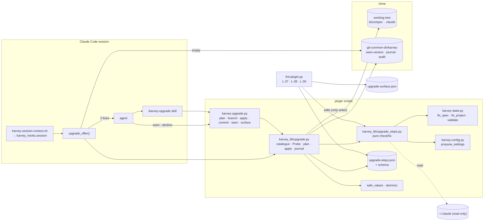
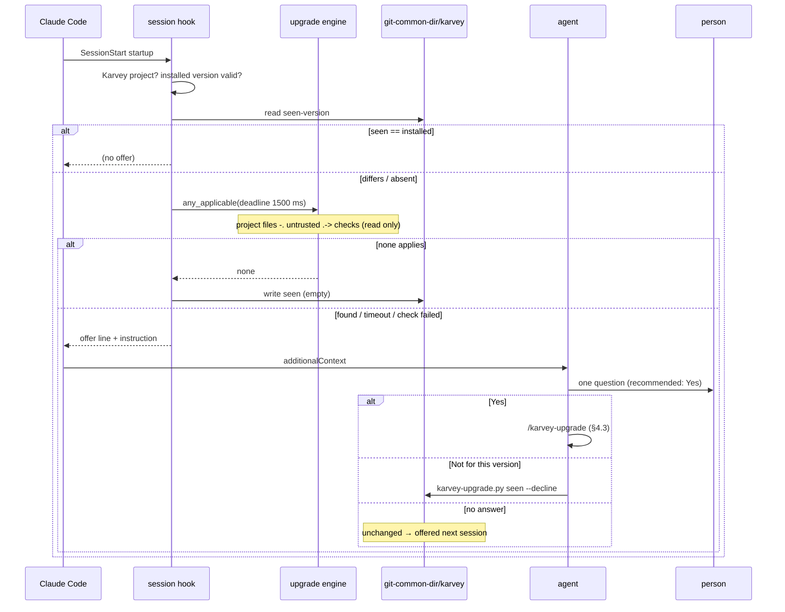
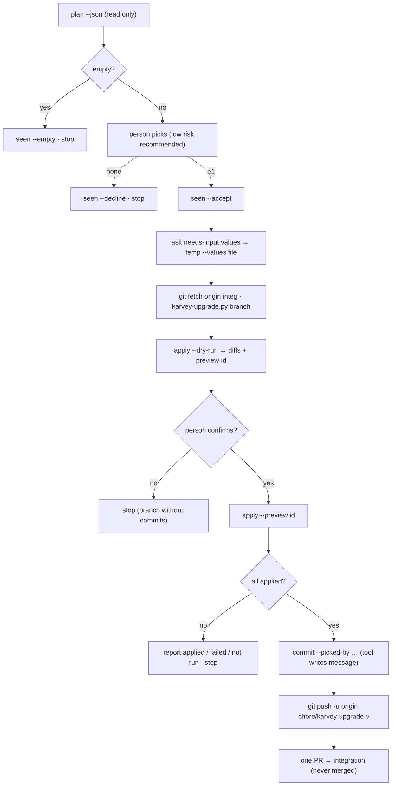

# Architecture: project-upgrade

> PHASE 5 (`karvey-architecture`, skill text read from `plugins/karvey/skills/karvey-architecture/SKILL.md` in
> this worktree) · Security Tier **2** · Layers: Backend (plugin scripts, hook, skill text, linter) · Target:
> `cli` · Complexity: **extension** of the wave1 hook, state-tool and linter machinery with one new capability
> (the upgrade engine), so both a components diagram and the data-flow diagrams are included (§4).
>
> Inputs read in this session: `prd.md`, `requirements.md` (REQ-UP-001..032, approved as D-21), `spec-delta.md`,
> `spec.json`, `checkpoint.md`, `PLAN.md`, `docs/spec/decisions.md` (D-20, D-21), `docs/spec/project.json`, the
> table of contents and §1.0, §7, §10, §11 of `wave1-hardening/architecture.md` (house style), and the code it
> builds on: `hooks/hooks.json`, `hooks/karvey-session-context.sh`, `scripts/karvey_lib/{karvey_hooks,project,
> atomicio,safe_values,__init__}.py`, `scripts/karvey_lib/defaults.json`, `scripts/karvey-state.py` and
> `scripts/karvey-config.py` (CLI surface and function list), `scripts/lint-plugin.py` (registry, L-11, L-12,
> L-16, L-35, `--list`), `schemas/project.schema.json`, `skills/karvey/hooks/plan-gate.sh`,
> `hooks/karvey-statusline.sh`, `hooks/README.md`, `README.md`, `.github/workflows/lint.yml`,
> `tests/hooks/run_tables.py` and `tables/session.json`.
>
> **Gate mode.** D-21 lets the agent advance non-production gates without stopping. Every open choice below
> is decided with the recommended default and listed in §10.1 *Decisions taken by the architect* for the owner.
> Nothing here is approved by this document.

## Summary

After a plugin update, the first `startup` session in a Karvey project compares the installed version
(`plugin.json`) with a small **seen-version record** in `<git-common-dir>/karvey/seen-version`. When they
differ, the session hook runs the cheap checks of a declared **step catalogue** against the project, inside a
fixed time budget. If none applies, it records the version as seen and says nothing (REQ-UP-005). Otherwise it
adds two lines to the session context telling the agent to ask one question. The hook never writes a project
file and never resolves the offer on its own: the answer is recorded by `karvey-upgrade.py seen --decline`, or by
the `/karvey-upgrade` skill when the person accepts. An unanswered offer leaves the record untouched, so it comes
back next session.

The plan and every write belong to one deterministic tool, `scripts/karvey-upgrade.py`, built on a new library
module `karvey_lib/upgrade.py`. Steps are **data plus pure functions**: each step's `check` and `fix` only read the
project through a read-only `Probe` and return a list of planned edits. The **engine** is the only writer. It
confines every edit to the working tree (or the clone's git dir), writes each file atomically, stops at the first
failure, and requires the preview digest from `apply --dry-run` before it applies anything. The skill relays the
tool: plan table, the person's pick, dry-run, apply on `chore/karvey-upgrade-<version>`, one commit written by the
tool that names the steps and who picked them, then one PR. Three new linter checks close the loop:
- **L-37**: a release that changed the upgrade surface declares its upgrade. It compares against a committed
  fingerprint, not a git diff.
- **L-38**: the catalogue is validated.
- **L-39**: the docs are present.

## Engineering-standards conformance gate (Step 4B)

**Not evaluated.** `docs/spec/project.json` declares no `standards` block and `docs/spec/standards/` does not
exist (checked in this session). Per `rules/engineering-standards.md`, that is not conformance: every non-trivial
pattern choice is a gray zone. Under D-21 the architect picks the recommended option. Each pick is listed in §10.1
so the owner can overturn it at the next gate he reviews. No `deviations.md` is created, because there is no
standard to deviate from. The design reuses the wave1 conventions without exception:
- Python ≥ 3.9 stdlib only;
- the `karvey_lib` exit codes and `--json` envelope;
- `atomicio` for writes;
- `safe_values` for values that come from the project;
- `schema_lite` for JSON contracts;
- the table runner and unittest.

---

## 1. Components and boundaries

### 1.0 System boundary

**This spec owns:**
- The **upgrade offer** in the session hook: `karvey_hooks.upgrade_offer()` and its call from `session_text()`,
  plus one degraded line in the bash fallback of `hooks/karvey-session-context.sh`.
- The **seen-version record** `<git-common-dir>/karvey/seen-version` (per clone, shared by worktrees, never
  committed).
- The **upgrade engine** `scripts/karvey_lib/upgrade.py` (catalogue loader, `Probe`, planner, applier, journal,
  branch and commit helpers) and the **step functions** `scripts/karvey_lib/upgrade_steps.py`.
- The **upgrade tool** `scripts/karvey-upgrade.py` (`plan`, `branch`, `apply`, `commit`, `seen`, `surface`).
- The **step catalogue** `scripts/karvey_lib/upgrade-steps.json` and its schema `schemas/upgrade-steps.schema.json`.
- The **release-surface fingerprint** `scripts/karvey_lib/upgrade-surface.json`.
- The **upgrade skill** `skills/karvey-upgrade/SKILL.md`.
- Linter checks **L-37, L-38, L-39**, and generalising `--list` so that it accepts `REQ-UP-NNN` claims.
- Docs: the `README.md` upgrade section, a pointer in `plugins/karvey/README.md`, the offer section in
  `hooks/README.md`, the CHANGELOG entry, and the statusline section of `hooks/README.md`, rewritten to show the
  stable command (F-51).
- Tests: session-table cases `ss-24..ss-35`, unit suites `test_upgrade_*.py`, lint mutations for L-37..L-39, and
  the fixture project `tests/fixtures/upgrade/`.

**This spec does NOT touch:**
- `karvey-state.py` migrations (`fix_spec`, `fix_project`) and `karvey-config.py propose_settings`: they are
  **called in-process**, never changed or duplicated.
- The guards (`guards.py`), `hooks.json` entries, the approval marker, the release ledger, the prod-gate.
- The settings notice: its text and conditions are unchanged. The offer is an addition next to it.
- Anything under `~/.claude/`: the tool reads it for the human steps and never writes it (D-01, D-11).
- `project.json:karvey_version`: it means "the version every agent environment must have" (`rules/
  project-config.md:92`), and L-12 owns it in this repo. The upgrade does not bump it (§10.1 A-09).
- The plugin update itself (`claude plugin update`).

**Changes that require revalidating this design:**
- Claude Code gains a plugin-level `statusLine` or a post-update hook. The offer and the F-51 step would then
  move there.
- The SessionStart hook timeout (10 s in `hooks.json`) is lowered below the offer budget plus the current
  session work.
- `validate --fix` stops being importable as `fix_spec`/`fix_project`, or starts writing on its own.
- A step is needed whose fix cannot be expressed as file edits (for example, a git history rewrite). The engine
  contract in §1.4 would then need a new edit kind, reviewed as a Tier 2 change.

### 1.1 Plugin tree after this change (new ★, modified ✎)

```
plugins/karvey/
├── .claude-plugin/plugin.json            ✎ description: "19 support skills" (L-11); version at release only
├── hooks/
│   ├── karvey-session-context.sh         ✎ degraded path: one "upgrade offer unavailable" line (no python)
│   └── README.md                         ✎ "The upgrade offer" section; statusline section → stable command
├── schemas/
│   └── upgrade-steps.schema.json         ★ catalogue contract (REQ-UP-008), schema_lite subset
├── scripts/
│   ├── karvey-upgrade.py                 ★ the upgrade tool (CLI)
│   ├── lint-plugin.py                    ✎ L-37, L-38, L-39; --list accepts REQ-UP claims
│   └── karvey_lib/
│       ├── upgrade.py                    ★ engine: catalogue, Probe, plan, apply, journal, branch, commit, seen
│       ├── upgrade_steps.py              ★ pure check/fix functions of the initial catalogue
│       ├── upgrade-steps.json            ★ the step catalogue
│       ├── upgrade-surface.json          ★ release-surface fingerprint (L-37)
│       ├── defaults.json                 ✎ session.upgrade_probe_ms, session.offer_line_max
│       └── karvey_hooks.py               ✎ upgrade_offer() called from session_text()
├── skills/
│   └── karvey-upgrade/SKILL.md           ★ the upgrade skill (relays the tool)
└── tests/
    ├── fixtures/upgrade/                 ★ legacy project + fixture home (anonymised)
    ├── hooks/run_tables.py               ✎ given.seen_version (default: seeded = installed)
    ├── hooks/tables/session.json         ✎ ss-24..ss-35
    └── unit/test_upgrade_{catalogue,plan,apply,steps,seen,cli}.py, test_lint_plugin.py ✎
README.md                                 ✎ "Upgrading your project" under "Update to the latest version"
CHANGELOG.md                              ✎ [Unreleased] entries; release block declares its upgrade (L-37)
```

### 1.2 Session hook: the offer (`karvey_hooks.upgrade_offer`)

| Component | Type | Responsibility | Security Tier |
|---|---|---|---|
| `karvey_hooks.upgrade_offer(start, team_root, mode, env)` | New function | Returns `(lines, error)`: 0 lines (silent), 2 lines (offer + instruction) or 1 line (`[karvey] upgrade offer unavailable: <reason>`). It writes only the seen record, and only for an `empty` result. | Tier 2 |
| `karvey_hooks.session_text` | Modified | Calls `upgrade_offer` in **both** branches: no team root (today it returns only the settings notice) and team root. The lines go after the settings notice. With a team root they go inside "=== First action ===" as the second item, after the restore line. | Tier 2 |
| `hooks/karvey-session-context.sh` (bash, no python) | Modified | Inside a Karvey project on `startup`, prints once `[karvey] upgrade offer unavailable: python 3 not found`. Nothing else. | Tier 1 |

**Algorithm** (all local, no fetch, REQ-UP-006):
1. `mode != "startup"` → silent (REQ-UP-002: not resume/compact/clear).
2. `kp = pj.find_root(start)` (the same Karvey-project test as the settings notice, bounded by the git top
   level). If it is None, try `team_root` when it is a Karvey project. None → silent, **no record is created**
   (REQ-UP-003). A Karvey project **outside git** is silent too (rev. 2, F-27): there is no clone to record the
   answer in, and the fallback state dir would sit under the home. `state_dir(kp, create=False)` is used, so
   nothing is created by reading.
3. `installed = kl.__version__` (read from `plugin.json`). It must match `VERSION_RE`
   `^\d{1,4}\.\d{1,4}\.\d{1,4}(?:-[0-9A-Za-z.]{1,20})?$`, otherwise the one-line failure is printed.
4. `seen = upgrade.read_seen(kp)`. A missing or malformed record counts as absent. `seen.version == installed` →
   silent.
5. **Probe within budget** (REQ-UP-005, REQ-UP-006): `upgrade.any_applicable(kp, deadline=now + upgrade_probe_ms)`
   runs in a daemon thread that the hook waits for until the deadline plus `PROBE_WATCHDOG_GRACE_S` (0.25 s); a
   probe still running then counts as `timeout` (rev. 2, F-25). Only the hook's own thread writes the `empty`
   record, so a late probe can never record anything. The probe loads the catalogue and evaluates the steps in `cost` order (`low` first, then `scan`). It stops at the **first**
   step whose status is not `nothing`. Results:
   - `found` → offer.
   - `none` (every step evaluated, all `nothing`) → `write_seen(kp, installed, "empty")`, silent.
   - `timeout` or a check that raised → offer. The hook does not guess "nothing applies"; the plan is computed
     when the person accepts (REQ-UP-005 error scenario).
   - Catalogue missing or invalid → one line `[karvey] upgrade offer unavailable: <reason>`, record unchanged
     (REQ-UP-006 error scenario).
6. Output, each line truncated to `offer_line_max` (300) characters. Rev. 2 (F-09): phrased like the settings
   notice — a signed notice saying what the user can do — not an imperative order naming a command, which a
   model may take for a prompt injection:
   ```
   Karvey (upgrade): installed 3.13.0, last resolved in this clone 3.12.0 — project upgrade steps may apply; the user can decline for this version with: python3 '<plugin>/scripts/karvey-upgrade.py' seen --decline
   The user can get an upgrade plan; if you can ask, offer it (AskUserQuestion): "Karvey 3.12.0 → 3.13.0: do you want a plan to upgrade this project?" — "Yes, show me the plan (Recommended)": /karvey:karvey-upgrade · "Not for this version": the decline command. Unanswered: record nothing.
   ```
   With no record the first line reads `installed 3.13.0, no upgrade resolved yet in this clone` and the
   question reads `→ 3.13.0` (REQ-UP-002). `<plugin>` is `kl.PLUGIN_ROOT`, quoted with `shlex.quote` (plugin
   paths may contain spaces, BUG-18).
7. Any exception inside `upgrade_offer` is caught locally and becomes the one-line failure. `session_main`
   keeps its own outer catch. The session always starts (REQ-UP-006).

**Budget.** `defaults.json:session.upgrade_probe_ms = 1500`. The hook timeout is 10 s. Today's session work (git
reads for live state, 5 s timeout each) keeps well under that. The deadline is checked between steps, a `scan`
step also checks it between files, and `Probe.glob` checks it in every directory it walks (rev. 2, F-25). Project
reads are capped at `PROJECT_READ_MAX` (2 MiB; a larger file is `check-failed`, never read), and the walk
prunes `.git`, `node_modules` and nested work trees. The watchdog of step 5 bounds anything else (one blocking
call) at the budget plus 0.25 s. Why short-circuit: in
the common case (something applies) the hook stops at the first cheap hit, in a few ms.

### 1.3 The seen-version record and how the ask is answered

| Component | Type | Responsibility | Security Tier |
|---|---|---|---|
| `<git-common-dir>/karvey/seen-version` | New file (0600, dir 0700) | `{"v":1,"version":"3.13.0","resolution":"accepted"\|"declined"\|"empty","at":"<iso-tz>","by":"<git user.name or null>","from":"3.12.0"\|null}`. One per clone; worktrees share it because it sits in the common git dir. Outside git: **none** — the hook stays silent and `seen` refuses (rev. 2, F-27; §5 E-12), so nothing is written under the home. | Tier 2 |
| `upgrade.read_seen / write_seen` | New functions | Read tolerant (malformed → absent). Write under `atomicio.lock` + `write_text_atomic` (mode 0600). | Tier 2 |
| `karvey-upgrade.py seen --decline \| --accept \| --empty \| --show` | New CLI | The **only** way the agent resolves an offer. It refuses outside a Karvey project (exit 3) and records `installed`. | Tier 2 |

**Who writes what** (the key design question):

| Event | Writer | Resolution |
|---|---|---|
| Probe finds nothing applicable | the session hook | `empty` |
| Person answers "Not for this version" | the agent, running `seen --decline` (as instructed by the hook line) | `declined` |
| Person accepts; the skill presents a non-empty plan and the person picks ≥ 1 step | the skill, running `seen --accept` after the pick | `accepted` |
| Person accepts, then picks none | the skill, `seen --decline` (REQ-UP-028 error scenario) | `declined` |
| Skill finds an empty plan (also when invoked by hand) | the skill, `seen --empty` | `empty` |
| Offer shown, session ends unanswered | nobody | unchanged → offered again (REQ-UP-001, REQ-UP-004 error) |
| Write fails (read-only git dir) | — | the hook, or `seen`, prints `[karvey] could not record the upgrade answer (<reason>); the offer will repeat next session` (REQ-UP-001 error scenario) |

The existing `protect-paths` guard already blocks any agent command or edit that **names** `.git/karvey`
(`guards.STATE_NEEDLES`). So a hand-edit of the record is blocked, and the only route is the audited
`seen` subcommand (it appends an `audit.log` line: `upgrade.seen <resolution> <version>`). A decline is not a
gate approval, so it does not need the approval marker (§10.1 A-03).

### 1.4 Upgrade engine (`karvey_lib/upgrade.py`)

| Component | Type | Responsibility | Security Tier |
|---|---|---|---|
| `load_catalogue(path=None)` | New | Reads `upgrade-steps.json` and validates it with `schema_lite` against `schemas/upgrade-steps.schema.json`. Then it adds semantic checks: unique ids, `check`/`fix` names present in `upgrade_steps.REGISTRY`, `human ⇒ fix null`, `report_only ⇒ fix null`, `writes` ⊆ {`project`,`git_dir`} unless `human`. Any failure raises `CatalogueError("step <id>: missing field <f>")` and nothing is evaluated (REQ-UP-008). | Tier 2 |
| `Probe(root, overlay)` | New | The **read-only** view a step sees: `read_text`, `read_json` (capped at `PROJECT_READ_MAX`, rev. 2), `exists`, `glob` (under the root; a pruned, deadline-checked walk from the pattern's literal prefix, rev. 2), `git_read(*args)` (allow-list: `rev-parse`, `symbolic-ref`, `status --porcelain`, `ls-files`, `config --get`, `check-ignore`; `show` dropped and `--output`/`--exec`/`-c` refused, F-19; list argv, never a shell), `home_read(rel)` (only `.claude/settings.json`, `.claude/settings.local.json`, `.claude/CLAUDE.md`, under `$HOME`), `plugin_read(rel)` / `plugin_json(rel)` (read-only, confined to the installed plugin's root: the shipped shims and `project.schema.json`, F-02), `installed`, `state` (the `karvey-state.py` module loaded with importlib, as `karvey-context.py` does), `config` (`karvey-config.py`, same way). The `overlay` is a dict of pending edits: reads see the result of earlier steps in the same run, so a sequence previews exactly what it will apply. | Tier 2 |
| `StepResult` | New dataclass | `status` ∈ `nothing` · `applies` · `human` · `report` · `needs-input` · `check-failed`; `summary` (the "what changes" cell); `edits: [Edit]`; `diff` (text, for human steps); `instructions`; `warnings`; `inputs_needed`. | — |
| `Edit` | New dataclass | `op` ∈ `write` · `delete`; `path` (relative POSIX); `scope` ∈ `project` · `git_dir`; `before_sha256` (None = create); `text` (for `write`). | Tier 2 |
| `plan(root)` | New | Evaluates **every** step in catalogue order over one overlay. A raising check becomes `check-failed: <reason>` and the rest go on (REQ-UP-009 error). Returns `Plan{from, to, computed_on (branch), steps:[…], exit}`. **It writes nothing**: no lock, no journal, no audit (REQ-UP-010). | Tier 2 |
| `apply(root, ids, dry_run, preview, inputs, confirm_no_preview)` | New | See the flow below. | Tier 2 |
| `ensure_branch(root)` / `branch_base(root)` | New | Creates or switches to the upgrade branch (§1.5 `branch`); `branch_base` says where it starts (the local upgrade branch, else the remote one, else the integration branch — rev. 2, F-08). | Tier 2 |
| `commit(root, picked_by, picked_at, answer, trailers)` | New | Stages exactly the journal's files and commits (§1.5 `commit`). | Tier 2 |
| journal `<git-common-dir>/karvey/upgrade-journal.json` | New file (0600) | `{v:1, branch, from, to, applied:[id], failed:{id:reason}, not_run:[id], files:[path], preview, at}`. `commit` reads it; `apply` reads it to allow a dirty tree made only of files it wrote itself. | Tier 2 |

**Apply flow** (REQ-UP-011..017, REQ-UP-019):
1. `load_catalogue`. Every id in `ids` must exist, else exit 3 naming it before anything changes (REQ-UP-011).
2. **Values are data** (REQ-UP-019). `branch_flow.integration` and `branch_flow.production` go through
   `safe_values.check_branch` (pattern plus `git check-ref-format`). The integration branch is resolved from
   `branch_flow.integration`, then `origin/HEAD`, otherwise the tool refuses:
   `no integration branch: set project.json:branch_flow.integration`. The installed version goes through
   `VERSION_RE`. A failure refuses with `invalid branch name in project.json:branch_flow.integration`, naming the
   source. Every subprocess is an argv list; `test_no_shell_true.py` already greps `scripts/`.
3. Unless `dry_run`: **clean tree** (REQ-UP-013 error). If `git status --porcelain` is non-empty, it refuses and
   names the paths, except for paths listed in the journal of the current upgrade branch (a second `apply` in the
   same upgrade).
4. Unless `dry_run`: `ensure_branch` (REQ-UP-013). If the current branch is integration or production, or any
   other branch, it switches to `chore/karvey-upgrade-<installed>`, creating it when needed.
5. `plan` on the (now current) tree, then this selection rule:
   - all selected ids are `nothing` → print "nothing to do" per step, exit 0, no write (REQ-UP-014);
   - some are `nothing` and others apply → exit 3 naming the ids that do not apply (REQ-UP-011);
   - any id is `needs-input` without its `--values` entry → exit 3 naming the missing input (REQ-UP-021 error).
6. Selected steps run **in catalogue order**, never in argument order, over one overlay:
   - `human` steps: print instructions and diff, perform nothing, and stay `human` (REQ-UP-015). No flag
     overrides this.
   - `report` steps: print the report, perform nothing (REQ-UP-024).
   - others: collect `edits`.
7. **Path confinement** (REQ-UP-016). Each edit's `realpath` must sit under `git rev-parse --show-toplevel`
   (scope `project`) or under the git common dir (scope `git_dir`). It must not traverse a symlink out of the
   tree, and it must not name `.git/karvey/{approvals,ledger}`. A failure refuses the step before any write.
8. `dry_run` → off the upgrade branch, the tree of `HEAD` must equal the tree of `branch_base` (rev. 2, F-24):
   otherwise exit 3 "this dry-run would preview the current branch, but apply writes on <upgrade branch> …: run
   `karvey-upgrade.py branch` first". Then print a unified diff per edit (`difflib`; a deletion is shown against `/dev/null`) and the
   **preview id** = sha256 of the canonical JSON of `[(step, op, path, before_sha256, sha256(text))]`. Exit 0,
   no write (REQ-UP-012).
9. Not `dry_run`:
   - a step with `dry_run: true` in the selection requires `--preview <id>` equal to the recomputed id, else
     exit 3 `the tree changed since the preview, or no preview was shown: run apply --dry-run` (REQ-UP-012);
   - a step with `dry_run: false` requires `--confirm-no-preview <id>`.
10. Write, step by step. Per file: `atomicio.write_text_atomic(path, text, expected_sha256=before)` (temp file +
    rename, compare-and-swap) or `os.remove` after a sha check, so every file is fully old or fully new.
    - The first failure stops the run. The report lists `applied`, `failed{id: reason}` (with the files of that
      step already written, if any) and `not_run` (REQ-UP-017).
    - The journal is written after each step, so it is right even when the run stops midway.
11. Exit 0 when everything selected was applied or shown, 1 when a step failed.

### 1.5 The upgrade tool (`scripts/karvey-upgrade.py`)

Shared flags: `--root` (default: walk up from the cwd with `find_root`) and `--json` (the `karvey_lib` envelope).
Exit codes: `karvey_lib`.

| Subcommand | Writes | Behaviour |
|---|---|---|
| `plan [--json]` | nothing | The table (step · what changes · dry-run · risk · needs human), plus `from → to` and `computed_on`. `--json`: `result = {from, to, computed_on, in_git (rev. 2), steps:[{id, since, title, status, summary, dry_run, risk, human, report_only, inputs_needed, warnings}]}`. Exit 0 (`nothing to do` included), 1 when any check failed (REQ-UP-007, 009, 010). |
| `branch [--json]` | git: branch create / switch | Validates the values, refuses a dirty tree, creates `chore/karvey-upgrade-<installed>` from `refs/remotes/origin/<integration>` when that ref exists locally, else from `refs/heads/<integration>`, then switches to it. **It never fetches.** The skill runs `git fetch origin <integration>` first, when a remote exists, and fetches the remote upgrade branch of this version (tolerating its absence). When the branch exists, it only switches. Rev. 2 (F-08): when no local upgrade branch exists but `refs/remotes/origin/chore/karvey-upgrade-<installed>` does (another clone pushed the same upgrade), the branch starts **from it** — only when it builds on the integration branch (`merge-base --is-ancestor`), otherwise `branch` refuses and checks nothing out; a local upgrade branch strictly behind it is fast-forwarded. The result carries `remote: true` (a PR may already be open), `remote_commits` / `remote_files` (what it brings, one line each, capped) and `integration` (the PR target). |
| `apply --steps a,b [--dry-run] [--preview ID] [--confirm-no-preview ID…] [--values FILE] [--json]` | project tree, journal | §1.4 flow. `--values FILE` is JSON `{step_id: {key: value}}`, validated through `safe_values` per key kind. |
| `commit --picked-by NAME [--picked-at ISO] [--answer TEXT] [--trailer K=V…] [--json]` | git: one commit | Refuses when the current branch is integration or production, or is not the upgrade branch named in the journal (REQ-UP-013). Runs `git add -- <journal files>` and then `git commit -F <tmp> -- <journal files>`. The message is `chore(karvey): project upgrade <from> → <to>`, then the body `Steps: a, b` · `Picked-by: NAME` · `Picked-at: ISO` · `Answer: "<≤200 chars>"`, then the trailers passed by the skill (the session's attribution lines) (REQ-UP-018, 028). It prints `pr_title` and `pr_body` in `--json` so the PR text is deterministic. |
| `seen --decline\|--accept\|--empty\|--show` | seen record | §1.3. |
| `surface [--write]` | `upgrade-surface.json` (maintainers, plugin repo only) | Prints the current fingerprint against the recorded one. `--write` refreshes it to the top CHANGELOG release, and refuses unless the root contains `plugins/karvey/.claude-plugin/plugin.json` (§1.8). |

### 1.6 The step catalogue and the initial steps

`upgrade-steps.json` (catalogue_version 1). **Required per step** (REQ-UP-008): `id` (`^[a-z][a-z0-9-]{1,40}$`),
`since` (semver), `check` (a function name in `upgrade_steps.REGISTRY`), `fix` (a function name, or `null`),
`dry_run` (bool), `human` (bool), `risk` (`low`|`medium`|`high`). **Optional**: `title`, `report_only`
(default false), `writes` (default `["project"]`), `cost` (`low`|`scan`, default `low`), `params` (object, passed
to the functions).

`since` below is **3.13.0**, the working number for "the release right after 3.12.0" (D-20). The number is fixed
at release by `karvey-deploy`, which also sets the fingerprint (§1.8).

| Order | id | REQ | check (reads) | fix (edits) | dry_run | human | risk | cost |
|---|---|---|---|---|---|---|---|---|
| 1 | `schema-migrate` | 020 | `state.fix_spec` / `state.fix_project` in memory (exact tier) on every `spec.json` under `docs/spec` **except `docs/spec/changes/archive/`** (history, D-14, E-22; rev. 2, F-22) and `project.json`; applies when any output differs. An unmigratable file is a per-file warning and stays listed as "needs a human" (§5 E-08). | write the migrated JSON (`atomicio.dumps`, preserving the detected format) | yes | no | low | scan |
| 2 | `schema-migrate-proposed` | 020 | the same with `accept_proposed=True`, minus what step 1 already covers; applies only when the proposed tier adds something | write | yes | no | medium | scan |
| 3 | `legacy-shims` | 022 | files `.claude/**/plan-gate.sh` and `git-flow-guard.sh`, plus `.claude/settings.json` hook entries whose command names them. A file byte-identical to a known shipped version (`params.known_sha256`: the current shims and the 3.11.x templates) applies. A file that differs is `human`, with the diff against the shipped shim. | delete the copies; remove the entries (an empty `hooks` array drops the key); set `enforcement.plan_gate_hook` / `git_flow_hook: true` for each guard removed (the behaviour is kept) | yes | no* | medium | low |
| 4 | `team-settings` | 021 | `karvey_hooks._settings_gaps` on the working copy's `project.json` (missing or legacy `notifications` / `management`); preview = `config.propose_settings(settings, from_legacy=True)` | merge the block with the person's `--values`; `needs-input` while any `<…>` placeholder remains; each value checked through `safe_values.check_target` / `check_location` | yes | no | low | low |
| 5 | `enforcement-defaults` | 026 | `enforcement` keys with `x-karvey-default` in `schemas/project.schema.json` that the project does not declare (an explicit value, default or not, is never listed). Standards: when `project.json` has no `standards` block it adds an informational line "no engineering standards declared → `/karvey:karvey-standards`" (the plugin ships no standard templates today; `params.standards` lists them when it does). | set the missing keys to their defaults | yes | no | low | low |
| 6 | `statusline-launcher` | 023 | `statusLine.command` in `$HOME/.claude/settings.json`, then the project `.claude/settings.json` and `.claude/settings.local.json`: a Karvey statusline on a versioned path (`/karvey/<semver>/hooks/karvey-statusline.sh`) → `human` with the stable command (§1.9). A non-Karvey command → `nothing`, with the note "own statusline, left as is". No statusline at all → `nothing`, with the note "no statusline: optional …" (rev. 2, F-21: it was `human`, which made every plan non-empty). | none | — | yes | low | low |
| 7 | `global-config` | 025 | `$HOME/.claude/settings.json` and `CLAUDE.md` against `params.recommend`. Initial content: hook entries that name a Karvey shim or a versioned Karvey path; `env.KARVEY_COMPAT_MARKER` when the owner's compatibility hook is present (D-11); the `CLAUDE.md` destinations line (REQ-W1-099). Shows a unified diff. Unreadable → `check-failed: unreadable` (REQ-UP-025 error). | none | — | yes | low | low |
| 8 | `changes-in-flight` | 024 | for every non-archived change (`pj.list_changes`, archive excluded): `state.validate_data(strict)` gate issues and `state.compute_next` blockers; lists the change with the unmet gate | none (`report_only: true`) | — | no | low | scan |

\* `legacy-shims` is declared `human: false`. A locally edited copy makes that one finding return `human`. A step
may downgrade itself to `human` at check time, but it can never upgrade itself to a write (§3.3).

Human, report and `check-failed` results **count as applicable** for the hook's "nothing applies" test. The
person has something to see, so the offer is shown once per version (§10.1 A-06).

### 1.7 The upgrade skill (`skills/karvey-upgrade/SKILL.md`)

A support skill. It does not advance any change phase. `allowed-tools: Read, Bash, AskUserQuestion`. Description,
in the L-02 shape: "Karvey support — project upgrade plan after a plugin update: state-based plan, dry-run, picked
steps applied on a branch, one PR — when the session offers it or any time." Triggers: "karvey upgrade",
"actualizar proyecto karvey", "plan de actualización karvey" (L-03: method context).

Steps (the skill never computes, adds or skips a step: REQ-UP-027):
1. Locate `${CLAUDE_PLUGIN_ROOT}/scripts/karvey-upgrade.py`. Missing → say so and stop; never do the steps by
   hand (REQ-UP-027 error).
2. `plan --json`. Not a Karvey project (exit 3) → say so and stop without writing (REQ-UP-029 error). Empty →
   `seen --empty`, tell the person, stop.
3. Show the table exactly as returned. When `computed_on` is not the integration branch, add one line: "the plan
   is recomputed on the upgrade branch".
4. One multi-select question (AskUserQuestion). Every step is an option; steps with `risk: low` that are not
   human are marked recommended. Human and report steps are labelled "shown, not applied" (REQ-UP-028).
   - Picks none → `seen --decline`, stop (no branch, no commit).
   - Picks ≥ 1 → `seen --accept`.
5. `needs-input` steps: ask for the values (one question per step) and write them to a temp `--values` file in
   the scratch or temp dir, never in the repo.
6. `git fetch origin <integration>` and, tolerating its absence, the remote upgrade branch (when a remote exists),
   then `branch`. `remote: true` → tell the person a PR may already be open; a dry-run that is then "nothing to
   do" for every pick means the upgrade is already there: stop (rev. 2, F-08).
7. `apply --dry-run --steps … --json`: show each diff and the human and report output. A step with `dry_run: false`
   gets its own confirmation question. Then one confirmation question: "Apply these changes?".
8. `apply --steps … --preview <id> [--confirm-no-preview …]`. On failure: relay applied / failed / not run and
   stop. The person decides whether to fix and re-run (`plan` lists what is left).
9. `commit --picked-by "<person>" --answer "<their words>" --trailer …`.
10. `git push -u origin chore/karvey-upgrade-<v>`, then open one PR to the integration branch with the
    `pr_title`/`pr_body` from step 9, using `project.json:git_platform` (`gh pr create` · `az repos pr create` ·
    `glab mr create`, values through `karvey-config.py get --shell`). No PR tooling or no remote → print the
    exact commands (REQ-UP-018). **Never merge.** A rejected push → report it and the retry command; the commit
    stays local. An existing PR from the branch (`remote: true`) is not opened twice: the push updated it.

It is invocable at any time and behaves the same with or without an offer (REQ-UP-029).

### 1.8 Linter: L-37, L-38, L-39 and `--list`

| Check | Severity | What it proves |
|---|---|---|
| **L-37** `release declares its project upgrade` (REQ-UP-030) | error, or warning during `[Unreleased]` | It hashes the **upgrade surface** (the globs in `upgrade-surface.json`, normalised: BOM stripped, LF). Equal to the recorded `files` → pass. Different: <br>• top CHANGELOG release **equals** the fingerprint's `release` (development under `[Unreleased]`) → **warning** listing the changed files: "the next release must add an upgrade step or declare none". <br>• top release **is newer** than the fingerprint → **error**, unless (a) some step has `since` equal to the top release, or (b) the release block has a line matching `^- No project upgrade needed: .{10,}` (reason required). In both cases it is also an error until the fingerprint is refreshed to that release (`karvey-upgrade.py surface --write`). The message names the release and the changed files. <br>• top release **older** than the fingerprint → error (inconsistent). |
| **L-38** `the step catalogue is valid` (REQ-UP-031, 008, 010, 016) | error | `load_catalogue` (fields, names, invariants). It also walks the AST of every function in `upgrade_steps.REGISTRY` and forbids: `open(` in a write mode, `write_text`/`write_bytes`, `os.remove`/`unlink`/`rename`/`replace`/`mkdir`/`rmdir`, `shutil.*`, `subprocess.*`, and `atomicio.write_*`. Rev. 2 (F-26): calls are resolved through the module's import aliases (`import os as o`, `from os import remove`), a forbidden module imported at module level fails, `.open()` in a write mode and `os.open` fail, and a name bound to `probe.state` / `probe.config` (also through a helper's parameter) may use only the tools' read-only names (`PROBE_TOOLS`). Only `Probe` methods may do I/O. A non-human step whose `fix` references `probe.home_read`, or whose `writes` contains anything but `project`/`git_dir`, fails naming the step. `since` newer than `plugin.json` is **one warning** naming the steps while `## [Unreleased]` holds entries (a working number, A-12) and an **error** once `[Unreleased]` is empty — `karvey-deploy` sets `since` to the release (F-01). |
| **L-39** `upgrade documented` (REQ-UP-032) | error | `README.md` has an upgrade heading under "Update to the latest version" that mentions `/karvey:karvey-upgrade`, "Not for this version" and `plan`. `hooks/README.md` has "## The upgrade offer" with `<!-- guard-case: ss-24… -->` anchors (L-16 then checks them). From the release that ships this change on, the top release block mentions the project upgrade (the L-37 declaration or a step id). |
| `--list` (modified) | — | `requirement_ids` collects `REQ-(W1\|UP)-\d{3}`. A claim written `"UP-030"` maps to `REQ-UP-030`, and a bare `"055"` keeps meaning `REQ-W1-055`, so existing claims are unchanged. |

**Why a fingerprint, not a git diff** (§10.1 A-05). The repo has one tag (`v3.2.0`), releases are not tagged, and
the CI `lint` job checks out at depth 1. A committed fingerprint makes L-37 deterministic offline, in any checkout,
and forces the refresh exactly at the release that changed the surface.

**Initial surface globs:**
- `plugins/karvey/schemas/*.json`
- `plugins/karvey/skills/karvey/rules/*.md`
- `plugins/karvey/hooks/hooks.json`
- `plugins/karvey/hooks/*.sh`
- `plugins/karvey/skills/karvey/hooks/*.sh`
- `plugins/karvey/scripts/karvey_lib/{defaults,vocabulary}.json`
- `plugins/karvey/scripts/karvey_lib/{guards,karvey_hooks,project,approval}.py`

### 1.9 Statusline stable command (F-51)

A plugin cannot declare a statusline and the tool may not write under `~/.claude/`, so the stable launcher is a
**command** the person pastes once, not a file:

```json
"statusLine": {"type": "command", "padding": 0,
  "command": "bash -c 'f=$(ls -1dt \"$HOME\"/.claude/plugins/cache/*/karvey/*/hooks/karvey-statusline.sh 2>/dev/null | head -1); [ -n \"$f\" ] && exec bash \"$f\"'"}
```

It resolves the newest installed Karvey with the same rule as the deprecated shims (`ls -1dt …/karvey/*/`), so
a plugin update never breaks it. The same text goes into `hooks/README.md` (replacing the versioned example) and
into `upgrade_steps.STABLE_STATUSLINE`, so one constant feeds the step, the docs (L-39 compares them) and the unit
test.

### 1.10 External integrations

| System | Direction | Protocol | Auth | Timeout |
|---|---|---|---|---|
| local `git` | outbound (subprocess) | argv | none (local) | 5 s per call (`project.GIT_TIMEOUT_S`) |
| `gh` / `az` / `glab` (skill only, PR) | outbound | CLI | the person's existing login | CLI default; failure → print the command |
| git remote (skill only: `fetch`, `push`) | outbound | git | the person's credentials | git default; the hook and the tool never touch a remote |

## Cloud infrastructure

**Cloud provider(s):** none (`project.json:cloud.provider = "none"`, `iac_tool: none`). Everything runs locally in
the person's Claude Code session and in the existing GitHub Actions workflow `.github/workflows/lint.yml`, which
needs no change: the new unit tests, tables and lint checks are picked up by its existing steps. The infra phase is
skipped ("no cloud; CI is the existing lint workflow"). Deployment is the normal plugin release through the
marketplace (D-10: owner's prod approval).

## 2. Data model

### 2.1 `schemas/upgrade-steps.schema.json`

```json
{
  "$schema": "https://json-schema.org/draft/2020-12/schema",
  "type": "object", "required": ["catalogue_version", "steps"], "additionalProperties": false,
  "properties": {
    "$comment": {"type": "string"},
    "catalogue_version": {"const": 1},
    "steps": {"type": "array", "minItems": 1, "items": {
      "type": "object", "additionalProperties": false,
      "required": ["id", "since", "check", "fix", "dry_run", "human", "risk"],
      "properties": {
        "id": {"type": "string", "pattern": "^[a-z][a-z0-9-]{1,40}$"},
        "since": {"type": "string", "pattern": "^\\d+\\.\\d+\\.\\d+$"},
        "title": {"type": "string", "maxLength": 80},
        "check": {"type": "string", "pattern": "^[a-z_][a-z0-9_]*$"},
        "fix": {"type": ["string", "null"], "pattern": "^[a-z_][a-z0-9_]*$"},
        "dry_run": {"type": "boolean"}, "human": {"type": "boolean"},
        "risk": {"enum": ["low", "medium", "high"]},
        "report_only": {"type": "boolean"},
        "writes": {"type": "array", "items": {"enum": ["project", "git_dir"]}},
        "cost": {"enum": ["low", "scan"]},
        "params": {"type": "object"}
      }}}
  }
}
```
The keywords are within the `schema_lite` subset (L-17 already enforces the subset on `schemas/`). Invariants the
schema cannot express live in `load_catalogue` and L-38: unique ids; function names in the registry;
`human ⇒ fix = null`; `report_only ⇒ fix = null`; `fix = null ∧ ¬human ⇒ report_only`.

### 2.2 `upgrade-surface.json`

`{"$comment": "...", "release": "3.13.0", "globs": [...], "files": {"plugins/karvey/schemas/project.schema.json": "<sha256>", ...}}`
Committed. It is refreshed only by `karvey-upgrade.py surface --write` at a release (the deploy checklist line is
added in §8), and L-37 checks that it is fresh.

### 2.3 Seen record and journal

Both are described in §1.3 and §1.4. Both are JSON `v: 1`, 0600, under `project.state_dir(root)`, never committed
(the git dir is not in the tree). An unknown `v` counts as absent (seen) or as "no journal" (apply then refuses a
dirty tree, the safe side).

### 2.4 `defaults.json` additions

`"session": {"board_rows_max": 40, "handoff_bytes_max": 6144, "upgrade_probe_ms": 1500, "offer_line_max": 300}`.
L-22 already forbids second literals of defaults. The hook, the docs and the tests cite these keys.

## 3. Security per tier (Tier 2) and trust boundaries

Tier 2 here means: a hook writes clone-local state, and a script rewrites project files using values read from
the project (`spec.json:security_tier_reason`). The credential is the person's own OS account and git identity.
The controls are **authorization of writes** (only the engine writes; only the scopes allowed), **input
validation** (project values are data) and **access logging** (`audit.log`).

### 3.1 Controls per component

| Component | Tier | Justification | Controls |
|---|---|---|---|
| `upgrade_offer` (hook) | 2 | runs on every startup and writes the seen record | no fetch; writes only `empty` to the state dir; any failure becomes one line; bounded by `upgrade_probe_ms` |
| `karvey-upgrade.py seen` | 2 | resolves the offer | refuses outside a Karvey project; atomic 0600 write; audit line; the direct path is blocked by protect-paths |
| engine `apply` | 2 | rewrites project files | single writer; path confinement (§1.4 step 7); compare-and-swap per file; preview digest; clean-tree precondition; audit line per step (`upgrade.apply <id> <files>`) |
| step functions | 2 | read project and home | read-only by construction (only `Probe` I/O) and by lint (L-38 AST scan); home reads limited to three files |
| `branch` / `commit` | 2 | git writes | argv only; `check_branch` on every project-sourced name; refuses integration/production; stages exactly the journal's paths |
| skill | 2 | talks to the person and the remote | relays only; values for `--values` go to a temp file outside the repo; never merges |

### 3.2 Trust boundaries

| Trust boundary | What crosses | Untrusted side | Where it is validated | Control |
|---|---|---|---|---|
| Project files → engine | `project.json` values (branch names, management, notifications), `spec.json` content, `.claude/settings.json` | the repo (anyone who can push) | `upgrade.apply` step 2; the step functions via `safe_values`; JSON parsed with `atomicio.read_json` | values never reach a shell; branch names through `check_branch`; paths confined; malformed JSON → `check-failed` |
| Person → skill → tool | picked ids, `--values`, `--answer` text | the chat turn | `apply` (ids against the catalogue; values through `safe_values`), `commit` (answer ≤ 200 chars, control characters stripped, passed via `-F` file) | unknown id refused; no value interpolated into a command line |
| Home → human steps | `~/.claude/settings.json`, `CLAUDE.md` | the user's environment | `Probe.home_read` (fixed three paths, size cap 1 MB) | read only; shown as a diff; never written |
| Installed plugin → hook | `plugin.json` version, the catalogue | the plugin cache (same user) | `VERSION_RE`; `load_catalogue` | a malformed catalogue gives one line, no offer, no record |
| Agent → seen record | `seen --decline` | the agent | the `seen` CLI | the direct write is blocked by protect-paths; audited; the worst case is a suppressed offer (§3.3) |

In the data-flow diagram (§4.2) the untrusted crossings are drawn as dotted `-. untrusted .->` edges.

### 3.3 STRIDE (short)

| Threat | Case | Mitigation |
|---|---|---|
| Spoofing | the agent declines on the person's behalf | the decline only suppresses a question until the next version; the skill stays invocable at any time; the `audit.log` line records it. Accepted risk (a decline is not a gate). |
| Tampering | `project.json:branch_flow.integration = "dev; rm -rf ~"` | `check_branch` refuses, naming the source (REQ-UP-019 scenario); argv subprocesses only |
| Tampering | a step's `fix` escapes the tree (symlinked `.claude` → `~/.claude`) | realpath confinement in the engine, before any write |
| Tampering | a step upgrades itself from human to write at runtime | the engine uses the **catalogue's** `human`/`report_only` flags; a check may only downgrade (to `human`) |
| Repudiation | who picked the steps | commit body `Picked-by` / `Picked-at` / `Answer`; audit lines |
| Information disclosure | home config printed into the transcript | only the Karvey-related keys (`statusLine`, `hooks` entries naming Karvey, `env.KARVEY_*`, the destinations line) are diffed, never the whole file |
| DoS | a huge repo makes the probe slow | deadline, then offer shown; the session is never blocked |
| Elevation | the tool writes under `.git/karvey/approvals` or the ledger | confinement explicitly excludes them; L-38 forbids direct I/O in steps |

### 3.4 Security control points

| Point | Tier | Control |
|---|---|---|
| Hook entry (`startup`) | 2 | Karvey-project test; version format; budget; one-line failure |
| Catalogue load | 2 | schema + invariants; refuse to evaluate on error |
| Value use (branch, version, settings) | 2 | `safe_values`; argv only |
| File write | 2 | confinement + CAS + atomic rename; preview digest |
| Git write | 2 | not on integration/production; explicit paths |
| Logging | 2 | `audit.log`: resolution, step ids, file paths; never values of notifications targets or home content |

## 4. Diagrams

### 4.1 Components



### 4.2 Data flow: the offer and its answer



### 4.3 Data flow: plan → apply → PR



## 5. Edge cases

| # | Edge case | How it is handled | Component |
|---|---|---|---|
| E-01 | No seen record (first run ever, fresh clone) | counts as absent; `→ <installed>` in the question | `upgrade_offer` |
| E-02 | Malformed or unknown-`v` seen record | treated as absent; rewritten on the next resolution | `read_seen` |
| E-03 | Downgrade (installed < seen) | "differs" → offer `seen → installed`, literally as REQ-UP-002; the plan is still state-based | `upgrade_offer` |
| E-04 | Two sessions start at once in two worktrees | both may show the offer; `write_seen` is locked and atomic; the last writer wins with equivalent content | `write_seen` |
| E-05 | Read-only git dir | the answer is not recorded; one line says the offer repeats (REQ-UP-001 error) | `write_seen`, `seen` |
| E-06 | Catalogue missing or invalid in the installed plugin | one line `[karvey] upgrade offer unavailable: <reason>`; record unchanged; `plan` exits 4/5 naming the step and field | hook, `load_catalogue` |
| E-07 | Probe exceeds its budget (also one blocking read: the watchdog, rev. 2) | offer shown; nothing recorded | `any_applicable`, `_probe_with_watchdog` |
| E-08 | A `spec.json` that cannot be migrated (unmappable phase, `42`) | that file is left out of the edits with the state tool's reason; the other files migrate; the step stays listed as "1 file needs a human" (REQ-UP-020 error) | `schema-migrate` |
| E-09 | Empty or `{}` `project.json`, no `project.json` but `changes/` exists | `team-settings` applies (missing); `enforcement-defaults` creates keys only when `project.json` exists, otherwise it is `needs-input` → handed to `/karvey:karvey-init --settings` | steps 4, 5 |
| E-10 | Dirty tree at `branch`/`apply` | refused, dirty paths named; a dirty tree made only of the journal's files on the upgrade branch is allowed (second apply) | engine |
| E-11 | Upgrade branch already exists (earlier attempt) — locally, or only on the remote (another clone, rev. 2 F-08) | local: `branch` switches to it (fast-forwarded when strictly behind the remote one); remote only: `branch` creates it from `origin/<upgrade branch>` when that builds on the integration branch (else refused), lists what it brings and says a PR may be open. `plan` shows what is left; `commit` adds a new commit to the same branch and PR; the push is a fast-forward | `ensure_branch`, `branch_base` |
| E-12 | Karvey project outside git | `plan` works; `branch`/`apply`/`commit` refuse ("apply needs git: the upgrade goes through a branch"); the hook is silent and `seen` refuses, so no record is written (rev. 2, F-27) | engine, hook, `write_seen` |
| E-13 | Integration branch undeclared and no `origin/HEAD` | `branch` refuses, naming `project.json:branch_flow.integration` | `ensure_branch` |
| E-14 | Integration == production (trunk, like this repo) | the upgrade branch is created from it; the PR goes to it; `commit` refuses on it | `ensure_branch`, `commit` |
| E-15 | Mixed selection: some ids already satisfied, others apply | exit 3 naming the satisfied ones; all satisfied → "nothing to do", exit 0 (REQ-UP-011 vs 014, §10.1 A-07) | `apply` |
| E-16 | The tree changed between dry-run and apply | preview digest mismatch → refused, re-run the dry-run | `apply` |
| E-17 | Step 2 of 3 fails after step 1 wrote | step 1 is kept (atomic files); report failed/not run; the journal records it; re-`plan` lists steps 2 and 3 only (REQ-UP-017 error) | `apply` |
| E-18 | A locally edited shim copy | `legacy-shims` returns `human` with the diff against the shipped shim; nothing is deleted | step 3 |
| E-19 | A `team-settings` proposal with `<tool location>` placeholders | `needs-input`; apply refuses until `--values` supplies them (REQ-UP-021 error) | step 4 |
| E-20 | An own (non-Karvey) statusline, or none | `nothing`, note "own statusline, left as is" / "no statusline: optional …" (REQ-UP-023 error, rev. 2) | step 6 |
| E-21 | Home settings unreadable or invalid JSON | `check-failed: unreadable`, rest computed (REQ-UP-025 error); counts as applicable for the hook | step 7 |
| E-22 | Archived changes in a bad state | never reported (`list_changes` excludes `archive/`) and never migrated (steps 1–2 skip `docs/spec/changes/archive/`, rev. 2 F-22); D-14 pre-3.12 history untouched | steps 1, 2, 8 |
| E-23 | Non-interactive session (`claude -p`, CI) | the instruction says: if you cannot ask, record nothing; the next interactive session asks | hook text |
| E-24 | `plugin.json` version not semver | one-line failure; no offer, no record; no branch name built from it | hook, `VERSION_RE` |
| E-25 | Push rejected, or no PR tooling | commit stays local; the skill prints the exact retry / PR commands (REQ-UP-018 error) | skill |
| E-26 | Board/handoff at their byte limits on the same startup | offer lines are separate and capped at 300 characters each; the existing bounds are unchanged (REQ-UP-006 success) | `session_text` |
| E-28 | A dry-run off the upgrade branch on a tree that differs from the branch's base (a local integration branch ahead of `origin`) | refused, naming `branch` (rev. 2, F-24) | `check_preview_base` |
| E-29 | A project string (a directory name, a `phase`) holding control characters | shown escaped (`\x0a`) in the plan rows and the report lines, never as a new line (F-28) | `one_line` |
| E-27 | Existing session-table cases (ss-01..23) would now see an offer | the runner seeds the seen record equal to the installed version unless a case sets `given.seen_version` (`null` = absent); ss-01..23 unchanged | `run_tables.py` |

## 6. Test coverage plan (contract for `karvey-test`)

### 6.1 Session table cases (`tests/hooks/tables/session.json`)

| Case | What | REQ |
|---|---|---|
| ss-24-offer-on-version-change | seen 3.12.0, installed = plugin, applicable step → exactly one offer instruction naming `3.12.0 → <v>` | 002 |
| ss-25-offer-absent-record | no record → `→ <v>` | 002, 001 |
| ss-26-no-offer-on-resume | `resume` → no offer, record unchanged | 002 |
| ss-27-silent-outside-karvey | git repo without project.json/changes → output identical to today, no `karvey/seen-version` | 003 |
| ss-28-bare-docs-spec-silent | bare `docs/spec/` → no offer | 003 |
| ss-29-declined-no-offer | record `declined` for installed → no offer | 004 |
| ss-30-empty-plan-records-seen | fresh `karvey-init`-shaped project with a clean fixture home → no offer, record `empty` = installed | 005 |
| ss-31-budget-exceeded-offers | `upgrade_probe_ms` forced to 0 via an env override for tests (`KARVEY_TEST_UPGRADE_PROBE_MS`) → offer | 005 |
| ss-32-bad-catalogue-one-line | catalogue replaced by invalid JSON in a copied plugin tree → one `upgrade offer unavailable` line, record unchanged | 006 |
| ss-33-bounds-with-offer | 40-row board + 6 KB handoff + offer → the other sections are bounded exactly as before | 006 |
| ss-34-worktree-shares-record | resolved in the main copy → no offer in a worktree, `git status` clean | 001 |
| ss-35-degraded-no-python (`nopy`) | one unavailable line | 006 |

### 6.2 Unit tests (`tests/unit/`)

| Suite | Level | Covers |
|---|---|---|
| `test_upgrade_catalogue.py` | unit | the shipped catalogue loads; each missing field in turn → `step <id>: missing field <f>`, nothing evaluated (008); invariants (human ⇒ fix null …) |
| `test_upgrade_plan.py` | unit | the same legacy fixture with seen 3.0.0 and 3.11.4 → identical plans (007); all-pass → "nothing to do" exit 0; a raising check → `check failed`, others evaluated, exit 1 (009); `--json` ids == table rows (009); checksum of tree + git dir + fixture home unchanged after `plan` (010) |
| `test_upgrade_apply.py` | unit/integration (temp git repo) | only picked ids change files; unknown id → nothing changes (011); dry-run prints diffs and writes nothing; apply without / with a stale preview refused; `dry_run: false` needs `--confirm-no-preview` (012); on `dev` → changes on `chore/karvey-upgrade-<v>`, `dev` has no new commit; dirty tree refused naming paths (013); double apply → "nothing to do", no file changed (014); human step never performed, home byte-identical (015, 016); symlink escape refused; step 2 of 3 fails → report + re-plan (017); `integration = "dev; rm -rf ~"` refused naming the source (019); mixed selection rule (E-15) |
| `test_upgrade_steps.py` | unit | per step, on fixtures: `schema-migrate` (approvals null + string management migrated; unmappable phase isolated) (020); `schema-migrate-proposed` only with its own id (020); `team-settings` preview and placeholder refusal (021); `legacy-shims` removal + flag + edited copy → human diff; then the plan-gate and git-flow guard tables still pass on the fixture (022); `statusline-launcher` versioned → stable command, own → left (023); `changes-in-flight` impl without tasks approval listed, archived not, apply writes nothing (024); `global-config` diff and unreadable (025); `enforcement-defaults` lists `prod_gate_hook`, skips explicit values (026) |
| `test_upgrade_seen.py` | unit | `seen --decline/--accept/--empty` write 0600 atomically; refuse outside a Karvey project; decline → no offer on same version, offer on next (004); unanswered → offer again |
| `test_upgrade_cli.py` | integration | `commit` message names ids, `Picked-by`, `Picked-at`; refuses on integration/production; stages exactly the journal files (018, 028); `pr_title`/`pr_body` in `--json` |
| `test_lint_plugin.py` (extended) | unit | L-37: surface unchanged → pass; changed under `[Unreleased]` → warning; new release without step/declaration → error naming files and release; with `since` = release or the declaration + refreshed fingerprint → pass (030). L-38: missing `risk`, a fix writing via `open(...,'w')`, a non-human step reading home → each fails naming the step (031). L-39: README/hooks README section removed → error (032). `--list` accepts `UP-` claims |
| `test_no_shell_true.py` (existing) | unit | still passes with the new scripts |

### 6.3 Fixtures

`tests/fixtures/upgrade/legacy-project/` (anonymised, from `tests/fixtures/legacy/*`): string `management`,
`approvals: null`, a copied `.claude/hooks/plan-gate.sh` plus its `settings.json` entry, no `notifications`, one
change in `impl` without a tasks approval, one archived change in the same state. `tests/fixtures/upgrade/home/`:
`.claude/settings.json` with a versioned Karvey statusline. `test_fixtures_anonymous.py` covers the new tree.

### 6.4 Skill text, E2E and manual

| What | Level | Case |
|---|---|---|
| The skill relays: rows == `plan --json`; missing tool → stop (027); picks none → decline, no branch (028); invocable with seen == installed (029); not a Karvey project → stop (029) | manual script `tests/manual/upgrade-skill.md` (a headless session in a throw-away clone) | 027..029 |
| Full offer → accept → PR on a throw-away GitHub repo | E2E manual | 002, 018 |
| Docs readable: README says when you are asked, how to decline, how to run by hand | L-39 + review | 032 |

### 6.5 Requirement → test coverage

All 32 REQ-UP are covered by at least one row above (§11 lists the tests per REQ). The critical edge cases
E-04, E-07, E-08, E-10, E-15, E-16, E-17, E-18, E-19, E-27 each have a named test.

## 7. Migration and rollout

1. **This repo (dogfooding).** At impl the fingerprint `upgrade-surface.json` is created with `release` = the
   version that ships this change, and the 8 steps carry `since` = that version, so L-37 passes by construction.
   After the release, the owner's first session in this repo gets the offer: expected steps are
   `enforcement-defaults` (no `prod_gate_hook` / `plan_marker_ttl_min` in `project.json`) and the human
   `statusline-launcher` / `global-config`.
2. **Release checklist.** `karvey-deploy` and `rules/versioning.md` gain one line: "if the upgrade surface changed
   (L-37 warning), add an upgrade step with `since` = this release **or** a `No project upgrade needed: <reason>`
   line, then `karvey-upgrade.py surface --write`." L-19/L-20 keep the versioning rules consistent.
3. **Other projects of the team.** Nothing is pushed to them. Each person gets the offer in their own clone
   on the first startup after the update (D-20). The PR goes through that repo's normal review.
4. **Deprecated shims.** Unchanged until 4.0.0. `legacy-shims` now removes the project copies, which is the path
   wave1 §7.4 proposed by hand.
5. **Rollback.** Reverting the plugin version removes the offer. The seen record is inert, and a later version
   offers again (E-03).

## 8. Skill and rule text changes

- `skills/karvey-upgrade/SKILL.md` (new, §1.7).
- `skills/karvey/SKILL.md` (orchestrator): one line in the support-skills list; the counts in `README.md`,
  `plugins/karvey/README.md`, `plugin.json` and `marketplace.json` go from 18 to 19 support skills (L-11).
- `README.md`: "### Upgrading your project" under "## Update to the latest version". It says when you are asked
  (first startup after an update, once per clone), how to decline ("Not for this version", until the next
  version), and how to run it by hand (`/karvey:karvey-upgrade`, `karvey-upgrade.py plan`).
- `plugins/karvey/README.md`: a one-line pointer.
- `hooks/README.md`: "## The upgrade offer" with guard-case anchors ss-24..ss-35; the statusline example is
  replaced by the stable command (§1.9).
- `rules/versioning.md` and `karvey-deploy`: the release line (§7 item 2).
- `CHANGELOG.md`: `[Unreleased]` entries per task; the release block lists the 8 step ids (L-37, L-39).

## 9. Observability strategy

- **Structured logging:** `audit.log` (existing `karvey_lib/audit.py`, JSONL, 0600, 1 MB rotation) gets one line
  per event:
  - `upgrade.offer {from,to,result: shown|empty|unavailable|timeout, ms}`;
  - `upgrade.seen {resolution, version}`;
  - `upgrade.apply {step, status, files}`;
  - `upgrade.commit {sha, steps}`.
  No values of notification targets or home content are logged.
- **Metrics:** probe time (`ms`) per offer, used to tune `upgrade_probe_ms`; the count of `timeout` results
  (should be ≈ 0); steps applied per upgrade.
- **Alerts:** none (a local tool). CI failure on L-37/L-38/L-39 is the only signal that has to reach a person.
- **Traceability:** the commit body (`Steps`, `Picked-by`, `Picked-at`) and the journal tie every upgrade PR to
  its plan; `from → to` sits in the audit lines and the PR title.

## 10. Architectural decisions

| Decision | Alternative considered | Why this one |
|---|---|---|
| Steps are pure functions returning edits; one engine writes | each step's fix writes its own files | confinement, compare-and-swap, atomicity, dry-run and the preview digest are then implemented once, and "checks are read-only" becomes lintable (L-38 AST scan) instead of a promise |
| Catalogue in JSON + a function registry in Python | everything in Python; everything in JSON with shell commands | REQ-UP-008 asks for declared fields a linter can read; shell commands in data would reopen S-01 |
| Hook probes in-process with a short-circuit and a deadline | always offer and let the skill find "empty"; a background job that caches the plan | REQ-UP-005 wants no offer when nothing applies; short-circuit makes the common case cheap; the deadline keeps REQ-UP-006; a cache would be a second state to invalidate |
| The agent resolves via `seen --decline` / the skill via `--accept`/`--empty` | the hook marks "seen" when it shows the offer | REQ-UP-001: an unanswered offer is not resolved |
| Preview digest required by `apply` | trust the skill to have shown the dry-run | turns REQ-UP-012 into code, and catches a tree that changed between preview and write |
| The tool writes the commit | the skill composes `git commit` | a deterministic message with ids and who picked (REQ-UP-028), and exact paths |
| Fingerprint file for L-37 | `git diff` against the previous release tag; parsing CHANGELOG for paths | there are no release tags and CI lint is depth 1; the fingerprint is offline and forces a refresh exactly when needed |
| Stable statusline as an inline command | a launcher file under `~/.claude` | the tool may not write under home (D-01, D-11); the command survives every update |

### 10.1 Decisions taken by the architect (D-21: recommended default picked, for the owner to confirm)

| # | Open choice | Picked (recommended) | Alternative left out |
|---|---|---|---|
| A-01 | How the ask is answered and recorded | the hook only injects; the agent runs `seen --decline`; the skill runs `seen --accept` / `--empty`; unanswered = nothing written | the hook records on show; an approval-hook style marker for declines |
| A-02 | REQ-UP-005 within the hook budget | in-hook short-circuit probe, `upgrade_probe_ms = 1500`, timeout → offer | defer to the skill (always offer); cache the plan per version |
| A-03 | Is a decline a gated human act? | no: audited CLI + protect-paths on the file; the worst case is a suppressed question until the next version | require the prompt marker from the approval hook |
| A-04 | Where the offer sits in the context | after the settings notice; inside "First action" as the second item after `checkpoint restore` | before everything; replace the restore line |
| A-05 | L-37 detection | committed `upgrade-surface.json` fingerprint + `since` / `No project upgrade needed:` line; warning during `[Unreleased]`, error at a release | git diff vs a tag; CHANGELOG path parsing |
| A-06 | Human / report / check-failed results count as "applies" for the offer | yes: the offer is shown once per version | only writable steps count (a report would never be seen) |
| A-07 | REQ-UP-011 "not applicable" vs REQ-UP-014 "nothing to do" | all picked ids satisfied → nothing to do, exit 0; a mix → refuse naming the satisfied ones | always refuse; always ignore silently |
| A-08 | Branch base and fetch | the skill fetches; the tool never fetches and bases on `origin/<integration>` when the local ref exists, else the local branch — rev. 2 (F-08): on `origin/<upgrade branch>` first, when it exists and builds on the integration branch (a local upgrade branch behind it is fast-forwarded) | the tool fetches; always the local branch; a clone-unique branch suffix |
| A-09 | `project.json:karvey_version` | not touched by the upgrade (it is the expected installed version; L-12 in this repo) | a `record-version` step (it would make every release's plan non-empty) |
| A-10 | Proposed-tier migration | a separate step `schema-migrate-proposed`, risk medium, never recommended by default | a flag on `schema-migrate` |
| A-11 | Upgrade section location | root `README.md` (where "Update to the latest version" lives) + a pointer in `plugins/karvey/README.md` | only the 10-line plugin README |
| A-12 | Release number in `since` | 3.13.0 as the working number; fixed at release | leave `since` empty until the release (schema would reject) |
| A-13 | Question language | the person's language (the instruction says so); the fixed parts are English | Spanish only |
| A-14 | Extra lint checks | L-38 (catalogue) and L-39 (docs) in addition to L-37 | fold everything into L-37 |

## 11. REQ coverage matrix

Component keys: **HK** hook offer (§1.2) · **SR** seen record + `seen` (§1.3) · **EN** engine (§1.4) · **CLI** tool
(§1.5) · **CAT** catalogue + steps (§1.6) · **SK** skill (§1.7) · **LN** linter (§1.8) · **SL** statusline command
(§1.9) · **DOC** docs (§8).

| REQ-UP | Components | Tests |
|---|---|---|
| 001 | HK, SR | ss-34, ss-25; `test_upgrade_seen` (read-only git dir) |
| 002 | HK | ss-24, ss-25, ss-26 |
| 003 | HK | ss-27, ss-28 |
| 004 | SR, SK | ss-29; `test_upgrade_seen` |
| 005 | HK, EN | ss-30, ss-31 |
| 006 | HK | ss-32, ss-33, ss-35 |
| 007 | EN, CLI | `test_upgrade_plan` (3.0.0 vs 3.11.4) |
| 008 | EN, CAT, LN L-38 | `test_upgrade_catalogue` |
| 009 | CLI | `test_upgrade_plan` (`--json`, check failed) |
| 010 | EN, LN L-38 | `test_upgrade_plan` checksum; L-38 mutation |
| 011 | EN | `test_upgrade_apply` |
| 012 | EN, SK | `test_upgrade_apply` (preview digest, confirm-no-preview) |
| 013 | EN, CLI | `test_upgrade_apply` (branch, dirty tree) |
| 014 | EN | `test_upgrade_apply` (double apply) |
| 015 | EN, CAT | `test_upgrade_apply` (human never performed) |
| 016 | EN, LN L-38 | `test_upgrade_apply` (home byte-identical, symlink); L-38 mutation |
| 017 | EN | `test_upgrade_apply` (step 2 of 3 fails) |
| 018 | CLI, SK | `test_upgrade_cli`; manual E2E |
| 019 | EN, CLI | `test_upgrade_apply` (`dev; rm -rf ~`) |
| 020 | CAT (`schema-migrate`, `schema-migrate-proposed`) | `test_upgrade_steps` |
| 021 | CAT (`team-settings`) | `test_upgrade_steps` |
| 022 | CAT (`legacy-shims`) | `test_upgrade_steps` + guard tables on the fixture |
| 023 | CAT (`statusline-launcher`), SL | `test_upgrade_steps` |
| 024 | CAT (`changes-in-flight`) | `test_upgrade_steps` |
| 025 | CAT (`global-config`) | `test_upgrade_steps` |
| 026 | CAT (`enforcement-defaults`) | `test_upgrade_steps` |
| 027 | SK | manual `upgrade-skill.md` |
| 028 | SK, CLI | `test_upgrade_cli`; manual |
| 029 | SK | manual |
| 030 | LN L-37 | `test_lint_plugin` |
| 031 | LN L-38 | `test_lint_plugin` |
| 032 | DOC, LN L-39 | `test_lint_plugin`; review |

**Coverage: 32 of 32 REQ-UP** have at least one component and one test.

## 12. Risks, open questions and cloud infrastructure

### Risks and mitigations

| Risk | Likelihood | Impact | Mitigation |
|---|---|---|---|
| The probe slows every startup in big repos (a large repository: 137 spec files) | Medium | Medium | short-circuit on the first hit; `scan` steps run last; 1.5 s deadline; `ms` logged to tune it |
| The offer shows on every version because a human step never passes (e.g. the owner keeps a versioned statusline) | Low (rev. 2: a missing statusline is no longer a human result, F-21) | Low | once per version only; "Not for this version" is one answer; accepted as the intended nudge |
| Existing session tables change behaviour | High if unhandled | Medium | the runner seeds seen = installed by default (E-27) |
| L-37 makes rule typo fixes noisy at release | Medium | Low | a one-line `No project upgrade needed: wording only` satisfies it; during `[Unreleased]` it is only a warning |
| A future step needs a fix that is not file edits | Low | Medium | revalidation condition in §1.0; a new edit kind is a reviewed Tier 2 change |
| The agent declines for the person | Low | Low | audited; the skill can be run at any time; no gate depends on it |
| `fix_spec`/`fix_project` signatures change in wave1 follow-ups | Medium | Medium | imported through one loader in `upgrade.py`; `test_upgrade_steps` fails loudly |

### Open questions for the owner

None blocking. The items in §10.1 are decided with their recommended option under D-21. The owner can overturn any
of them at the tasks or QA gate.

### Cloud infrastructure

None. See *Cloud infrastructure* after §1.10: `cloud.provider: none`, infra skipped, CI is the existing
`lint.yml`.

## Revision history

| Date | Version | Change |
|---|---|---|
| 2026-09-25 | 1 | First architecture from REQ-UP-001..032 (D-21); architect decisions A-01..A-14 recorded for the owner. |
| 2026-09-25 | 1.1 | QA wording only: company names removed from §7 item 3 and §12 (public repo). Behaviour fixes F-05..F-20 are recorded in `findings.md`; the spec-gaps F-08, F-21..F-27 wait for karvey-iterate. |
| 2026-09-26 | 2 | `karvey-iterate` (requirements rev. 2), including the QA re-run (D1–D4) follow-ups: the remote upgrade branch must build on the integration branch and its commits/files are listed; a local upgrade branch behind it is fast-forwarded; `plan --json` carries `in_git`; `Probe.glob` follows symlinked directories that resolve inside the root; one-line/printable output at the report boundary; F-21 §1.6 row 6 / E-20; F-22 §1.6 row 1 / E-22; F-23 through the init block (no architecture change); F-24 §1.4 step 8 / E-28; F-25 §1.2 budget and step 5, §1.4 Probe; F-26 §1.8 L-38; F-27 §1.2 step 2, §1.3, E-12; F-08 §1.4, §1.5 `branch`, §1.7, E-11; F-01 §1.8 `since` rule; F-02 §1.4 `plugin_read`; F-09 §1.2 output text; F-28 E-29. |
