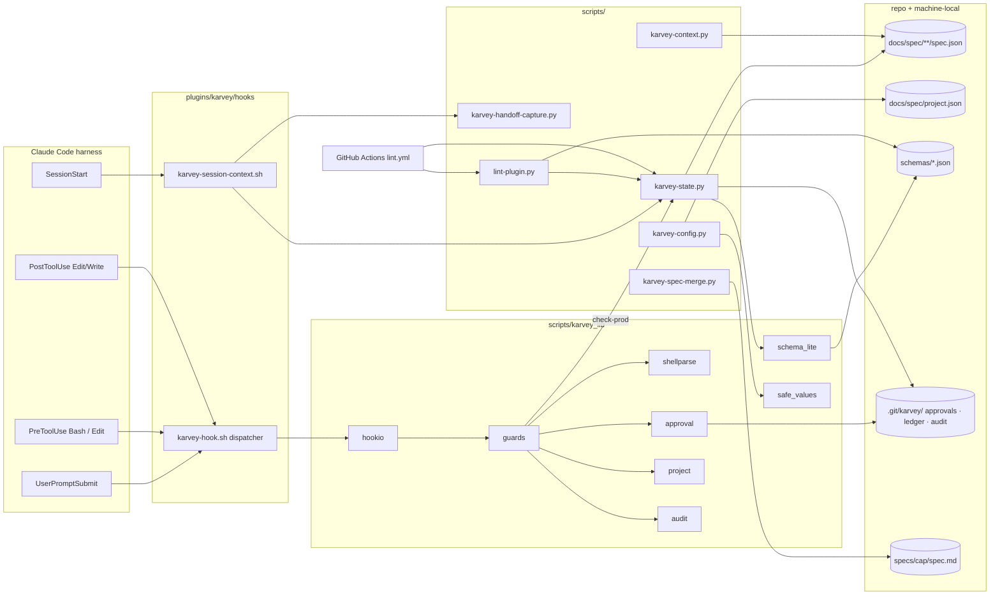
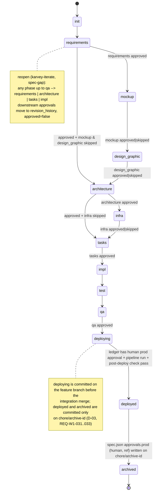
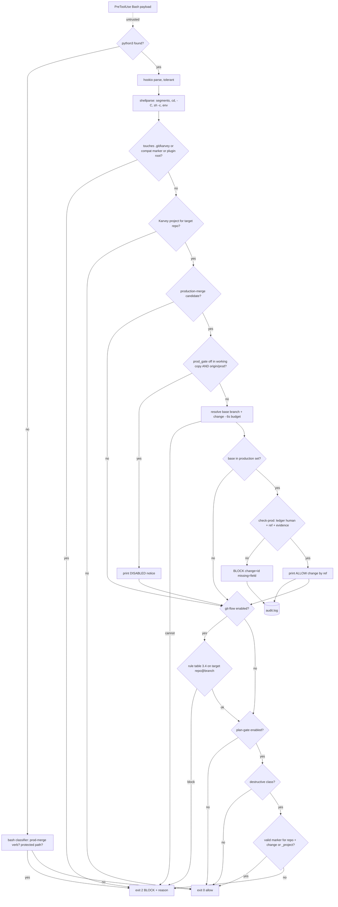
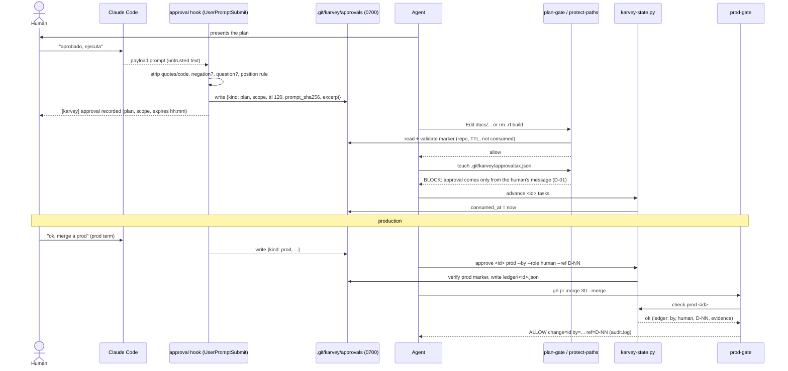

# Architecture: wave1-hardening

> PHASE 5 (`karvey-architecture`, method as shipped in 3.11.2) · Security Tier **2** · Layers: Backend
> (scripts and hooks of the plugin), Infra (CI) · Target: `cli` · Complexity: **new capability**, so the
> components diagram and the data-flow diagrams are both included (§4).
>
> Inputs read in this session: `prd.md`, `requirements.md` (REQ-W1-001..109, approved as D-05), `spec.json`,
> `spec-delta.md`, `docs/spec/decisions.md` (D-01..D-07), `docs/spec/project.json`,
> `docs/spec/reviews/2026-09-23-panel-review.md` (§2, R-01..R-07, R-16, R-17, R-18, R-21, R-22, §4..§6), the
> current `plugins/karvey/hooks/*`, `plugins/karvey/skills/karvey/hooks/*`, `plugins/karvey/.claude-plugin/plugin.json`,
> `.claude-plugin/marketplace.json`, `.github/workflows/close-external-prs.yml`, and the rules
> `security-tiers`, `engineering-standards`, `project-config`, `targets`, `deploy-workflow`, `enforcement`,
> `verification`, `versioning`.
>
> **Design-graphic precondition.** Step 1 of the skill requires `approvals.design_graphic.approved = true`.
> This change has no UI and records `skipped: {mockup: "no UI", design_graphic: "no UI"}` in `spec.json` by
> hand, as its own workaround (D-04, `lane_note`). The precondition is treated as satisfied by `skipped`,
> which is exactly the rule REQ-W1-004 makes code.

## Summary

Wave 1 turns the guarantees Karvey states in prose into code with tests. We add one small Python 3 package
with no dependencies (`plugins/karvey/scripts/`). It holds a **state tool** that owns every write to
`phase`, `approvals`, `skipped` and `phase_history`, checked against published JSON Schemas. It also holds a
**plugin linter**, a **read-only dashboard**, a **spec-delta merge tool**, a **handoff capture** and a
**settings resolver**. The resolver only hands values to shell commands after they pass a safety check.

Every guard runs from the plugin's own `hooks/hooks.json`, through one bash dispatcher and one Python
process per event. Nothing is copied into project `settings.json` any more:
- `prod-gate`: on by default, fails closed.
- `git-flow` and `plan-gate`: opt-in through `project.json:enforcement`.
- a `UserPromptSubmit` **approval hook**: the only thing that writes the approval marker.
- a post-write **spec validator** and a **pending-sync recorder**.

The session hook is bounded and emits structured context. A new CI workflow runs the linter, the unit tests
and the guard tables on every PR.

## Engineering-standards conformance gate (Step 4B)

**Not evaluated.** `docs/spec/project.json` declares no `standards` block, and neither
`docs/spec/standards/_index.md` nor any `standards/{layer}.md` exists in this repo. Checked in this session:
`project.json` has no `standards` key, and `ls docs/spec` shows `backlog.md changes decisions.md
incidents-index.md project.json reviews specs`.

Per `rules/engineering-standards.md`, "not evaluated" is **not** the same as conformant. With no standard,
every non-trivial pattern choice for the Backend and Infra layers is a **gray zone to be decided by the
owner**. Those choices are listed in *Architectural decisions* (§10). The architecture approval gate is the
design-mode question for them, and the ones that need an answer beyond "approve" are in *Open questions*
(§12). No `deviations.md` is created, because there is no standard to deviate from.

---

## 1. Components and boundaries

### 1.0 System boundary

**This spec owns:**
- The new tree `plugins/karvey/scripts/`: the state tool, linter, dashboard, spec-merge, handoff capture,
  settings resolver and the shared library `karvey_lib/`.
- The new tree `plugins/karvey/schemas/`: `spec`, `project`, `state-machine` and `legacy-phase-map`.
- The new tree `plugins/karvey/tests/`: guard tables, unit tests, regression tests, fixtures and page tests.
- `plugins/karvey/hooks/`: `hooks.json`, the new `karvey-hook.sh` dispatcher, `karvey-session-context.sh`,
  `karvey-statusline.sh`, `README.md` and `tests/test-hooks.sh`.
- `plugins/karvey/skills/karvey/hooks/{git-flow-guard,plan-gate}.sh`, which become deprecated shims.
- The rule `plugins/karvey/skills/karvey/rules/state-machine.md` (new), plus the rule and skill text changes
  in §8.
- `.github/workflows/lint.yml` (new) and `.gitattributes` (new).
- The method page `docs/karvey.html` (BUG-10..14) and moving `REVISION_PR_17-19_20260923.md` into
  `docs/spec/changes/team-adapters/qa/`.
- The migration of this repo's own `docs/spec/**/*.json` (`team-adapters`, `archive/2026-09-22-team-layer`,
  `wave1-hardening`).

**This spec does NOT touch:**
- Any other repository. The HainTech repos, Tarien and the owner's standards repo get *proposed snippets*,
  never writes.
- The owner's `~/.claude/CLAUDE.md` and `~/.claude/hooks/*`. §7.3 describes the diff to show him; nobody
  edits them in this change.
- The bug / spec-gap / emergent router, the Iron Law, "prod never delegated", the logical tracker states and
  adapters, EARS, and everything in the panel's §5 "do not change".
- Lanes (R-09), fused gates and `-y` semantics (R-10), judges (R-11), the release manifest per change
  (R-08), the timing of the spec merge (R-17 timing), and ID allocation (R-20). All of these are Wave 2.

**Changes that require revalidating this design:**
- The Claude Code hook contract changes: the exit-2 block convention, the stdin field names, or how the
  `hooks.json` matcher selects events (assumptions A-1..A-8 in §3.6).
- Claude Code gains a native way to express "only the human can approve". The marker design (§3.3) would
  then be replaced, not patched.
- The owner answers Q-A1, Q-A2 or Q-A6 differently from the recommendation (§12).
- A team standards repo is declared for this project (`project.json:standards`). The conformance gate would
  then run.

### 1.1 Plugin tree after this change

```
plugins/karvey/
├── .claude-plugin/plugin.json          MODIFY  description (REQ-W1-060), version at release only (REQ-W1-037)
├── hooks/
│   ├── hooks.json                      MODIFY  +UserPromptSubmit, +PreToolUse, +PostToolUse; SessionStart split by source
│   ├── karvey-hook.sh                  NEW     bash dispatcher: finds python3, applies each guard's fail mode, execs karvey_hooks
│   ├── karvey-session-context.sh       MODIFY  REQ-W1-045..050, 083
│   ├── karvey-statusline.sh            MODIFY  REQ-W1-049, 100, 101
│   ├── README.md                       MODIFY  REQ-W1-049, 051 (with guard-case anchors)
│   └── tests/test-hooks.sh             MODIFY  entry point: runs the tables + the BUG-01..04 cases it holds today
├── schemas/
│   ├── spec.schema.json                NEW     REQ-W1-001, 002, 006..009, 088
│   ├── project.schema.json             NEW     REQ-W1-002, 010, 026, 027, 061, 071, 088, 093, 098
│   ├── state-machine.json              NEW     the phase graph as data (phases, approval keys, skippable, producers/readers)
│   └── legacy-phase-map.json           NEW     exact tier (REQ-W1-009 list) + proposed tier (Q-A2)
├── scripts/
│   ├── karvey-state.py                 NEW     state tool
│   ├── karvey-config.py                NEW     settings resolver + safe values + notify-check + outbox (see §1.8, Q-A4)
│   ├── karvey-context.py               NEW     dashboard (read-only)
│   ├── karvey-spec-merge.py            NEW     spec-delta merge
│   ├── karvey-handoff-capture.py       NEW     writes state.json
│   ├── lint-plugin.py                  NEW     plugin linter
│   └── karvey_lib/
│       ├── __init__.py                 NEW     version, exit codes, JSON envelope
│       ├── hookio.py                   NEW     tolerant hook-payload parser (A-1..A-8)
│       ├── shellparse.py               NEW     shell segmentation: cd, -C, sh -c, env prefixes, substitutions
│       ├── project.py                  NEW     locate project/spec_repo, branch_flow, active change, reviewed-config read
│       ├── schema_lite.py              NEW     JSON-Schema subset validator (stdlib)
│       ├── safe_values.py              NEW     per-tool/per-channel patterns, metacharacter refusal
│       ├── approval.py                 NEW     vocabulary match, marker write/verify, ledger
│       ├── guards.py                   NEW     prod_gate, git_flow, plan_gate, protect_paths classifiers
│       ├── atomicio.py                 NEW     utf-8-sig read, atomic write, O_EXCL lock, format preservation
│       ├── audit.py                    NEW     JSONL decision log (0600, 1 MB rotation)
│       ├── karvey_hooks.py             NEW     event entry points called by karvey-hook.sh
│       ├── defaults.json               NEW     D-06/D-07 defaults: the one place (REQ-W1-049)
│       └── vocabulary.json             NEW     default approval / negation / prod terms (REQ-W1-019)
├── skills/karvey/hooks/
│   ├── git-flow-guard.sh               MODIFY  deprecated shim → karvey-hook.sh pre-bash --only git-flow --force-enabled
│   └── plan-gate.sh                    MODIFY  deprecated shim → karvey-hook.sh pre-{bash|edit} --only plan-gate --force-enabled
├── skills/karvey/rules/state-machine.md NEW    human rendering of state-machine.json between generated markers
├── skills/*/rules/                     DELETE  the 9 hand-kept copies (REQ-W1-052)
└── tests/
    ├── hooks/tables/*.json             NEW     guard tables (REQ-W1-019, 030)
    ├── hooks/run_tables.py             NEW     table runner (builds throw-away git repos per case)
    ├── unit/test_*.py                  NEW     unittest, stdlib
    ├── regression/test_incidents.py    NEW     BUG-05..17 index → the check that proves each
    ├── fixtures/legacy/{spec,project}/ NEW     anonymised legacy shapes (§6.3)
    └── page/test_page.mjs              NEW     node:test, no npm (Q-A7)
```

**Language and dependencies.** Python ≥ 3.9 using only the standard library (`json`, `argparse`,
`pathlib`, `subprocess`, `shlex`, `difflib`, `hashlib`, `unicodedata`, `datetime`, `unittest`), plus bash.
The bash stays compatible with 3.2, the macOS system bash. There are no pip dependencies. `jq` is not
required any more: today's hooks fall back to a `grep` that returns the wrong field when `jq` is missing.
3.9 is the floor because it is the macOS Command Line Tools python and the oldest version still on GitHub
runners. `zoneinfo` (3.9+) is used by the statusline only.

**Shared conventions for every script.**

| Item | Contract |
|---|---|
| Invocation | `python3 "${CLAUDE_PLUGIN_ROOT}/scripts/<tool>.py" <command> …`. The skills cite exactly this form. In this repo (dogfooding) it is `python3 plugins/karvey/scripts/<tool>.py`. |
| Root discovery | `--root DIR`, or else walk up from the cwd **no further than the git top level** looking for `docs/spec/project.json` or `docs/spec/changes/` (the REQ-W1-050 definition of a Karvey project). |
| Exit codes | `0` ok · `1` findings (validation errors, lint failures, convergence not reached) · `2` usage error · `3` refused (unmet precondition, unsafe value, write that would be invalid) · `4` input not found / unreadable / corrupt · `5` internal error. Hooks follow the harness contract instead: `0` allow, `2` block. |
| Output | Human text on stdout by default. `--json` prints one envelope: `{"tool","version","ok","exit","result":{…},"errors":[…],"warnings":[…]}`. Each error/warning is `{"code","severity","file","path","expected","got","message"}`. Diagnostics go to stderr. |
| Writes | `atomicio.write_json`: read with `utf-8-sig`, keep 2-space indent and key order, write `tmp + os.replace` in the same directory, under an `O_EXCL` lock file (`<file>.lock`, stale after 30 s). A compare-and-swap on the content hash at replace time refuses (exit 3) when another writer changed the file. |
| Time | ISO 8601 with offset (`datetime.now().astimezone().isoformat(timespec="seconds")`). A `--date` input must carry a zone. |
| Subprocess | Always an argv list, never `shell=True`. Every value that comes from a file travels as one argv element. |

### 1.2 `karvey-state.py`: the state tool

**Satisfies:** REQ-W1-001, 003..011, 013 (with lint L-06), 016 (marker consumption), 023 (`check-prod`), 048
(indirectly, through `active`), 069/070 (the data they read), 109.

**Data it owns:** `spec.json:phase`, `approvals.*`, `skipped`, `phase_history`, `updated_at`; the release
ledger (§2.4); consuming the approval markers (§3.3).

| Command | Args | Does | Refuses (exit 3) when |
|---|---|---|---|
| `next <change>` | `--root`, `--json` | Computes from `state-machine.json` and returns `{change, phase, status: in-progress\|awaiting-approval\|ready\|invalid, next_phase, skill, preconditions:[{phase, state: approved\|skipped\|pending}], blockers:[…]}`. `invalid` carries the validation errors (REQ-W1-005 error scenario). | — (read-only; exit 4 if unreadable) |
| `advance <change> <to>` | `--by`, `--pipeline-run`, `--post-deploy-check pass` (only for `deployed`), `--json` | Applies an edge. Closes the open `phase_history` entry with `exited_at` and appends `{phase, entered_at, by?}`. Sets `updated_at`. Consumes the markers of the phase that closed (REQ-W1-016). | Edge not in the graph. A preceding approvable phase is neither approved nor skipped (the message names it: `requirements not approved or skipped`). Last history entry corrupt (REQ-W1-008). `to=deployed` without pipeline and check evidence (REQ-W1-011). `to=archived` without `phase=deployed` and a human `approvals.prod` in spec.json. The phase value is unmappable legacy. |
| `generated <change> <phase>` | | `approvals.<phase>.generated = true` (REQ-W1-001 success scenario). | Unknown phase. |
| `approve <change> <phase>` | `--by`, `--role human\|ceo-delegate`, `--ref`, `--date?`, `--write-spec` (prod only) | Writes `{approved: true, by, role, date, ref, evidence}` (REQ-W1-006). **prod:** it writes the machine-local **release ledger**, not spec.json (D-03). With `--write-spec`, used by archive on its own branch, it copies the ledger or D-NN approval into `spec.json:approvals.prod` (REQ-W1-032). | Any of by/role/ref missing. `prod` with a role other than `human` ("production approval is never delegated"). `prod` without a valid **prod-kind approval marker** (§3.3, Q-A1). For the other phases, a missing marker is a warning in 3.12.0 and `evidence: {"marker": "none"}` is recorded. |
| `skip <change> <phase>` | `--reason` | `skipped[phase] = reason` (REQ-W1-007). | Empty reason. Phase not `skippable` in the graph (mockup, design_graphic, infra in Wave 1). |
| `reopen <change> <phase>` | `--reason`, `--ref` | The backward edge used by `karvey-iterate` for a spec-gap. It moves the approvals of the reopened phase and of everything downstream into a new `revision_history[]` entry (`superseded_approvals`), sets them to `approved: false`, and appends a history entry. | The target is not a reopen target (`requirements`, `architecture`, `tasks`, `impl`). Missing reason. |
| `validate [PATH…\|--all]` | `--fix`, `--dry-run`, `--accept-proposed`, `--strict`, `--json` | Validates spec.json and project.json against the schemas plus the semantic checks (§2.3). With `--fix` it migrates (§2.5): the unified diff always goes to stdout first, then the file is written unless `--dry-run`. `--fix` is idempotent (REQ-W1-009). | exit 1 on errors. In advisory mode warnings keep exit 0 (REQ-W1-003). Unmappable or unmigratable values make `--fix` exit 3 and write nothing. |
| `active` | `--root`, `--json` | The one active-change resolution shared by the hooks and the dashboard (§5). | — |
| `check-prod <change>` | `--json` | `{ok, change, by, role, ref, date, source: ledger\|spec, missing:[…]}`. The prod-gate calls it in-process. | exit 1 if not ok, exit 4 if unreadable. |

**Legacy files and transitions (3.12.0 advisory).** Transitions accept exact-tier legacy phase values
(§2.5) by mapping them in memory. They write back only the fields they own, in normalised form, and leave
every other legacy field untouched (reported as warnings). An unmappable phase makes the transition refuse
with `run validate --fix --dry-run`. So a project upgraded to 3.12.0 mid-change keeps working unless its
phase value is one nobody can interpret.

**Skill text that calls it** (§8): every phase skill's "Update spec.json" block; the orchestrator's phase
table becomes `karvey-state.py next`; `karvey-iterate` uses `reopen`; `karvey-deploy` uses
`advance deploying` and `approve prod`; `karvey-archive` uses `advance deployed`, `approve prod --write-spec`
and `advance archived`.

### 1.3 Hooks: `hooks.json`, the dispatcher and `karvey_hooks`

One dispatcher and one Python process per event: several guards need the same parse of the payload, the
same project lookup and the same shell segmentation.

```json
{
  "hooks": {
    "SessionStart": [
      { "matcher": "startup",
        "hooks": [{ "type": "command", "command": "bash \"${CLAUDE_PLUGIN_ROOT}/hooks/karvey-session-context.sh\" startup", "timeout": 10 }] },
      { "matcher": "resume|compact|clear",
        "hooks": [{ "type": "command", "command": "bash \"${CLAUDE_PLUGIN_ROOT}/hooks/karvey-session-context.sh\" resume", "timeout": 10 }] }
    ],
    "UserPromptSubmit": [
      { "hooks": [{ "type": "command", "command": "bash \"${CLAUDE_PLUGIN_ROOT}/hooks/karvey-hook.sh\" prompt", "timeout": 5 }] }
    ],
    "PreToolUse": [
      { "matcher": "Bash",
        "hooks": [{ "type": "command", "command": "bash \"${CLAUDE_PLUGIN_ROOT}/hooks/karvey-hook.sh\" pre-bash", "timeout": 15 }] },
      { "matcher": "Edit|Write|MultiEdit|NotebookEdit",
        "hooks": [{ "type": "command", "command": "bash \"${CLAUDE_PLUGIN_ROOT}/hooks/karvey-hook.sh\" pre-edit", "timeout": 5 }] }
    ],
    "PostToolUse": [
      { "matcher": "Edit|Write|MultiEdit|NotebookEdit",
        "hooks": [{ "type": "command", "command": "bash \"${CLAUDE_PLUGIN_ROOT}/hooks/karvey-hook.sh\" post-edit", "timeout": 10 }] }
    ]
  }
}
```

The `SessionStart` split passes `startup` or `resume` as an **argument taken from the matcher**, so REQ-W1-050
("start, not resume/compact/clear") does not depend on a `source` payload field (A-5).

**`karvey-hook.sh <event>`** (bash):
1. Find the interpreter: `python3`, then `python` if it reports major version 3, then `py -3` on Windows.
2. If none is found, apply the per-guard fail mode in §3.2 using a bash-only classifier, and exit.
3. Otherwise `exec python3 "$ROOT/scripts/karvey_lib/karvey_hooks.py" <event> "$@"`.
4. Its internal time budget is always below the `hooks.json` timeout. We assume a hook the harness kills is
   treated as non-blocking (A-7), so the prod-gate must reach its decision before the kill.

| Event → guards, in order (the first block wins) | REQ | Default | Fail mode |
|---|---|---|---|
| `pre-bash` → **protect-paths** → **prod-gate** → **git-flow** → **plan-gate** | 018 · 023..027, 035 · 020..022, 035 · 014..016 | protect-paths always on · prod-gate **on** (D-02) · git-flow off · plan-gate off | protect-paths closed · prod-gate **closed** · git-flow closed when enabled · plan-gate closed when enabled |
| `pre-edit` → **protect-paths** → **plan-gate** | 018 · 016 | as above | as above |
| `post-edit` → **spec-write validator** (`docs/spec/**/spec.json` and `project.json`) → **pending-sync recorder** (`docs/spec/**`) | 028 · 063 | on in Karvey projects | open, with one warning line |
| `prompt` → **approval hook** | 017, 019 | on in Karvey projects | open: no marker is created, which is the safe side |

- **Protect-paths** is independent of `plan_gate_hook`. The prod-gate depends on the marker and the ledger
  (§3.3), so they must be protected even when plan-gate is off.
- A guard that is disabled costs nothing beyond the shared parse.
- Outside a Karvey project every guard is **inert and silent** (§5). The one exception is protect-paths:
  the Karvey state directories are protected wherever they live.

**Guard contracts** (implemented in `karvey_lib/guards.py`; every decision goes to `audit.py`):

| Guard | Input | Decision logic (summary; the full case list is in §6.1) | Output |
|---|---|---|---|
| protect-paths | Bash command segments; Edit/Write `file_path` | Blocks any tool call whose command or path touches `<git-common-dir>/karvey/` (approvals, ledger), `$KARVEY_COMPAT_MARKER` (Q-A5) or `${CLAUDE_PLUGIN_ROOT}/**`. Matching is on the resolved realpath for Edit/Write. For Bash, the literal path, or the substrings `karvey/approvals` / `karvey/ledger` / the marker file name after expanding `~`, `$HOME` and `$(git rev-parse …)`. | exit 2: `[karvey] BLOCK protect-paths: approval comes only from the human's message (D-01)` |
| prod-gate | Bash segments | Detects production-merge candidates (§3.4). Resolves the base branch (local for `git push`; `gh`/`az`/`glab` view calls with a 6 s budget) and the change being released. Allows only if `check-prod` is ok. Invalid `prod_gate_hook` (non-boolean) counts as on. Off only if **false in both** the working copy and `origin/{production}:docs/spec/project.json` (§3.5). | allow: one stdout line `[karvey] prod-gate ALLOW change=<id> by=<name> ref=<ref>` · block: exit 2 with `[karvey] prod-gate BLOCK change=<id\|?> missing=<field> reason=<…>` · disabled: `[karvey] prod-gate DISABLED for this project (project.json)` |
| git-flow | Bash segments | Resolves the **target repository per segment**: `cd` chains, `git -C`, `--git-dir/--work-tree`, git aliases via `git config --get alias.X`. Whole-name branch match. Rules in §3.4. | exit 2: `[karvey] BLOCK git-flow: <rule> (<repo>@<branch>)` |
| plan-gate | Bash segments, or Edit/Write | Command-class classification (§3.4). Allows if a valid marker exists for (repo, change) or (repo, `_project`), newer than the TTL, not consumed and not corrupt. | exit 2: `[karvey] BLOCK plan-gate: <class>. Present the plan and wait for the human's approval; the approval hook records it.` Nothing tells the agent to create anything. |
| spec-write validator | `tool_input.file_path` (A-3) | If the path matches, runs `karvey-state.py validate <file>` in-process. | violations: exit 2, with the list on stderr (A-4: in PostToolUse this feeds the reason back to the session) · valid: silent |
| pending-sync | same | Appends the repo-relative path to `docs/spec/.graph-pending` (dedupe, sorted, LF), except the pending file itself and `graphify-out/**`. | silent |
| approval hook | prompt text (A-2) | §3.3 and §3.6. | silent. When it records a marker it prints one stdout line, `[karvey] approval recorded (<kind>, <scope>, expires hh:mm)`, so the human sees it. |

**Legacy templates.** `skills/karvey/hooks/git-flow-guard.sh` and `plan-gate.sh` stay for 3.12.x as shims
that exec the dispatcher with `--only <guard> --force-enabled`. A project that copied them into its
`settings.json` keeps the same behaviour without the H-10/H-12 defects. `karvey-guard` detects those entries
and proposes removing them (§7.4). The shims are removed in 4.0.0.

### 1.4 Session hook: `karvey-session-context.sh`

**Satisfies:** REQ-W1-045, 046, 047, 050, 083 (settings on `origin/{integration}`), and REQ-TEAM-002 / 014b
as modified.

- It stays bash, so the degraded settings line works without python (REQ-W1-050). Selection, truncation
  and JSON emission are delegated to `python3 karvey_hooks.py session <startup|resume>` when python is
  present.
- **Active change:** `karvey-state.py active` (§5). It excludes `changes/archive/` and any directory holding
  `IMPLEMENTED`, which fixes H-08.
- **Manifest:** compact **xor** full. The compact one wins when it exists (H-09).
- **Board:** only the open rows, at most 40. A row is open when its status marker is not `✅` / `done`. The
  hook then adds `… N more open rows in <path>`.
- **Handoff:** at most 6 KB, cut at a line boundary, then `… truncated (X KB of Y KB) — full file: <path>`.
- **Channel:** a single JSON object on stdout:
  `{"hookSpecificOutput":{"hookEventName":"SessionStart","additionalContext":"<text>"}}` (A-6). The plain
  text is the fallback when python is missing.
- **Settings notice:** only for the `startup` argument. It checks the working copy first, then
  `git show origin/{integration}:docs/spec/project.json` against the local ref, with no fetch, to keep the
  hook offline and fast (REQ-W1-083). Before declaring settings missing, a `management` legacy string counts
  as present-but-legacy: the notice says `legacy shape — run karvey-state.py validate --fix`.
- **Worktree fix (latent defect found here):** the current `state.json` comparison tests
  `os.path.isdir(<repo>/.git)`. That test fails in git worktrees, where `.git` is a file, and reports
  "NOT FOUND". It is replaced by `git -C <repo> rev-parse --git-dir`. **To log as a finding** (see the reply).

### 1.5 `karvey-handoff-capture.py`

**Satisfies:** REQ-W1-048, REQ-TEAM-010d.

`karvey-handoff-capture.py --profile <dir> [--repos-from state|team|project] [--scheduled-tasks N]
[--ready-to-rotate] [--dry-run] [--json]`

- For each owned repo it runs `git -C <repo> rev-parse --abbrev-ref HEAD`, `git log -1 --pretty=%h` and
  `git status --porcelain`, then writes `<profile>/state.json` atomically:
  `{saved_at, repos:[{path, branch, commit, uncommitted, measured:true} | {path, measured:false, reason}],
  scheduled_tasks?, ready_to_rotate?}`.
- A repo that fails to measure is recorded as `measured:false` with its reason, never with invented values
  (error scenario).
- Exit codes: `0`, with some repos possibly unmeasured and listed; `4` if the profile directory is missing;
  `2` for usage errors.
- Skill text: `karvey-checkpoint save` Step "write state.json" becomes this invocation, and the phrase
  "never by hand" is kept.

### 1.6 `lint-plugin.py`

**Satisfies:** REQ-W1-002, 005, 012, 013, 022, 029, 031, 033, 034, 036, 038..040, 042, 049, 051..053,
055..060, 062, 064, 073..079, 081, 084, 086, 087, 091..095, 099, 107, and the regression checks of
BUG-06/07/15/16/17 (§6.4).

`lint-plugin.py [--root REPO] [--only L-NN[,…]] [--format text|json|github] [--list]`

- Exit `0` when there is no error-severity finding, `1` when there is one, `2` on usage errors.
  `--format github` prints `::error file=…,line=…::` annotations for the PR.
- Every check is a registered function with an id, a severity and the REQ it proves. `--list` prints the
  registry, and the linter checks that every REQ it claims appears in `requirements.md`.

| Id | Check | REQ |
|---|---|---|
| L-01 | Every `skills/*/SKILL.md` has frontmatter in the supported subset (one-line `key: value` scalars; `allowed-tools` as a comma list) | 055, 077 |
| L-02 | Description ≤ 250 characters, and it names the phase or role, the product and when to use it (shape regex: `^Karvey (phase \d+\|support)`) | 077 |
| L-03 | Trigger phrases carry method context. They are checked against a deny list of bare generic words (`deploy`, `QA`, `code review`, …) and third-party names (`gstack`, `Garry Tan`, `kiro`, …), and a phrase repeated across skills fails (trigger overlap) | 078 |
| L-04 | `disable-model-invocation: true` on guard, team, benchmark-models, scrape, import, retro | 079 |
| L-05 | Every `phase` literal in skill or rule text belongs to the `state-machine.json` enum | 001, 055 |
| L-06 | No instruction to edit `phase`, `approvals`, `skipped` or `phase_history` by hand. Every hit is an invocation of `karvey-state.py` | 013 |
| L-07 | The orchestrator has no phase→next table. It calls `karvey-state.py next` | 005 |
| L-08 | Every change artifact a skill reads is produced by an earlier phase (`state-machine.json:produces/reads`). `proposal.md` and `specs/*/spec-delta.md` fail | 012, 057 |
| L-09 | Every cited path resolves from the citing file, or is written `${CLAUDE_PLUGIN_ROOT}/…` | 053 |
| L-10 | No `skills/*/rules/` copy exists. A copy declared as generated must be byte-identical to its source | 052 |
| L-11 | Skill and rule counts in `README.md`, `plugins/karvey/README.md`, `plugin.json` and `marketplace.json` match the files | 055 |
| L-12 | `plugin.json`, `marketplace.json`, `project.json:karvey_version` and the top CHANGELOG release agree | 055 |
| L-13 | The top CHANGELOG release has a "Why" section. `docs/karvey.html` has that version in its version history, marked current, in every language block | 058 |
| L-14 | An instructed action (Write, Edit, AskUserQuestion, Bash, Agent) is declared in `allowed-tools` | 056 |
| L-15 | Every hook named in skills or rules exists in `hooks.json` or the dispatcher and has table cases. `clickup-sync-guard` and `standards-guard` fail | 029 |
| L-16 | In `rules/enforcement.md` and `hooks/README.md`, every sentence that makes a behaviour promise (verbs: blocks, allows, prints, silent, nothing, exits) carries `<!-- guard-case: ID[,ID] -->`. Each id exists in the tables, and its expected decision matches the verb class. An unanchored promise fails | 022, 051 |
| L-17 | Every field in the JSON blocks of `rules/project-config.md` and `rules/living-specs.md` is present in a schema | 002 |
| L-18 | `docs/spec/**/*.json` validate (it calls the state tool's validator) | 055, 109 |
| L-19 | Versioning text: no bump per commit or task. impl writes `[Unreleased]`, and QA D6 and the deploy pre-check read `[Unreleased]` | 036, 038, 039 |
| L-20 | Every QA item assigned in `rules/versioning.md` appears in `karvey-qa` D6 | 040 |
| L-21 | No write of an actual time into an estimate field (`time_estimate.*actual`) | 042 |
| L-22 | Rotation threshold: no literal other than one that cites `karvey_lib/defaults.json` | 049 |
| L-23 | graphify or knowledge sync is invoked only by `karvey-archive` and the explicit on-demand path | 062 |
| L-24 | Tracker ritual: status per task, comment and cascade per Feature (`phase-close.md`) | 064 |
| L-25 | QA text has no commit instruction. The review is written to `changes/{id}/qa/`, deploy reads from there, and no `REVISION_PR_*.md` sits at the repo root | 073, 074, 075 |
| L-26 | QA text has no stack-specific rules (Axios/apiService, `v-html`, RUT) | 076 |
| L-27 | Deploy: no instruction to commit the prod approval on the integration branch. The 6-step checklist comes before the first `git push`. Archive creates `chore/archive-{id}` before its first commit | 031, 033, 034 |
| L-28 | Management: no `management.tool != markdown` test; no direct `clickup.backlog_list_id` read; one cascade statement (in `management-adapters.md`) cited, not restated; 🙋 in every marker legend; `phase-close.md` names exactly the skills that cite it; init uses one initial Epic state | 084, 086, 087, 091, 092, 094, 095 |
| L-29 | In command examples, a `project.json` value is interpolated only through `karvey-config.py get --shell` and is double-quoted | 093 |
| L-30 | H-33 minor defects: one decision-log path; no `E{1..99}` in karvey-init; one "For each E2E flow step" block in karvey-test; README names skills `/karvey:karvey-<name>` | 059 |
| L-31 | README and `plugin.json` present the tracker as the team's configured one; ClickUp appears only as one option | 060 |
| L-32 | Every `RESUELTO` incident in `docs/bugs_dev_testing.md` names a regression test or lint id, and that test or id exists | 107 |
| L-33 | *(advisory, no REQ; edge case §5)* Duplicate `D-NN`, `BUG-NN` or `BL-NN` headings | — |
| L-34 | No subagent prompt in any skill allows writing `project.json` | 081 |
| L-35 | The CHANGELOG top release carries the `CLAUDE.md`-destinations compatibility line (3.12.0) | 099 |

### 1.7 `karvey-context.py`: dashboard

**Satisfies:** REQ-W1-026 (display), 043 (close report), 044 (calibration), 068..072, 090 (outbox listing),
107/108 (convergence).

`karvey-context.py [--root] [--change ID] [--section overview|open-work|approvals|enforcement|calibration|convergence|close-report] [--json]`

- **Read-only:** it opens files read-only and never writes, including under `--json` (REQ-W1-072). JSON is
  parsed as JSON; Markdown tables are parsed by header name (`Type`, `Status`, …), never by column position.
- **OPEN WORK:**
  - findings per change, by type and status;
  - every `BUG-NN` whose status is not `RESUELTO`, from `docs/bugs_dev_testing.md` and `incidents-index.md`;
  - every `[human]` task marked 🙋 / `awaiting-human`, with its executor and since when (from the PLAN.md row);
  - backlog items with status `open`;
  - outbox entries (`changes/*/tracker-outbox.jsonl`).
- **An unreadable file** is shown as `unreadable: <path> (<reason>)` and the rest still renders (REQ-W1-068
  error scenario).
- **Age:** days since the last `phase_history` entry's `entered_at`. Past `stall_days` (default 7, D-07) the
  change is flagged `stalled`. Without history the age is `unknown`, never `0`.
- **Approvals:** every approval from `requirements` to `prod`, with by, role and date, or `skipped: <reason>`.
  `approved: true` without `by` is shown as `approver missing`.
- **WIP:** `N/limit` when `wip_limit` is set, or a warning `WIP N/limit` when it is exceeded.
- **Enforcement:** `prod-gate on (default)` or `off (project.json, reviewed on origin/<prod>)`, plus
  git-flow, plan-gate and marker status (valid until / none).
- **Calibration:** ratio of actual (AI + review) to estimate per work type of the estimation table, over the
  last archived changes that have data. It proposes a recalibration only when a type deviates by more than
  `threshold_pct` in each of the last `window` changes (D-07: 30 %, 3). With fewer changes it prints the
  ratios and "not enough history".
- **Convergence** `--change X`: exit 1 while any `bug` or `spec-gap` finding is `open` or `routed`, or any
  BUG-NN routed to the change is not `RESUELTO` with a named regression. It lists each offender.
- **Close report:** lists tasks that have no actual (REQ-W1-043 error scenario).
- Exit: `0`; `1` only for `--section convergence` when not converged; `4` when there is no `docs/spec`.
- Skill text: `karvey-context/SKILL.md` becomes "run the script and relay its output". The `grep -o`
  parsing and the local approvals line are removed.

### 1.8 `karvey-config.py`: settings resolver and safe values (addition, see Q-A4)

Not in the orchestrator's list, but needed. Without it REQ-W1-080..099 would stay prose, which is the
failure the goal forbids. It is also the code-level control for F-02/S-01.

**Satisfies:** REQ-W1-080 (resolution half), 083, 086, 087, 088, 090, 093, 097, 098, 099 (send-time half),
010 (the snippet in §7.2).

| Command | Contract |
|---|---|
| `resolve management [--change ID]` | Resolves in one order: the `spec.json` override `{tool, location, statuses, sprints}`, then `project.json:management`. A legacy string becomes `{tool}`, and `none` becomes `markdown` with a legacy warning. Output: `{tool, location, statuses, sprints, source, external: bool, missing:[…]}`. `external` is the single "is there a tracker" test, false for `markdown`/`none` (REQ-W1-087). `missing` includes `statuses` or `location` so skills run the missing-map clause. |
| `resolve notifications` | `{channel, target, via, events, detail}`, defaults applied (`detail: counts`). |
| `get <dotted.key> --shell` | Prints the validated value for the key's kind (§3.1), or exits 3 naming the key and the rule it broke. The skill uses `VALUE=$(python3 … get management.location --shell) \|\| stop` and then passes `"$VALUE"`. |
| `notify-check [--confirm]` | Hashes the resolved notifications block and compares it with `<git-common-dir>/karvey/notify-last.json`. Unchanged: exit 0. Changed: exit 10, printing the new destination for the human to confirm (REQ-W1-097). `--confirm` records the new hash only against a live human confirmation (D-16, F-15): the human types `confirmo notificacion <code>` (or `confirm notification <code>`; `<code>` = first 8 hex of the destination hash), the approval hook records it under `approvals/notify/` scoped to the clone, the project and that destination, with the `plan_marker_ttl_min` TTL; without it (the agent alone, another destination or project, expired) `--confirm` records nothing and exits 10 with the phrase to type. The confirmation is single-use. A `target` containing `://` is refused with exit 3. |
| `outbox add\|list\|done <change>` | `changes/<id>/tracker-outbox.jsonl`: `{id, op, args, parent_key, created_at, attempts, last_error}` (REQ-W1-090). `list` feeds the phase-close retry and the dashboard. Adding a child whose parent is itself pending is recorded as `blocked_by` the parent, never sent. |
| `propose-settings [--from-legacy]` | Prints a `notifications` / `management` snippet built from the legacy string and a top-level `clickup.backlog_list_id`, with placeholders for the rest. It never writes (§7.2). |

Exit codes follow the shared contract, plus `10` = "confirmation required" for `notify-check`.

### 1.9 `karvey-spec-merge.py`

**Satisfies:** REQ-W1-065, 066, 067 (archive text).

`karvey-spec-merge.py <change> [--capability NAME] [--dry-run] [--json]`

- **Input:** `changes/<id>/spec-delta.md`, sections `## ADDED Requirements`, `## MODIFIED Requirements`,
  `## REMOVED Requirements`.
- **Unit:** one requirement item, a bullet starting `- **REQ-…**` with its indented continuation lines. In
  MODIFIED, the item under `### Requirement: <ID>` is keyed by that id.
- **Target:** `docs/spec/specs/<capability>/spec.md`. The capability comes from `spec.json:capability`
  unless `--capability` is given.
- **ADDED:** appended under `## ADDED by \`<change>\` (<version>, merged <date>)`, keeping the delta's
  `###` group headings. An id already present with identical text is a no-op (idempotent). The same id with
  different text is a conflict.
- **MODIFIED:** replaced in place by id. An id not present is an error: nothing is written and the id is
  named (REQ-W1-065 error scenario).
- **REMOVED:** replaced by `- ~~**<ID>**~~ — REMOVED by \`<change>\` (<date>): <reason>`. A second run is
  a no-op.
- `--dry-run` prints the unified diff (`difflib`) and writes nothing. An unparsable section gives exit 3 with
  the line number.
- Exit: `0` applied or no-op; `1` conflict or missing id, nothing written; `3` parse error; `4` file
  missing.
- Skill text: `karvey-archive` merge step becomes "`--dry-run`, show the diff, then run without the flag".
  If the tool fails, archive stops before moving the folder (REQ-W1-067).

### 1.10 Statusline and method page

- `karvey-statusline.sh`: resolves the zone once per run. An invalid `KARVEY_TZ` gives system time plus
  `(TZ?)` (REQ-W1-100). The windows are joined with `' · '.join(present)` (REQ-W1-101).
  `KARVEY_ROTATE_HOURS` defaults to `defaults.json:rotation_hours`, read relative to the script. When the
  script was copied elsewhere and cannot find the file, it shows `rot?` instead of using a second literal
  (REQ-W1-049).
- `docs/karvey.html`:
  - the inline script is restructured into pure functions (`safeDecodeHash`, `pickLang`, `withLang`,
    `hashToBlock`) plus one `init(window)`, so node can test them with a stub window;
  - `decodeURIComponent` inside try/catch (BUG-10);
  - `?lang=` must be one of the 5 languages (by its first two letters) before it is saved, and a URL
    language applies for one visit without overwriting a saved choice (BUG-11, REQ-W1-103);
  - `URLSearchParams` keeps the other parameters (BUG-12);
  - a `hashchange` listener (BUG-13);
  - the switch is hidden until JS adds `class="js"` to `<html>`, and the static markup shows no switch
    (BUG-14).

### 1.11 CI: `.github/workflows/lint.yml`

**Satisfies:** REQ-W1-030, 054, 109 (runtime), AC-2, AC-4.

```yaml
name: Plugin lint and tests
on:
  pull_request: { branches: [main] }
  push: { branches: [main] }
permissions: { contents: read }          # no secrets, no write token; never pull_request_target
concurrency: { group: lint-${{ github.ref }}, cancel-in-progress: true }
jobs:
  lint:
    runs-on: ubuntu-latest
    steps:
      - uses: actions/checkout@<sha>      # pinned by commit SHA
      - uses: actions/setup-python@<sha>
        with: { python-version: '3.12' }
      - run: python3 plugins/karvey/scripts/lint-plugin.py --format github
      - run: python3 plugins/karvey/scripts/karvey-state.py validate --all --root .
  tests:
    strategy: { matrix: { os: [ubuntu-latest, macos-latest], python: ['3.9', '3.12'] } }
    runs-on: ${{ matrix.os }}
    steps:
      - uses: actions/checkout@<sha>
        with: { fetch-depth: 0 }          # table cases need real git history for origin/* refs
      - uses: actions/setup-python@<sha>
        with: { python-version: '${{ matrix.python }}' }
      - run: python3 -m unittest discover -s plugins/karvey/tests/unit -v
      - run: python3 -m unittest discover -s plugins/karvey/tests/regression -v
      - run: python3 plugins/karvey/tests/hooks/run_tables.py --junit tables.xml
      - run: bash plugins/karvey/hooks/tests/test-hooks.sh
        env: { KARVEY_SKIP_TABLES: '1' }  # the tables ran in the step above (F-37)
  page:
    runs-on: ubuntu-latest
    steps:
      - uses: actions/checkout@<sha>
      - uses: actions/setup-node@<sha>
        with: { node-version: '20' }
      - run: node --test plugins/karvey/tests/page/
  windows-advisory:
    runs-on: windows-latest
    continue-on-error: true               # advisory in 3.12.0: path translation and CRLF cases
    defaults: { run: { shell: bash } }
    steps:
      - uses: actions/checkout@<sha>
        with: { fetch-depth: 0 }
      - uses: actions/setup-python@<sha>
        with: { python-version: '3.12' }
      - run: cd plugins/karvey/tests/unit && python -m unittest -v test_paths test_hookio test_atomicio
      - run: python plugins/karvey/tests/hooks/run_tables.py --tag windows -v
```

The `windows` tag (F-36) marks the smoke cases that exercise the dispatcher through Git Bash (allow, block, an
Edit path, a prompt marker, the post-edit validator); path translation, BOM and CRLF are covered at unit level
(`test_paths.py`, `test_hookio.py`, `test_atomicio.py`). `test_ci_workflow.py` fails if a `--tag` selection in
the job selects no case, so the advisory job never goes red merely for having nothing to run.

A PR is blocked only if `main` requires these checks. That is a repository setting, a `[human]` task for
the owner (Q-A8), not a file this change can write. The job's run duration is kept in the summary: jobs of a
few seconds across every run mean nothing ran (verification.md §5).

---

## 2. Data model

### 2.1 `schemas/state-machine.json`: the phase graph as data

```json
{
  "version": 1,
  "phases": [
    {"id": "init",           "approval": null,             "skippable": false, "skill": "karvey-init",           "produces": ["prd.md", "spec.json", "findings.md", "PLAN.md"]},
    {"id": "requirements",   "approval": "requirements",   "skippable": false, "skill": "karvey-requirements",   "produces": ["requirements.md", "spec-delta.md"], "reads": ["prd.md"]},
    {"id": "mockup",         "approval": "mockup",         "skippable": true,  "skill": "karvey-mockup",         "produces": ["mockup/"], "reads": ["requirements.md", "prd.md"]},
    {"id": "design_graphic", "approval": "design_graphic", "skippable": true,  "skill": "karvey-design-graphic", "produces": ["design-spec.md"], "reads": ["mockup/", "requirements.md"]},
    {"id": "architecture",   "approval": "architecture",   "skippable": false, "skill": "karvey-architecture",   "produces": ["architecture.md"], "reads": ["requirements.md", "design-spec.md?"]},
    {"id": "infra",          "approval": "infra",          "skippable": true,  "skill": "karvey-infra",          "produces": ["infra.md"], "reads": ["architecture.md"]},
    {"id": "tasks",          "approval": "tasks",          "skippable": false, "skill": "karvey-tasks",          "produces": ["tasks.md"], "reads": ["architecture.md", "requirements.md"]},
    {"id": "impl",           "approval": null,             "skippable": false, "skill": "karvey-impl",           "reads": ["tasks.md", "architecture.md"]},
    {"id": "test",           "approval": null,             "skippable": false, "skill": "karvey-test",           "reads": ["architecture.md", "requirements.md"]},
    {"id": "qa",             "approval": "qa",             "skippable": false, "skill": "karvey-qa",             "produces": ["qa/REVISION_PR_*.md"]},
    {"id": "deploying",      "approval": "deploy",         "skippable": false, "skill": "karvey-deploy",         "reads": ["qa/REVISION_PR_*.md"]},
    {"id": "deployed",       "approval": "prod",           "skippable": false, "skill": "karvey-deploy"},
    {"id": "archived",       "approval": null,             "skippable": false, "skill": "karvey-archive",        "reads": ["spec-delta.md"]}
  ],
  "edges": "forward: phases[i] -> phases[i+1]; a skipped phase is passed through",
  "reopen_targets": ["requirements", "architecture", "tasks", "impl"],
  "preconditions": {
    "enter(P)": "every phase before P with a non-null approval is approved or skipped; approvals.deploy is not a precondition in Wave 1",
    "enter(deployed)": "release ledger holds a human prod approval + pipeline run + post-deploy check",
    "enter(archived)": "phase = deployed AND spec.json approvals.prod.by set, role human, ref non-empty"
  }
}
```

`rules/state-machine.md` renders this file between `<!-- generated:state-machine -->` markers. L-08 and a
unit test check the two agree, so the rule and the tool can never disagree (REQ-W1-005). `?` marks an
optional read, which is how architecture reads `design-spec.md` only when design_graphic was not skipped.
`approvals.deploy` keeps its 3.11 meaning (the DEV deploy was verified) and is recorded, but it is not a
precondition. Making it one would turn today's optional step into a new gate.

### 2.2 `schemas/spec.schema.json` (JSON Schema 2020-12, supported subset)

`schema_lite.py` implements, and L-17 restricts the schemas to, this subset: `type`, `enum`, `const`,
`required`, `properties`, `additionalProperties`, `propertyNames`, `items`, `minItems`, `minLength`,
`maxLength`, `pattern`, `oneOf`, `anyOf`, `if/then/else`, `$ref` to local `$defs` or cross-file
`karvey:<file>#/$defs/…`, `minimum`, `maximum`, plus two extensions:
- `x-karvey-severity: warning` marks a rule that warns instead of failing, in advisory mode (strict mode
  promotes every such warning to an error).
- `x-karvey-format: datetime-tz` means ISO 8601 with time and offset.

**Annotations** (accepted, ignored by validation): `$schema`, `$id`, `$comment`, `$defs`, `title`,
`description`, `x-karvey-note`, `x-karvey-default`, `x-karvey-safe` and `x-karvey-schema-version`. Any other
keyword is an error of the schema itself, which is what L-17 relies on.

**Legacy shapes that validate** (`schema.legacy`, F-05). A node with `x-karvey-severity: warning` **and** an
`x-karvey-note` that is *matched* — as a property value, an `additionalProperties` value or a
`oneOf`/`anyOf` branch — reports the match itself as one warning with code `schema.legacy` and the note as
the message. That is how a shape that is valid but legacy (`gates_skipped`, an unknown approval key, a
string `management`, a top-level `clickup` block) is reported without failing. A `schema.legacy` warning
never makes a branch invalid, so it does not change which `oneOf` alternative matches.

**Legacy approval dates** (F-06, REQ-W1-003). `$defs/approval.date` carries `x-karvey-severity: warning`, so
the date-only values every existing `spec.json` holds (`"date": "2026-09-22"`) are warnings in advisory
mode, exit 0 (§2.7). The state tool always writes a `datetime-tz`, and `--fix` never invents a time.
`$defs/prodApproval.date` has no such marker and stays an error.

```json
{
  "$schema": "https://json-schema.org/draft/2020-12/schema",
  "$id": "karvey:spec.schema.json",
  "x-karvey-schema-version": 1,
  "type": "object",
  "required": ["change_id", "phase"],
  "additionalProperties": true,
  "properties": {
    "schema_version": {"const": 1},
    "change_id": {"type": "string", "pattern": "^[a-z0-9][a-z0-9-]{1,62}$"},
    "phase": {"$ref": "#/$defs/phase"},
    "phase_history": {"type": "array", "items": {"$ref": "#/$defs/historyEntry"}},
    "skipped": {
      "type": "object",
      "propertyNames": {"enum": ["mockup", "design_graphic", "infra"]},
      "additionalProperties": {"type": "string", "minLength": 1}
    },
    "lane": {"type": "string", "x-karvey-note": "data only in Wave 1 (R-09)"},
    "approvals": {
      "type": "object",
      "properties": {
        "requirements":   {"$ref": "#/$defs/approval"},
        "mockup":         {"$ref": "#/$defs/approval"},
        "design_graphic": {"$ref": "#/$defs/approval"},
        "architecture":   {"$ref": "#/$defs/approval"},
        "infra":          {"$ref": "#/$defs/approval"},
        "tasks":          {"$ref": "#/$defs/approval"},
        "qa":             {"$ref": "#/$defs/approval"},
        "deploy":         {"$ref": "#/$defs/approval"},
        "prod":           {"$ref": "#/$defs/prodApproval"}
      },
      "additionalProperties": {"type": "object", "x-karvey-severity": "warning",
                               "x-karvey-note": "unknown approval key (legacy: impl, test, deploy_dev, deploy_prod, design…)"}
    },
    "management": {"oneOf": [{"$ref": "#/$defs/toolName"}, {"$ref": "#/$defs/managementOverride"}]},
    "seed_backlog_id": {"oneOf": [{"type": "string"}, {"type": "array", "items": {"type": "string"}}]},
    "security_tier": {"enum": [1, 2, 3, 4]},
    "layers": {"type": "array", "items": {"type": "string"}},
    "language": {"type": "string", "pattern": "^[a-z]{2}(-[A-Z]{2})?$"},
    "type": {"type": "string"},
    "goal": {"type": "string"},
    "created_at": {"type": "string", "x-karvey-format": "datetime-tz", "x-karvey-severity": "warning"},
    "updated_at": {"type": "string", "x-karvey-format": "datetime-tz", "x-karvey-severity": "warning"},
    "decisions": {"oneOf": [{"type": "array", "items": {"type": "string", "pattern": "^[DC]-\\d+$"}}, {"type": "object"}]},
    "links": {"type": "object", "properties": {"parent": {"type": "string"}, "children": {"type": "array"}}},
    "inputs": {"type": "object", "additionalProperties": {"type": "string"}},
    "iteration_count": {"type": "integer", "minimum": 0},
    "revision_history": {"type": "array"},
    "clickup": {
      "type": "object",
      "properties": {
        "epic_id": {"type": "string"}, "feature_ids": {"type": "array"}, "task_ids": {"type": "object"},
        "backlog_list_id": {"type": "string"}, "client_tag": {"type": "string"}
      }
    },
    "gates_skipped": {"type": "object", "x-karvey-severity": "warning", "x-karvey-note": "legacy → skipped (--fix)"}
  },
  "$defs": {
    "phase": {"enum": ["init", "requirements", "mockup", "design_graphic", "architecture", "infra", "tasks",
                       "impl", "test", "qa", "deploying", "deployed", "archived"]},
    "historyEntry": {
      "type": "object",
      "required": ["phase", "entered_at"],
      "properties": {
        "phase": {"$ref": "#/$defs/phase"},
        "entered_at": {"type": "string", "x-karvey-format": "datetime-tz"},
        "exited_at": {"type": "string", "x-karvey-format": "datetime-tz"},
        "by": {"type": "string"}, "ref": {"type": "string"}, "evidence": {"type": "object"}
      }
    },
    "role": {"enum": ["human", "ceo-delegate"]},
    "evidence": {
      "type": "object",
      "properties": {
        "marker": {"type": "string"}, "marker_created_at": {"type": "string"},
        "prompt_excerpt": {"type": "string", "maxLength": 80}, "session": {"type": "string"}
      }
    },
    "approval": {
      "type": "object",
      "properties": {
        "generated": {"type": "boolean"},
        "approved": {"type": ["boolean", "null"]},
        "by": {"type": "string"}, "role": {"$ref": "#/$defs/role"},
        "date": {"type": "string", "x-karvey-format": "datetime-tz", "x-karvey-severity": "warning"},
        "ref": {"type": "string"}, "evidence": {"$ref": "#/$defs/evidence"}
      },
      "if": {"properties": {"approved": {"const": true}}, "required": ["approved"]},
      "then": {"required": ["by", "role", "date", "ref"], "x-karvey-severity": "warning",
               "x-karvey-note": "error for writes by the state tool; warning for legacy files in advisory mode"}
    },
    "prodApproval": {
      "type": "object",
      "properties": {
        "by": {"type": "string"}, "role": {"const": "human"},
        "date": {"type": "string"}, "ref": {"type": "string"}, "evidence": {"$ref": "#/$defs/evidence"}
      },
      "if": {"properties": {"by": {"minLength": 1}}, "required": ["by"]},
      "then": {
        "required": ["role", "date", "ref"],
        "properties": {"ref": {"minLength": 1, "pattern": "^(D-\\d+|https://\\S+)$"},
                       "date": {"minLength": 1, "x-karvey-format": "datetime-tz"}}
      }
    },
    "toolName": {"enum": ["clickup", "jira", "linear", "azure-boards", "github-projects", "spreadsheet",
                          "markdown", "other", "none"],
                 "x-karvey-note": "none = legacy alias of markdown (warning)"},
    "managementOverride": {
      "type": "object",
      "properties": {
        "tool": {"$ref": "#/$defs/toolName"}, "location": {"type": "string"},
        "statuses": {"$ref": "karvey:project.schema.json#/$defs/statuses"}, "sprints": {"type": "string"}
      }
    }
  }
}
```

The prod rule makes the REQ-W1-003 error scenario an error: `by` set with an empty `ref` fails. That is an
error, not a warning, even in advisory mode, because it is exactly the H-22 record
(`team-adapters prod.ref = "session approval: …"`). That value also fails the `ref` pattern. `--fix` never
edits it (it would flip an approval). The owner resolves it by recording the missing D-NN, and the linter
reports it until then. This file is *this repo's* dogfooding debt; see §7.1.

### 2.3 Semantic checks beyond the schema (in `karvey-state.py validate`)

| Check | Severity (advisory → strict) |
|---|---|
| The phase value is exact-tier legacy (§2.5) | warning → error |
| The phase value is unknown | error |
| The current phase is past an approvable phase that is neither approved nor skipped (H-22) | warning → error |
| `phase_history` gap: a non-skipped phase between `init` and the current one has no entry (REQ-W1-109 error scenario) | warning → error (error for this repo at release) |
| `phase_history` entry out of order, or `exited_at < entered_at` | error |
| `skipped` names a phase that is also approved | warning |
| `approvals.*.approved: true` without `by`/`role`/`ref` (legacy) | warning → error |
| `management` is `none` or a string | warning (legacy alias) |
| A `project.json` value fails `safe_values` (§3.1) | error |
| `enforcement.prod_gate_hook` is not a boolean | error (and the gate stays on, REQ-W1-027) |
| An **archived** change (`docs/spec/changes/archive/**`) whose approval dates all predate the 3.12.0 release (`karvey_lib/defaults.json:pre_3_12_history.released_on`; `null` until the release, L-35 checks it then): its approval-format errors (date-only, prose `ref`, missing `role`, "archived without a human approvals.prod") | warning, message suffixed "pre-3.12 recorded history (D-14)", in both modes; never back-filled (F-35). A non-archived change stays strict. |

**Mode:** `project.json:schema_mode` is `advisory` (the default in 3.12.x) or `strict`. `--strict`
overrides it. 4.0.0 flips the default (Wave 2, owner decision 3 in the panel's §6).

### 2.4 Release ledger and approval markers (machine-local, never committed)

Location: `$(git rev-parse --git-common-dir)/karvey/`. This is per clone, shared by all worktrees of the
repo, and never tracked by git. For a project that is not a git repo the fallback is
`${XDG_STATE_HOME:-~/.local/state}/karvey/<sha256(realpath(root))[:16]>/`. Directories are mode 0700 and
files 0600. On native Windows `chmod` is a no-op and the per-user profile ACL applies.

```
<git-common-dir>/karvey/
├── approvals/<scope>.json        scope = change-id | _project
├── approvals/notify/confirm-<sha256(project key)[:16]>.json
│                                  the human's confirmation of a changed notification destination (D-16)
├── ledger/<change-id>.json        release facts: prod approval, pipeline run, post-deploy check
├── notify-last.json               notify-check hash
└── audit.log                      JSONL decisions (1 MB rotation → audit.log.1)
```

```json
// approvals/<scope>.json — written ONLY by the approval hook
{"v": 1, "kind": "plan|prod", "scope": "wave1-hardening", "repo": "<common-dir realpath>",
 "created_at": "2026-09-23T21:10:00-03:00", "ttl_min": 120, "session_id": "<from payload or empty>",
 "prompt_sha256": "<hex>", "prompt_excerpt": "aprobado, ejecuta…", "consumed_at": null}

// ledger/<change-id>.json — written by karvey-state.py approve prod / advance deployed
{"v": 1, "change": "wave1-hardening",
 "prod": {"by": "Mauricio Quezada Ibáñez", "role": "human", "date": "…", "ref": "D-08",
          "evidence": {"marker": "approvals/wave1-hardening.json", "marker_created_at": "…", "prompt_excerpt": "…"}},
 "release": {"pipeline_run": "https://github.com/…/actions/runs/…", "post_deploy_check": "pass", "at": "…"}}
```

### 2.5 Legacy migration map (`schemas/legacy-phase-map.json`)

The read-only scan of `/home/mauricio-haintech/Dev` in this session found **533 files** under `docs/spec`
(467 `spec.json`, 66 `project.json`) in **68 repo roots**, worktrees and copies included. All were readable
JSON. There are **31 distinct `phase` values**: 7 are already enum values (`impl`, `qa`, `test`, `deployed`,
`archived`, `init`, `architecture`), 8 are in REQ-W1-009's list, 14 are other legacy spellings and 2 cannot be
mapped.

| Tier | Legacy value(s) (count in scan) | Maps to | Applied by |
|---|---|---|---|
| exact (REQ-W1-009) | `requirements-generated` (5), `mockup-generated` (3), `design-graphic-approved`, `architecture-generated` (2), `architecture-approved` (1), `infra-generated`, `infra-approved` (26), `tasks-generated` (13), `tasks-approved` (57) | the phase name | `--fix` |
| exact (REQ-W1-009) | `deploy` (10) | `deploying` (conservative: `deployed` needs pipeline evidence) | `--fix` |
| proposed (Q-A2) | `mockup-approved` (19), `architecture-draft` (1), `mockup-rejected` (1) | `mockup`, `architecture`, `mockup` | `--fix --accept-proposed` |
| proposed | `implementing` (8), `impl-in-progress` (1), `impl-done` (11), `implemented` (6) | `impl` | same |
| proposed | `implemented-pending-test` (10) | `test` | same |
| proposed | `deployed-dev` (30), `deploy_dev` (6), `deploy-paso3-activo` (3), `deploy_prod` (6), `deployed-lab-pending-vtr` (1) | `deploying` | same |
| proposed | `deployed-prod` (30) | `deployed` | same |
| unmappable | `iterate` (3), missing/`null` (1) | — (the owner picks the phase) | reported, nothing written |

Other `--fix` rules, each shown in the diff and none of them creating or flipping an approval:
- `gates_skipped: {phases:[…], reason}` → `skipped: {phase: reason}` for every skippable phase. The
  non-skippable ones stay as a warning for the owner. The single local instance, the archived `team-layer`,
  lists architecture, tasks and qa, which are not skippable, so `--fix` cannot validate it by migration
  alone (§7.1).
- An approval embedded as `{skipped: true, skip_reason|reason|na_reason|nota}` or `{na|not_applicable: true}`
  (found **~320 times** in the scan) → `skipped[phase] = <reason>`. A missing reason is written as
  `"(legacy: no reason recorded)"`. The embedded flags are left in place, because deleting them is not
  needed for validity.
- `management: "none"` → `"markdown"` in `spec.json`. In `project.json`, a string becomes `{"tool": s}`.
  A top-level `clickup.backlog_list_id` moves to `management.location`, and `statuses` stays absent
  (REQ-W1-010). A non-string, non-object value (`42`) is not migratable: exit 3, no write.
- `approvals: null` (27 files) → `{}`.
- This repo's hand-written `phase_history` transition entry `{from, to, at, by, ref}` → the `from` entry
  gets `exited_at = at`, and `{phase: to, entered_at: at, by, ref}` is appended.
- No other key is touched. Unknown keys (Spanish-language project fields such as `fases`, `orden`,
  `verificacion`, and `notes`, `ripple`, `tenant`…) are allowed: `additionalProperties: true` at the top
  level.

### 2.6 `schemas/project.schema.json`

```json
{
  "$schema": "https://json-schema.org/draft/2020-12/schema",
  "$id": "karvey:project.schema.json",
  "x-karvey-schema-version": 1,
  "type": "object",
  "required": ["git_platform", "repos", "spec_repo", "branch_flow"],
  "additionalProperties": true,
  "properties": {
    "project": {"type": "string"},
    "git_platform": {"enum": ["github", "azure_devops", "gitlab"]},
    "cloud": {"type": "object", "properties": {"provider": {"enum": ["azure", "gcp", "aws", "mixed", "none"]}}},
    "iac_tool": {"enum": ["terraform", "bicep", "pulumi", "none"]},
    "knowledge_sync": {"enum": ["none", "graphify", "obsidian"]},
    "targets": {"type": "array", "minItems": 1, "items": {"type": "string"}},
    "repos": {"type": "array", "minItems": 1, "items": {"type": "string", "minLength": 1}},
    "spec_repo": {"type": "string", "minLength": 1},
    "ops_repo": {"type": "string"},
    "branch_flow": {
      "type": "object", "required": ["integration", "production"],
      "properties": {
        "feature_prefix": {"$ref": "#/$defs/refPrefix"},
        "integration": {"$ref": "#/$defs/branchName"},
        "production": {"$ref": "#/$defs/branchName"},
        "protected_branches": {"type": "array", "items": {"type": "string", "pattern": "^[A-Za-z0-9._/*-]{1,100}$"}}
      }
    },
    "standards": {"type": "object"},
    "enforcement": {
      "type": "object",
      "properties": {
        "git_flow_hook": {"type": "boolean"},
        "plan_gate_hook": {"type": "boolean"},
        "prod_gate_hook": {"type": "boolean", "x-karvey-default": true},
        "plan_marker_ttl_min": {"type": "integer", "minimum": 5, "maximum": 1440, "x-karvey-default": 120},
        "approval_vocabulary": {
          "type": "object",
          "properties": {
            "approve": {"type": "array", "items": {"type": "string", "minLength": 1, "maxLength": 40}},
            "negate": {"type": "array", "items": {"type": "string", "minLength": 1, "maxLength": 40}},
            "prod_terms": {"type": "array", "items": {"type": "string", "minLength": 1, "maxLength": 40}}
          }
        }
      }
    },
    "notifications": {
      "type": "object",
      "properties": {
        "channel": {"enum": ["google-chat", "slack", "teams", "email", "webhook", "none", "google_chat"]},
        "target": {"type": "string", "x-karvey-safe": "notifications.target"},
        "via": {"enum": ["mcp", "cli", "webhook", "api", ""]},
        "events": {"type": "array", "items": {"enum": ["qa", "deploy", "incident"]}},
        "detail": {"enum": ["counts", "full"], "x-karvey-default": "counts"},
        "deferred": {"type": "boolean", "x-karvey-note": "'not now' at init (REQ-W1-095)"}
      }
    },
    "management": {
      "oneOf": [
        {"$ref": "karvey:spec.schema.json#/$defs/toolName", "x-karvey-severity": "warning", "x-karvey-note": "legacy string → --fix"},
        {
          "type": "object", "required": ["tool"],
          "properties": {
            "tool": {"$ref": "karvey:spec.schema.json#/$defs/toolName"},
            "location": {"type": "string", "x-karvey-safe": "management.location"},
            "statuses": {"$ref": "#/$defs/statuses"},
            "hierarchy": {"type": "string"},
            "via": {"enum": ["mcp", "cli", "api", "file"]},
            "sprints": {"type": "string", "x-karvey-safe": "management.sprints"}
          }
        }
      ]
    },
    "wip_limit": {"type": "integer", "minimum": 1},
    "stall_days": {"type": "integer", "minimum": 1, "x-karvey-default": 7},
    "calibration": {"type": "object", "properties": {
      "threshold_pct": {"type": "integer", "minimum": 1, "maximum": 500, "x-karvey-default": 30},
      "window": {"type": "integer", "minimum": 1, "maximum": 20, "x-karvey-default": 3}}},
    "schema_mode": {"enum": ["advisory", "strict"], "x-karvey-default": "advisory"},
    "karvey_version": {"type": "string", "pattern": "^\\d+\\.\\d+\\.\\d+$"},
    "docs_pr": {"type": "object"},
    "clickup": {"type": "object", "x-karvey-severity": "warning", "x-karvey-note": "legacy top-level block"}
  },
  "$defs": {
    "branchName": {"type": "string", "pattern": "^(?!-)(?!.*\\.\\.)[A-Za-z0-9._/-]{1,100}(?<!\\.lock)(?<!/)$"},
    "refPrefix": {"type": "string", "pattern": "^[A-Za-z0-9._-]{1,40}/$"},
    "statusName": {"oneOf": [{"type": "string", "x-karvey-safe": "status"}, {"type": "null"}]},
    "flatStatuses": {"type": "object", "properties": {
      "todo": {"$ref": "#/$defs/statusName"}, "in_progress": {"$ref": "#/$defs/statusName"},
      "review": {"$ref": "#/$defs/statusName"}, "done": {"$ref": "#/$defs/statusName"},
      "blocked": {"$ref": "#/$defs/statusName"}}, "additionalProperties": false},
    "statuses": {"anyOf": [
      {"$ref": "#/$defs/flatStatuses"},
      {"type": "object", "properties": {
        "by_level": {"type": "object", "additionalProperties": {"$ref": "#/$defs/flatStatuses"}},
        "by_list": {"type": "object", "additionalProperties": {"$ref": "#/$defs/flatStatuses"}}},
       "additionalProperties": false}]}
  }
}
```

`google_chat` (found once in the scan) is accepted as a legacy alias with a warning. `null` in `statuses` is
REQ-W1-082's "unsupported state". `by_level` / `by_list` are its per-level maps.

### 2.7 Versioning and compatibility policy

| Change to a schema | Schema version | Plugin version | Mode |
|---|---|---|---|
| New optional field, new enum alias, new warning | same `x-karvey-schema-version`; `$comment` updated | minor | advisory |
| New error-severity rule on existing data | +1 | minor; in advisory mode it ships as a warning first | advisory → strict only at a major |
| Removing a field or alias, tightening a type, flipping the default mode to strict | +1 | **major** (4.0.0) | strict |

- Files may declare `"schema_version": 1`. When it is absent the file is read as version 1.
- A file declaring a higher version than the tool knows gives exit 4: "upgrade Karvey". The tool never
  guesses.
- 3.12.x guarantees that no existing `spec.json` becomes unreadable (PRD §9). Validation warns, `--fix`
  migrates, and transitions work on every exact-tier legacy file.

---

## 3. Security per tier (Tier 2) and trust boundaries

**Security Tier 2**, from `spec.json` (`security_tier_reason`: hooks that gate git operations and the merge
to production; `project.json` values reach shell commands). The Tier 2 controls from `rules/security-tiers.md`
map onto a local CLI plugin like this:

| Tier 2 control | Here |
|---|---|
| Authentication / credential | The human's identity is the **prompt the harness attributes to the user** (UserPromptSubmit). Git hosting credentials stay in `gh`/`az`/`glab`, never read or stored by Karvey. |
| Basic authorization | Prod merge only with a human prod approval (REQ-W1-023). Plan-gated edits only with a live marker (REQ-W1-016). Marker writes only by the hook (REQ-W1-018). |
| Access logging | `audit.log` records every prod-gate decision (REQ-W1-025) and every block by any guard, with ts, repo, change, guard, decision, reason, approver and ref. No tokens. At most the 80-character prompt excerpt that REQ-W1-017 already requires. |
| No secrets in code | Notification destinations reference secret *names* (REQ-W1-097 refuses `://`). No token is ever written by any script. |
| Inputs validated at the boundary | Every value from `project.json`/`spec.json` is validated by `safe_values` before it reaches a command (§3.1). Hook payloads are parsed tolerantly and treated as data. |

### 3.1 Untrusted `project.json` values never reach a shell (F-02 / S-01, REQ-W1-093)

`project.json` and `spec.json` are **committed files**: they can come from a contributor's PR, a client repo
or a cloned template, so they are untrusted input. Three rules apply:

1. **Scripts:** every subprocess call uses an argv list. No `shell=True`, no `os.system`, no string
   concatenation into a command line. A unit test greps `scripts/` for `shell=True|os.system|os.popen` and
   fails on any hit.
2. **Skills (prose that builds commands):** values are fetched with `karvey-config.py get <key> --shell`,
   which validates and prints the value, or refuses with exit 3. The skill passes it double-quoted. L-29
   fails any command example that interpolates a `project.json` value another way.
3. **`safe_values.py` patterns** (all of them also refuse control characters, the characters
   `` ` $ ; | & < > \ ( ) { } `` , newlines and a leading `-`, which blocks option injection):

| Kind | Pattern |
|---|---|
| `branch_flow.*` | `branchName` (§2.6); also checked with `git check-ref-format --branch` when git is present |
| `notifications.target` google-chat | `^spaces/[A-Za-z0-9_-]{1,64}$` |
| slack | `^(#[a-z0-9._-]{1,80}\|C[A-Z0-9]{8,12})$` |
| teams | `^[\w .:@-]{1,128}$` |
| email | `^[^@\s]{1,64}@[A-Za-z0-9.-]{1,253}\.[A-Za-z]{2,}$` |
| webhook | the secret's **name**: `^[A-Z][A-Z0-9_]{2,63}$`; anything with `://` is refused (REQ-W1-097) |
| `management.location` clickup | `^\d{1,20}$` |
| jira | `^[A-Z][A-Z0-9_]{1,9}$` |
| linear | `^[A-Za-z0-9_-]{1,32}$` |
| azure-boards | `^[\w .-]{1,128}(\\[\w .-]{1,128}){0,4}$` |
| github-projects | `^[A-Za-z0-9-]{1,39}/\d{1,6}$` |
| spreadsheet | a relative path, normalised, inside `docs/spec/`, no `..`, extension `.csv\|.xlsx\|.ods\|.md` (REQ-W1-093 error clause) |
| markdown | `^docs/spec/[A-Za-z0-9_./{}-]+\.md$` |
| status names | `^[^\x00-\x1f`$\\;\|&<>]{1,64}$` |

### 3.2 Fail-closed vs fail-open, per guard

| Guard | Can't evaluate because… | Behaviour | Why |
|---|---|---|---|
| **prod-gate** | python missing · project.json unreadable · spec.json corrupt · state tool error · PR base can't be resolved (network, CLI missing, timeout) · the change can't be determined · unparsable command that contains a merge verb | **Block** (exit 2) with the reason: "cannot verify the production approval: <reason>" (REQ-W1-024). Without python, the bash classifier blocks any segment matching `gh +pr +merge\|az +repos +pr +update.*(completed\|auto-complete)\|glab +mr +merge\|gh +api.*(pulls/[0-9]+/merge\|mergePullRequest)\|git +push` whose command also names `master\|main` or the project's production name (a grep of project.json) or has no refspec. | The one non-delegable gate (D-02). A false block costs a retry, or the human merging in the web UI. A false allow is the H-15 failure. |
| **protect-paths** | python missing | Block any Bash/Edit touching the literal `karvey/approvals`, `karvey/ledger` or the compat marker name (bash grep). | Protects the evidence the prod-gate relies on. |
| **git-flow** (opt-in) | python missing · target repo unresolvable (`git -C $X`, unexpanded variable) · unparsable command | When enabled: **block** `git commit\|push\|merge\|cherry-pick\|revert\|am` segments with "cannot resolve the target repository; rewrite without variables". When disabled: nothing. | The project asked for it. The block names the rewrite that passes. |
| **plan-gate** (opt-in) | python missing · unparsable command | When enabled: **block** with the reason, keeping today's semantics (no marker → block the classes). Unparsable commands fall back to a conservative regex over the raw string. | The project asked for it. Wrongly allowing a destructive command is worse than a retry. |
| **approval hook** | anything | **Open**: no marker is created and the prompt is never blocked (exit 0). The failure is recorded in `audit.log` (`approval-hook error`). | Failing open here means *not approving*, which is the safe side. The human sees no `[karvey] approval recorded` line and can repeat the approval. |
| **spec-write validator** | python missing · crash | **Open** with one line: `[karvey] spec.json not validated: <reason>`. | The write already happened, and PostToolUse cannot undo it. CI (L-18) is the backstop. |
| **pending-sync** | anything | **Open**, silent. | Archive recomputes pending paths from `git diff` since the last sync anyway (§5). |
| **session hook** | python missing | **Open**; the degraded settings line is still printed (REQ-W1-050). | It informs; it never gates. |

### 3.3 The marker's integrity: the agent must not be able to create it

**Honest threat model.** The agent's shell runs as the **same OS user** as the hooks. No file permission
lets a hook write a file that the same user's shell cannot write. So "the agent cannot create it" cannot be
an OS guarantee. The threat the requirements target is the documented one:
- an agent that creates the marker because a text **told it to** (`karvey-guard/SKILL.md:53`, the owner's
  global rule), or
- an agent that takes the shortcut when blocked (H-11).

The controls make creation by the agent a **deliberate, multi-step circumvention that leaves a trace**,
never an instruction it follows or a one-command shortcut. They are layered:

1. **Nothing instructs it.** L-06, L-15 and L-16 remove every "touch the marker" instruction from the
   plugin. The block message tells the agent to *wait for the human*, never to create a file. The global
   `CLAUDE.md` rule changes (§7.3).
2. **Only the approval hook writes it.** The marker lives under `<git-common-dir>/karvey/approvals/`, not
   `/tmp`, which is shared, world-listable and the old fixed path. The directory is 0700 and the file 0600,
   written atomically.
3. **Protect-paths blocks any tool call that touches it**, whether plan-gate is enabled or not: Edit or
   Write on a realpath under `karvey/`; Bash segments that name the directory, the file name, the ledger
   or `$KARVEY_COMPAT_MARKER` after expanding `~`, `$HOME` and `$(git rev-parse --git-common-dir)`
   (REQ-W1-018). The block names D-01.
4. **Well-formedness is required.** A marker is valid only as JSON `v:1` with `kind`, `scope`, `repo` equal
   to this repo's common dir, `created_at` within `ttl_min`, `consumed_at: null`, and a `prompt_sha256` of
   64 hex characters. An empty file from `touch` is ignored and recorded in `audit.log` as `forged-or-corrupt
   marker ignored`.
5. **Transcript cross-check** (defence in depth, advisory in 3.12.0). When `transcript_path` is readable,
   plan-gate checks that some user entry in it hashes to `prompt_sha256` (A-8). A mismatch is logged
   (`marker not found in transcript`) and shown on the dashboard. It does not block, because the transcript
   format is undocumented.
6. **Prod needs more than a marker.** `approve prod` requires a **prod-kind** marker (Q-A1): the human's
   prompt had an approval phrase **and** a prod term. It then writes the ledger. The prod-gate checks the
   ledger **and** the matching evidence. A hand-edited `spec.json:approvals.prod` without a ledger entry is
   blocked with "approval not recorded through the state tool". The durable, human-visible records remain
   the `D-NN` and the PR (D-03).
7. **Consumption and expiry.** TTL: `plan_marker_ttl_min`, default 120 (D-07), clamped to 5..1440 and read
   from reviewed config (§3.5). Consumed by `karvey-state.py advance` when the phase it approved closes
   (`consumed_at` set, file kept for audit, and removed after 24 h by the next hook run).

**Residual risk, accepted and written in the rule:** an agent that writes an obfuscated Python one-liner
building the path at runtime can forge a marker. Controls 3–6 make that visible:
- the audit log shows a marker with no `approval recorded` line in the session;
- the transcript cross-check fails;
- for prod, a `D-NN` still has to exist in the decision log and the PR.

The authoritative production control where the platform offers it is a server-side branch protection, which
the prod-gate complements and does not replace (Q-A8).

**Approval vocabulary** (REQ-W1-017, 019). The default lives in `karvey_lib/vocabulary.json`, the one place.
A project overrides it in `project.json:enforcement.approval_vocabulary`, read from reviewed config
(§3.5). The matching algorithm (in `approval.py`, table-tested):

1. Normalise: NFKD, strip accents, casefold, collapse whitespace.
2. **Remove quoted and pasted material:** fenced code blocks, inline code, lines that start with `>`, text
   inside `"…"`, `“…”` and `«…»`, and any line longer than 200 characters (pasted logs).
3. **Reject** when what remains ends with `?`, contains `¿`, or contains a negation term with word
   boundaries. Default negation terms:
   `no`, `todavia no`, `aun no`, `espera`, `no apruebo`, `no ejecutes`, `pero antes`, `primero`, `not`,
   `don't`, `do not`, `wait`, `hold`, `nope`, `stop`.
4. **Accept** when an approval term appears (word boundaries) within the first 12 words, or anywhere if the
   cleaned prompt is ≤ 120 characters. Default approval terms:
   `ok`, `okey`, `dale`, `aprobado`, `apruebo`, `aprueba`, `ejecuta`, `adelante`, `procede`, `si`,
   `perfecto`, `approved`, `approve`, `go ahead`, `lgtm`, `proceed`, `ship it`.
5. `kind = prod` when a prod term also appears. Default prod terms:
   `prod`, `produccion`, `production`, `pr a prod`, `merge`, `release`, `master`, `main`, `publica`, `libera`.
   Otherwise `kind = plan`. A prod marker also satisfies plan-gate.
6. **Scope:** a change id named in the prompt; else the single active change (§5); else `_project`. This
   meets REQ-W1-016's "project (and change, when one is active)".

### 3.4 Command classes (what each guard recognises)

**Shell segmentation (`shellparse.py`).**
- `shlex` in POSIX mode splits on `;`, `&&`, `||`, `|`, `&` and newlines.
- Leading `VAR=val` assignments and `command`, `builtin`, `exec`, `time`, `nohup`, `env …`, `sudo` are
  stripped. A leading `\` and absolute paths (`/usr/bin/gh`) are normalised.
- The argument of `bash|sh|zsh -c '…'` and of `eval '…'` is recursed into, along with the contents of
  `$(…)` and backticks, to depth 3.
- `cd <dir>` updates the effective directory of later segments, relative to the payload `cwd`.
- `git` global options are parsed: `-C`, `-c k=v`, `--git-dir`, `--work-tree`, `--no-pager`.
- An unparsable input (unbalanced quotes) is marked `unparsed`, and each guard applies its fail mode.

**prod-gate candidates:**
- `gh pr merge [N|url|branch] [--admin|--auto|--squash|--rebase|--merge]`
- `gh api` with a `…/pulls/<N>/merge` path or a `mergePullRequest` / `enablePullRequestAutoMerge` mutation.
  The GraphQL form cannot be resolved reliably and is blocked: fail closed.
- `az repos pr update … --status completed` or `--auto-complete true`
- `glab mr merge`
- `git push` whose resolved destination ref is the production branch

The **production set** (D-15, F-12) is: `branch_flow.production` ∪ the remote default branch (`origin/HEAD`) ∪
{`master`, `main`, if they exist on the remote}, **minus the integration branch** (`branch_flow.integration`)
when it differs from `branch_flow.production`. The integration branch is not production: a PR or merge into
`dev` with `integration: dev`, `production: master` is not gated, even when `origin/HEAD` is `dev` (the Azure
Repos default). `master` and `main` are never removed, even when one of them is named as the integration
branch, so a project cannot make the gate blind by renaming `production` or `integration` (§3.5); the remote
default counts whenever it is not the integration branch. Table cases pg3-01..06, pg1-06, pg1-11.

**The change being released**, resolved in this order, or else block:
1. the PR head branch `feature_prefix + <id>` with `docs/spec/changes/<id>` present;
2. a PR title matching `^\[Deploy\] (<id>)`;
3. the only change in `deploying`.

When several changes are `deploying`, the gate checks the resolved one and prints a warning listing the
others without prod approval (H-21 stays Wave 2, D-02).

**git-flow rules** (when enabled; `I` = integration, `P` = production; trunk means `I == P`):

| Command on the target repo | Rule |
|---|---|
| `commit` (incl. `--amend`), `cherry-pick`, `revert`, `am` on `I` or `P` | block (REQ-W1-020 via target resolution) |
| `merge` on `P` (and on `I` in trunk) | block; merges into `P` go through a PR |
| `merge` on `I` (non-trunk) | allow (flow step 3) |
| `push` bare with HEAD = `P` (or `I` in trunk) | block (REQ-W1-021) |
| `push <remote> <src>:<P>`, `push <remote> P`, `refs/heads/P`, `:P`, `+…`, `--all`, `--mirror` | block (REQ-W1-021/035) |
| `push <remote> master-notes` and other names containing `P` | allow: whole-name match (REQ-W1-021) |
| `push <remote> <src>:<I>` or `HEAD:<I>` where `<src>` ≠ local `I` (non-trunk) | block (REQ-W1-022) |
| `push <remote> I` / `I:I` (pushes local `I`) | allow (flow step 4; Q-A9) |
| `push --force*` to `I` or `P` | block |
| manual deploy: `func azure functionapp publish`, `az webapp up`, `az functionapp deployment source config-zip`, `vercel --prod`, `netlify deploy --prod`, `firebase deploy`, `gcloud (app\|run) deploy` | block |

**plan-gate classes** (when enabled and there is no valid marker):
- **writes:** `>` and `>>` to a path; `>|`; `tee <path>` (not `/dev/null`); heredoc to a file.
- **not writes** (REQ-W1-014): `N>&M`, `>&2`, `2>/dev/null`, `&>/dev/null`, `>/dev/null`, and
  `2> /dev/null` with a space.
- **destructive:**
  - file removal: `rm -r|-R|--recursive|-rf|-fr`;
  - git: `git clean`, `git reset --hard`, `git checkout -- …`, `git restore` (without `--staged`),
    `git push --force|-f|+ref`;
  - in-place edits: `sed -i`, `perl -pi`, `truncate`, `find … -delete|-exec rm`;
  - SQL: `DROP TABLE|DATABASE`, `TRUNCATE`, `DELETE FROM <t>` without `WHERE` (case-insensitive, also
    inside `-c/-Q/-e` strings);
  - infrastructure: `terraform destroy|apply -destroy`, `az … delete`, `gcloud … delete`,
    `aws … (delete-*|rm|rb)`, `kubectl delete`.
- **Edit / Write / MultiEdit / NotebookEdit:** always.
- **Known limitation, tabled as `allow` with `limitation: true`:** writes performed inside an interpreter
  (`python3 -c "open(…,'w')"`). plan-gate classifies commands; it is not a sandbox. `enforcement.md` says so,
  anchored to that table case (L-16).

### 3.5 Configuration that can weaken a guard is read from the reviewed line

The agent can edit working-copy files, so settings that *weaken* a guard are read from what was reviewed:

| Setting | Read from | Rule |
|---|---|---|
| `enforcement.prod_gate_hook` | working copy **and** `origin/{production}:docs/spec/project.json` (local ref) | Off only if `false` in both. A non-boolean counts as on. |
| `approval_vocabulary`, `plan_marker_ttl_min` | `origin/{production}` if present, else the plugin defaults | Uncommitted edits are ignored. TTL clamped to 5..1440. |
| `branch_flow.production` | working copy, but the production set always includes existing `master`/`main` and `origin/HEAD` unless it is the integration branch (D-15) | Renaming cannot hide `main`/`master` or a non-integration default branch. |
| `git_flow_hook`, `plan_gate_hook` | working copy **or** `origin/{production}` | On if on in either, so turning one off also requires a reviewed change. |

This is what makes D-02's "switching it off is a committed `project.json` change, reviewed like any other"
enforceable rather than descriptive.

### 3.6 Hook payload assumptions (tolerant parser, `hookio.py`)

These are verified read-only in this session: the plugin's current `hooks/hooks.json` shape, the installed
CLI `2.1.281 (Claude Code)`, the local plugin-dev hook documentation
(`~/.claude/plugins/marketplaces/claude-plugins-official/plugins/plugin-dev/skills/hook-development/SKILL.md`)
and the owner's working hooks, which use exit 2 with stderr and note that the legacy JSON `{"decision":…}`
output is rejected by ≥ 2.1.269. The local documentation and the harness disagree on some field names, so
the parser accepts both and the test phase captures real payloads (§6.1, T-0).

| # | Assumption | Tolerant handling |
|---|---|---|
| A-1 | stdin is one JSON object with `tool_name`, `tool_input`, `cwd`, `session_id`, `transcript_path`, `hook_event_name` | Missing `cwd` → `$CLAUDE_PROJECT_DIR` → `$PWD`. Missing `session_id` → empty (the marker still works). Non-JSON stdin → the guard's fail mode. |
| A-2 | The UserPromptSubmit text is in `prompt` (the harness) or `user_prompt` (the local plugin-dev doc) | Read `prompt`, then `user_prompt`, then `message.content` (string or list of `{type:text,text}`). |
| A-3 | The Edit/Write path is `tool_input.file_path`; NotebookEdit uses `notebook_path` | Try both; MultiEdit uses `file_path`. |
| A-4 | PostToolUse exit 2 feeds stderr back to the session | If the capture shows otherwise, switch to `{"decision":"block","reason":…}`, which is kept behind a version check. |
| A-5 | The SessionStart matcher selects by `startup\|resume\|compact\|clear` | Source passed as an argument from the matcher, so the payload `source` is not needed. |
| A-6 | SessionStart accepts `hookSpecificOutput.additionalContext` on stdout | Fallback to plain stdout text if the capture shows it is not rendered. |
| A-7 | A hook killed at its timeout is treated as non-blocking | Every guard's internal budget is below its timeout (prod-gate network ≤ 6 s of 15 s). |
| A-8 | The transcript is JSONL with user entries containing the prompt text | Hash every string value of lines whose `type`/`role` is user. Unreadable → "unverified", never a block. |
| A-9 | Plugin hooks and the user's own hooks both run; a block from any one blocks | No coordination needed. The owner's `require-plan*.sh` keep running beside Karvey's. |
| A-10 | Payload paths on Windows arrive as `C:\…`; under WSL they need `/mnt/c/…` | `hookio.norm_path` handles `X:\`, `/x/…` (Git Bash) and `\\wsl$`. |

### 3.7 Trust boundaries

| Trust boundary | What crosses | Untrusted side | Where validated | Control |
|---|---|---|---|---|
| Human → harness → approval hook | prompt text | the prompt may contain pasted text, quotes or logs | `approval.py` | Quote and paste stripping, negation first, position rule, kind; table-tested (REQ-W1-019). |
| Agent → harness → pre-tool hooks | Bash command, Edit/Write path | **the agent** is the actor being gated | `shellparse` + `guards` | Segmentation, target-repo resolution, fail-closed prod-gate, protect-paths. |
| Repo files → scripts | `project.json`, `spec.json`, `spec-delta.md`, Markdown tables | contributors, cloned client repos | `schema_lite`, `safe_values`, parsers | Schema + patterns; argv-only subprocess; unknown shapes reported, not guessed. |
| Scripts → git / `gh` / `az` / `glab` | argv | values from files | `safe_values` before the call | Quoted argv elements; no shell. |
| Git host → prod-gate | PR base, head, title (JSON) | network / CLI output | `guards.prod_gate` | Parsed as JSON; missing fields → block; 6 s budget. |
| Working copy → prod-gate config | `enforcement.*` | the agent can edit it | `project.reviewed()` | Weakening needs `origin/{production}` too (§3.5). |
| Transcript → plan-gate | JSONL | undocumented format | `approval.verify_transcript` | Advisory only. |

The data-flow diagrams (§4.2, §4.3) mark these crossings with dotted `-. untrusted .->` edges.

### 3.8 STRIDE

| Threat | Asset / entry point | Scenario | Control | Residual |
|---|---|---|---|---|
| **S**poofing | Human approval | The agent creates or touches the marker (H-11) | Hook-only writer; protect-paths; well-formed JSON; prod needs a prod-kind marker plus ledger; no instruction anywhere (§3.3) | Obfuscated same-uid forgery, which is visible in audit and transcript; prod also needs a D-NN |
| Spoofing | Human approval | Quoted text ("status: approved") or a question triggers approval | Stripping, negation and question rules; ≥2 quoted cases in the tables (REQ-W1-019) | A new phrasing not in the tables → the vocabulary is tuned by adding a case |
| **T**ampering | `spec.json:approvals.prod` | Hand edit to pass the prod-gate | The prod-gate checks the ledger + evidence, not the file alone; spec-write validator flags it; L-18 in CI | Ledger forgery (same as the first row) |
| Tampering | `project.json` | Agent sets `prod_gate_hook: false` or renames production | Reviewed-line read (§3.5); the production set includes `origin/HEAD`, `main`, `master` | A malicious *merged* project.json, which is the reviewed decision D-02 allows |
| Tampering | Plugin scripts | Agent edits the installed hook to neuter it | protect-paths on `${CLAUDE_PLUGIN_ROOT}/**` | Editing `~/.claude/settings.json` to disable hooks is outside Karvey's reach; the human's environment is the trust root |
| Tampering | `spec.json` concurrent writes | Two sessions advance the same change | O_EXCL lock + compare-and-swap (exit 3) | — |
| **R**epudiation | Prod merge | "Who approved this release?" | `audit.log` line per decision (REQ-W1-025); ledger evidence; D-NN; PR body | The audit log is local; the D-NN and PR are the shared record |
| **I**nformation disclosure | Prompt excerpt, session id | Marker or audit readable by other OS users | 0700/0600 under `.git/karvey/`; only an 80-character excerpt; no tokens logged | On native Windows, the profile ACL (documented) |
| Information disclosure | QA notification | Findings' titles leak to a channel (F-33) | `detail: counts` by default (REQ-W1-098) | `full` is an explicit opt-in |
| **D**enial of service | Every Bash call | A slow hook, or false positives that make the user disable the gate (H-10) | One process; no network outside the prod-merge path; REQ-W1-014 redirection rules; zero false positives in the tables | A bad regex change is caught in CI (REQ-W1-030) |
| DoS | Production merge | The prod-gate blocks legitimate merges when the network fails | Clear reason + retry; the human can merge in the web UI | Accepted (fail closed, D-02) |
| **E**levation of privilege | Production branch | `gh pr merge --admin`, `gh api …/merge`, `git push origin HEAD:main`, `bash -c` wrapping, env prefixes | Candidate detection (§3.4) with recursion; GraphQL merge → block | `curl` straight to the REST API with a token → server-side branch protection (Q-A8) |
| EoP | Notification destination | A changed `target` redirects notices (F-32) | `://` refused; `notify-check` asks for confirmation on change (REQ-W1-097); `--confirm` needs the human's typed confirmation recorded by the approval hook, and protect-paths covers it and `notify-last.json` (D-16, F-15) | — |
| EoP | Shell injection through `project.json` (S-01) | `target: "spaces/AAA; rm -rf ~"` | `safe_values` + argv + L-29 (REQ-W1-093) | — |

### 3.9 Security control points

| Point | Tier | Control |
|---|---|---|
| Prompt entry (approval hook) | 2 | Vocabulary rules; the marker is the only output; fail open = no approval |
| Pre-tool (dispatcher) | 2 | protect-paths → prod-gate (fail closed) → git-flow → plan-gate |
| State writes (`karvey-state.py`) | 2 | Schema before write; by/role/ref required; prod role human + prod marker; lock + CAS |
| Commands built by skills | 2 | `karvey-config.py get --shell`, quoted |
| Logging | 2 | `audit.log` decisions; no tokens; 80-character excerpt at most |

---

## 4. Diagrams

### 4.1 Components



### 4.2 Phase state machine



### 4.3 Hook decision flow (PreToolUse on Bash, git/gh commands)



### 4.4 Approval-marker flow



---

## 5. Edge cases

| Edge case | How it is handled | Component |
|---|---|---|
| **Worktrees** | Marker, ledger and audit live under `git rev-parse --git-common-dir`, shared by all worktrees of the repo and scoped by change. Each worktree's `docs/spec` is its own working copy, so the state tool writes the one it runs in. The session hook uses `rev-parse --git-dir` instead of `isdir(.git)` (latent defect, §1.4). The settings check also reads `origin/{integration}` (REQ-W1-083). | project, session hook, handoff-capture |
| **Multiple changes in dev** | `active` rule: (1) the branch is `feature_prefix+<id>` with `changes/<id>` present; (2) else the only change not archived, without `IMPLEMENTED`, and not `deployed`; (3) else none, which gives project scope for the marker and "several active: a, b" on the dashboard. The prod-gate resolves the released change (§3.4) and warns about other `deploying` changes (H-21 → Wave 2). The visible-version check compares against the deployed commit's version file (REQ-W1-041). | state `active`, prod-gate, deploy text |
| **Relative paths** | `CLAUDE_PROJECT_DIR`/`cwd` are made absolute first (the BUG-01 hang lesson). `cd ../x &&` and `git -C rel` resolve against the effective segment directory. `~` and `$HOME` are expanded. Other `$VAR` → unresolved → the guard's fail mode. Lint paths resolve from the citing file (REQ-W1-053). | shellparse, hookio, lint |
| **Empty / null inputs** | Empty command → allow. Empty prompt → no marker. `approvals: null` → `{}` via `--fix` with a warning. Empty `skip` reason → refuse. Empty `[Unreleased]` → deploy's release step stops (REQ-W1-037). | all |
| **Out-of-range values** | TTL clamped to 5..1440. `wip_limit < 1`, `stall_days < 1` and `detail: "verbose"` → schema error; the default is used by the dashboard with a warning (REQ-W1-098). `prod_gate_hook: "no"` → invalid, gate on (REQ-W1-027). | schema, config, guards |
| **Missing python3** | Dispatcher fail modes in §3.2. Session hook: degraded settings line. Statusline: already requires python3 (README). Scripts: bash shims print "Karvey requires python3 ≥ 3.9" and exit 4. `karvey-health` reports it. | dispatcher, session hook |
| **Windows / WSL paths** | `hookio.norm_path` translates `C:\…` → `/mnt/c/…` on Linux/WSL and `/c/…` → `C:/…` on native Windows. The marker dir is `.git/karvey`, or `%LOCALAPPDATA%\karvey` without git. `.gitattributes` forces LF on `*.sh`/`*.py`. Critical output is ASCII (`[karvey] BLOCK …`) because of the emoji/codepage lesson in `hooks/README.md`. Windows CI job is advisory. | hookio, atomicio, CI |
| **Hooks running in non-Karvey repos** | Every guard except protect-paths is inert and silent when no `docs/spec/project.json` or `docs/spec/changes/` exists between the target dir and its git top level. The approval hook creates no marker there. Measured cost: one python start per Bash call, budget p95 ≤ 150 ms (§9). | project, dispatcher |
| **Karvey project with `changes/` but no `project.json`** | The prod-gate stays on with the production set `{origin/HEAD, main, master}` and says "project.json missing". The session hook prints the settings notice. | prod-gate, session hook |
| **Multi-repo projects (code repos without `docs/spec`)** | Wave 1: the gates cover repos that hold `docs/spec`. A HainTech code repo like `api-paautin-auth` has none, so its production merge is **not** gated. This is documented, and it is Q-A6. | prod-gate |
| **Legacy `spec.json` across HainTech repos** | 467 files / 31 phase values / ~300 embedded skip shapes (§2.5). Advisory validation; exact tier migrated on transition; proposed tier behind `--accept-proposed`; unmappable reported. Nothing is written outside this repo (§7). | state, schemas |
| **Legacy `project.json` (string `management`, no `notifications`)** | 38 `"markdown"`, 1 `"clickup"`, 23 absent; 62 of 66 without notifications. `karvey-config resolve` accepts both shapes (REQ-W1-087). `--fix` migrates. `propose-settings` prints the snippet. | config, state |
| **Concurrent sessions on the same change** | Lock + CAS on spec.json writes (exit 3 "changed by another writer, re-run"). Markers are per project/change, not per session (REQ-W1-016): session B can use session A's approval, and the dashboard shows the marker's `session_id` and warns when the user differs. | atomicio, approval |
| **ID collisions (BUG-NN / D-NN / BL-NN)** | No allocation script in Wave 1: H-35 was not reproduced, and ID allocation is R-20 in Wave 2, per the requirements' exclusions. Detection: L-33 (advisory) flags duplicate headings in CI when two branches allocated the same number. Resolution stays the owner's (never renumber a decision, `decisions.md` header). | lint L-33 |
| **Duplicate tracker items / re-runs** | Find-or-create by natural key (REQ-W1-089, skill text). Two matches → stop and ask. Outbox for failed operations (REQ-W1-090). | config outbox, skills |
| **External CLI failure or timeout** (`gh`, `az`, `glab`, graphify) | prod-gate: block with the reason. Knowledge sync failure at archive: `.graph-pending` kept and the failure reported (REQ-W1-063). Tracker failure: outbox. | guards, archive text, config |
| **Inconsistent data** (phase past unapproved gates, `approved:true` without `by`, history gaps) | Advisory warnings (errors in strict). The dashboard marks "approver missing" and "age unknown". `--fix` never invents approvals. | state, context |
| **Huge inputs** | The session hook caps 40 rows / 6 KB. Approval hook: prompts > 20 KB are only scanned in their first 2 KB. Markdown table parsers skip rows > 10 KB. Spec-merge refuses files > 5 MB. | session, approval, context |
| **Pending-sync list merge conflicts** | `docs/spec/.graph-pending` is sorted, deduped, LF, with `merge=union` in `.gitattributes`. At archive the sync also unions `git diff --name-only <last-sync-commit>..HEAD -- docs/spec`, so a missed append is caught. | post-edit, archive |
| **Trunk projects** (this repo: `main`/`main`) | `I == P`: git-flow blocks commit, merge and push on `main`. The single PR `feature/* → main` is both gates. The prod-gate evaluates that PR (REQ-W1-035). `deploying` is committed on the feature branch. | guards, deploy text |

---

## 6. Test coverage plan (contract for `karvey-test`)

Levels: **unit** (python `unittest`, stdlib), **table** (guard tables run against throw-away git repos),
**integration** (a script against a fixture tree), **E2E** (a real Claude Code session, manual or captured),
**manual** (agent behaviour, with a written script, per AC-7). Every REQ-W1 has at least one row (§11).

### 6.1 Guard tables (`plugins/karvey/tests/hooks/tables/*.json`)

Case format:
`{"id","guard","given":{"repo":{"branch","remote_branches","project_json","spec":{…},"ledger":{…},"marker":{…}},"cwd","env"},"input":{"tool_name","tool_input"|"prompt"},"expect":{"decision":"allow|block","stdout_contains"?,"stderr_contains"?,"marker_created"?},"tags":["H-10",…],"limitation"?:true}`.

`run_tables.py` builds each repo with `git init` in a temp dir, including a bare "origin" so `origin/*`
refs are real. It fakes `gh`/`az`/`glab` with stub executables on `PATH` that print canned JSON. It feeds
the payload to `karvey-hook.sh`. It also runs a **no-python** pass over the prod-gate and protect-paths
cases (tag `nopy`), with `PATH` stripped of python.

**T-0 (test-phase prerequisite, manual/E2E):** capture one real payload per event (UserPromptSubmit,
PreToolUse Bash/Edit, PostToolUse Write, SessionStart startup/resume) from the installed CLI into
`tests/fixtures/payloads/` using a scratch settings file outside the repo. That confirms or corrects A-1..A-8
before the tables are frozen.

| Table | Command classes (minimum cases) | Must include |
|---|---|---|
| `plan-gate.json` | redirections (8), writes (6), destructive classes (≥ 1 each of the 12 in §3.4), Edit/Write (4), marker scope/TTL/consumed (6), limitations (2) | **H-10:** `ls 2>/dev/null` allow · `git clean -fdx` block · `find . -delete` block · `sed -i` block · `rm -rf build` block. REQ-W1-014 set: `2>&1`, `>&2`, `&>/dev/null`. REQ-W1-015 set: truncate, `DELETE FROM t;` block vs `DELETE FROM t WHERE id=1` allow, terraform destroy, `az group delete`, `rm -r`. REQ-W1-016: marker project A used in B → block; 121 min → block; consumed → block; `touch` empty file → block. The false positive `echo "a > b"` (quoted) → allow. |
| `git-flow.json` | commit (8), push (14), merge / cherry-pick (6), manual deploy (7), target resolution (8), trunk (6) | **H-12:** `git -C <repo-on-master> commit` block · bare `git push` on master block · `git push origin feature/x:dev` block · `git push origin master-notes` allow. `cd <p> && git commit` · `bash -c 'git commit …'` · `GIT_DIR=… git commit` · alias `git ci` → commit. `git push origin dev` from feature → allow (Q-A9). `git push -f origin dev` block. Trunk: `git merge` on main block. |
| `prod-gate.json` | `gh pr merge` variants (10), `gh api` (4), `az repos` (4), `glab` (3), `git push` to production (5), resolution failures (6), config (6), wrappers (6) | **H-12:** `gh pr merge 12 --merge --admin` without approval → block. REQ-W1-023 success with ledger → allow + ALLOW line. REQ-W1-024: corrupt spec.json → block "cannot verify"; gh stub timeout → block. REQ-W1-026: no key → block; dashboard `on (default)`. REQ-W1-027: `false` in both → allow + DISABLED; `false` only in the working copy → block; `"no"` → block. Hand-edited approvals.prod without ledger → block. PR into dev → allow silent. Non-Karvey repo → allow silent. Renamed `production: "prod-x"` with `main` as origin/HEAD → PR into main gated. `nopy` pass. |
| `approval.json` | ≥ 7 approvals, ≥ 7 negations/questions, ≥ 3 quoted/pasted, prod kind (4), scope (4), non-Karvey (1), long prompt (2) | **REQ-W1-019** minimums (5/5/2): "aprobado, ejecuta" · "ok" · "dale" · "approved, go ahead" · "lgtm" / "no apruebo todavía" · "¿está aprobado?" · "no, espera" · "don't proceed yet" · "ok pero antes revisa X" / a code fence with `status: approved` · `> approved by QA` · `el log dice "approved"`. Prod: "ok, merge a prod" → kind prod; "aprobado" → kind plan. The recorded excerpt is 80 characters. |
| `protect-paths.json` | touch/echo/cp/mv/python with literal path (6), Write/Edit on the marker (3), plugin root edit (2), compat marker (2) | REQ-W1-018 error scenario; active with plan-gate **off**. |
| `notify-confirm.json` | human phrase recorded (2), negation / quoted (2), agent alone (1), human then `--confirm` (1), other destination (1), other project (1), expired (1), protect-paths on the confirmation and the notify record (3) | D-16 / F-15, REQ-W1-097. |
| `spec-write.json` | valid (2), enum violation (2), prod ref missing (1), non-spec file (2), outside docs/spec (1), invalid JSON (1), nopy (1) | REQ-W1-028: `phase: "qa-approved"` reported. |
| `session.json` | active selection (5), manifest (3), bounds (4), settings notice (8), structured output (2), worktree (1) | REQ-W1-045..047, 050 incl. `"notifications": {}` on startup → 1 line, on resume → none; bare `docs/spec/openapi.yaml` under a Karvey parent above the git top level → none; settings only on `origin/main` → none (REQ-W1-083); no python → degraded line; `.git` file (worktree) → measured. |
| `statusline.json` | TZ (3), windows (3), rotation default (2) | BUG-08 `(TZ?)`, BUG-09 separators, `rot?` when defaults.json is missing. |

A regex change that makes `ls 2>/dev/null` block again fails the PR, which is the REQ-W1-030 error
scenario, run in CI.

### 6.2 Unit tests (`plugins/karvey/tests/unit/`)

| Module / tool | What is tested | Cases (REQ / edge) |
|---|---|---|
| `test_schema_lite.py` | every supported keyword; unsupported keyword → error (L-17 relies on it) | 002 |
| `test_state_validate.py` | enum; prod `by` without `ref` → error exit 1; advisory vs strict; history gaps; semantic checks §2.3; every legacy fixture | 001, 003, 109 |
| `test_state_transitions.py` | edge allowed / refused with byte-identical file; skipped satisfies; `reopen`; lock + CAS; `deployed` evidence; `archived` preconditions | 004, 007, 008, 011 |
| `test_state_approve.py` | missing field → refuse; `ceo-delegate` prod → refuse; prod without prod marker → refuse; ledger written, not spec; `--write-spec` | 006, 023, 032 |
| `test_state_fix.py` | exact tier; proposed tier only with the flag; `"shipping"` unmappable → no write; `gates_skipped`; embedded skips; `management` string / `42`; idempotent second run; no approval changed (asserted by diffing every `approvals.*.approved`) | 009, 010 |
| `test_state_next.py` | `next` for every phase, incl. this change (skipped mockup/design_graphic → architecture); invalid file → status invalid | 005 |
| `test_shellparse.py` | segmentation, `cd`, `-C`, `sh -c`, `eval`, `$(…)`, env prefix, unbalanced quotes | 020, edge cases |
| `test_approval_vocab.py` | normalisation, stripping, negation precedence, position rule, kind | 017, 019 |
| `test_marker.py` | write/read/TTL/consume; forged empty file ignored; wrong repo; transcript check advisory | 016, 018 |
| `test_safe_values.py` | every pattern in §3.1 with accept/reject pairs, incl. `spaces/AAA; rm -rf ~`, `://`, leading `-`, spreadsheet `../x.csv` | 093, 097 |
| `test_config_resolve.py` | resolution order; legacy string / object / `none`; `external`; `missing`; outbox add/list/done and a child under a pending parent | 080, 086, 087, 088, 090 |
| `test_notify_check.py` | unchanged → 0; changed → 10; `--confirm` only with the human's typed confirmation (agent alone, other destination, other project, expired, forged → 10; single use; protect-paths); `detail` default counts | 097, 098 |
| `test_context.py` | OPEN WORK from fixtures; unreadable file shown; age/stalled/unknown; approvals incl. skipped and "approver missing"; WIP; read-only (tree hash before == after); JSON reordering gives the same values; calibration ≥ 3 / < 3; convergence | 043, 044, 068..072, 107, 108 |
| `test_spec_merge.py` | ADDED/MODIFIED/REMOVED; idempotent; missing MODIFIED id → nothing written; `--dry-run` writes nothing; unparsable section → line + exit 3; this change's real delta against a copy of `specs/method/spec.md` | 065, 066 |
| `test_handoff_capture.py` | measured values equal to `git rev-parse`/`status --porcelain`; unmeasurable repo → `measured:false`; worktree | 048 |
| `test_lint_plugin.py` | each L-NN with a passing and a failing mini-plugin fixture; `--list` REQ references exist | 052..060 etc. |
| `test_no_shell_true.py` | grep of `scripts/` for `shell=True\|os.system\|os.popen` | 093 |
| `test_paths.py` | Windows/WSL/Git-Bash path normalisation | edge |
| `test_state_machine_rule.py` | `rules/state-machine.md` generated block equals `state-machine.json` | 005 |

### 6.3 Fixtures: legacy shapes (anonymised)

`tests/fixtures/legacy/{spec,project}/*.json` are **hand-written synthetic files** that reproduce each
shape class found by the read-only scan (§2.5). They contain no client data: `change_id` is `fixture-NN`,
free text is `"…"`, no tenant names, no people, no ids from trackers. The scan itself is **not** committed.
Only this catalogue is (counts from 2026-09-23):

| Fixture | Shape reproduced | Found |
|---|---|---|
| `spec/phase-<value>.json` × 31 | every distinct `phase` value, incl. `null` | 31 values / 467 files |
| `spec/approvals-embedded-skip-*.json` × 6 | `{skipped, skip_reason}`, `{na, na_reason}`, `{not_applicable, reason}`, `{note, skipped}`, `{na, nota}`, `{approved, date}` | ~320 approval entries |
| `spec/approvals-null.json` | `approvals: null` | 27 |
| `spec/approvals-unknown-keys.json` | `impl`, `test`, `deploy_dev`, `deploy_prod`, `design`, `mockup_iter3` | ~180 |
| `spec/management-{markdown,clickup,none,absent}.json` | spec-level management | 322 / 46 / 10 / 89 |
| `spec/seed-{str,list}.json`, `spec/depends-{str,list}.json`, `spec/decisions-{list,dict}.json` | multi-type fields | — |
| `spec/gates-skipped.json` | `{phases:[architecture,tasks,qa], reason}` | 1 (team-layer) |
| `spec/team-adapters-like.json` | `phase: deploy`, qa not approved, prod ref prose (H-22) | 1 |
| `spec/bom.json` | UTF-8 BOM | (BUG-02 case) |
| `project/management-{markdown,clickup,absent,object}.json` | project-level management incl. `status_flow` and `location_name` extras | 38 / 1 / 23 / 4 |
| `project/notifications-{absent,google_chat,none}.json` | notifications variants | 62 / 1 / 1 |
| `project/clickup-backlog-list.json` | top-level `clickup.backlog_list_id` / `backlog_list_id` | 2 |
| `project/trunk.json` | `main`/`main` | 1 |

### 6.4 Regression suite: BUG-05..BUG-17 (`tests/regression/test_incidents.py`)

It maps each incident to the check that proves it. It fails if the named check disappears, and L-32 cross-checks
it against `docs/bugs_dev_testing.md`. REQ-W1-107 requires each entry to name its check.

| BUG | Check that proves the fix | Level |
|---|---|---|
| BUG-05 impl resume on dead states | L-36 (logical states in impl selection and dependencies; F-39) + manual script `tests/manual/impl-resume.md` (REQ-W1-085) | lint + manual |
| BUG-06 legacy `management` string | `test_config_resolve` (string/object/none) + `test_state_fix` + L-28 (`!= markdown` text) | unit + lint |
| BUG-07 README / plugin.json ClickUp | L-31 | lint |
| BUG-08 invalid `KARVEY_TZ` | `statusline.json` TZ cases | table |
| BUG-09 stray separator | `statusline.json` windows cases | table |
| BUG-10 malformed hash | `page/test_page.mjs: safeDecodeHash` | unit (node) |
| BUG-11 invalid `?lang=` saved | `test_page.mjs: pickLang / one-off vs saved` | unit (node) |
| BUG-12 query params dropped | `test_page.mjs: withLang` | unit (node) |
| BUG-13 no `hashchange` | `test_page.mjs: init binds hashchange` | unit (node) |
| BUG-14 inert switch without JS | `test_page_static.py` (html.parser: no visible switch without `.js`) | unit |
| BUG-15 `clickup-sync-guard` phantom | L-15 | lint |
| BUG-16 README vs hook behaviour | L-16 + `session.json` notice cases | lint + table |
| BUG-17 release docs incomplete | L-13 | lint |

### 6.5 Integration, E2E and manual

| What | Level | Covers |
|---|---|---|
| `validate --fix` on copies of this repo's three spec.json + project.json; then `validate --all` = 0 errors (after the owner's decisions of §7.1) | integration | 009, 109, AC-1 |
| Full dogfood cycle of this change: every phase from `tasks` on recorded with `karvey-state.py`; `phase_history` complete at release | E2E | 013, 109, O-1 |
| 3.12.0 release PR `feature/wave1-hardening → main` through the prod-gate: first blocked without approval, then allowed after the human's prod phrase + `approve prod` | E2E (real, owner present) | 023..025, 035, AC-3 |
| Archive of this change on `chore/archive-wave1-hardening` via docs PR; `approvals.prod` written there; spec-merge dry-run shown | E2E | 031..033, 067 |
| Agent-behaviour scripts under `plugins/karvey/tests/manual/`: missing status map (080/081/082), settings commit on docs branch (083), QA moves review → done (084), impl resume (085), find-or-create (089), init "not now" + Epic state (095), `--settings` merge (096) | manual | 080..085, 089, 095, 096 |
| CI proof: the `lint` and `tests` jobs visible on the PR with non-trivial duration (verification.md §5) | CI | 030, 054 |

---

## 7. Migration and rollout

### 7.1 This repo (dogfooding, D-04)

These steps run in `karvey-impl`, on the feature branch, in this order:
1. The state tool lands. `validate --fix --dry-run` runs on the three `spec.json` files and `project.json`,
   and the diff is shown to the owner.
2. **`wave1-hardening/spec.json`:** `--fix` normalises its hand-written `phase_history` (§2.5). From then on
   every phase write goes through the tool (REQ-W1-109).
3. **`team-adapters/spec.json`:** `phase: "deploy"` → `deploying` (exact tier). Its
   `approvals.prod.ref = "session approval: …"` stays an **error**, which `--fix` cannot resolve without
   flipping or inventing an approval. **Owner action (Q-A10):** record the retroactive D-NN for that
   release, then `approve team-adapters prod --by … --role human --ref D-NN --write-spec` on the feature
   branch. Its `qa.approved: false` stays until convergence (REQ-W1-108).
4. **`archive/2026-09-22-team-layer/spec.json`:** `phase: "impl"`, `tasks.approved: false`, and
   `gates_skipped` listing non-skippable phases → **warnings in advisory mode, errors in strict**. AC-1 asks
   for 0 *errors*, which advisory meets. Making it strict-valid would need approvals that never happened, so
   the recommendation is to leave it as recorded history. Owner decision (Q-A10).
5. `project.json`: no migration needed (management is already an object). `karvey_version` is bumped
   at release only.
6. Rule copies deleted; references rewritten to `../karvey/rules/x.md` (mechanical). The
   `REVISION_PR_17-19_20260923.md` move and the reference updates (CHANGELOG, backlog, bugs file).

### 7.2 Other repos (HainTech, Tarien): proposals only, never writes

- **3.12.0 is advisory:** installing it changes nothing in a repo's files. `validate` warns. Transitions
  work on exact-tier legacy files. Only the **prod-gate** changes behaviour: on by default (D-02), so any
  *agent-driven* production merge in a repo with `docs/spec` needs the new approval path. The CHANGELOG
  carries a "Behaviour change" and "How to switch off (reviewed project.json)" section.
- **Per repo, run by its owner in that repo's own docs PR** (PRD §7):
  `karvey-state.py validate --all --fix --dry-run` → review the diff → `--fix`, plus `--accept-proposed` if
  Q-A2 is accepted → commit on a docs branch.
- **Settings snippets:** `karvey-config.py propose-settings --from-legacy` prints, for example:

  ```json
  "management": { "tool": "markdown", "location": "docs/spec/changes/{change-id}/PLAN.md" },
  "notifications": { "channel": "none", "target": "", "via": "", "events": [] }
  ```

  For the one ClickUp project it prints `{"tool": "clickup", "location": "<clickup.backlog_list_id>"}`
  with no `statuses`, so the missing-map clause resolves them with the human (REQ-W1-080).
  **It prints; it never writes.** The owner applies it. The session hook's notice points to
  `/karvey:karvey-init --settings`, which asks and writes on a docs branch (REQ-W1-083).
- **QA stack rules** (Axios/apiService, `v-html`, RUT) removed from `karvey-qa` (REQ-W1-076): proposed as a
  snippet for the HainTech standards repo's `standards/frontend.md`, applied there by its owner.

### 7.3 The owner's global `~/.claude/CLAUDE.md` (D-01): diff to show, not to apply

```diff
@@ Regla principal de ejecución @@
 1. **Presentar un plan completo** antes de ejecutar cualquier cosa
 2. **Esperar aprobación explícita** del usuario
-3. **Ejecutar `touch /tmp/claude-plan-approved-mauricio-haintech`** para registrar la aprobación
+3. **La aprobación la registra el hook `UserPromptSubmit` al leer tu mensaje** (Karvey 3.12.0, D-01).
+   El agente **nunca** crea, toca, copia, mueve ni borra un marcador de aprobación. Si un hook bloquea
+   por falta de plan, vuelve a presentar el plan y espera tu aprobación. Para producción, tu mensaje
+   debe nombrar la producción ("ok, merge a prod").
 4. **Ejecutar TODO sin interrupciones** — cero preguntas intermedias
```

This diff has a side effect the owner must decide on together with it (Q-A5). His own `require-plan.sh`
and `require-plan-bash.sh` gate on `${TMPDIR:-/tmp}/claude-plan-approved-$(id -un)[-$CLAUDE_SESSION_ID]`.
After this diff nothing creates that file, so every edit would be blocked. The options:
- (a) **Recommended:** set `KARVEY_COMPAT_MARKER` in his `settings.json` `env`. Karvey's approval hook then
  also writes that path when it records an approval, and protect-paths protects it.
- (b) He adds his own UserPromptSubmit hook.
- (c) His hooks call `karvey-state.py` to ask for marker status.

The diff and the chosen option are shown to him **outside this repo** and applied only after his approval
(D-01, "What it does NOT say").

### 7.4 Projects that installed the 3.11 templates

`karvey-guard` (no arguments) looks for `git-flow-guard.sh` / `plan-gate.sh` entries in the project's
`.claude/settings.json`. When it finds them it proposes one of:
- remove them and set `enforcement.git_flow_hook` / `plan_gate_hook: true` in `project.json` (docs branch);
- or keep them: the shims give the fixed behaviour until 4.0.0.

### 7.5 Release order

1. `karvey_lib` + schemas + state tool.
2. Guards + tables.
3. Session hook + capture.
4. Linter + CI (the linter goes green only after the text changes of §8).
5. Dashboard + spec-merge + config.
6. Text changes.
7. Statusline + page.
8. Migration of this repo.
9. One version bump at the release step (REQ-W1-037).
10. Release PR through the prod-gate.
11. Archive by docs PR.

The dependency order for `karvey-tasks`: library → tools → hooks → linter → text → CI required checks.

---

## 8. Skill and rule text changes

Every file below is rewritten so that the deterministic part is a script call and the prose keeps only
judgement. "state call" means `python3 "${CLAUDE_PLUGIN_ROOT}/scripts/karvey-state.py" …`.

| File | Change | REQ |
|---|---|---|
| `skills/karvey/SKILL.md` (orchestrator) | Replace the phase table (lines 115-137) with `state call next {id} --json` and relay `skill`/`blockers`; `invalid` → show errors. Line 191 "Version bump + CHANGELOG per commit" → "CHANGELOG `[Unreleased]` per commit; one bump per release". Add `Write`, `AskUserQuestion` to `allowed-tools`. Short description, triggers pruned. | 005, 039, 056, 077, 078 |
| `karvey-init/SKILL.md` | Step writing `spec.json` → `state call` (creates `phase: init`, `phase_history`). Settings step: "Step 3 does not re-ask project.json fields; Step 3.2 may ask the team settings"; one initial Epic state; `Settings:` line in output; persist "not now" as `notifications.deferred: true`; write on a docs branch. knowledge_sync `none` default when graphify is not detected, said once. Remove `E{1..99}`. Enforcement question: flags in project.json, no settings.json copy. Remove the init sync step. | 013, 061, 062, 083, 095, 059 |
| `karvey-requirements/SKILL.md` | `phase: requirements-generated` → `state call generated {id} requirements`; approval → `state call approve … --by --role --ref`. Read `prd.md`, not `proposal.md`. spec-delta at the change root. Remove the graphify step. | 001, 006, 012, 013, 062 |
| `karvey-mockup/SKILL.md`, `karvey-design-graphic/SKILL.md` | State calls; `skip` path for no-UI changes (`state call skip {id} mockup --reason`); design-graphic no longer writes its own approval (it asks; H-05 semantics beyond this stay Wave 2); graphify per iteration removed; `proposal.md` → `prd.md`. | 007, 012, 013, 062 |
| `karvey-architecture/SKILL.md` | Step 1 precondition "approved **or skipped**" via `state call next`; Step 6/7 state calls instead of `architecture-generated/-approved`; Step 6B sync removed (archive only). | 004, 013, 062 |
| `karvey-infra/SKILL.md`, `karvey-tasks/SKILL.md` | State calls; `infra` skippable via `skip`; tasks: PLAN.md row carries `estimate_min · actual_ai_min · actual_review_min`; find-or-create by natural key; missing-map clause cited, not restated; status map resolved as a tasks-gate precondition. | 013, 043, 080, 081, 089 |
| `karvey-impl/SKILL.md` | `state call advance {id} impl` at start. Remove the bump (lines 75-87): `[Unreleased]` line per commit. Actual time as time entry / worklog / PLAN.md actual (lines 120-124 `time_estimate` removed). Select `todo` or orphan `in_progress` with deps at `review\|done` from one declared source; report drift. Cascade cited from management-adapters. | 011, 036, 042, 043, 085, 091 |
| `karvey-test/SKILL.md` | State call; remove the duplicate "For each E2E flow step" block; consume §6 of architecture.md as the test contract. | 013, 059 |
| `karvey-qa/SKILL.md` | Remove "apply atomic commits" (line 121): every defect → `findings.md`. Review written to `changes/{id}/qa/REVISION_PR_*.md`. D6 checks `[Unreleased]` + every versioning-rule QA item. Remove Axios/apiService, `v-html`, RUT (to standards, D9). Approve → moves `review` Tasks/Features to `done`. Notify via `karvey-config.py notify-check` + counts by default. State call for `approvals.qa`. | 038, 040, 073, 074, 076, 084, 097, 098 |
| `karvey-deploy/SKILL.md` | Pre-deploy checklist moved to Step 1.9, before the first push. Read the review from `changes/{id}/qa/`. `state call advance {id} deploying` on the feature branch before the integration merge. The release step turns `[Unreleased]` into `[x.y.z]` and bumps once. Prod OK → record D-NN + PR body → `state call approve {id} prod …` (ledger; **never** commit on integration; line 206 removed). Trunk: one PR. Visible-version check against the deployed commit's version file; a missing visible version is a recommendation. Pipeline green + post-deploy check → record in the ledger. | 011, 031, 034, 035, 037, 041, 074 |
| `karvey-archive/SKILL.md` | Starts with `git checkout -b chore/archive-{id} origin/{production}`. `state call advance {id} deployed --pipeline-run … --post-deploy-check pass` (from the ledger or CI), `approve prod --write-spec` (from ledger or D-NN / PR URL; neither → stop), `advance archived`. Spec-merge via `karvey-spec-merge.py --dry-run` then apply. Verify nothing is left in `review`. Calibration via `karvey-context.py --section calibration`. Knowledge sync here only, consuming `.graph-pending` ∪ git diff. Docs-only PR. | 011, 032, 033, 044, 063, 065..067, 084 |
| `karvey-iterate/SKILL.md` | spec-gap → `state call reopen`; tracker test via `karvey-config.py resolve management` (`external`), not `!= markdown`. | 013, 087 |
| `karvey-context/SKILL.md` | "Run `karvey-context.py` and relay it". The `grep -o` parsing (lines 75-77) and the approvals line are removed. | 068..072 |
| `karvey-checkpoint/SKILL.md` | `state.json` via `karvey-handoff-capture.py` (never by hand). Rotation threshold cites `defaults.json` (8 h, D-06), not 24 h. Compact **or** full manifest. | 046, 048, 049 |
| `karvey-guard/SKILL.md` | Install = set `project.json:enforcement.*` (docs branch). `--override` removed (line 53 `touch` gone): "approval comes only from the human's message". Detect 3.11 template entries (§7.4). `disable-model-invocation: true`. | 017, 018, 079 |
| `karvey-team`, `karvey-benchmark-models`, `karvey-scrape`, `karvey-import`, `karvey-retro` | `disable-model-invocation: true`; descriptions ≤ 250. `karvey-import` writes its phase via the state call. | 013, 079 |
| `karvey-browse`, `karvey-health` | Add `Write` to `allowed-tools`. Health checks python3 ≥ 3.9 presence. | 056 |
| `karvey-decisions/SKILL.md` + `rules/multi-agent.md` | One decision-log path (the same text in both). | 059 |
| All 32 SKILL.md | Descriptions ≤ 250 in the "Karvey phase N — produces — when" shape; generic and third-party triggers removed; `karvey/rules/x.md` → `../karvey/rules/x.md`; "Shall we advance" block kept, but via `next`. | 053, 077, 078 |
| `rules/state-machine.md` (new) | Generated from `state-machine.json`; preconditions; reopen; where each phase is committed (D-03). | 001, 004, 005 |
| `rules/enforcement.md` | Rewritten to describe only what the dispatcher implements, each promise anchored `<!-- guard-case: … -->`: protect-paths, prod-gate default on + reviewed-line switch-off, git-flow table, plan-gate classes + limitation, marker lifecycle, no `touch`. The "Note — approval delegation" keeps its point but references the approval hook. | 016, 018, 022, 026, 027, 051 |
| `rules/deploy-workflow.md` | Principle 4: the approval is recorded as D-NN + PR + ledger, copied to spec.json at archive. Step list: checklist before the first push; trunk variant. | 031, 034, 035 |
| `rules/versioning.md` | Line 15: "each **release** increments"; `[Unreleased]` during impl; QA items listed so L-20 can compare. | 036, 039, 040 |
| `rules/knowledge-sync.md` | "Sync at archive and on demand only"; `.graph-pending`; `none`. | 061..063 |
| `rules/phase-close.md` | Names exactly the skills that run it; status per task, comment + cascade per Feature; remove `clickup-sync-guard` (line 41); outbox retry. | 029, 064, 090, 094 |
| `rules/engineering-standards.md` | Remove `standards-guard` (line 181) or mark it "not shipped". | 029 |
| `rules/management-adapters.md` | The one missing-map clause; resolution order (spec override → project); tracker-ids block incl. `task_ids`; per-level maps + `null`; no workflow edits; QA and archive under `set_status` "Used by"; the one cascade; `awaiting-human` 🙋 → `blocked`; natural keys; outbox; `none` alias; `sprints`; values via `karvey-config.py get --shell`. | 080..093 |
| `rules/notifications.md` | `://` refused; confirm on change (`notify-check`); `detail: counts\|full`; destinations only from project.json, migration aid at `--settings`. | 097..099 |
| `rules/project-config.md`, `rules/living-specs.md` | Schemas referenced; the JSON blocks updated with every new field (`prod_gate_hook`, `plan_marker_ttl_min`, `approval_vocabulary`, `wip_limit`, `stall_days`, `calibration`, `schema_mode`, `knowledge_sync: none`, `detail`, `sprints`, `lane`, `skipped`, `phase_history`, `schema_version`) so L-17 can compare. | 002 |
| `rules/team.md` | Rotation threshold cites `defaults.json` (removes 24 h at :58, :66, :80). | 049 |
| `rules/clickup-protocol.md` | Estimate never overwritten; cascade cited, not restated. | 042, 091 |
| `rules/backlog.md`, `rules/incident-tracking.md` | "is there a tracker" via `karvey-config.py`; RESUELTO requires a named regression (L-32). | 087, 107 |
| `hooks/README.md` | New hooks table; conditions anchored to table cases; rotation cites defaults; python ≥ 3.9. | 049, 051 |
| `README.md`, `plugins/karvey/README.md`, `plugin.json`, `marketplace.json` | Tracker as the team's configured one; `/karvey:karvey-<name>`; counts; description shortened. | 055, 059, 060 |
| `CHANGELOG.md` (at release) | `[Unreleased]` → `[3.12.0]` with "Why", behaviour change (prod-gate), CLAUDE.md-destinations compatibility line, 3.10.0 claim toned down. | 037, 058, 080, 099 |

---

## 9. Observability strategy

- **Structured decision log:** `<git-common-dir>/karvey/audit.log`, JSONL
  `{ts, guard, event, decision, reason, repo, change, branch, approver, ref, session_id, duration_ms}`.
  One line per prod-gate decision (REQ-W1-025), per block from any guard, per recorded or ignored marker,
  and per hook error. Mode 0600, rotated at 1 MB. It never holds tokens, full prompts or command bodies
  beyond the classified verb.
- **User-visible lines:** `[karvey] prod-gate ALLOW|BLOCK|DISABLED …`, `[karvey] BLOCK <guard>: …`,
  `[karvey] approval recorded (…)`. All ASCII, one line each.
- **Dashboard:** enforcement state, marker validity, and counts of blocks per guard over the last 7 days
  from `audit.log`, as a "false-positive watch" (R-02 metric: blocks the user overrides).
- **Metrics this change enables** (read by Wave 2 R-14): `phase_history` timestamps per change; estimate vs
  actual per task; hook `duration_ms` percentiles. Budget: pre-bash p95 ≤ 150 ms without network, the
  prod-gate network path ≤ 6 s. The tables assert duration < 1 s per non-network case.
- **Alerts:** none automatic, because this is a local CLI plugin. The CI job fails the PR (REQ-W1-054).
  `karvey-health` reports python missing, the hooks not loaded (no audit line in the last N sessions of a
  Karvey project), and legacy templates still installed.
- **Traceability:** every audit line carries `change` and `session_id`. Every ledger entry carries the
  marker id and prompt excerpt, so an approval traces to the human message that produced it.

---

## 10. Architectural decisions

No engineering standard exists for this project, so each row is a gray-zone choice presented for the owner's
approval at this gate.

| Decision | Alternative considered | Why this one |
|---|---|---|
| Python ≥ 3.9 stdlib + bash; no jq, no pip | bash + jq (today) · bats for tests (R-02) · a PyPI `jsonschema` | jq is optional on user machines and today's grep fallback reads the wrong field. `bats` is a dependency. Python is already required by the statusline and the session hook. unittest + a table runner give the same table tests with nothing to install. |
| Guards registered in the plugin `hooks.json`, enabled by `project.json` flags; 3.11 templates become shims | Keep copying templates into project `settings.json` (3.11) | The plugin-level hook is what makes the prod-gate "on by default" (D-02) without an install step. Flags in a committed file make switching off a reviewed change. |
| One dispatcher process per event, guards run in a fixed order | One hooks.json entry per guard | Entries for the same event run in parallel and would each re-parse and re-walk the tree. One process gives a deterministic order and one decision line. |
| `approve prod` writes a machine-local release ledger; `spec.json:approvals.prod` is written only at archive | Write `approvals.prod` into the working copy uncommitted, or commit it on the feature branch | D-03 literally, with no dirty tree on `dev` during deploy. The ledger also gives the prod-gate evidence that a hand edit cannot provide. |
| Prod approval requires a prod-kind marker from the human's prompt (Q-A1) | Trust `--role human` as written by the agent | Otherwise the prod-gate checks a field the gated agent writes itself, which is the H-11 flaw moved one step later. |
| Marker under `<git-common-dir>/karvey/` (0700/0600), JSON, TTL, consumed | `/tmp` path (3.11); per-session path (owner's hook); HMAC with a same-user key | Per repo and shared by worktrees, as REQ-W1-016's scope requires. `/tmp` is shared and predictable. An HMAC key readable by the same uid adds no real barrier beyond protect-paths, only complexity. |
| Settings that weaken a guard are read from `origin/{production}` too | Working copy only | It makes D-02's "reviewed like any other change" enforceable, not descriptive. |
| JSON-Schema **subset** validator in-house (`schema_lite`) | Hand-coded validation per field | The schemas stay the machine-readable contract REQ-W1-002 asks for, and the linter can compare them with the rules. The subset is small and enforced by L-17. |
| `karvey-spec-merge.py` (glossary name) | `karvey-specdelta.py` (orchestrator brief) | The requirements glossary (approved, D-05) and the panel fix `scripts/karvey-spec-merge`. Q-A3. |
| New `karvey-config.py` | Keep REQ-W1-080..099 in prose | The north star forbids prose-only guarantees, and S-01 is a Tier 2 control. Q-A4. |
| Legacy map with an exact tier and an opt-in proposed tier | Only REQ-W1-009's list | The scan found 31 values: 7 already valid, 8 in REQ-W1-009's list, 16 others (137 files). Without a proposed tier those stay "unmappable". Q-A2. |
| Skippable phases in Wave 1: mockup, design_graphic, infra | Any phase | Covers no-UI and no-cloud changes (this one) without inventing lanes (R-09). |
| `.graph-pending` committed with `merge=union` + git-diff union at archive | Machine-local pending list · git diff only | REQ-W1-063 asks for an appended list. The union merge avoids conflicts, and the git-diff union catches Bash-side writes that the PostToolUse hook cannot see. |
| Page tests with `node --test` + stub window (no npm) | Browser E2E only (Mac agent) | Deterministic in CI. Browser verification stays a manual check via `karvey-browse`. Q-A7. |

---

## 11. REQ coverage matrix

Every REQ-W1 maps to at least one component and one test row. Component keys: **ST** state tool · **SCH**
schemas · **HK** dispatcher/guards · **AH** approval hook · **SS** session hook · **HC** handoff capture ·
**LN** linter · **CX** dashboard · **SM** spec-merge · **CF** config · **SL** statusline · **PG** method
page · **CI** workflow · **TX** skill/rule text (§8).

| REQ-W1 | Components | Tests |
|---|---|---|
| 001 | ST, SCH, LN L-05, TX | unit validate; L-05 |
| 002 | SCH, LN L-17 | unit schema_lite; L-17 |
| 003 | ST | unit validate |
| 004 | ST, SCH (state-machine) | unit transitions |
| 005 | ST `next`, TX orchestrator, LN L-07 | unit next; L-07; rule/json agreement |
| 006 | ST `approve` | unit approve |
| 007 | ST `skip` | unit transitions |
| 008 | ST | unit transitions |
| 009 | ST `--fix`, SCH legacy map | unit fix; integration on this repo |
| 010 | ST `--fix`, CF propose | unit fix |
| 011 | ST (deployed/archived preconditions), TX impl/deploy/archive | unit transitions; E2E release/archive |
| 012 | TX, LN L-08 | L-08 |
| 013 | TX, LN L-06 | L-06; E2E dogfood |
| 014, 015 | HK plan-gate | table plan-gate |
| 016 | HK plan-gate, AH, ST (consume) | table plan-gate; unit marker |
| 017 | AH | table approval |
| 018 | HK protect-paths, TX guard | table protect-paths |
| 019 | AH vocabulary, SCH | table approval; unit vocab |
| 020, 021 | HK git-flow | table git-flow |
| 022 | HK git-flow, TX enforcement, LN L-16 | table git-flow; L-16 |
| 023 | HK prod-gate, ST `check-prod`/ledger | table prod-gate; E2E release |
| 024, 025 | HK prod-gate, audit | table prod-gate |
| 026 | HK prod-gate, CX enforcement | table prod-gate; unit context |
| 027 | HK prod-gate (reviewed line) | table prod-gate |
| 028 | HK spec-write | table spec-write |
| 029 | TX phase-close/standards, LN L-15 | L-15 |
| 030 | tests/hooks, CI | CI run |
| 031 | TX deploy/rule, ST ledger, LN L-27 | L-27; E2E release |
| 032 | ST `--write-spec`, TX archive | unit approve; E2E archive |
| 033 | TX archive, HK git-flow, LN L-27 | L-27; E2E archive |
| 034 | TX deploy, LN L-27 | L-27 |
| 035 | HK (trunk), TX deploy/archive | table git-flow/prod-gate trunk; E2E |
| 036, 038, 039 | TX impl/qa/deploy/versioning, LN L-19 | L-19 |
| 037 | TX deploy | E2E release (one bump) |
| 040 | TX qa/versioning, LN L-20 | L-20 |
| 041 | TX deploy | manual (deploy script) |
| 042 | TX impl/clickup-protocol, LN L-21 | L-21 |
| 043 | TX tasks/impl, CX close-report | unit context; E2E dogfood |
| 044 | CX calibration, TX archive | unit context |
| 045, 046, 047 | SS | table session |
| 048 | HC, TX checkpoint | unit capture |
| 049 | SL, `defaults.json`, TX team/checkpoint/README, LN L-22 | table statusline; L-22 |
| 050 | SS | table session |
| 051 | TX README, LN L-16 | L-16; table session |
| 052 | delete copies, LN L-10 | L-10 |
| 053 | TX refs, LN L-09 | L-09 |
| 054 | CI | CI run; Q-A8 setting |
| 055 | LN L-01, L-05, L-11, L-12, L-18 | unit lint |
| 056 | TX allowed-tools, LN L-14 | L-14 |
| 057 | SCH state-machine produces/reads, LN L-08 | L-08 |
| 058 | TX CHANGELOG/page, LN L-13 | L-13 |
| 059 | TX, LN L-30 | L-30 |
| 060 | TX README/plugin.json, LN L-31 | L-31 |
| 061 | SCH, TX init | unit validate; manual init |
| 062 | TX, LN L-23 | L-23 |
| 063 | HK pending-sync, TX archive | table spec-write (pending); E2E archive |
| 064 | TX phase-close, LN L-24 | L-24 |
| 065, 066 | SM | unit spec-merge |
| 067 | TX archive | E2E archive |
| 068..072 | CX | unit context |
| 073, 074, 075 | TX qa/deploy, file move, LN L-25 | L-25 |
| 076 | TX qa, LN L-26 | L-26 |
| 077, 078, 079 | TX frontmatter, LN L-01..L-04 | L-01..L-04 |
| 080, 081, 082 | TX management-adapters + skills, CF resolve, LN L-34 | unit config; manual scripts |
| 083 | CF / SS (origin check), TX init | table session; manual |
| 084 | TX qa/archive/rule, LN L-28 | L-28; manual |
| 085 | TX impl, LN L-28 | manual; L-28 |
| 086, 087, 088 | CF resolve, SCH, TX, LN L-28 | unit config; L-28 |
| 089 | TX (find-or-create) | manual |
| 090 | CF outbox, TX phase-close, CX | unit config; unit context |
| 091, 092 | TX rule/legends, LN L-28 | L-28 |
| 093 | CF `get --shell`, `safe_values`, LN L-29 | unit safe_values; unit no_shell_true; L-29 |
| 094, 095 | TX, LN L-28 | L-28; manual init |
| 096 | TX (already implemented in 3.11.2) | manual script + existing test-hooks.sh |
| 097, 098 | CF notify-check, SCH `detail`, TX qa/notifications | unit notify_check |
| 099 | TX, CHANGELOG, LN L-35 | L-35; unit config (no CLAUDE.md read) |
| 100, 101 | SL | table statusline |
| 102..106 | PG | node tests; static markup test |
| 107 | LN L-32, CX convergence, regression suite | regression; L-32 |
| 108 | CX convergence | unit context; convergence run at QA |
| 109 | ST validate, LN L-18, CI | integration on this repo; CI |

**No REQ-W1 is left without a component.** Twelve are covered only by agent-behaviour manual scripts or
E2E (041, 080..082 partly, 083 partly, 084, 085, 089, 095 partly, 096, and the E2E parts of 023/031..035),
as AC-7 allows. Each has a named script under `plugins/karvey/tests/manual/`.

---

## 12. Risks, open questions and cloud infrastructure

### Risks and mitigations

| Risk | Likelihood | Impact | Mitigation |
|---|---|---|---|
| A regex or classifier change blocks normal work, and users disable the gates (R-02's stated risk) | Medium | High | Table tests with the false positives in CI; zero false positives as the acceptance bar; the audit "blocks" watch on the dashboard. |
| The hook payload differs from A-1..A-8 on the installed CLI | Medium | High | Tolerant parser; T-0 capture before freezing the tables; fail-closed only on the prod path. |
| The prod-gate blocks legitimate releases (network, gh auth) | Medium | Medium | A precise reason; a 6 s budget; the human can merge in the web UI; the disabled switch through a reviewed project.json. |
| Behaviour change across ~22+ HainTech repos when 3.12.0 installs (prod-gate on) | High | Medium | CHANGELOG "Behaviour change"; the block message says exactly how to approve; the prod-gate is inert in repos without `docs/spec` (and that same fact is Q-A6). |
| Legacy spec.json diversity (31 values, 300 embedded skips) makes `--fix` noisy | High | Low | Tiered map; `--dry-run` first; nothing written outside this repo. |
| The linter is too strict on day one and blocks the release PR itself | Medium | Medium | The linter lands before the text changes but is required in CI only after §8 is done (release order §7.5). |
| Hook latency on every Bash call | Low | Low | One process; a p95 budget asserted in the tables. |
| The owner's own `require-plan*.sh` stop working after the CLAUDE.md diff | High if applied alone | High | The diff is presented together with Q-A5 option (a). |
| Same-uid forgery of the marker or ledger | Low | High | §3.3 layers; D-NN + PR still required; server-side protection recommended (Q-A8). |

### Open questions for the owner (answer at this gate)

- **Q-A1, prod approval evidence (recommended: yes).** `approve prod` requires a *prod-kind* marker, meaning
  your prompt contains an approval **and** a prod term ("ok, merge a prod"). The prod-gate then checks the
  ledger, not just `spec.json`. The alternative is to trust an agent-written `role: human`, which is weaker
  and repeats H-11.
- **Q-A2, legacy phase map (recommended: accept the proposed tier behind `--accept-proposed`).** 16 of the
  31 values found in HainTech repos (137 files) are neither enum values nor in REQ-W1-009's list (for example `deployed-prod` → `deployed`,
  `deployed-dev` → `deploying`, `implementing`/`impl-done` → `impl`, `implemented-pending-test` → `test`).
  Without the proposed tier they stay "unmappable" until someone picks by hand.
- **Q-A3, script name (recommended: `karvey-spec-merge.py`).** The architecture brief said
  `karvey-specdelta.py`, but the approved glossary and the panel say `scripts/karvey-spec-merge`.
- **Q-A4, new component `karvey-config.py` (recommended: yes).** It turns REQ-W1-080..099 (the resolution
  order, "is there a tracker", shell-safe values, notify-check, outbox) into code. It was not in the
  orchestrator's component list.
- **Q-A5, your personal plan hooks after the CLAUDE.md diff (recommended: option a).** Option (a):
  `KARVEY_COMPAT_MARKER` in your `settings.json` `env`, and Karvey's approval hook also writes your marker.
  Option (b): your own UserPromptSubmit hook. Option (c): your hooks ask `karvey-state.py`.
- **Q-A6, multi-repo coverage of the prod-gate (recommended for 3.12.0: document the gap).** Code repos
  without `docs/spec` are not gated. The alternative is a pointer file per code repo (`.karvey.json` →
  `spec_repo`), proposed as a snippet. It would be a new requirement, so a spec-gap to route through
  iterate if you want it in Wave 1.
- **Q-A7, node in CI (recommended: yes).** Is `node --test`, with no npm packages, acceptable for the
  method-page tests (BUG-10..13)? Otherwise those checks become manual browser checks through the Mac agent.
- **Q-A8, branch protection on `main` (recommended: yes).** Require the `lint` and `tests` checks, which
  REQ-W1-054's "block the merge" needs. That is a GitHub setting, a `[human]` task. Optionally enable
  "require approval" server-side as the authoritative prod control.
- **Q-A9, `git push origin dev` from a feature branch (recommended: allow).** It pushes the local `dev`
  (flow step 4). H-12 listed it as a pass; REQ-W1-022 blocks only `<other>:dev` refspecs.
- **Q-A10, this repo's own history.** `team-adapters` needs a retroactive D-NN for its prod release to
  clear the `approvals.prod.ref` error. For the archived `team-layer`, which has non-skippable phases in
  `gates_skipped`, the recommendation is to keep it as warnings (advisory) rather than invent approvals;
  strict validation would require approvals that never happened.

### Cloud infrastructure

**None: CLI plugin; CI on GitHub Actions only.** `project.json`: `cloud.provider: none`, `iac_tool: none`,
`git_platform: github`. The only infrastructure is `.github/workflows/lint.yml` (§1.11), with permissions
`contents: read`, no secrets, and actions pinned by SHA. The repository setting "required status checks on
`main`" is a `[human]` task (Q-A8). The deploy trigger is unchanged: the PR `feature/* → main` merged with
the owner's approval (trunk, D-04). Nothing is ever deployed manually. `/karvey-infra` (PHASE 6) generates
and validates the workflow file.

---
*Generated by `karvey-architecture` (PHASE 5) on 2026-09-23 for `wave1-hardening`. Knowledge sync (Step 6B)
deliberately not run: this change moves the sync to archive only (REQ-W1-062), as already recorded in
`PLAN.md`.*
