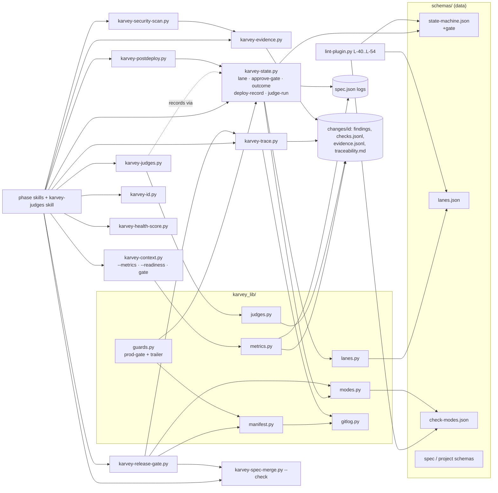
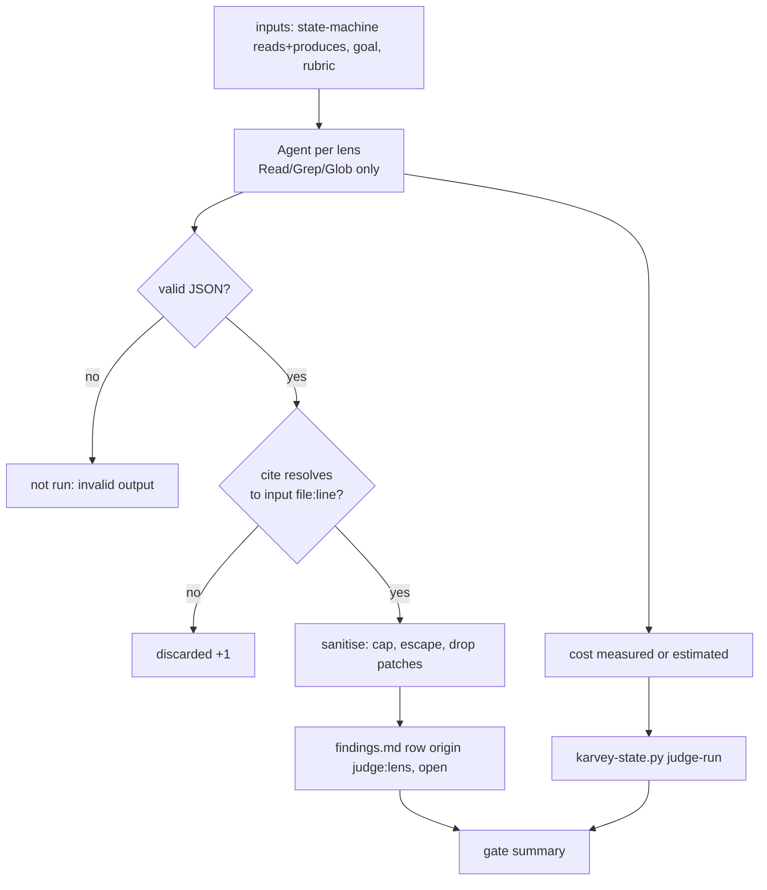

# Architecture: wave2-structural

> PHASE 5 (`karvey-architecture`, the skill as it is in this branch) · Security Tier **2** · Layers: Backend
> (the plugin's scripts, hooks and skill text), Infra (the existing CI workflow) · Target: `cli` · Lane:
> `standard` · Complexity: **extension** of the Wave 1 design, with two new capabilities (judges, metrics), so
> both the component and the data-flow diagrams are included (§4).
>
> Inputs read in this session: `prd.md`, `requirements.md` (REQ-W2-001..088, approved under D-21),
> `spec-delta.md`, `PLAN.md`, `spec.json`, `findings.md`, `docs/spec/decisions.md` (D-01..D-32; Wave 2's are
> D-22..D-27, D-29, D-30), `docs/spec/project.json`, the approved Wave 1 design
> `docs/spec/changes/wave1-hardening/architecture.md` (§1..§12), the project-upgrade design on its own branch
> (`feature/project-upgrade`: `architecture.md` §1.6, §1.8, §2.1, §2.2), and the real code listed in §1.1 with
> the line numbers this design builds on.

## Summary

Wave 1 put the method's state into one tool with schemas and guards. Wave 2 keeps that shape and adds data to
it, so that the process can be cheaper for small work and measured for all work. In short:

- A **lane table** (`schemas/lanes.json`) says, per lane and phase, mandatory / optional / skipped and how many
  human gates apply. The state tool computes `next` from it and records lane-skipped phases by itself.
- A **check-mode registry** (`schemas/check-modes.json`) is the one place where every new check declares its
  mode for 3.13 and for 4.0. Nothing new refuses by default in 3.13; 4.0 flips exactly D-24's three.
- `spec.json` gains four append-only logs owned by the state tool: `gate_outcomes[]`, `lane_history[]`,
  `deploys[]`, `judge_runs[]`. The **metrics view** (`karvey-context.py --metrics`) reads them, read-only
  and reproducible; the retro and the 4.0 readiness report are built on it.
- **Judges** are clean-context subagents with one rubric per judged phase. A helper script builds their closed
  input list and filters their output (a finding without a resolvable `file:line` is dropped). They write only
  `findings.md` rows; their cost goes to `judge_runs[]` through the state tool; they never approve.
- **Merged gates** (`project.json:gates`) record three human answers as per-phase approvals through one new
  state-tool command. Every phase skill closes with one question instead of "approve" + "shall we advance".
- **Release per change:** a `Karvey-Change` trailer on every commit, a **release manifest** computed from the
  trailers, and one **release gate** script that returns the deploy pre-check verdict. The prod gate shows the
  manifest verdict in 3.13 and applies it in 4.0.
- Deterministic helpers replace model judgement where a script can decide: IDs, health score, evidence
  capture, the requirement → test trace, security-tool runs and the post-deploy verdict.

No new hook event is added: the optional trailer guard is one more guard in the existing `pre-bash` dispatch.
There is no cloud: infra is skipped, and CI stays the existing `.github/workflows/lint.yml`, with new unit
suites and table cases.

## Engineering-standards conformance gate (Step 4B)

**Not evaluated.** `docs/spec/project.json` declares no `standards` block and `docs/spec/standards/` does not
exist (checked: `ls docs/spec` → `agent backlog.md changes decisions.md incidents-index.md project.json
reviews specs`). As in Wave 1 (its §"Engineering-standards conformance gate"), "not evaluated" is not
conformance. Every non-trivial pattern choice is therefore listed in §10. Under D-21 they are taken by the
architect with the recommended option, for the owner to confirm at the *how* gate. No `deviations.md` is
created, because there is no standard to deviate from.

---

## 1. Components and boundaries

### 1.0 System boundary

**This spec owns:**
- New data: `plugins/karvey/schemas/{lanes,check-modes}.json`; new fields in `spec.schema.json`,
  `project.schema.json` and `state-machine.json`.
- New library modules: `plugins/karvey/scripts/karvey_lib/{lanes,modes,metrics,manifest,gitlog,judges}.py` and
  `karvey_lib/security_tools.json`.
- New scripts: `plugins/karvey/scripts/karvey-{release-gate,id,health-score,evidence,trace,judges,
  security-scan,postdeploy}.py`.
- Extensions to `karvey-state.py`, `karvey-context.py`, `karvey-spec-merge.py`, `lint-plugin.py`,
  `karvey_lib/guards.py` and `karvey_lib/karvey_hooks.py` (registry only).
- New skill `skills/karvey-judges/`. New rules `rules/{lanes,gates,judges}.md` and `rules/judges/{requirements,
  architecture,qa}.md`. The skill and rule text changes in §8.
- Tests under `plugins/karvey/tests/` (§6) and this change's dogfooding artifacts (§7.1).
- The **upgrade-step declarations** for the project-upgrade catalogue (§7.4). Only the declarations: the engine
  belongs to that change.

**This spec does NOT touch:**
- The project-upgrade engine, its catalogue schema or its checks L-37..L-39. They live on their own branch;
  Wave 2 only adds rows to the catalogue once that change is merged (§7.4).
- The owner's personal global instructions. REQ-W2-020 delivers a diff file inside the change folder, and the
  owner applies it (D-01, D-11, D-25).
- `CHANGELOG.md`, `docs/spec/decisions.md`, `docs/spec/backlog.md` and `docs/spec/agent/*` in this phase (they
  change in impl/deploy, under their own rules).
- The approval marker, the release ledger and the prod-gate's fail-closed core (Wave 1 §3.3, §3.2). Wave 2 adds
  inputs to the prod gate; it does not relax any of them.
- The iterate router, the Iron Law, "production approval never delegated or automatic", the prod gate on by
  default (D-02), EARS, and every item of the panel's §5 "do not change".
- Wave 3 (R-15, R-19, R-24..R-30). The manifest produced here is what Wave 3's per-change report (D-31) reads.

**Changes that require revalidating this design:**
- The project-upgrade catalogue shape changes before it merges (§7.4 would be re-expressed).
- Claude Code exposes subagent token usage in the tool result. Judge cost would then be `measured`, not
  `estimated` (§1.7); the fields stay the same.
- The owner decides judges blocking by default, or a 4.0 default beyond D-24's three (§7.3).
- A team standards repo is declared (`project.json:standards`). The conformance gate would then run.

### 1.1 Wave 1 code this design builds on (verified in this branch)

| What | Where (file:line) | Wave 2 use |
|---|---|---|
| Phase graph as data; `deploying.approval = "deploy"`, `skippable` only on mockup / design_graphic / infra | `schemas/state-machine.json` (phases, `edges`, `preconditions`) | lane-aware next; `deploying.approval → null` (REQ-W2-051) |
| `skipped` keys limited to 3 phases; `lane` is "data only in Wave 1" | `schemas/spec.schema.json:34-51` | extended for lane skips (§2.1) |
| Decision refs `^[DC]-\d+$` | `schemas/spec.schema.json:146-158` | `@repo` suffix (REQ-W2-074) |
| `is_skipped`, `next_phase_of`, `compute_next` | `scripts/karvey-state.py:744`, `:749`, `:771` | lane table consulted first |
| `cmd_generated`, `cmd_skip` (refuses non-skippable phases) | `karvey-state.py:1078`, `:1098` | `generated_at`; `imported`; lane skip path |
| `PROD_REF`, `ROLES = ("human","ceo-delegate")` | `karvey-state.py:1171-1172` | `+auto`, never for prod |
| `cmd_approve`: prod needs a prod-kind marker, the other phases warn without one | `karvey-state.py:1291-1340` | outcome log; gate approve; judge blocking; import refusal |
| `transact` (lock + CAS write) | `karvey-state.py:927` | every new write |
| Guard registry | `karvey_lib/karvey_hooks.py:191` | `+trailer` guard |
| `released_change`, `_evaluate_candidate`, `prod_gate` | `karvey_lib/guards.py:897`, `:932`, `:1026` | manifest verdict and per-change approvals |
| Safe values (`check_branch`, `check_enum`, `check_common`) | `karvey_lib/safe_values.py:98-210` | scanner, probe and id arguments |
| Ledger `record_prod` / `record_release` | `karvey_lib/approval.py:520`, `:525` | attested deploy; per-manifest prod record |
| Dashboard sections, calibration | `scripts/karvey-context.py:51`, `:677` | `+metrics`, `+readiness`, `+gate` |
| Spec merge (idempotent on identical text) | `scripts/karvey-spec-merge.py:275`, `:430` | `+--check` |
| Linter registry L-01..L-36 (`@check`) | `scripts/lint-plugin.py:253…1811` | Wave 2 checks start at **L-40** (L-37..L-39 are reserved by project-upgrade) |
| Local merge + push into integration | `skills/karvey-deploy/SKILL.md:80-86`, `rules/deploy-workflow.md:46` | replaced by a PR (REQ-W2-048) |
| Evidence in shared files | `skills/karvey-test/SKILL.md:38,103,167,190`, `skills/karvey-deploy/SKILL.md:32` | moved under `changes/{id}/` |
| 13 "Shall we advance" closings | `grep -rln 'Shall we advance' skills` = 13 files (e.g. `karvey-architecture/SKILL.md:309`) | one gate question |
| `type: ops` / hotfix lane in prose | `rules/multi-agent.md:84-95` | become rows of the lane table |
| Retro counts commits per author | `skills/karvey-retro/SKILL.md:25,55` | optional only (REQ-W2-009) |

**Shared conventions** are Wave 1's §1.1 table, unchanged. That means stdlib Python ≥ 3.9 plus bash 3.2, the
exit codes `0/1/2/3/4/5`, the `--json` envelope, atomic CAS writes under a lock, ISO 8601 times with a zone,
and argv lists only (`test_no_shell_true.py` already enforces the last). Every new script follows them, and
the new unit suites import them rather than copying them.

### 1.2 Plugin tree after this change (new ★, modified ✎)

```
plugins/karvey/
├── schemas/
│   ├── lanes.json                  ★ C-01 lane table (REQ-W2-011..019)
│   ├── check-modes.json            ★ C-04 mode registry (REQ-W2-083..085)
│   ├── state-machine.json          ✎ deploying.approval → null; "gate" per phase; lane precondition text
│   ├── spec.schema.json            ✎ lane enum, logs, role auto, generated_at, imported, D-NN@repo, skipped keys
│   └── project.schema.json         ✎ gates, judges, lanes, checks, branch_flow.mode, enforcement.trailer_guard, tests
├── scripts/
│   ├── karvey-state.py             ✎ C-02 lane, gate, outcome, deploy-record, judge-run, attested deployed, --fix
│   ├── karvey-context.py           ✎ C-05 --metrics, --readiness, --section gate; lane column; deployed-not-archived
│   ├── karvey-spec-merge.py        ✎ C-13 --check (merged | unmerged | conflict)
│   ├── lint-plugin.py              ✎ C-20 L-40..L-54
│   ├── karvey-release-gate.py      ★ C-09 manifest + verdict (REQ-W2-045..047, 050, 069)
│   ├── karvey-id.py                ★ C-16 next BUG|D|BL|F|Q (REQ-W2-070, 071)
│   ├── karvey-health-score.py      ★ C-17 (REQ-W2-072)
│   ├── karvey-evidence.py          ★ C-18 (REQ-W2-073)
│   ├── karvey-trace.py             ★ C-14 traceability.md + coverage gate (REQ-W2-058..062)
│   ├── karvey-judges.py            ★ C-07 inputs / collect (REQ-W2-023, 025..027, 029, 030)
│   ├── karvey-security-scan.py     ★ C-15 (REQ-W2-064..067)
│   ├── karvey-postdeploy.py        ★ C-19 (REQ-W2-075..078)
│   └── karvey_lib/
│       ├── lanes.py                ★ lane table, patch criteria, diff measure
│       ├── modes.py                ★ mode resolution + checks.jsonl hit records
│       ├── metrics.py              ★ pure metric functions over parsed artifacts
│       ├── manifest.py             ★ trailer parse, commit → change mapping
│       ├── gitlog.py               ★ read-only git queries (argv allow-list)
│       ├── judges.py               ★ input builder, citation resolver, output sanitiser
│       ├── security_tools.json     ★ fixed command templates per category
│       ├── guards.py               ✎ C-10 trailer guard; C-11 manifest in the prod gate
│       ├── karvey_hooks.py         ✎ REGISTRY += trailer
│       └── defaults.json           ✎ judges.lenses_per_lane, judge_price_table, deployed_stall_days, id lock
├── skills/
│   ├── karvey-judges/SKILL.md      ★ C-07
│   ├── karvey/rules/{lanes,gates,judges}.md        ★ C-01, C-08, C-07 (lanes.md renders lanes.json)
│   ├── karvey/rules/judges/{requirements,architecture,qa}.md  ★ rubrics
│   └── (text changes, §8)           ✎ C-22
└── tests/ (§6)                      ★/✎ C-21
```

### 1.3 C-01 — Lanes: `schemas/lanes.json`, `karvey_lib/lanes.py`, `rules/lanes.md`

**Satisfies:** REQ-W2-011, 012, 013, 014, 015, 017, 018, 019, 021, 031 (the per-lane judge counts live here).

Shape (one row per lane; `m` mandatory, `o` optional, `s` skipped by the lane):

| lane | requirements | mockup | design_graphic | architecture | infra | tasks | impl | test | qa | deploying/deployed | human gates (merged) | judges per judged phase |
|---|---|---|---|---|---|---|---|---|---|---|---|---|
| `patch` | s | s | s | s | s | s | m (test-first) | m (regression) | m (`qa-lite`) | m | 1 (prod) | 0 |
| `standard` | m | s | s | m | o | m | m | m | m | m | 3 | 2 |
| `feature-ui` | m | m | m | m | o | m | m | m | m | m | 3 | 3 |
| `ops` | m (lite) | s | s | s | m | m | m | m (verification) | o | m | 2 (*what+how*, release) | 2 |
| `hotfix` | s | s | s | s | s | s | m (no tasks approval) | m (regression) | o (`qa-lite`) | m | 1 (prod) | 0 |
| `docs` | o | s | s | s | s | o | m | o | m (`qa-lite`) | m | 1 (release) | 0 |

- `o` means the phase runs when the change needs it; `skip` with a reason is still accepted, exactly as today.
  `s` is recorded automatically as `skipped[phase] = "lane:{lane}"` when the state tool passes the phase
  (REQ-W2-015).
- The `patch` and `hotfix` rows also carry `requires: ["bug_id", "finding", "regression_test"]`. `patch` has
  `criteria: {max_code_files: 3, forbid: ["schema", "api_contract", "permissions"], max_tier: 2}` (D-29).
  `code_globs`, `schema_globs`, `api_globs` and `permission_globs` have neutral defaults in the table (for
  example `**/migrations/**`, `**/*.sql`, `**/openapi*.{yml,yaml,json}`, `**/*.proto`,
  `**/*permission*`), and `project.json:lanes.globs` can extend them.
- `lanes.py`:
  - `load()` validates the table with `schema_lite`, plus two semantic checks: every lane lists every
    approvable phase, and `init` is never skipped.
  - `phase_rule(lane, phase)`.
  - `admit_patch(answers)` checks the init answers of REQ-W2-012 (`touches_ui`, `schema`, `api_contract`,
    `permissions_or_trust`, `tier`, `code_files`; any unknown → `standard`).
  - `measure_diff(root, base, head)` computes the same criteria from `gitlog.diff_names(base, head)` and
    returns every exceeded criterion (REQ-W2-017).
  - `lane_of(data)` returns `(lane, source)`. A missing `lane` falls back to `spec.json:type` (`ops`/`hotfix`),
    and then to `legacy`, which means the 3.12 pipeline: every phase mandatory unless recorded as skipped
    (REQ-W2-019).
- `rules/lanes.md` holds the human text: the criteria, how to raise a lane, and why lowering one needs the
  human. Its table is rendered from `lanes.json` between generated markers, with the same pattern and the same
  lint as `rules/state-machine.md`. The `ops` and hotfix prose in `rules/multi-agent.md:84-95` becomes a
  pointer to it.

### 1.4 C-02 — State tool extensions (`karvey-state.py`)

**Satisfies:** REQ-W2-001, 002, 015, 016, 018, 019, 028 (refusal half), 030 (write half), 036, 040, 042, 047
(record half), 051, 053, 074, 080 (refusal half), 087.

The state tool stays the only writer of `spec.json`'s state fields (Wave 1 L-06). The new data are appended
through `transact` and never rewritten.

| Command | Does | Refuses (exit 3) when |
|---|---|---|
| `next` (✎) | Reads the lane first. A lane-`s` phase counts as skipped for preconditions and is written as `skipped: lane:{lane}` when `advance` passes it. `blockers` are de-duplicated in order (REQ-W2-074). A missing lane gives one warning (3.13) or an error under `schema_mode: strict` (4.0). | — |
| `advance` (✎) | As Wave 1, plus the lane auto-skip. `hotfix`: impl may start without `tasks.approved` and deploy without a QA document, but only when `bug_id` and `regression_test` are recorded (`lane-evidence`, below) (REQ-W2-018). `deployed --attested --ref D-NN --pipeline-run URL`: when the clone has no ledger, the history entry gets `evidence: {attested: true, ref, pipeline_run}` (REQ-W2-053). | As Wave 1. `--attested` without both `--ref D-NN` and an `https://` pipeline URL (the message names both accepted evidences). `--attested` while a ledger exists (the measured path must be used). |
| `lane <change> set\|raise\|lower <lane>` | `set` only at `init`, from `lanes.admit_patch` answers (`--answers file.json`). `raise` (only when every phase keeps at least its mode in the new lane — REQ-W2-016 revision 1) appends `lane_history[{from, to, at, reason, by}]`; phases the new lane requires that were lane-skipped become pending (their `skipped` entry is removed, only when its reason starts with `lane:`). `lower` appends the same, with `ref`. | Unknown lane (lists valid ones). `set patch` whose answers fail D-29 (the message names the criterion, e.g. `patch: schema change — use standard`). `lower` without `--by`, `--role human`, `--ref` and a valid human approval marker (the same `approval.find_valid` path `approve` uses) (REQ-W2-016). |
| `lane-evidence <change> --bug BUG-NN --finding F-NN --regression-test PATH::NAME` | Records `lane_evidence{}` for `patch` / `hotfix`. The release gate and QA-lite read it. | Missing field; lane is not `patch` / `hotfix`. |
| `generated` (✎) | Also writes `generated_at` the first time (never overwritten). `--imported` writes `imported: true` (REQ-W2-080). | As Wave 1. |
| `approve` (✎) | Appends `gate_outcomes[{outcome: "approved", phases:[…], by, role, ref, at, kind: "gate"}]` (REQ-W2-001). `--role auto` is accepted for non-prod phases and recorded as-is (REQ-W2-040). Judge mode `blocking` (C-04): refuses while `findings.md` has an `open` row with origin `judge:*`, phase = this phase and severity Critical/High (REQ-W2-028). An `imported: true` phase needs a valid human marker even in 3.13; otherwise it refuses (REQ-W2-080). | `prod` with `--role auto` (`production approval is never automatic`). Missing by/role/ref (unchanged). |
| `approve-gate <change> what\|how\|release` | Resolves the gate's phases from `state-machine.json` `gate` minus lane-skipped / skipped phases. Every covered phase must be `generated` (otherwise it refuses and names the missing artifact, REQ-W2-036). It writes one approval record per phase (same by/role/ref/date/evidence) and **one** `gate_outcomes` entry listing them. `release` records `qa`; `prod` is recorded only through the Wave 1 prod path, which requires the prod-kind marker (D-10 words). Without that marker, `release` records `qa` and says that prod is still pending (open point 2 of the requirements). | A covered phase not generated; `--role auto` on `release` when prod would be written. |
| `outcome <change> <phase\|gate> changes_requested --by --role --ref [--reason]` | Appends `gate_outcomes[{outcome: "changes_requested", …, reason}]`. An empty reason is recorded as `"no reason given"` (REQ-W2-042). `--kind plan-exception` records a plan-rule question, which is not a gate (REQ-W2-038). The phase is not changed. | Missing `--role` or `--ref` (REQ-W2-001 error: `spec.json` byte-identical). |
| `deploy-record <change> --env E --version V --verification pass\|regression\|not-evaluated [--rollback TEXT] [--evidence PATH]` | Appends `deploys[{env, version, at, verification, rollback, evidence}]` (REQ-W2-002). | Missing env/version/verification; unknown verification value. |
| `judge-run <change> <phase> --from FILE` | Appends to `judge_runs[]` the per-judge records produced by `karvey-judges.py collect` (lens, model, intra_model, verdict, counts, tokens_in/out, usd, estimated, discarded). This is the only `spec.json` write of the judge flow (§1.7). | Record without `model` or `intra_model` (REQ-W2-029 error); non-numeric cost. |
| `validate --fix` (✎) | Proposes `lane` from the recorded state (REQ-W2-087): `type: ops` → `ops`; `type: hotfix` → `hotfix`; mockup and design_graphic skipped → `standard`; otherwise `feature-ui`. The proposal is in the **proposed tier** (`--accept-proposed`, Wave 1 §2.5), because it is inferred. It moves `approvals.deploy` into `deploys[]` only when it holds data (`date`/`by`), and drops it when it is empty (REQ-W2-051). It never creates or flips an approval. The diff comes first, and a second run is a no-op. | Unchanged. |

`compute_next` changes in one place. `next_phase_of` asks `lanes.phase_rule(lane, pid)` before `is_skipped`, so
a lane-`s` phase is passed through. `gate_phases_before` treats lane-`s` as `skipped`. A `feature-ui` change
therefore still refuses `architecture` without a mockup approval (REQ-W2-015 error). A `standard` change passes
mockup and design_graphic, and `spec.json:skipped` shows `lane:standard` for them.

**`skip` (✎):** the manual `skip` keeps refusing a phase that is not `skippable`. A lane skip bypasses that list
only for the phases the change's own lane marks `s`, which keeps the Wave 1 protection for everything else.

### 1.5 C-04 — Check-mode registry (`schemas/check-modes.json`, `karvey_lib/modes.py`)

**Satisfies:** REQ-W2-083, 084, 085, 010 (hit records), 044/046/062/017 (their mode).

One file lists every check Wave 2 introduces:

| check id | what refuses when blocking | 3.13 default | 4.0 default | decision |
|---|---|---|---|---|
| `schema.strict` | `lane`, `phase_history`, `skipped` required; legacy shapes are errors | warn | **blocking** | D-24 |
| `gates.merged` | (a default, not a refusal) three gates instead of seven | granular | **merged** | D-22, D-24 |
| `release.manifest` | unmapped commit or change without QA in the manifest | warn | **blocking** | D-24, D-26 |
| `lane.diff` | diff exceeds the lane's criteria | warn | warn | — |
| `coverage.requirements` | requirement without a green test or a `manual` exception | warn | warn | — |
| `trailer.guard` | commit on an active change's feature branch without a trailer | off (opt-in) | off | D-26 |
| `judges.mode` | open Critical/High judge finding at approve | advisory | advisory | D-23 |
| `security.tools` | a category "not evaluated" | advisory | advisory | — |
| `postdeploy.contract` | deploy without a contract | advisory | advisory | — |

- `modes.resolve(root, check_id)` returns the project override (`project.json:checks.{id}`), else the default for
  the plugin's major version. A project may always pick a stricter mode. A laxer mode than the 4.0 default is
  accepted with a warning that names the check.
- `modes.record_hit(root, change, check_id, detail, finding=None)` appends one line to
  `changes/{id}/checks.jsonl`: `{check, at, mode, would_refuse: true, detail, finding}`. The scripts that run at
  gate time call it (release gate, QA's lane check, trace coverage). Guards never write into the working tree:
  the trailer guard's hits are caught later as "unmapped" by the manifest. The file is committed with the change
  and gives the readiness report its data (REQ-W2-010).
- REQ-W2-084 is made structural: **no row defaults to `blocking` in 3.13**. The three new refusals that do exist
  in 3.13 are listed in §7.3, and each one only refuses an operation that did not exist in 3.12.0 (lowering a
  lane, approving an imported phase without a marker, `--role auto` on prod).

### 1.6 C-05 — Metrics, readiness and gate summary (`karvey_lib/metrics.py`, `karvey-context.py`)

**Satisfies:** REQ-W2-003, 004, 005, 006 (the snapshot it prints), 010, 021, 027 (display), 037, 040 (auto
apart), 056 (dashboard half).

`karvey-context.py --metrics [--from YYYY-MM-DD --to YYYY-MM-DD] [--as-of YYYY-MM-DD] [--lane L] [--json]`
- **Read-only.** It inherits Wave 1's REQ-W1-072 contract: files are opened read-only, and a new unit test
  asserts that `git status --porcelain` is empty after a run (REQ-W2-005 error).
- **Reproducible.** The period and `--as-of` are explicit inputs. The JSON carries no wall-clock value and no
  absolute path, its keys are sorted, and its floats are rounded to two decimals. The same repo and the same
  arguments give byte-identical output (AC-1). Without `--from/--to` the period is the 28 days before `--as-of`,
  and `--as-of` defaults to today. That default is only for humans; the baseline and the retro always pass all
  three arguments.
- **Sources** (all in the repo): `spec.json` (`created_at`, `phase_history`, `approvals.*.generated_at`,
  `gate_outcomes`, `deploys`, `judge_runs`, `lane`, `lane_history`, `revision_history`), `findings.md` (type,
  origin, phase, status, routing), `PLAN.md` / `tasks.md` (estimate and actual columns, which Wave 1's
  calibration parser already reads), `docs/bugs_dev_testing.md`, and `changes/*/checks.jsonl`.
- **Metrics** (per lane and in total). Each one is a pure function in `metrics.py` that returns
  `(value | None, reasons[])`:

  | Metric | Computation | "n/a" when |
  |---|---|---|
  | lead time | `created_at` → prod approval date | no prod date, or date without time |
  | cycle time per phase | `phase_history` `entered_at` → `exited_at` | no history / open entry |
  | approval wait per gate | `generated_at` → each `gate_outcomes.at` | no `generated_at` (every legacy change) |
  | throughput | archived changes / week in period | no archived change in period |
  | deploy frequency | `deploys[env=prod]` / week | no deploys |
  | change failure rate | prod deploys with `verification = regression` or a rollback / prod deploys | no prod deploy |
  | time to restore | regression deploy → next `pass` deploy of the same change | no regression |
  | spec-gap rate · ripple | spec-gap findings / change · `revision_history` entries / change | no `findings.md` |
  | gate rejection rate | `changes_requested` / all outcomes, per gate | no outcomes |
  | estimate accuracy | actual / estimate (Wave 1 calibration code, `karvey-context.py:677`) | no actual column |
  | judge acceptance · judge cost | routed / (routed + rejected) per lens · Σ `judge_runs.usd` per gate and change (`estimated` shown) | no judge rows |
  | automatic approvals | count of `role: auto`, shown apart from human ones | — |

- **Missing data.** It is never zero. A change with missing data is excluded from that metric only, and is listed
  as `n/a — {reason} ({change-id})` (REQ-W2-004). An empty period prints every metric as
  `n/a — no archived change in period`.
- `--readiness` (REQ-W2-010, 086) reports four things:
  - the number of **measured** changes: deployed or archived, with `lane`, a timed `phase_history` and at least
    one `gate_outcomes` entry;
  - per check of the registry, the `would_refuse` hits from `checks.jsonl`;
  - how many of those hits were **confirmed**, meaning their linked finding was routed as `bug` or `spec-gap`;
  - `schema.strict` hits computed on the fly with `validate --strict`, which is deterministic and needs no
    record.

  A check with no data prints `no data`. The last line is `ready for 4.0: N of 4 measured changes`.
- `--section gate --change X --gate what|how|release` is the one-page gate summary (REQ-W2-027, 037). It shows:
  - the phases covered and their generated artifacts;
  - the lane and the lane-skipped phases (`skipped (lane)`);
  - per judge its lens, verdict, counts by severity, model and `intra_model`; High/Critical findings in full;
    judges that disagree; `not run ({reason})`; `judges: none for lane patch`; `judges: disabled by project
    setting`;
  - for *how*: the decisions, risks and deviations taken from `architecture.md` headings (§10, §12) and
    `deviations.md`, the estimated cost from `tasks.md`, and the `[human]` tasks with their executor. A
    deviations file whose entries the summary does not show is reported as an omission;
  - uncovered requirements (from C-14) and a missing post-deploy contract or rollback (from C-19);
  - for *release*: the lane check, the coverage line, the security categories and the manifest verdict.

  It is built by the script, so it cannot silently omit a section. A section whose source is missing prints
  `missing: {path}`.
- **Dashboard (✎).** It adds a `lane` column; lane-skipped phases show as `skipped (lane)`, never as pending
  (REQ-W2-021). Auto approvals show as `auto`. A new line flags `deployed {n} d, not archived` past
  `defaults.json:deployed_stall_days` (7, requirements open point 10) (REQ-W2-056).

### 1.7 C-07 — Judges (`skills/karvey-judges`, `rules/judges*.md`, `karvey-judges.py`, `karvey_lib/judges.py`)

**Satisfies:** REQ-W2-022..033.

Flow (§4.3). A phase skill finishes its artifact, then calls `/karvey-judges {change} {phase}` before
presenting the gate:

1. `karvey-judges.py inputs <change> <phase> --json` resolves the settings: `project.json:judges` →
   `{enabled, phases, mode, lenses, per_lane, cross_model}`, with defaults from `defaults.json`. The lens count
   comes from the lane (`patch` 0, `standard` 2, `feature-ui` 3, override per lane ≥ 0; REQ-W2-031). The input
   list is **closed**. It contains:
   - the phase's `produces` and `reads` from `state-machine.json`, which for architecture means
     `requirements.md` and `architecture.md`;
   - `spec.json:goal`;
   - `rules/judges/{phase}.md` and the lens section of that rubric;
   - for `qa`, also the diff (`git diff {base}...HEAD`, written to a temp file) and `qa/REVISION_PR_*.md`.

   Nothing else is added. The skill passes each judge **only file paths** plus the rubric text, never the
   session's conversation (REQ-W2-023). If a caller adds an argument outside the list, the builder drops it and
   the output shows `dropped: {item} (not a phase input)`.
2. The skill starts one `Agent` subagent per lens, in parallel, with a fixed prompt template from
   `rules/judges.md`. The template has: role, rubric, the input paths, and the output contract (JSON:
   `{lens, verdict: pass|concerns|fail, findings:[{severity, type_guess, text, cite:"path:line"}]}`). It says
   "do not edit any file". The prompt allows only Read, Grep and Glob.
   - **Model:** when `cross_model: prefer` and the second-opinion adapter finds another model family's CLI on
     PATH (the same detection `karvey-second-opinion` uses), that lens runs through the adapter. Otherwise the
     subagent runs intra-model. Either way the run records `model` and `intra_model` (REQ-W2-029).
3. `karvey-judges.py collect <change> <phase> --results DIR --json` checks each result:
   - **Schema.** An unparsable result becomes `not run (invalid output)`.
   - **Citations.** Every `cite` must resolve to an existing file among the inputs and a line within its length.
     A finding that does not is discarded and counted (REQ-W2-025).
   - **Sanitising.** Text is capped at 300 characters. Control characters, `|` and newlines are escaped for a
     Markdown table cell. Any proposed patch or code block is stripped, and only the finding text is kept
     (REQ-W2-026 error).
   - **Cost.** It is measured when the runtime reports usage and otherwise estimated: characters in / out ÷ 4
     × `defaults.json:judge_price_table[model]`, marked `estimated: true` (REQ-W2-030). A `judges.budget` key
     is reported as `ignored (measure only, D-30)` and never used.

   It then appends the kept findings to `findings.md` as `open` rows with origin `judge:{lens}`, the phase, the
   type guess and the severity (the append-only writer in `judges.py`, under the same lock helper). The run
   records go to a temp file for step 4. **It never routes a finding, edits an artifact or writes a `spec.json`
   state field.**
4. `karvey-state.py judge-run <change> <phase> --from <tmp>` appends `judge_runs[]`. REQ-W2-026's "SHALL NOT
   change `spec.json`" is read as "a judge changes no phase, approval, skip or history". The cost log that
   REQ-W2-030 requires in `spec.json` is appended by the state tool, the owner of that file (§10 A-03).
5. The gate summary (C-05) reads `judge_runs[]` and `findings.md`.

- **The fiscal (REQ-W2-032)** is the `qa` lens `fiscal`, and it runs even when a project sets fewer lenses for
  `qa`. Its rubric has one question: "list every claim of the review without evidence (command output with an
  `evidence.jsonl` line, a CI run for the reviewed commit, or a `file:line`)". `karvey-qa` calls it before
  `approve qa` (or before the *release* gate).
- **Acceptance (REQ-W2-033).** `karvey-iterate` writes the `Routed to` cell for a judge row as
  `accepted:{bug|spec-gap|emergent} {ref}` or `rejected: {reason}`. `karvey-context.py --section convergence`
  already lists `open`/`routed` rows. It now also lists a `closed` judge row with neither form as
  `unresolved (no routing or reason)`.
- **Rubrics** (`rules/judges/{requirements,architecture,qa}.md`) each have a section per lens: requirements =
  domain, methods; architecture = security, methods, agents-cost; qa = fiscal, security (REQ-W2-024).
  `validate` reports a lens in `project.json:judges.lenses` that has no section as `unknown lens`.
- **Where judges run (REQ-W2-022).** Judges run at the phases in `judges.phases` (default `[requirements,
  architecture, qa]`). With judges disabled, the gate summary shows `judges: disabled by project setting`.
  Default `enabled: true`, `mode: advisory` (§10 A-06).

### 1.8 C-08 — Gates (`rules/gates.md`, `state-machine.json:gate`, skill closings)

**Satisfies:** REQ-W2-034, 035, 036 (via C-02), 037 (via C-05), 038, 039, 040 (skill text), 041, 042.

- `state-machine.json` gives each approvable phase a `gate`: `what` (requirements, mockup, design_graphic),
  `how` (architecture, infra, tasks), `release` (qa, prod).
- `project.json:gates: granular | merged`. It resolves through C-04 (`gates.merged`): 3.13 defaults to
  `granular`, 4.0 to `merged`. `--granular-gates` on any phase skill forces granular for that invocation. Any
  other value is refused by `validate` (REQ-W2-039).
- `rules/gates.md` holds the **one closing block** that every phase skill cites instead of its own ending
  (REQ-W2-035):
  - **Granular:** `generated` → judges (if the phase is judged) → one `AskUserQuestion` with *Approve and
    advance (recommended)* · *Approve and stop* · *Request changes*. The answer is recorded with `approve` or
    `outcome`. *Approve and advance* runs the skill that `next` names, with no second question.
  - **Merged:** a phase that does not close a gate records `generated` and continues to the next phase (no
    question, REQ-W2-038). The last generated phase of a gate runs its judges, prints `--section gate`, and asks
    the one question, which is recorded with `approve-gate` or `outcome`.
  - Plan-rule exceptions (an action outside the approved plan, a change to production data) ask on their own,
    are recorded with `outcome --kind plan-exception`, and are not counted as gates.
  - `-y` means: record with `--role auto` and continue. It is never used for `release` when prod would be
    recorded; the state tool refuses that (REQ-W2-040).
- The 13 "Shall we advance" closings (§1.1) are replaced by a pointer to that block. `rules/phase-close.md:45`
  keeps its ordering rule (tracker actions 1–4 before the gate question), rewritten to name the gate question.
- **Grill (REQ-W2-041).** `karvey-grill` asks in batches of at most four questions (the `AskUserQuestion`
  limit), each with its recommended option first. Before the stack branch it infers the stack from lockfiles,
  manifests and CI files, and asks one confirmation.
- **Request changes (REQ-W2-042).** The skill records the outcome with the reason, keeps the phase, and re-runs
  the phase skill that owns the requested artifact (for a merged gate, the earliest phase named in the reason,
  or else the gate's first phase).

### 1.9 C-09 — Release manifest and release gate (`karvey_lib/manifest.py`, `karvey-release-gate.py`)

**Satisfies:** REQ-W2-045, 046, 047 (PR body check), 050, 069, 014/018 (lane triplet items).

- **Trailer parsing (`manifest.py`).** It runs `git log --format=%H%x1f%s%x1f%(trailers:key=Karvey-Change,
  valueonly,separator=%x1e)%x1e {prod}..{head}` through `gitlog.py` (argv only). A trailer value must match
  the change-id pattern of `spec.schema.json:17-18`, `^[a-z0-9][a-z0-9-]{1,62}$`. Anything else, or several
  different values, means `unmapped` with the reason. A merge commit with no trailer of its own is mapped when
  all of its non-first-parent commits map to the same change. A commit that only touches
  `docs/spec/changes/{id}/**` maps to `{id}` (spec bookkeeping, recorded as `mapped_by: path`).
- **`karvey-release-gate.py manifest [--base origin/{production}] [--head HEAD] --json`** returns
  `{base, head, changes:[{id, version, lane, qa: approved|lane-skipped|missing, commits:[sha]}],
  unmapped:[{sha, subject, reason}], verdict: pass|warn|fail, mode}`. The version comes from the change's
  CHANGELOG `[Unreleased]` / release block, and the QA state from `spec.json`. The verdict is `pass` when there
  is no unmapped commit and every change is `approved` or `lane-skipped`. Otherwise it is `warn` in `warn` mode
  and `fail` in `blocking` mode (REQ-W2-046). A non-pass verdict records a `checks.jsonl` hit per change.
- **`karvey-release-gate.py check <change> [--pr-body FILE] --json`** is the deploy pre-check (REQ-W2-069). It
  returns items `{qa_gate, tests, changelog, version_match, lane_triplet, manifest, spec_merged, pr_body}`, each
  `pass | fail | not-applicable` with its detail:
  - `tests`: from C-14's coverage and the latest `evidence.jsonl` test run;
  - `version_match`: the same comparison as L-12;
  - `lane_triplet`: BUG-NN + finding + regression test for `patch` / `hotfix`;
  - `spec_merged`: from `karvey-spec-merge.py --check`;
  - `pr_body`: every manifest change-id and version is listed in the PR body file (REQ-W2-047 error).

  Exit 1 when an item fails in its current mode. The skill explains the JSON and does not recompute it.
- **`karvey-release-gate.py release-branch --json`** is read-only. It lists the commits of the approved changes,
  in order, that a `release/{version}` branch from production would cherry-pick (REQ-W2-050). The deploy skill
  runs the cherry-picks only after the human's OK. On a conflict it stops, prints the commit and runs
  `git cherry-pick --abort`; it never resolves a conflict itself.

### 1.10 C-10, C-11 — Trailer guard and the prod gate

**C-10 trailer guard (REQ-W2-044).** A new `Guard("trailer", ("pre-bash",), "open", False, enabled=
guards.trailer_enabled)` in `karvey_hooks.py:191`.
- **When it applies.** `enforcement.trailer_guard: off | warn | blocking` is read from the reviewed line, as for
  git-flow (Wave 1 §3.5). The command must be a `git commit` segment in a Karvey project, the branch must be
  `{feature_prefix}{id}`, and `{id}` must be an active change.
- **Message sources.** It takes the message from `-m`/`--message` values, `-F FILE` (read with a 64 KB cap), and
  `--trailer`. With none of them (an editor or `--no-edit`) it cannot see the message and stays silent.
- **Verdict.** A trailer equal to `{id}` is silent. Otherwise `warn` prints
  `[karvey] trailer WARNING: add "Karvey-Change: {id}"` and `blocking` exits 2 with the same text.
- **Fail mode.** It fails open: a check that cannot run never blocks a commit, and the manifest catches the
  unmapped commit later.

**C-11 prod gate (REQ-W2-046, 047).** `_evaluate_candidate` (`guards.py:932`) keeps its Wave 1 core: resolve
the change → `check_prod`, block when missing. After the Wave 1 allow decision it adds:
- It computes the manifest for `base..head`, within the same `NET_BUDGET_S` deadline.
- **`release.manifest = warn` (3.13):** a non-pass verdict adds `[karvey] prod-gate MANIFEST WARNING: unmapped=N
  without-qa=a,b`, and the push or merge is allowed. If the manifest cannot be computed, it adds `MANIFEST
  not evaluated ({reason})` and still allows, which keeps the 3.12 behaviour (REQ-W2-084).
- **`blocking` (4.0):** a non-pass verdict, or a manifest that cannot be computed, blocks. The message names the
  change or the commit. Every manifest change must also pass `check_prod`, so each one needs a human prod
  approval.
- **Recording (REQ-W2-047, REQ-W2-052 rev. 1, D-37).** `approve {id} prod --manifest --pr-body FILE --sha {head}`
  computes the manifest of `origin/{production}..{head}` and refuses when the PR body the human approved does not
  name exactly its changes. One OK covers them: the approving change's own prod marker, else the `_project`
  one — never another change's. Every record carries the Wave 1 binding (`head_sha`, `expires_at` = OK + 24 h,
  evidence with the prompt hash, D-34/D-35) plus `manifest: {changes, approved_with}`; the approving change's
  record is written first and the marker is consumed once, after all the writes (a failed consume is a warning,
  BUG-73). `check_prod` accepts a covered change's record only when its manifest lists the change, its evidence
  names the approving change's or the project marker with the hook's audit line, and the approving change's own
  record matches (same manifest, commit and marker). A reopen supersedes the reopened change's record
  (D-36); reopening the approving change also ends the coverage of every change it covered (fails closed). The
  approving change must be in the manifest (BUG-82), and the prod-gate computes the manifest at the released
  commit (BUG-83). Every other prod path — `approve prod` without `--manifest` and the merged release gate
  (`approve-gate release --sha`) — stays one OK per change (BUG-41, BUG-70).

### 1.11 C-12, C-13 — Deploy flow and spec merge timing

**Satisfies:** REQ-W2-045 (step), 048, 049, 050, 052, 054, 055, 056 (lint half), 076 (naming).

New order of `karvey-deploy` (text in §8). Steps marked ✎ are changed:

1. ✎ **2.1–2.3** unchanged, plus the trailer check through `manifest` on the feature branch.
2. ★ **2.4-bis Living spec on the change branch.** Run `karvey-spec-merge.py {id} --dry-run`, show it, then
   apply it and commit with the trailer (REQ-W2-054). On a conflict the tool exits 1, prints the diff, and
   deploy stops before any PR.
3. ✎ **2.5 Integration by PR** (env-branches mode only). Push the branch and open a PR to `{integration}` with
   the host CLI. That PR's CI is the DEV gate. The local `git merge` + `git push "$I"` lines
   (`karvey-deploy/SKILL.md:80-86`, `deploy-workflow.md:46`) are removed (REQ-W2-048).
4. ✎ **2.6 Post-deploy verification (DEV)**, via C-19. "canary" stays only where the platform splits traffic.
5. ★ **2.8-bis Release manifest + release gate.** Run `karvey-release-gate.py check {id} --pr-body …`, show the
   verdict, and offer `release-branch` when it is not `pass`.
6. ✎ **2.7 / 2.9** The PR body lists every manifest change-id and version. The prod OK text lives in the PR body
   or the PR approval (REQ-W2-052). The prod-gate allows the merge.
7. ✎ **2.10 Post-deploy verification (PROD)** → `deploy-record` (C-19).
8. The archive branch writes the D-NN into the decision log and `approve prod --write-spec` copies it into
   `approvals.prod` (Wave 1 order, now stated in `deploy-workflow.md`).

- **`branch_flow.mode` (REQ-W2-049).** It is `trunk | env-branches`. Without the key it is derived: trunk when
  integration equals production. `validate` reports `trunk` with integration ≠ production as a contradiction.
  `karvey-init --settings` recommends trunk.
- **`karvey-spec-merge.py --check`** is read-only. It prints `merged` when every ADDED/MODIFIED id is present
  with identical text and every REMOVED id is struck, `unmerged` with the missing ids, or `conflict`. Archive
  runs it first: `merged` means nothing is merged again (REQ-W2-055 success); `unmerged` on a legacy change is
  reported and merged on `chore/archive-{id}`.

### 1.12 C-14 — Test-first and trace (`karvey-trace.py`)

**Satisfies:** REQ-W2-057 (tasks text + check), 058, 059, 060, 061, 062, 063 (QA text + fiscal).

`karvey-trace.py <change> [--write] [--check] --json`:
- **Requirements.** IDs are parsed from `requirements.md` (`REQ-…-NNN` headings) and from `spec-delta.md`
  (ADDED/MODIFIED).
- **Tasks.** `tasks.md` rows cite requirements. The **test task** of each requirement must precede the
  implementation task in `depends_on`. A requirement with neither a test task nor a `manual: {reason}` line in
  `tasks.md` is `uncovered`; the *how* gate summary shows it (REQ-W2-057 error).
- **Commits.** They come from `git log --format=… --grep` on the change trailer (`gitlog.py`). A commit is
  linked to a requirement when its message cites the task id (`E1.F2.T3`) or the REQ id.
- **Tests.** Files are matched by the globs in `project.json:tests.globs` (default: `tests/**`, `**/test_*`,
  `**/*_test.*`, `**/*.test.*`, `**/*.spec.*`). Test names or tags must match `test_REQ_[A-Z0-9]+_\d{3}\w*` or
  `@req REQ-[A-Z0-9]+-\d{3}`. A test added by the change's commits with no reference is `unmapped test`
  (REQ-W2-058).
- **Last result.** It comes from JUnit XML files named in `evidence.jsonl` records (C-18), or else from the latest
  evidence line of a command that ran the test. With neither, the result is `not run`.
- `--write` renders `changes/{id}/traceability.md` (REQ-W2-060). A requirement without a commit shows
  `no commit`.
- `--check` is the coverage gate (REQ-W2-062). Every ADDED/MODIFIED requirement needs a green test or a `manual`
  exception. The mode comes from `coverage.requirements` (warn in 3.13), and a hit is recorded per uncovered
  requirement.
- `karvey-test` starts by reading `architecture.md` §"Test coverage plan" and ends by listing every row it did
  not execute as `planned, not executed` (REQ-W2-059). Its plan and evidence go to
  `changes/{id}/test_plan.md` and `changes/{id}/test_evidence.md` (REQ-W2-061). QA states "tests pass" only
  with an `evidence.jsonl` line or the CI run URL of the reviewed commit; otherwise it writes `not evaluated`
  (REQ-W2-063), and the fiscal checks this (C-07).

### 1.13 C-15 — Security tools (`karvey-security-scan.py`, `security_tools.json`)

**Satisfies:** REQ-W2-064, 065, 066, 067, 068 (infra text).

- **`security_tools.json`** is a fixed catalogue per category: secrets, sast, sca, iac. Each entry has `{id,
  detect: [binary], version_argv, run_argv_template, output: json|sarif, parser, applies_if_globs}`. The
  templates are argv lists whose only placeholders are `{repo}` and `{out}`. Examples, with public tool names:
  secrets = gitleaks / trufflehog; sast = semgrep / bandit; sca = osv-scanner / pip-audit / npm audit; iac =
  checkov / trivy config.
- **`karvey-security-scan.py run <change> [--categories …] --json`** does the following for each category:
  - **applies?** An `applies_if_globs` match on the repo (for example, no IaC files means `not applicable`,
    REQ-W2-065 success).
  - **tool?** The first available tool (`shutil.which`) is used. When none is found, the category is `not
    evaluated (no tool)` (REQ-W2-065 error).
  - **run** with a timeout of `defaults.json:security_tool_timeout_s`, an output cap of 5 MB, and the evidence
    wrapper (C-18). A non-zero exit that is not the tool's documented "findings found" code means `not evaluated
    (tool error)`, never `pass` (REQ-W2-064 error).
  - **result:** `{category, tool, version, argv, exit, findings_by_severity, report: qa/security-{category}.json}`.
- **Suppressions** live in `changes/{id}/qa/suppressions.json` as `[{tool, rule, path, reason, scope}]`. An entry
  without a reason or a scope is reported by `validate-suppressions` (REQ-W2-066). QA Dimension 1 cites each
  category's line and then reviews what the tools cannot see: authorisation per object, tenant isolation and
  business logic.
- **Safety (REQ-W2-067).** `{repo}` is `git rev-parse --show-toplevel` realpath-checked under the project root.
  No `project.json` value is placed in an argv. A project may *choose among* catalogue tools
  (`project.json:security.tools.{category}: [id]`, validated with `check_enum` against the catalogue ids), but
  it cannot supply a command. A value with shell metacharacters is refused by `safe_values.check_common`
  before use.
- **CI (REQ-W2-068).** `karvey-infra` writes a `security-scan` stage into `infra.md` with the same categories.
  The *how* summary lists a pipeline without that stage as a deviation.

### 1.14 C-16..C-18 — IDs, health score, evidence

**C-16 `karvey-id.py next BUG|D|BL|F|Q [--change ID] [--qualified] --json` (REQ-W2-070, 071).**
- **Lock.** It takes `O_EXCL` on `<git-common-dir>/karvey/ids.lock` (stale after `lock_stale_seconds`). If the
  lock cannot be taken, it exits 3 with the reason and prints no number.
- **Scan.** It reads the working tree sources, which are `docs/bugs_dev_testing.md`, `docs/spec/decisions.md` and
  `docs/spec/decisions/*.md`, `docs/spec/backlog.md`, `changes/*/findings.md` (F-NN is per change, so it scans
  only `--change`), and Q-NN wherever Wave 3 places them. It also reads every local and `refs/remotes/*` branch
  through `git grep -h -o -E '<KIND>-[0-9]+' <ref> -- <paths>` (read-only, no fetch).
- **Reserve.** It takes max + 1, above the reservations in `<git-common-dir>/karvey/ids.json`
  `{kind: [{n, at, change}]}`, records the new one, releases the lock and prints the number.
- `--qualified` prints `BUG-NN@{repo}`, where `{repo}` is the `project.json:repos[0]` slug checked by
  `safe_values`.
- **Residual risk.** Two *clones* that have not pushed can still collide. The remote scan narrows this; L-33
  (duplicate headings) goes from advisory to error for IDs created after this release, and the dashboard shows
  duplicates.
- L-45 forbids bounded Epic ranges (`E{1..99}`) in any skill (REQ-W2-071).

**C-17 `karvey-health-score.py --inputs FILE.json [--json]` (REQ-W2-072).**
- **Input.** One JSON with the sub-results the health skill collects: type errors, lint errors per KLOC, tests
  passed / failed, coverage %, dead-code items, and the tools present.
- **Sub-scores.** Each dimension is a named pure function (`score_types`, `score_lint`, `score_tests`,
  `score_coverage`, `score_deadcode`). The weights are in `defaults.json:health_weights`, and the weight of a
  missing tool is redistributed, as today's text says.
- **Time.** Time comes from `KARVEY_TZ`. An invalid zone prints `fallback zone: {system zone}` (REQ-W2-072
  error).
- The output is deterministic for the same input. The skill runs the tools, writes the input JSON, calls the
  script and relays the result.

**C-18 `karvey-evidence.py [--change ID] [--label TEXT] -- <cmd…>` (REQ-W2-073).**
- **Run.** It runs the argv as given, with no shell, streaming stdout and stderr through and keeping a rolling
  sha256 of each stream. It returns the command's own exit code.
- **Record.** It appends `{at, change, label, argv, cwd_rel, exit, duration_ms, stdout_sha256, stderr_sha256,
  bytes}` to `changes/{id}/evidence.jsonl`. **No output content is stored**, so the file cannot leak secrets.
  `--junit PATH` records a path that the trace tool may read.
- **Change.** It is resolved with `karvey-state.py active` when `--change` is not given. With no active change
  it still runs the command and prints `[karvey] evidence not recorded: no active change` to stderr (REQ-W2-073
  error).
- **Citations.** Phase-close claims cite `evidence.jsonl:{line}`.

### 1.15 C-19 — Post-deploy verification (`karvey-postdeploy.py`)

**Satisfies:** REQ-W2-075, 076, 077, 078, 002 (the record).

- **Contract (REQ-W2-075).** `karvey-infra` writes, per deployable service, a fenced block
  `karvey-postdeploy` (JSON) in `infra.md`:
  `{service, env, health:[url], routes:[{url, expect_status}], thresholds:{error_rate_pct, p95_ms_vs_baseline_pct,
  new_5xx}, window_min, metrics_source:{kind, how}, rollback:{command, doc}}`. A contract with no rollback
  command is listed in the *how* summary as incomplete.
- **`karvey-postdeploy.py probe <change> --env prod --json`** parses the block.
  - URLs must be `https://`, or `http://localhost` for dev.
  - It runs the `health` and `routes` probes with `urllib`, a 5 s timeout per request, no redirects to another
    host, samples spread over `window_min` (default 10), and records status and latency.
- **`karvey-postdeploy.py evaluate <change> --observed FILE --json`** compares the probe results plus the
  observed metrics with the thresholds. It returns `pass | regression | not-evaluated`, writes
  `changes/{id}/deploy_evidence.md` (a table per probe) and prints the `deploy-record` command.
  - **Observed metrics.** The observed file holds the numbers the deploy skill gathered from `metrics_source`:
    error rate, p95, new 5xx. Querying a platform's metrics API is platform-specific. The **skill** runs that
    query as a presented command under the plan gate, and the script only evaluates numbers, so no
    `infra.md` text is ever executed by a script (§3).
  - **No contract or no thresholds (REQ-W2-077).** The result is `not-evaluated`, with the recommendation "add
    a post-deploy contract to infra.md". It is never `pass`.
- **Regression (REQ-W2-078).** The deploy skill shows `rollback.command` and asks the human. Its execution
  passes through the plan gate like any production-affecting command. Then `deploy-record --rollback "…"`
  records it, and `karvey-id.py next BUG` opens the incident.

### 1.16 C-20 — Linter checks (L-40..L-54)

L-37..L-39 are reserved by project-upgrade (its §1.8), so Wave 2 starts at L-40. Each check is registered with
the REQs it proves, which `--list` verifies against `requirements.md` (Wave 1 L-registry contract; `--list`
accepts `REQ-W2-NNN` claims the same way project-upgrade generalises it for `REQ-UP`).

| Id | Check | REQ | Severity |
|---|---|---|---|
| L-40 | `lanes.json` validates. Every lane lists every approvable phase. `rules/lanes.md`'s generated table equals the rendering. `state-machine.json:gate` covers every approvable phase. | 011, 021, 034 | error |
| L-41 | No phase skill ends with a "Shall we advance" (or a translation) after an approval question. Every phase skill's close cites `rules/gates.md`. In merged mode a phase that does not close a gate carries no `AskUserQuestion` approval step. | 034, 035 | error |
| L-42 | Every `git commit` example in skill or rule text carries `Karvey-Change:` (a `--trailer` or a message line). | 043 | error |
| L-43 | No instruction of a local merge into `{integration}` followed by a push to it. | 048 | error |
| L-44 | Evidence and test-plan paths are under `changes/{id}/`. `docs/test_evidence.md` and `docs/test_plan.md` fail. | 061 | error |
| L-45 | No bounded Epic range (`E{1..99}`, `1..99`) in any skill. | 071 | error |
| L-46 | No text describes graphify or knowledge sync as required, mandatory or obligatory. `knowledge_sync` absent means no sync step. | 079 | error |
| L-47 | `check-modes.json`: every check has a 3.13 and a 4.0 mode; no 3.13 default is `blocking`; 4.0 differs from 3.13 only for `schema.strict`, `gates.merged`, `release.manifest`, unless the row has a `decision` ref. Every mode-reading call in scripts names a registered id. | 083, 085 | error |
| L-48 | In this repo: if `project.json` sets `gates`, `judges`, `lanes` or `checks`, a `docs/spec/retros/baseline-*.json` exists and is dated no later than the commit that first set them. | 006 | error |
| L-49 | A change in `deployed` (not archived) has `karvey-spec-merge.py --check` = `merged`. | 056 | error |
| L-50 | `rules/management-adapters.md`: every tool row has a `log_time` cell (an operation or `none`). The impl text uses `log_time`, and falls back to the actual columns when it is `none`. | 007 | error |
| L-51 | Every judged phase has `rules/judges/{phase}.md` with one section per default lens. The judge prompt template forbids edits and lists only Read/Grep/Glob. | 023, 024 | error |
| L-52 | `-y` in skill text is described as `role: auto` and never for prod. | 040 | error |
| L-53 | Deploy text order: spec merge (2.4-bis) and the release gate (2.8-bis) come before the production PR. The prod OK is in the PR body or approval at deploy and becomes a D-NN at archive. The step is named "post-deploy verification". | 045, 052, 054, 076 | error |
| L-54 | The hooks README's statusline failure-line sentence carries a `guard-case` anchor to a `statusline.json` case (an L-16 extension, kept separate so that it can be listed). | 082 | error |

The Wave 1 checks L-11 (skill counts, +`karvey-judges`), L-12, L-16 (new anchors), L-18 (the new fields) and
L-23 (knowledge-sync callers) are updated, not duplicated.

### 1.17 C-22 — Other skill and rule text

See §8 for the full list.
- **Retro (REQ-W2-008, 009).** `karvey-retro` reads `--metrics` and the findings, writes
  `docs/spec/retros/retro-{date}.md`, takes each agreed action's `BL-NN` from `karvey-id.py`, and asks for the
  owner when one is missing. It follows up the previous retro's actions by their BL status. The per-author view
  runs only with `--per-person`.
- **Import (REQ-W2-080).** `generated --imported` is recorded per imported artifact. Then the gate questions are
  asked in order (merged gates when enabled), and the change resumes at the first gate not approved.
- **Decisions (REQ-W2-081).** `{ops_repo}/docs/spec/decisions.md` is the only log that is written. The skill also
  reads `decisions/*.md` per-period files, shows a migration note once per session, and reports a D-NN present in
  both shapes as a duplicate. `karvey-id` scans both.
- **Tracker time (REQ-W2-007).** `management-adapters.md` gains a `log_time` column: the time entry, the worklog,
  the equivalent object, or `none` (Markdown and spreadsheet use the actual columns). `karvey-impl` logs through
  it.

---

## 2. Data model

### 2.1 `spec.schema.json` additions

All of them are optional in 3.13. `x-karvey-severity: warning` marks a legacy shape. Under `schema.strict` (4.0)
`lane`, `phase_history` and `skipped` are required.

```json
"lane": {"enum": ["patch", "standard", "feature-ui", "ops", "hotfix", "docs"]},
"lane_history": {"type": "array", "items": {"type": "object", "required": ["from", "to", "at", "reason"],
  "properties": {"from": {"type": "string"}, "to": {"type": "string"}, "at": {"type": "string", "x-karvey-format": "datetime-tz"},
                 "reason": {"type": "string", "minLength": 1}, "by": {"type": "string"}, "ref": {"type": "string"}}}},
"lane_evidence": {"type": "object", "properties": {"bug_id": {"type": "string", "pattern": "^BUG-\\d+(@[a-z0-9][a-z0-9._-]*)?$"},
  "finding": {"type": "string"}, "regression_test": {"type": "string"}}},
"gate_outcomes": {"type": "array", "items": {"type": "object", "required": ["outcome", "phases", "by", "role", "ref", "at"],
  "properties": {"outcome": {"enum": ["approved", "changes_requested"]}, "kind": {"enum": ["gate", "plan-exception"]},
                 "gate": {"enum": ["what", "how", "release", "phase"]}, "phases": {"type": "array", "items": {"type": "string"}},
                 "by": {"type": "string"}, "role": {"$ref": "#/$defs/role"}, "ref": {"type": "string", "minLength": 1},
                 "at": {"type": "string", "x-karvey-format": "datetime-tz"}, "reason": {"type": "string"}}}},
"deploys": {"type": "array", "items": {"type": "object", "required": ["env", "version", "at", "verification"],
  "properties": {"env": {"type": "string", "minLength": 1}, "version": {"type": "string"}, "at": {"type": "string", "x-karvey-format": "datetime-tz"},
                 "verification": {"enum": ["pass", "regression", "not-evaluated"]}, "rollback": {"type": ["string", "null"]},
                 "evidence": {"type": "string"}}}},
"judge_runs": {"type": "array", "items": {"type": "object", "required": ["phase", "lens", "model", "intra_model", "verdict", "at"],
  "properties": {"phase": {"type": "string"}, "lens": {"type": "string"}, "model": {"type": "string", "minLength": 1},
                 "intra_model": {"type": "boolean"}, "verdict": {"enum": ["pass", "concerns", "fail", "not-run"]},
                 "findings": {"type": "object"}, "discarded": {"type": "integer", "minimum": 0},
                 "tokens_in": {"type": "integer", "minimum": 0}, "tokens_out": {"type": "integer", "minimum": 0},
                 "usd": {"type": "number", "minimum": 0}, "estimated": {"type": "boolean"}, "at": {"type": "string"}}}}
```

- `$defs.role` becomes `["human", "ceo-delegate", "auto"]`. The semantic check keeps `approvals.prod.role =
  human`. `$defs.approval` gains `generated_at` (datetime-tz) and `imported` (boolean).
- `skipped.propertyNames` becomes every approvable phase. The semantic check (§2.3 of Wave 1) allows a
  non-`skippable` phase in `skipped` only with a `lane:{lane}` reason that matches `spec.json:lane`.
- `decisions` items become `^[DC]-\d+(@[a-z0-9][a-z0-9._-]*)?$` (REQ-W2-074).
- `approvals.deploy` becomes a legacy key (warning `state.legacy_deploy_approval`, fixed by `--fix`).
- The `phase_history` entry `evidence` gains `attested` (boolean), `pipeline_run` and `ref`.

### 2.2 `project.schema.json` additions

```json
"gates": {"enum": ["granular", "merged"]},
"judges": {"type": "object", "properties": {
  "enabled": {"type": "boolean"}, "mode": {"enum": ["advisory", "blocking"]},
  "phases": {"type": "array", "items": {"enum": ["requirements", "mockup", "design_graphic", "architecture", "infra", "tasks", "qa"]}},
  "lenses": {"type": "object"}, "per_lane": {"type": "object", "additionalProperties": {"type": "integer", "minimum": 0}},
  "cross_model": {"enum": ["prefer", "never"]},
  "budget": {"x-karvey-severity": "warning", "x-karvey-note": "ignored: measure only (D-30)"}}},
"lanes": {"type": "object", "properties": {"globs": {"type": "object"}}},
"checks": {"type": "object", "additionalProperties": {"enum": ["off", "advisory", "warn", "blocking"]}},
"branch_flow.mode": {"enum": ["trunk", "env-branches"]},
"enforcement.trailer_guard": {"enum": ["off", "warn", "blocking"]},
"tests": {"type": "object", "properties": {"globs": {"type": "array", "items": {"type": "string", "pattern": "^[A-Za-z0-9_./*{},-]{1,200}$"}}}},
"security": {"type": "object", "properties": {"tools": {"type": "object"}}}
```

`knowledge_sync` keeps its enum. Absent means `none` (D-27), and the schema gets `x-karvey-default: "none"`.

### 2.3 Change-folder files (all committed, all append-only or generated)

| File | Writer | Reader |
|---|---|---|
| `checks.jsonl` | `modes.record_hit` (release gate, QA lane check, trace `--check`) | `--readiness` |
| `evidence.jsonl` | `karvey-evidence.py` | trace, release gate, fiscal, QA |
| `traceability.md` | `karvey-trace.py --write` | QA, archive, gate summary |
| `judges/{phase}-{n}.json` | judge subagents (raw output, kept for audit) | `karvey-judges.py collect` |
| `qa/security-{category}.json`, `qa/suppressions.json` | scan tool; QA | QA D1, release gate |
| `test_plan.md`, `test_evidence.md`, `deploy_evidence.md` | test / deploy skills, `karvey-postdeploy.py` | QA, release gate |
| `global-instructions.diff` | this change (REQ-W2-020) | the owner |

Machine-local, never committed: `<git-common-dir>/karvey/ids.{lock,json}` (C-16), next to Wave 1's approvals
and ledger. Protect-paths already covers `<git-common-dir>/karvey/`, so the agent cannot forge a reservation
through Bash either.

---

## 3. Security per tier (Tier 2) and trust boundaries

Tier 2 means controls on every boundary where file content or tool output could become a command or an
approval. Wave 1's controls (§3.1–§3.9 there) all remain. Wave 2 adds the following:

| # | Control | Component | REQ |
|---|---|---|---|
| S-1 | **No judge or tool output is an approval.** `approve`/`approve-gate` read only the human marker. Judge rows are read only for the opt-in *refusal* in blocking mode, which can only make approval stricter. | C-02, C-07 | 028, PRD §9 |
| S-2 | **Judges get closed inputs.** Paths are taken from `state-machine.json`, the prompt is a fixed template and the allowed tools are Read/Grep/Glob. Output is schema-checked, citation-checked, capped and escaped before it reaches `findings.md`, and patches are dropped. A judge's output is untrusted text: it may carry an injected instruction, and nothing downstream executes it. | C-07 | 023, 025, 026 |
| S-3 | **Security tools use fixed argv templates.** The project chooses a catalogue id and never supplies a command. `{repo}` is realpath-confined. There is a timeout and an output cap, and every value passes through `safe_values` (REQ-W1-093). | C-15 | 067 |
| S-4 | **Trailers are parsed strictly** with the change-id pattern. A malformed trailer is `unmapped`, never guessed. Only git's own trailer parser is used, through argv. | C-09 | 045 |
| S-5 | **The manifest check fails closed once blocking.** In `warn` mode the 3.12 behaviour is kept: allow plus a warning, and "not evaluated" when it cannot be computed. In `blocking` mode a verdict that is not pass, or a manifest that cannot be computed, blocks. The mode is read from the **reviewed line** (`origin/{production}`), like `prod_gate_hook`, so a working-copy edit cannot turn it off. | C-11 | 046, PRD §9 |
| S-6 | **The post-deploy contract is never executed by a script.** Probes are HTTP GETs to `https://` URLs, with no cross-host redirect and a timeout. Metric queries and the rollback are commands the agent presents, and they go through the plan gate and the human. | C-19 | 076, 078 |
| S-7 | **Evidence stores hashes, not output**, so secrets printed by a command never reach the repo. | C-18 | 073 |
| S-8 | **ID reservations are machine-local and protected** (protect-paths). The remote scan is `git grep` over refs, read-only and without fetch. | C-16 | 070 |
| S-9 | **Lowering a lane needs the human marker.** Raising is free, because it only adds phases. | C-02 | 016 |
| S-10 | **`role: auto` never reaches prod.** The Wave 1 refusal of a non-human prod role is kept, with a dedicated message. | C-02 | 040 |
| S-11 | **Imported phases need the human marker**, even in 3.13. | C-02 | 080 |
| S-12 | **Nothing writes outside the repository.** The global-instructions change is a diff file, and protect-paths plus the plan gate cover the owner's configuration. | C-23 | 020 |

**Trust boundaries**

| Boundary | What crosses | Untrusted side | Validated at | Control |
|---|---|---|---|---|
| judge subagent → collector | JSON verdicts | model output | `karvey-judges.py collect` | S-2 |
| commit message → manifest | trailers | any committer | `manifest.py` | S-4 |
| `project.json` → scanners, trace globs, id repo slug | values | working copy (agent-editable) | `safe_values`, `check_enum`, glob pattern | S-3 |
| `infra.md` contract → probes | URLs, thresholds | repo text | `karvey-postdeploy.py` parse | S-6 |
| tool output → QA review | JSON/SARIF | third-party tools | parser + size cap | S-3 |
| remote refs → id tool | file contents | other branches | read-only `git grep` | S-8 |
| PR body → release gate | text | PR author | exact change-id / version compare | C-09 |

**STRIDE (new surface only).**
- **Spoofing:** a forged `Karvey-Change` trailer can map a commit to an approved change. This is mitigated
  because the manifest lists the commits per change in the PR body the human approves, and in 4.0 each change
  must also be QA-approved.
- **Tampering:** an agent could close a judge row to pass the blocking mode. Blocking is opt-in, the closure
  must carry `accepted:`/`rejected:` (C-07), and the metrics count rejections per lens.
- **Repudiation:** outcomes, lane changes and deploys are append-only, with `by`/`role`/`ref`.
- **Information disclosure:** evidence stores hashes only, and judge text is capped.
- **Denial of service:** judge runs are uncapped by design (D-30); cost is visible per gate. Scanner timeouts
  apply.
- **Elevation:** lane lowering and imported approvals require the marker.

**Security control points.**

| Point | Tier | Control |
|---|---|---|
| Gate approval | 2 | human marker (Wave 1), with judges advisory by default |
| Prod merge | 2 | `check_prod`, plus the manifest (warn → blocking) |
| Scanner run | 2 | fixed templates, confined path |
| Judge output entry | 2 | citation + sanitiser |
| Logs | 2 | audit log unchanged; `evidence.jsonl` without content; no tokens or PII in `checks.jsonl` |

---

## 4. Diagrams

### 4.1 Components



### 4.2 Data flow: a `standard` change with merged gates

```mermaid
sequenceDiagram
  participant H as Human
  participant P as Phase skills
  participant J as Judges (subagents)
  participant S as karvey-state.py
  participant C as karvey-context.py
  participant R as karvey-release-gate.py
  participant G as prod-gate hook
  P->>S: init; lane set standard (answers)
  P->>S: generated requirements (generated_at)
  Note over S: advance → mockup/design auto-skipped (lane:standard)
  P->>J: requirements rubric, closed inputs
  J-->>P: JSON verdicts -. untrusted .-> P
  P->>S: judge-run (cost, model)
  P->>C: --section gate what
  P->>H: one question (what)
  H-->>S: approve-gate what (marker from the human's message)
  P->>S: architecture, tasks generated (no question between)
  P->>J: architecture rubric
  P->>H: one question (how) + one-page summary
  H-->>S: approve-gate how
  P->>P: impl (trailer on every commit), test (evidence.jsonl, traceability.md)
  P->>J: qa fiscal + security
  P->>R: check (qa, tests, changelog, manifest, spec merged)
  P->>H: one question (release) with manifest
  H-->>S: approve-gate release (qa) + prod words → approve prod --manifest (ledger)
  P->>G: gh pr merge
  G->>S: check_prod (each manifest change)
  G->>R: manifest verdict (warn 3.13 / block 4.0)
  G-->>P: ALLOW
  P->>S: deploy-record prod (post-deploy verification)
```

### 4.3 Judge collection



---

## 5. Edge cases

| Edge case | How it is handled | Component |
|---|---|---|
| `spec.json` without `lane` | Legacy pipeline, one warning (3.13) or error under strict; `--fix` proposes one | C-01, C-02 |
| Unknown lane value | `validate` names it and lists the six | C-02 |
| `patch` requested with an unknown answer | Records `standard` and says which answer was unknown | C-01 |
| `patch` diff grows past 3 files at QA | `lane.diff` hit, a finding with a raise proposal, and a warn line on the prod gate | C-01, C-09 |
| Raising a lane reopens a lane-skipped phase that has artifacts | Only `lane:` skips are removed; manual skips stay; the phase becomes pending | C-02 |
| Merged gate with a covered phase not generated | `approve-gate` refuses and names the missing artifact | C-02 |
| Release gate answered without prod words | `qa` recorded, prod stays pending, and the summary says so | C-02, C-08 |
| Two judges disagree | Both verdicts shown, with "disagreement: lens A pass / lens B fail" | C-05 |
| Judge subagent times out or errors | `not run ({reason})`; the gate is still presented | C-07 |
| A judge cites a line past EOF | Discarded and counted | C-07 |
| A judge output contains Markdown or table-breaking text | Escaped and capped | C-07 |
| No other model family available | Intra-model run, recorded `intra_model: true` | C-07 |
| Runtime exposes no token usage | `estimated: true` from character counts | C-07 |
| `judges.budget` set | Reported as ignored (D-30) | C-07 |
| Commit without trailer (guard off) | Listed as `unmapped` in the manifest | C-09 |
| Merge commit, or a squash that dropped trailers | A merge maps through its parents; a squash without a trailer is unmapped, and the PR template reminds the author to keep the trailer | C-09 |
| Manifest cannot be computed (shallow clone, no `origin/{prod}`) | warn → "not evaluated"; blocking → block with the reason | C-11 |
| Cherry-pick conflict on `release/*` | Abort, report the commit, never resolve | C-09 |
| Two sessions ask for a BUG id at the same time | The `O_EXCL` lock serialises; the loser waits up to 5 s, then exits 3 | C-16 |
| Two clones, unpushed | Possible duplicate; remote scan + L-33 + dashboard (residual, §12) | C-16 |
| Evidence wrapper with no active change | Runs, does not record, says why | C-18 |
| Evidence of a command with huge output | Streamed; only the hash kept | C-18 |
| Security tool missing | `not evaluated (no tool)`, counted by the dashboard | C-15 |
| Security tool crashes | `not evaluated (tool error)` | C-15 |
| Suppression without reason | Reported by `validate-suppressions` | C-15 |
| No post-deploy contract | `not-evaluated`, never `pass` | C-19 |
| Probe host redirects elsewhere | Redirect not followed; probe fails; verification `regression` if a threshold is crossed, otherwise `not-evaluated` | C-19 |
| Metrics over a period with no archived change | Every metric prints `n/a — no archived change in period` | C-05 |
| Legacy approvals with date only | `n/a — approvals without time ({id})` for waits; the other metrics still aggregate | C-05 |
| Deployed change without the local ledger (another clone) | `advance deployed --attested --ref D-NN --pipeline-run URL` | C-02 |
| Spec merge conflict in the living spec | Tool exits 1 with the diff; deploy stops before the PR | C-13 |
| This change's own delta while Wave 1's delta is not merged | `--check` says `unmerged` naming the REQ-W1 ids; the Wave 1 merge must land first (spec-delta note) | C-13, §7.1 |
| A decision in both `decisions.md` and a per-period file | Reported as duplicate | C-22 |
| `-y` at the release gate with prod words absent | `qa` only; `role: auto` recorded; prod refused | C-02 |

---

## 6. Test coverage plan (contract for `karvey-test`)

Every new test is tagged `@req REQ-W2-NNN` (docstring tag) or named `test_REQ_W2_NNN_*`, and REQ-W2-058 applies
to this change's own tests. Suites run in the existing `lint.yml` jobs (`unittest discover` on `tests/unit` and
`tests/regression`, `run_tables.py`), so no workflow edit is needed beyond a job-duration check.

### 6.1 Unit suites (`plugins/karvey/tests/unit/`)

| Suite | Level | Covers (REQ-W2) |
|---|---|---|
| `test_lanes.py` | unit | 011, 012, 013, 017 (measure_diff on a temp git repo), 019, 031 (per-lane counts) |
| `test_state_lane.py` | unit | 015, 016 (raise/lower, marker needed), 018 (hotfix preconditions), 021 (`next` output), 087 (`--fix` lane inference, idempotent) |
| `test_state_outcomes.py` | unit | 001 (outcome append, refusal byte-identical), 040 (auto, prod refusal), 042 (no reason) |
| `test_state_gates.py` | unit | 034, 036 (approve-gate per phase, infra skipped, tasks missing), 039 (mode resolution), 080 (imported needs marker) |
| `test_state_deploys.py` | unit | 002, 051 (approvals.deploy legacy + fix), 053 (attested) |
| `test_state_judges.py` | unit | 028 (blocking refusal on open High), 029 (record without model refused), 030 (record written) |
| `test_schema_w2.py` | unit | 074 (`D-NN@repo`), `skipped` lane semantics, role enum, strict requirements (085) |
| `test_modes.py` | unit | 083, 084 (no 3.13 blocking), 085 (4.0 flips exactly three), hit records |
| `test_metrics.py` | unit | 003 (every metric on fixtures), 004 (n/a with reason), 005 (byte-identical twice; `git status` clean), 010 (readiness counts, `no data`) |
| `test_context_gate.py` | unit | 021, 027 (verdicts, disagreement, not run), 037 (summary sections, omission), 056 (deployed not archived) |
| `test_judges.py` | unit | 023 (closed inputs, dropped extras), 025 (citation discard), 026 (sanitiser, no patch), 030 (estimate, budget ignored), 032 (fiscal always present at qa), 033 (unresolved row in convergence) |
| `test_manifest.py` | unit | 043/045 (trailer mapping on a temp repo: mapped, unmapped, malformed, merge, path-only), 046 (verdict per mode), 088 (manifest of a trailer-only history) |
| `test_release_gate.py` | unit | 047 (PR body mismatch), 050 (release-branch plan), 069 (every item, exit codes), 014/018 (lane triplet) |
| `test_trace.py` | unit | 057, 058, 060 (no commit), 062 (coverage warn and hit) |
| `test_security_scan.py` | unit | 064 (stub tools on PATH: pass, findings, tool error), 065 (not evaluated / not applicable), 066 (suppression validation), 067 (metacharacter refusal, no project command) |
| `test_id_tool.py` | unit | 070 (two processes → different numbers; lock refusal), 071 (qualified id) |
| `test_health_score.py` | unit | 072 (identical twice, invalid TZ fallback line) |
| `test_evidence.py` | unit | 073 (line appended, exit code returned, no active change, no content stored) |
| `test_postdeploy.py` | unit | 075 (contract parse, missing rollback), 076 (pass / regression from local HTTP stub), 077 (not evaluated) |
| `test_spec_merge_check.py` | unit | 054, 055 (`--check` merged / unmerged / conflict) |
| `test_lint_plugin.py` (✎) | unit | each of L-40..L-54 with a failing mutation and a passing tree: 006, 007, 024, 035, 041 (grill batch text), 043, 048, 061, 071, 079, 082, 083, 085 |

### 6.2 Guard tables (`plugins/karvey/tests/hooks/tables/`)

| Table | New cases | REQ |
|---|---|---|
| `trailer.json` (new) | off → silent; warn + missing → warning line; blocking + missing → exit 2; present → silent; editor commit → silent; not an active change's branch → silent; `-F` file | 044 |
| `prod-gate.json` (✎) | manifest warn: allow + warning; blocking: block unmapped, block change without QA, block when not computable; warn + not computable → allow + "not evaluated"; multi-change manifest with every prod approval → allow | 046, 047 |
| `compat.json` (new) | the 3.12.0 fixtures (`tests/fixtures/legacy/*`) replayed with 3.13 defaults: every Wave 1 allow case still allows | 084 |
| `statusline.json` (✎) | failure-line case `sl-fail-*` | 082 |

### 6.3 Regression and integration

- `tests/regression/test_incidents.py` (✎) gets an index row per Wave 2 fix that closes a BUG-NN during impl.
- **Integration** (`test_wave2_flow.py`, unit runner on a temp repo): `init` → `lane set standard` → the
  requirements/architecture/tasks generated with merged gates (three `approve-gate` with a planted test marker)
  → trailer commits → `release-gate check` → manifest pass. It covers REQ-W2-034, 036, 045, 046, 069 end to end
  and AC-4, AC-5.
- **Integration** `test_patch_lane_flow.py`: a `patch` change with 2 files → one human gate (prod); the same
  change with a migration file → refused at `lane set` (AC-2).

### 6.4 Manual / E2E (`tests/manual/`, run headless under D-19)

| Script | REQ | Why manual |
|---|---|---|
| `judges-gate.md` | 022, 027, 029 | real subagents and the gate question |
| `merged-gates-three-questions.md` | 034, 035, 038 | count the questions a real session asks (AC-4) |
| `grill-batches.md` | 041 | interview behaviour |
| `retro-from-metrics.md` | 008, 009 | retro with a previous action |
| `import-through-gates.md` | 080 | real import |
| `deploy-postdeploy.md` | 076, 078 | probes against a local server, rollback question |
| `security-tools-present.md` | 064, 068 | with the real tools installed |

`manual` exceptions are listed in `traceability.md` with these reasons. Text-only REQs (020, 052, 059, 061, 063,
068, 081) are covered by lint checks or by the manual scripts above.

### 6.5 REQ → test coverage

Every REQ-W2-001..088 has at least one row above, or a lint check (§1.16) with a mutation test in
`test_lint_plugin.py`. The complete mapping is the matrix in §11. `karvey-trace.py --check` run on this change
(§7.1) is the machine check of this sentence.

---

## 7. Migration and rollout

### 7.1 This repo (dogfooding, REQ-W2-088)

1. **Trailer.** Every commit of this change carries `Karvey-Change: wave2-structural`, and that includes the
   commits already on the branch (`223fe52`, `5ea10b0`, checked).
2. **Order of implementation** (PLAN internal order): F1 metrics first. Then **take the baseline** with
   `karvey-context.py --metrics --from 2026-09-01 --to <day> --as-of <day> --json >
   docs/spec/retros/baseline-<day>.json`, commit it (L-48), and only then set this repo's `project.json`
   (`gates: merged` and `judges`). Next come lanes and judges, then gates and the manifest, then the rest.
3. `karvey-state.py validate --fix --dry-run --all` shows the lane proposals for this repo's own changes
   (`team-adapters`, `wave1-hardening`, the archived one). They are applied in this change's PR, because this
   repo is the method's own.
4. `branch_flow.mode: trunk` is written explicitly (integration = production = `main`).
5. **Living spec.** The Wave 1 delta must be merged first. Then `karvey-spec-merge.py wave2-structural` runs on
   this branch before the production PR (AC-6).
6. This change is the first `measured` change of the readiness report (§1.6).

### 7.2 The owner's global instructions (REQ-W2-020)

`changes/wave2-structural/global-instructions.diff` is a unified diff whose header names only the file's role
(`a/global-instructions`, `b/global-instructions`). It changes only the Karvey bullet about bugs and support
tickets, so that a small bug under D-29 goes through the `patch` lane (BUG-NN + finding + fix + regression test,
one prod gate). No other line appears in the hunk. The owner applies it. No step of this change writes outside
the repository.

### 7.3 3.13 → 4.0

- **3.13 (the Wave 2 advisory release).** Every row of `check-modes.json` is off, advisory, warn or granular. Only
  three operations refuse, and each one is new, so it cannot break a 3.12-valid flow (REQ-W2-084, `compat.json`
  proves the rest): `lane lower` without the human, `approve` of an `imported` phase without a marker, and
  `--role auto` on prod (prod already refused non-human roles in 3.12).
- **4.0.** The `check-modes.json` defaults flip for `schema.strict`, `gates.merged` and `release.manifest`, and
  for nothing else (L-47, REQ-W2-085). The release is proposed only when `--readiness` shows ≥ 4 measured
  changes; the proposal attaches that report and its approval is its own D-NN (REQ-W2-086). The deprecated Wave 1
  shims are removed in the same release (Wave 1 §1.3).

### 7.4 Project-upgrade steps each component will need (declarations only)

Project-upgrade's L-37 requires a release that changes the upgrade surface (schemas, rules, hooks, `guards.py`,
`karvey_hooks.py`, `defaults.json`) to declare its upgrade. The rows below go into `upgrade-steps.json` in the
Wave 2 release, in its catalogue shape (`id`, `since`, `check`, `fix`, `dry_run`, `human`, `risk`). `since` is
the Wave 2 release number, which is fixed at release (§10 A-01). If project-upgrade has not merged when Wave 2
releases, the same rows are written as a manual "Upgrade" list in the CHANGELOG release block, and they become
catalogue rows in the first release that has both.

| Step id | Component | check (reads, read-only) | fix (edits) | dry_run | human | risk |
|---|---|---|---|---|---|---|
| `lane-infer` | C-01/C-02 | non-archived `spec.json` without `lane` (via `state.fix_spec` proposed tier) | write the proposed `lane` (from `type` or skips) | yes | no | medium |
| `approvals-deploy-retire` | C-02 | `approvals.deploy` present in any `spec.json` | move to `deploys[]` when it holds data, else remove | yes | no | low |
| `branch-flow-mode` | C-12 | `branch_flow` without `mode` | set `trunk` when integration = production, else `env-branches` | yes | no | low |
| `knowledge-sync-declare` | C-22 | `graphify-out/` or `docs/spec/.graph-pending` exists and `knowledge_sync` absent | set `knowledge_sync: graphify` (keeps today's behaviour; absent now means `none`) | yes | no | low |
| `judges-budget-ignored` | C-07 | `project.json:judges.budget` present | remove the key (D-30) | yes | no | low |
| `evidence-into-changes` | C-14 | `docs/test_evidence.md` / `docs/test_plan.md` with per-change sections | none: shows the per-change split as a diff for the human | — | yes | low |
| `checks-overrides-known` | C-04 | `project.json:checks` keys not in `check-modes.json` | none (`report_only`) | — | no | low |
| `global-patch-lane` | C-23 | extends project-upgrade's `global-config` `params.recommend` with the `patch`-lane bullet | none (human diff, as `global-config`) | — | yes | low |
| **4.0 only:** `strict-schema-ready` | C-03 | changes that fail `validate --strict` (lane, phase_history, skipped) | runs `lane-infer` first; the rest reported | yes | no | medium |
| **4.0 only:** `manifest-unmapped` | C-09 | commits on integration not in production without a trailer | none (`report_only`: list them before the first blocking release) | — | no | low |

Not needing a step, with the reason for the release block's "No project upgrade needed" line where it applies:
- decision-ref pattern: it only loosens the schema;
- new scripts and the judges skill: they are plugin-side;
- the trailer guard: it is opt-in and off by default;
- `defaults.json` additions: there is no project copy;
- `hooks.json`: it is unchanged.

Upgrade-surface globs: `karvey_lib/{lanes,modes}.py` are proposed for addition, because they define project-facing
rules.

---

## 8. Skill and rule text changes

| File | Change | REQ |
|---|---|---|
| `skills/karvey-init/SKILL.md` | Objective lane questions → `lane set`; trunk recommended in `--settings`; remove the Epic range | 012, 049, 071 |
| 13 phase skills (§1.1 list) | Close = pointer to `rules/gates.md`; `-y` = `role: auto` | 035, 040 |
| `rules/phase-close.md` | Actions 1–4 before *the gate question* | 035 |
| `skills/karvey-requirements`, `-architecture`, `-qa` | Run `/karvey-judges` before the gate | 022 |
| `skills/karvey-grill/SKILL.md` | Batches ≤ 4, inferred stack confirmed | 041 |
| `skills/karvey-impl/SKILL.md` | Trailer on every commit; test task before impl; `log_time` | 043, 057, 007 |
| `skills/karvey-tasks/SKILL.md` | A test task per requirement preceding its impl task, or `manual: reason` | 057 |
| `skills/karvey-test/SKILL.md` | Read the coverage plan; evidence under `changes/{id}/`; `karvey-evidence`; `karvey-trace --write` | 059, 060, 061, 073 |
| `skills/karvey-qa/SKILL.md` | D1 runs `karvey-security-scan`; lane check; coverage; run or cite CI; fiscal before `approve qa` | 017, 062, 063, 064..066, 032 |
| `skills/karvey-deploy/SKILL.md`, `rules/deploy-workflow.md` | New order (§1.11); integration PR; manifest; release gate; post-deploy verification; prod OK order; attested fallback | 045..054, 069, 076..078 |
| `skills/karvey-archive/SKILL.md` | `--check` first; move and close only; knowledge sync only when declared | 055, 079 |
| `skills/karvey-infra/SKILL.md` | Post-deploy contract block; `security-scan` CI stage | 068, 075 |
| `skills/karvey-iterate/SKILL.md` | `accepted:` / `rejected:` for judge rows | 033 |
| `skills/karvey-retro/SKILL.md` | Metrics-based; retro file; BL-NN actions via `karvey-id`; per-person optional | 008, 009 |
| `skills/karvey-health/SKILL.md` | Call `karvey-health-score.py` | 072 |
| `skills/karvey-import/SKILL.md` | `generated --imported`; ask per gate in order | 080 |
| `skills/karvey-decisions/SKILL.md` | One log; read per-period files; duplicates | 081 |
| `skills/karvey-context/SKILL.md` | `--metrics`, `--readiness`, gate section | 003, 010 |
| every skill that mints an ID | `karvey-id.py next` | 070 |
| `rules/knowledge-sync.md`, `README.md` | Optional; `none` default | 079 |
| `rules/management-adapters.md` | `log_time` column | 007 |
| `rules/multi-agent.md` §6–§7 | Point to `rules/lanes.md` | 011, 018 |
| `rules/verification.md` | Cite `evidence.jsonl` lines for closing claims | 073 |
| `hooks/README.md` | Trailer guard section with `guard-case` anchors; statusline failure-line anchor | 044, 082 |
| new `rules/lanes.md`, `rules/gates.md`, `rules/judges.md`, `rules/judges/*.md`, `skills/karvey-judges/SKILL.md` | — | 011, 024, 034 |

All new text is organisation-neutral (PRD §9). Examples use `{change-id}`, `example.org` URLs, and public tool
names only.

## 9. Observability strategy

- **Structured records per change.** `gate_outcomes`, `deploys`, `judge_runs` and `lane_history` in `spec.json`,
  plus `checks.jsonl` and `evidence.jsonl`. Everything is in the repo, so the metrics are reproducible and
  reviewable in a PR.
- **Metrics tracked.** The §1.6 list, per lane: lead time, cycle time, approval wait, rejection rate, CFR, time
  to restore, judge cost and acceptance.
- **Guard decisions.** The trailer guard and the manifest part of the prod gate go to the Wave 1 audit log
  (`audit.py`) with `guard`, `decision`, `change`, `reason`.
- **Recommended alerts** (dashboard lines, no push): `deployed N d, not archived`; security categories `not
  evaluated`; open High judge findings at a gate; `unmapped` commits on integration; WIP and stalls as in Wave 1.
- **Traceability.** Every record carries `change` and `at`; hook records keep Wave 1's session id.

## 10. Architectural decisions

| Decision | Alternative considered | Why this one |
|---|---|---|
| Lanes and check modes as JSON data read by the tool and rendered into rules | Lane logic in skill prose | The same pattern as `state-machine.json`: one source, linted, testable (REQ-W2-011, 083) |
| New logs appended by the state tool | A separate file per log | Keeps "one writer of `spec.json`" (Wave 1 L-06) and the lock/CAS contract |
| Metrics read-only, explicit period + `--as-of`, no wall clock in JSON | Snapshot writing mode | Byte-identical output (AC-1) without giving the view a write path |
| Judges as `Agent` subagents + a deterministic collector | A judge script calling model APIs | No API keys needed (D-23: never client keys); the collector gives the determinism |
| Trailer guard in the existing `pre-bash` dispatch | A git `commit-msg` hook installed in the repo | No project file to install; the manifest catches editor commits |
| Post-deploy: the script evaluates, the agent queries | The script runs `metrics_source` commands | No repo text is ever executed by a script (S-6) |
| Evidence stores hashes only | Store output tails | No secret can land in the repo (S-7) |
| New lint ids from L-40 | Reuse L-37.. | L-37..L-39 are reserved by project-upgrade |

### 10.1 Decisions taken by the architect (D-21: the recommended default, for the owner to confirm at the *how* gate)

- **A-01 Version number.** "3.13" in this design names the Wave 2 advisory release (D-24). Project-upgrade was
  planned for "the release right after 3.12.0" (D-20) and also uses `since: 3.13.0`. If it ships first, Wave 2
  takes the next minor, and every "3.13" here reads as that number. `karvey-deploy` fixes it at release.
  *Recommended because* D-24 decides the semantics (advisory → blocking at a major), not the digit.
- **A-02 Judges are enabled by default in advisory mode** for `standard` and `feature-ui` (0 for `patch`). The
  alternative was opt-in. *Recommended because* O-4 and AC-3 require verdicts at every `standard` change, and
  advisory never refuses (REQ-W2-084). Cost is visible per gate (D-30).
- **A-03 The judge cost log is written to `spec.json` by the state tool.** REQ-W2-026 "the judges skill SHALL
  NOT change `spec.json`" is read as "a judge changes no phase, approval, skip or history". REQ-W2-030 requires
  the cost in `spec.json`, and the state tool is its only writer.
- **A-04 Release gate without prod words records `qa` only** (requirements open point 2), and prod stays pending
  until the D-10 words arrive.
- **A-05 `imported`, `lane lower` and `auto` on prod refuse even in 3.13.** They are new operations, so REQ-W2-084
  holds.
- **A-06 Measured change** = deployed or archived, with `lane`, a timed `phase_history` and ≥ 1 `gate_outcomes`
  entry. No back-fill of earlier approvals. This change becomes measurable once its *release* gate is recorded
  by the new tool.
- **A-07 `checks.jsonl` hits are written by gate-time scripts only**, never by hooks, so hooks never dirty the
  working tree.
- **A-08 The ID tool reserves clone-locally** and scans remote refs without fetching. A cross-clone collision
  stays a residual risk, surfaced by L-33 and the dashboard.
- **A-09 The trailer guard is `off` by default** (`warn` or `blocking` by opt-in). The manifest is the
  always-on signal.
- **A-10 Security tool catalogue:** public open-source tools per category, fixed argv templates, first
  available wins. A project may narrow the choice but never add a command.
- **A-11 `global-instructions.diff`** shows only the one bullet it changes, under a neutral header, so the
  public repo carries no personal path or organisation text.
- **A-12 A commit that only touches `changes/{id}/**`** maps to `{id}` in the manifest (spec bookkeeping), and
  is labelled `mapped_by: path`.
- **A-13 The `ops` lane** requires infra and tasks and skips architecture, as `rules/multi-agent.md:92` already
  describes. Its human gates are 2: *what + how* together, and *release*.

## 11. REQ coverage matrix

| REQ-W2 | Component(s) | Test / check |
|---|---|---|
| 001 | C-02 | test_state_outcomes |
| 002 | C-02, C-19 | test_state_deploys, test_postdeploy |
| 003 | C-05 | test_metrics |
| 004 | C-05 | test_metrics |
| 005 | C-05 | test_metrics (twice, clean tree) |
| 006 | C-05, C-23, L-48 | test_lint_plugin (L-48), §7.1 |
| 007 | C-22, L-50 | test_lint_plugin (L-50) |
| 008 | C-22 retro | manual retro-from-metrics |
| 009 | C-22 retro | manual retro-from-metrics |
| 010 | C-04, C-05 | test_metrics (readiness) |
| 011 | C-01, L-40 | test_lanes, test_lint_plugin |
| 012 | C-01, C-02, init text | test_lanes |
| 013 | C-01 | test_lanes, test_patch_lane_flow |
| 014 | C-01, C-09 | test_release_gate (triplet), test_patch_lane_flow |
| 015 | C-02 | test_state_lane |
| 016 | C-02 | test_state_lane |
| 017 | C-01, QA text | test_lanes (measure_diff) |
| 018 | C-01, C-02 | test_state_lane, test_release_gate |
| 019 | C-01, C-02 | test_lanes, test_schema_w2 |
| 020 | C-23 | file present + protect-paths table (existing) |
| 021 | C-05 | test_context_gate |
| 022 | C-07, C-08 | manual judges-gate |
| 023 | C-07, L-51 | test_judges |
| 024 | C-07, L-51 | test_lint_plugin (L-51), test_schema_w2 (unknown lens) |
| 025 | C-07 | test_judges |
| 026 | C-07 | test_judges |
| 027 | C-05 | test_context_gate |
| 028 | C-02 | test_state_judges |
| 029 | C-07, C-02 | test_state_judges, manual judges-gate |
| 030 | C-07, C-02 | test_judges, test_state_judges |
| 031 | C-01, C-07 | test_lanes |
| 032 | C-07, QA text | test_judges |
| 033 | C-07, iterate text | test_judges (convergence) |
| 034 | C-08, C-02, L-41 | test_state_gates, test_wave2_flow, manual merged-gates |
| 035 | C-08, L-41 | test_lint_plugin (L-41), manual merged-gates |
| 036 | C-02 | test_state_gates |
| 037 | C-05 | test_context_gate |
| 038 | C-08 | manual merged-gates |
| 039 | C-04, C-08 | test_state_gates, test_modes |
| 040 | C-02, L-52 | test_state_outcomes, test_lint_plugin |
| 041 | C-08 grill text | manual grill-batches |
| 042 | C-02, C-08 | test_state_outcomes |
| 043 | C-09, L-42 | test_manifest, test_lint_plugin |
| 044 | C-10 | trailer.json table |
| 045 | C-09, L-53 | test_manifest, test_wave2_flow |
| 046 | C-09, C-11 | test_manifest, prod-gate.json |
| 047 | C-09, C-11 | test_release_gate, prod-gate.json |
| 048 | C-12, L-43 | test_lint_plugin (L-43) |
| 049 | C-12, schema | test_schema_w2 (mode contradiction) |
| 050 | C-09 | test_release_gate |
| 051 | C-02 | test_state_deploys |
| 052 | C-12, L-53 | test_lint_plugin (L-53) |
| 053 | C-02 | test_state_deploys |
| 054 | C-13, L-53 | test_spec_merge_check, test_lint_plugin |
| 055 | C-13, archive text | test_spec_merge_check |
| 056 | C-05, L-49 | test_context_gate, test_lint_plugin |
| 057 | C-14, tasks text | test_trace |
| 058 | C-14 | test_trace |
| 059 | C-14, test text | manual (test phase run on this change) |
| 060 | C-14 | test_trace |
| 061 | C-14, L-44 | test_lint_plugin (L-44) |
| 062 | C-14, C-04 | test_trace |
| 063 | C-14, C-07 | test_judges (fiscal), QA text |
| 064 | C-15 | test_security_scan, manual security-tools-present |
| 065 | C-15 | test_security_scan |
| 066 | C-15 | test_security_scan |
| 067 | C-15 | test_security_scan |
| 068 | C-15, infra text | manual security-tools-present |
| 069 | C-09 | test_release_gate |
| 070 | C-16 | test_id_tool |
| 071 | C-16, L-45 | test_id_tool, test_lint_plugin |
| 072 | C-17 | test_health_score |
| 073 | C-18 | test_evidence |
| 074 | C-02, schema | test_schema_w2 |
| 075 | C-19 | test_postdeploy |
| 076 | C-19, L-53 | test_postdeploy, manual deploy-postdeploy |
| 077 | C-19 | test_postdeploy |
| 078 | C-19, deploy text | manual deploy-postdeploy |
| 079 | C-22, L-46 | test_lint_plugin (L-46) |
| 080 | C-02, import text | test_state_gates, manual import-through-gates |
| 081 | C-22 decisions, C-16 | test_id_tool (both shapes), manual |
| 082 | C-21, L-54 | statusline.json, test_lint_plugin |
| 083 | C-04, L-47 | test_modes, test_lint_plugin |
| 084 | C-04, C-11 | compat.json, test_modes |
| 085 | C-04, L-47 | test_modes |
| 086 | C-05, §7.3 | test_metrics (readiness line) |
| 087 | C-02 | test_state_lane |
| 088 | C-09, C-23, §7.1 | test_manifest, this change's own manifest at deploy |

All 88 are covered; none is left without a component and a verifier.

## 12. Risks, open questions and cloud infrastructure

### Risks and mitigations

| Risk | Likelihood | Impact | Mitigation |
|---|---|---|---|
| Judge cost grows with no cap (D-30) | Medium | Medium | Cost shown per gate and per change; lens count per lane; `patch` has none |
| Judges add noise and the human stops reading | Medium | Medium | Citation filter; acceptance rate per lens in the metrics; the retro decides lens changes |
| Squash merges drop trailers | Medium | Medium | Manifest lists them as unmapped; path-only mapping for spec bookkeeping; deploy text says "keep the trailer on squash" |
| Merged gates hide a bad phase between gates | Low | High | Judges at the requirements / architecture gates; *Request changes* sends the change back to the owning phase |
| Clone-local ID reservation collides across clones | Low | Low | Remote scan; L-33 as an error for new IDs; dashboard |
| Blocking judge mode bypassed by closing rows | Low | Medium | Opt-in only; `accepted:`/`rejected:` required; rejections counted |
| This design is large for one release | High | Medium | Internal order F1 → F2+F3 → F4+F5 → rest; each feature ships behind its mode; the tasks phase splits the work into independently testable tasks |
| Wave 1 delta not merged before this change's production PR | Medium | Medium | `--check` names the REQ-W1 ids; deploy stops before the PR (C-13) |
| Project-upgrade catalogue shape changes before merge | Low | Low | §7.4 is declarations; re-expressed at tasks time |

### Open questions for the owner

None is blocking: the architect's defaults are in §10.1 (D-21). The owner may change A-01, A-02 or A-09 at the
*how* gate.

### Cloud infrastructure

**Cloud provider(s):** none (`project.json:cloud.provider = none`, `iac_tool = none`). CI is the existing
GitHub Actions workflow `.github/workflows/lint.yml` (Wave 1 §1.11). The new unit suites and tables are picked
up by its existing `unittest discover` and `run_tables.py` steps, with no new job, secret or permission.
Deployment trigger: the method's own trunk flow (feature → PR → `main`), never manual. The infra phase is
skipped with the reason "no cloud; CI is the existing workflow".

## Revision history

| Date | Rev | Change |
|---|---|---|
| 2026-09-25 | 0 | First draft for the *how* gate (architecture + infra skipped + tasks) |
| 2026-09-26 | 1 | Merge of wave1-hardening (D-34..D-36 on the manifest and release-gate prod paths) and D-37 (F-61): §1.10 C-11 recording — one bound OK per release manifest, consumed once; every other prod path one OK per change |
