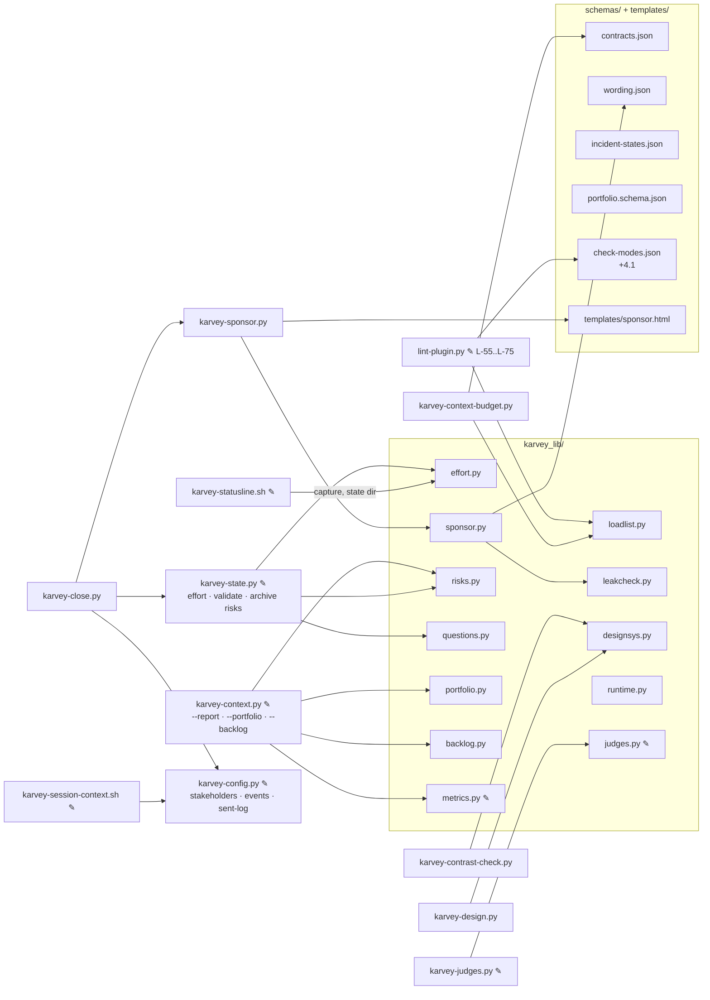
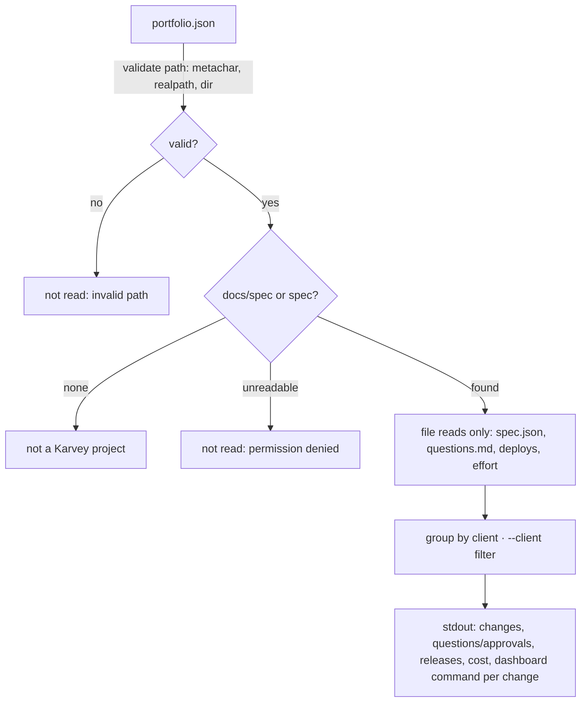

# Architecture: wave3-optimization

> PHASE 5 (`karvey-architecture`, the skill as it is in this branch) · Security Tier **2** · Layers: Backend (the
> plugin's scripts, hooks, schemas and skill/rule text), Frontend (two self-contained HTML pages: the sponsor page
> template and the method page), Infra (the existing CI workflow, one step added) · Target: `cli` + web (the two
> pages) · Lane: `feature-ui` · Complexity: **extension** of the Wave 1 and Wave 2 design with three new
> capabilities (context measurement, the sponsor page, the portfolio), so both the component and the data-flow
> diagrams are included (§4).
>
> Inputs read in this session: `prd.md`, `requirements.md` (REQ-W3-001..080, approved at the *what* gate under
> D-21), `spec-delta.md`, `design-spec.md` and `mockup/*.html` (approved), `PLAN.md`, `spec.json`, `findings.md`
> (F-01..F-41, all closed), `docs/spec/project.json`, the approved Wave 2 design
> `docs/spec/changes/wave2-structural/architecture.md` (§1..§12) and its hand-off `upgrade-steps.handoff.json`,
> the Wave 1 design `docs/spec/changes/wave1-hardening/architecture.md`, and the real code listed in §1.1 with the
> line numbers this design builds on (verified on `feature/wave3-optimization` at `c1882ec`).

## Summary

Wave 1 put the method's state into one tool; Wave 2 added lanes, gates, judges, logs and a metrics view on top of
it. Wave 3 adds **views for the people who decide** and makes the method **cheaper to read**, without adding a new
state writer, a new hook event or a network call:

- A **size tool** (`karvey-context-budget.py`) measures, per phase skill, the skill, the rules it loads and their
  transitive closure — first over the 4.0.0 content (the baseline, before any skill moves), then after the
  reorganisation, then in CI on every PR.
- The **reorganisation** comes last among the functional features: a core of seven hard contracts
  (`rules/_core.md`, ≤ 1,000 words, each contract with an id), a closed `Load:` line per skill, rules that cite each
  other only in footnotes, one adapter file per tracker, references for the closed list of rare paths, and an
  orchestrator that only routes (≤ 1,200 words). A **contract map** (`schemas/contracts.json`) proves no phase lost
  a hard contract; generated blocks keep the per-phase rule lists honest.
- **Cost per change** with one agent: the statusline (already fed the session cost by the runtime) stores the last
  value outside the repository; the state tool's new `effort` command charges each phase close with the interval,
  marked `exact` / `estimated` / `n/a`. Judge runs take the runtime-reported usage. The metrics view sums per lane,
  client and period; the retro flags outliers. Nothing caps anything (D-30).
- A **sponsor page** per change (`changes/{id}/sponsor.html`), generated only from the change's artifacts through
  an allow-list, checked by a **leak check that fails closed before writing**, in business wording, and delivered
  at every gate close to the declared sponsor. `--report`, "your turn" events and deduplicated notifications go with
  it.
- **Open questions** (`Q-NN`, `docs/spec/questions.md`) and a **risk register** per change (`risks.md`) with owner
  and date; listed at the qa and release gates; archive closes or moves every open risk.
- One **design system** per project, a **design delta** per UI change with base values (conflicts stop the apply),
  a **contrast tool**, and a **design judge** that replaces self-scoring.
- One **WBS** (Feature = functional area; `E{n}.QA` / `E{n}.DEPLOY` under the Epic; parent/child).
- A **read-only portfolio** (`karvey-context --portfolio`) over the local clones a `portfolio.json` lists: file
  reads only — no git call, no network.
- A **WSJF backlog** view, `done-direct`, a refinement cadence.
- **Portability**: a guide, `browse.via`, an OS-neutral open, no fixed country time, neutral incident states with
  aliases, the loaded version read correctly, team settings validated.
- **Last**, the method page in nine languages with an anchor alias table.

There is no cloud: infra is skipped, and CI stays `.github/workflows/lint.yml` with one size step added (§1.23).

## Engineering-standards conformance gate (Step 4B)

**Not evaluated.** `docs/spec/project.json` declares no `standards` block and `docs/spec/standards/` does not exist
(checked: `ls docs/spec` → `agent backlog.md changes decisions.md incidents-index.md project.json retros reviews
specs`). As in Wave 1 and Wave 2, "not evaluated" is not conformance. Every non-trivial pattern choice is listed in
§10.1 and taken by the architect with the recommended option under D-21, for the owner to confirm at the *how*
gate. No `deviations.md` is created: there is no standard to deviate from.

---

## 1. Components and boundaries

### 1.0 System boundary

**This spec owns:**
- New scripts: `plugins/karvey/scripts/karvey-context-budget.py` (size tool), `karvey-sponsor.py` (sponsor page),
  `karvey-contrast-check.py` (contrast tool), `karvey-design.py` (design delta and apply), `karvey-close.py`
  (gate-close steps).
- New library modules: `karvey_lib/{loadlist,effort,sponsor,leakcheck,risks,questions,designsys,portfolio,backlog,
  runtime}.py`.
- New data: `schemas/{contracts,wording,incident-states,portfolio.schema}.json`, `karvey_lib/leak_patterns.json`;
  new rows in `schemas/check-modes.json` (a `4.1` default column); new fields in `spec.schema.json`,
  `project.schema.json`; `design_graphic` added to the judged phases.
- Extensions to `karvey-state.py` (`effort`, `risk`, `validate` checks, `--fix` client move, archive risk precondition),
  `karvey-trace.py` (`--wbs`),
  `karvey-context.py` (`--report`, `--portfolio`, `--backlog`, open-work additions, gate-summary risks),
  `karvey-config.py` (stakeholder resolution, event routing, sent-log), `karvey-judges.py` / `karvey_lib/judges.py`
  (runtime usage, risk proposals, design rubric), `karvey_lib/metrics.py` (cost), `lint-plugin.py` (L-55..L-75),
  `hooks/karvey-statusline.sh` (cost capture), `hooks/karvey-session-context.sh` (both layouts, settings
  validation), `karvey_lib/project.py` (both layouts).
- New rule text: `rules/_core.md`, `rules/adapters/{markdown,clickup,jira,linear,azure-boards,github-projects,
  spreadsheet}.md`, `rules/judges/design_graphic.md`, `rules/risks.md`, references under
  `skills/{karvey-init,karvey-deploy,karvey}/references/`; new templates `plugins/karvey/templates/sponsor.html`;
  new doc `docs/portability.md`; the reorganised text of every phase skill and rule (§8).
- The method page `docs/karvey.html` (four languages, alias table, counts) and its tests.
- Tests under `plugins/karvey/tests/` (§6) and this change's dogfooding artifacts (§7.1).
- The **upgrade-step declarations** for the project-upgrade catalogue (§7.4), as a hand-off file. Only the
  declarations: the engine belongs to that change.

**This spec does NOT touch:**
- The project-upgrade engine, its catalogue schema or its checks L-37..L-39 (their own branch).
- The owner's personal global instructions or anything outside this repository.
- `CHANGELOG.md`, `docs/spec/decisions.md`, `docs/spec/backlog.md` and `docs/spec/agent/*` in this phase (they
  change in impl/deploy, under their own rules).
- The approval marker, the release ledger, the prod gate's fail-closed core, the finding router and "who observes
  does not route", the Iron Law, the production approval never delegated (D-10), the prod gate on by default
  (D-02), lanes and merged gates of Wave 2, and every item of the panel's §5 "do not change".
- Any cost cap (D-30), any runtime other than Claude Code (D-32), any hosting or public URL for the sponsor page.
- The team layer's own cost records (BL-34..BL-36 stay out) and the statusline width (BL-41).

**Changes that require revalidating this design:**
- `wave2-structural` changes skill or rule text after the baseline is taken (§7.1 step 1: re-take the baseline).
- The runtime stops passing `cost` to the statusline or renames its fields (§1.9 would fall back to `n/a`).
- The runtime starts exposing the session id to tools (§1.9 would drop the "most recent capture" heuristic).
- The owner declares a standards repository (the conformance gate would run).
- project-upgrade merges before Wave 3 releases with a different catalogue shape (§7.4 re-expressed).

### 1.1 Wave 1 and Wave 2 code this design builds on (verified in this branch)

| What | Where (file:line) | Wave 3 use |
|---|---|---|
| `fix_spec` (dry-run diff, never an approval) | `scripts/karvey-state.py:625` | `+` `clickup.client_tag` → `client` (REQ-W3-063) |
| `cmd_validate` | `karvey-state.py:774` | effort kinds, risks owner, dangling `Q-NN`, `done-direct` commit, cost-cap keys, literal webhook (REQ-W3-016, 017, 020, 029, 031, 050) |
| `compute_next`, `transact` (lock + CAS), `cmd_advance` | `karvey-state.py:916`, `:1090`, `:1139` | `advance archived` refuses an open risk (REQ-W3-034) |
| `cmd_generated`, `cmd_approve`, `cmd_outcome`, `cmd_approve_gate`, `cmd_gate` | `karvey-state.py:1307`, `:1580`, `:2044`, `:1935`, `:2019` | the closing block calls `effort` after them (§1.9) |
| `cmd_judge_run` (the only `judge_runs` writer) | `karvey-state.py:1817` | unchanged writer; records gain `tokens_total` and `source` (REQ-W3-077) |
| Dashboard sections, `open_work`, `human_waiting` | `scripts/karvey-context.py:53`, `:494`, `:437` | `+` open questions, open risks, refinement date (REQ-W3-030, 052) |
| `read_bugs` (incident states), `RESOLVED` | `karvey-context.py:358` | neutral states + aliases (REQ-W3-057) |
| `gate_summary`, `_judges_block` | `karvey-context.py:929`, `:884` | `+` open risks with owner, trigger, last review; unreviewed warning (REQ-W3-033) |
| `metrics_view`, `build_parser` | `karvey-context.py:1152`, `:1269` | `+ --report`, `--portfolio`, `--backlog` |
| Metric functions, `judge_cost`, `compute_all` | `karvey_lib/metrics.py:294`, `:333`, `:360` | `+ cost_per_change`, per-client aggregate, `cost_outliers` (REQ-W3-018, 019) |
| Check-mode registry and resolver | `schemas/check-modes.json`, `karvey_lib/modes.py:50` (`release_line`), `:84` (`resolve`) | `4.1` defaults column (REQ-W3-061) |
| Judged phases and rubric lenses | `karvey_lib/judges.py:18` (`PHASES_WITH_RUBRIC`), `defaults.json:judges` | `+ design_graphic` / lens `design` (REQ-W3-039) |
| Judge cost (chars ÷ 4 when no usage) | `karvey_lib/judges.py:215` (`cost`), `:255` | runtime total → `exact`; estimate counts every closed input (REQ-W3-077) |
| Judge input builder (closed list) | `karvey_lib/judges.py:96` (`build_inputs`) | the design judge's inputs: delta, mockup, rubric, contrast output |
| Statusline reads `cost` from the runtime and discards it | `hooks/karvey-statusline.sh:83`, `:216` | stores the last value per session in the state dir (REQ-W3-015) |
| Machine-local state dir (outside the repo) | `karvey_lib/project.py:286` (`state_dir`) | cost captures (no repo write from a hook) |
| Karvey project detection (`docs/spec` only) | `karvey_lib/project.py:78` (`is_karvey_project`), `:156`; `hooks/karvey-session-context.sh:52` | both layouts `docs/spec/` and `spec/` (REQ-W3-048) |
| Notifications resolution, destinations | `scripts/karvey-config.py:263` (`resolve_notifications`), `:424`; `rules/notifications.md:14`, `:53-55` | `+` three events, stakeholder routing, sent-log (REQ-W3-026, 027) |
| Tracker settings normalisation (aliases) | `karvey-config.py:153` (`_normalise_management`), `:203` | "settings invalid (…)" in hook and dashboard (REQ-W3-059) |
| Outbox for failed tracker/notify calls | `karvey-config.py:535` (`outbox_add`) | failed sponsor delivery recorded for reconciliation (REQ-W3-022) |
| Target values refuse `://` | `karvey_lib/safe_values.py:119` (`check_target`), `:98` (`check_common`) | stakeholder destinations (REQ-W3-020); portfolio paths (REQ-W3-045) |
| ID tool kinds `BUG D BL F Q` | `scripts/karvey-id.py:34` | `Q-NN` already reservable; `R-NN` is per change, not minted (§1.17) |
| Generated-block pattern + lint | `lint-plugin.py:2087` (L-40, `rules/lanes.md`) | same pattern for load lists (REQ-W3-012) |
| Counts lint, incident lint | `lint-plugin.py:767` (L-11), `:1664` (L-32) | method page counts (REQ-W3-070); neutral states (REQ-W3-057) |
| Linter registry, last id | `lint-plugin.py` L-01..L-54 (L-37..L-39 reserved by project-upgrade) | Wave 3 checks start at **L-55** |
| Mockup `open` (one OS) | `skills/karvey-mockup/SKILL.md:152`, `:181`, `:189` | OS-neutral open (REQ-W3-055) |
| Fixed country time | `skills/karvey/rules/changelog-policy.md:29` | project / environment zone (REQ-W3-056) |
| Localized incident states | `skills/karvey/rules/incident-tracking.md:51-60` | neutral names + aliases (REQ-W3-057) |
| Health reads the clone's `plugin.json` | `skills/karvey-health/SKILL.md:100` | loaded version from the runtime's record (REQ-W3-058) |
| Self-scored design, threshold ≥ 8 | `skills/karvey-design-graphic/SKILL.md:156-186` | score moves to the design judge (REQ-W3-039) |
| Phase = Feature in the tracker | `skills/karvey/rules/clickup-protocol.md:191` | phases on the Epic (REQ-W3-040) |
| Backlog table (priority only) | `skills/karvey/rules/backlog.md:25` | WSJF columns, `done-direct` (REQ-W3-049, 050) |
| `decisions cross` "no answer exists" | `skills/karvey-decisions/SKILL.md:66-80` | offers `ask` (REQ-W3-028) |
| Method page: five languages | `docs/karvey.html:10`, `:113-119`, `:316-320`, `:4515-4523`; `tests/unit/test_page_static.py:14` | nine languages (REQ-W3-066) |
| CI jobs `lint`, `tests`, `page` | `.github/workflows/lint.yml` | `+` size step in `lint` (REQ-W3-011, 072) |

**Shared conventions** are Wave 1's §1.1 table, unchanged: stdlib Python ≥ 3.9 plus bash 3.2, exit codes
`0/1/2/3/4/5`, the `--json` envelope, atomic CAS writes under a lock, ISO 8601 times with an offset, argv lists only
(`test_no_shell_true.py`). Every new script follows them.

**Measured today** (this branch, words / bytes of `SKILL.md` only, before any closure): orchestrator `karvey`
3,090 / 24,578; `karvey-qa` 3,103 / 22,008; `karvey-deploy` 3,055 / 21,412; `karvey-init` 1,992 / 14,504; the 26
rules total 142,995 bytes; `phase-close.md` cites 9 other files, `project-config.md` 14. These are the numbers the
baseline (§1.3) will fix precisely, closure included.

### 1.2 Plugin tree after this change (new ★, modified ✎)

```
plugins/karvey/
├── schemas/
│   ├── contracts.json              ★ C-02 contract ids + baseline (phase → contract) map (REQ-W3-003, 009)
│   ├── wording.json                ★ C-13 business wording per language: phases, lanes, risk states (REQ-W3-080)
│   ├── incident-states.json        ★ C-22 neutral states + localized aliases (REQ-W3-057)
│   ├── portfolio.schema.json       ★ C-20 portfolio file (REQ-W3-045)
│   ├── check-modes.json            ✎ C-23 Wave 3 rows + "4.1" default column (REQ-W3-061)
│   ├── spec.schema.json            ✎ effort[], client, stakeholders, (judge_runs tokens_total/source)
│   └── project.schema.json         ✎ client, stakeholders, backlog, browse, time_zone, portfolio
├── scripts/
│   ├── karvey-context-budget.py    ★ C-01 size tool: measure / compare / contracts / render (REQ-W3-001..012, 071, 072)
│   ├── karvey-sponsor.py           ★ C-13 build / deliver the sponsor page (REQ-W3-021..024)
│   ├── karvey-contrast-check.py    ★ C-18 WCAG ratios per declared token pair (REQ-W3-038)
│   ├── karvey-design.py            ★ C-18 delta diff / apply at archive with conflict stop (REQ-W3-036, 076)
│   ├── karvey-close.py             ★ C-26 gate-close steps in a fixed order (sponsor, events, risks, effort, checkpoint)
│   ├── karvey-trace.py             ✎ C-19 --wbs (one parent per task, Split reason) (REQ-W3-043)
│   ├── karvey-state.py             ✎ effort, risk (register edits + risk_log), validate checks, --fix client, archive risk precondition
│   ├── karvey-context.py           ✎ --report, --portfolio, --backlog, open-work Q/risks/refinement, gate risks
│   ├── karvey-config.py            ✎ stakeholders, event routing, notify sent-log, settings validation line
│   ├── karvey-judges.py            ✎ runtime usage, full-input estimate, risk proposals
│   ├── lint-plugin.py              ✎ C-25 L-55..L-75
│   └── karvey_lib/
│       ├── loadlist.py             ★ Load: parse, citation graph, closure, sizes
│       ├── effort.py               ★ capture read, interval, quality marks
│       ├── sponsor.py              ★ allow-listed page model from the artifacts
│       ├── leakcheck.py            ★ fail-closed leak rules
│       ├── leak_patterns.json      ★ secret-shaped value patterns (public formats only)
│       ├── risks.py                ★ risks.md parser / validator
│       ├── questions.py            ★ questions.md parser / validator
│       ├── designsys.py            ★ design-system / delta parser, colour parsing
│       ├── portfolio.py            ★ file-read-only multi-repo reader
│       ├── backlog.py              ★ backlog parser, WSJF
│       ├── runtime.py              ★ loaded version, platform opener hint
│       ├── judges.py               ✎ design phase, usage, estimate over inputs, risk kind
│       ├── metrics.py              ✎ cost per change / lane / client / period, outliers
│       ├── project.py              ✎ both spec layouts
│       └── defaults.json           ✎ judges.phases += design_graphic, backlog/cost/outlier defaults
├── hooks/
│   ├── karvey-statusline.sh        ✎ cost capture (no model turn)
│   └── karvey-session-context.sh   ✎ spec/ layout, "settings invalid (…)"
├── templates/sponsor.html          ★ C-13 self-contained template (design-spec tokens)
├── skills/
│   ├── karvey/rules/_core.md       ★ C-02 seven hard contracts
│   ├── karvey/rules/adapters/*.md  ★ C-04 one per tracker (from management-adapters.md + clickup-protocol.md)
│   ├── karvey/rules/risks.md       ★ C-17
│   ├── karvey/rules/judges/design_graphic.md ★ C-18 rubric, lens design
│   ├── karvey/references/*.md      ★ C-06 moved orchestrator text
│   ├── karvey-init/references/*.md ★ C-05 team settings, --settings
│   ├── karvey-deploy/references/*.md ★ C-05 docs-only, hotfix, post-deploy, branch hygiene
│   └── (every phase skill and rule) ✎ C-03 Load: line + footnotes (§8)
└── tests/ (§6)                      ★/✎
docs/portability.md                  ★ C-22
docs/karvey.html                     ✎ C-24
.github/workflows/lint.yml           ✎ size step
```

### 1.3 C-01 — Size tool (`karvey-context-budget.py`, `karvey_lib/loadlist.py`)

**Satisfies:** REQ-W3-001, 002, 010, 011, 071, 072.

- `loadlist.py`:
  - `declared(skill_text)` parses the `Load:` line (§1.5) → ordered list of relative paths; `None` when absent.
  - `cited(text)` collects every `rules/*.md`, `../karvey/rules/*.md`, `adapters/*.md` and `references/*.md`
    path the text names **outside code fences and outside footnote definitions**, plus the entries of its `Load:`
    line when there is one. This is the **one measure** used for the baseline, the after snapshot and CI (F-49,
    F-56): in the 4.0 text there are no footnotes, so it equals the panel's citation scan; after the
    reorganisation a footnote citation is not loaded and is not counted, and L-56 makes the non-footnote
    citations of a skill equal its `Load:` list. Before and after are therefore measured like for like.
  - `graph(rules_dir)` maps each rule to the rules it cites (same exclusions).
  - `closure(direct, graph)` — breadth-first, deterministic order (sorted), cycle-safe.
  - **Placeholders and conditional entries** (F-48): `adapters/{tool}.md` is measured once per tool, and the row
    reports `closure_min` (the smallest adapter, conditional `?` references left out) and `closure_max` (the
    largest adapter, every conditional reference in). The 40% target and the CI growth warning use
    `closure_max` (the worst case a session can load); `closure_min` is informative. In the 4.0 text a skill
    that names several trackers counts them all, because the 4.0 text asks the agent to read them all.
  - `size(path)` → `{bytes, words, tokens_est}`; `words` = whitespace-separated tokens of the file without YAML
    frontmatter (the unit REQ-W3-003/008 count); `tokens_est = ceil(bytes / 4)`, always marked `estimated`
    (A-02).
- `karvey-context-budget.py`:
  - `measure [--label L] [--json]` → one row per phase skill of `state-machine.json` (+ the orchestrator): `skill`,
    `has_load_line`, `direct`, `closure_min`, `closure_max` (each `{bytes, words, tokens_est}`), the file lists,
    a `session_hook` row (the bytes the session hook prints on the committed fixture project
    `tests/fixtures/budget-project/`, whose lists are capped — see C-16, F-50), and a
    top block `{method_version: L, plugin_files_sha: <sha256 of the sorted file list + contents>}`. No wall clock,
    no absolute path, keys sorted, rows sorted → byte-identical (REQ-W3-071). A `Load:` entry that names a missing
    file → issue with skill, line and file, exit 1 (REQ-W3-001 error, REQ-W3-072).
  - `compare BASE.json [AFTER.json|--live] [--target-median 40] [--warn-growth 10]` → per-phase reduction, the
    median, phases below 40% with their recorded reason (`contracts.json:reasons[phase]`) or `unexplained`; exit 1
    when the median misses the target (the test-phase gate of REQ-W3-010); `--warn-growth` prints
    `::warning::` lines for a phase grown > 10% and exits 0 (REQ-W3-011).
  - `contracts` (C-02) and `render` (C-07) sub-commands.
  - `observed --transcript FILE` (manual use, F-51): counts the rule and reference files a recorded session
    actually opened with the read tool per phase, and lists any outside the phase's `Load:` closure. It is how the
    manual script `one-phase-per-session.md` checks that footnotes are not opened; it reads a transcript the
    person points it to and never runs in CI.
- **Snapshots**: `docs/spec/retros/context-size-4.0.0.json` (baseline) and `context-size-4.1.0.json` (after). The
  baseline is committed alone, before any commit that moves a skill or rule (REQ-W3-002); `test_context_budget.py`
  checks the order with `git log --diff-filter` over the move paths (A-01).

### 1.4 C-02 — Core and contract map (`rules/_core.md`, `schemas/contracts.json`)

**Satisfies:** REQ-W3-003, 009.

`_core.md` states seven contracts, each under a heading carrying its id `{#contract-<id>}`:

| id | Contract (summary) | Moved from (4.0 text) |
|---|---|---|
| `state-tool` | phase, approvals, skips and logs change only through `karvey-state.py` | `rules/state-machine.md` |
| `gate` | one gate question per gate, the approval contract, `-y` = `auto`, never prod | `rules/gates.md`, `phase-close.md` |
| `prod-gate` | production needs the human's words + D-NN, never delegated or automatic | `rules/enforcement.md`, `deploy-workflow.md` |
| `branch-commit` | feature branch, PR into integration, `Karvey-Change` trailer on every commit | `deploy-workflow.md`, `versioning.md` |
| `verification` | the four verification failure modes, evidence before a closing claim | `rules/verification.md` |
| `finding-router` | findings are appended, only iterate routes; who observes does not route | `rules/iteration-loop.md` |
| `neutral-text` | public text names no organisation, product, client, person, internal URL or path | PRD §9 of Waves 1–3 |

`contracts.json` = `{contracts: [{id, anchor}], baseline: {phase: [contract ids]}, reasons: {phase: text}}`. The
baseline map is built once in F1 from the 4.0 closure (a contract applies to a phase when its source rule is in
that phase's 4.0 closure) and committed with the size baseline. `karvey-context-budget.py contracts` checks every
`(phase, id)` of the baseline: covered when the id's anchor is in `_core.md` or in a file of the phase's current
`Load:` closure; else `"{phase}: contract {id} not loaded"`, exit 1 (REQ-W3-009). L-55 counts the core's words
(≤ 1,000) and requires every contract heading to carry an id (REQ-W3-003).

### 1.5 C-03 — Closed load lists and footnotes

**Satisfies:** REQ-W3-004, 005.

- Syntax, one line in the first 15 lines after the frontmatter of every phase skill:
  `Load: _core.md, gates.md, judges.md, adapters/{tool}.md, references/settings.md?`
  — paths relative to `skills/karvey/rules/` (bare names) or to the skill (`references/…`); `{tool}` is resolved
  from `karvey-config.py resolve management` (C-04); a trailing `?` marks a conditional reference whose load
  condition is the pointer line (C-05).
- A citation of another rule "for context" becomes a Markdown footnote: `[^r-gates]: rules/gates.md — context only,
  not opened.` The agent is told once, in `_core.md`, that footnotes are never opened.
- L-56: every `rules/*.md` / `references/*.md` path in a skill body, outside a footnote definition and outside code
  fences, is in its `Load:` list (REQ-W3-004). L-57: a rule names another rule only inside a footnote; imperative
  load phrases (`load|read|open|see first` + a rule path) in a rule are errors (REQ-W3-005).
- Result: closure(phase) = `Load:` ∪ `_core.md` (REQ-W3-005 success scenario), which the size tool asserts.

### 1.6 C-04 — Tracker adapters (`rules/adapters/{tool}.md`)

**Satisfies:** REQ-W3-006.

`management-adapters.md` keeps the tool-neutral contract (logical states, natural keys, find-or-create, outbox,
estimation rules, the `log_time` column). Each tool's operations table, API examples and quirks move to
`rules/adapters/{tool}.md` (`markdown`, `clickup` — the whole of `clickup-protocol.md` —, `jira`, `linear`,
`azure-boards`, `github-projects`, `spreadsheet`). Skill bodies of init, tasks, impl, qa, deploy and archive lose
their per-tool examples (e.g. the ClickUp block of `karvey-tasks` Step 6A) and load `adapters/{tool}.md`. L-58:
tool-specific API tokens (`api.clickup.com`, `clickup_`, `jira issue`, `az boards`, `gh project`, `linear.app`…,
list in the check) appear only under `rules/adapters/` (REQ-W3-006).

### 1.7 C-05 — References for the closed list of rare paths

**Satisfies:** REQ-W3-007.

| Reference | From | Pointer line in the skill (load condition) |
|---|---|---|
| `karvey-init/references/team-settings.md` | first-use team settings | "no `management`/`notifications` in `project.json` → load it" |
| `karvey-init/references/settings.md` | `--settings` | "`--settings` given → load it" |
| `karvey-deploy/references/docs-only.md` | documentation-only path | "lane `docs` → load it" |
| `karvey-deploy/references/hotfix.md` | hotfix path | "lane `hotfix` → load it" |
| `karvey-deploy/references/postdeploy.md` | post-deploy verification | "`infra.md` has a post-deploy contract → load it" |
| `karvey-deploy/references/branch-hygiene.md` | branch hygiene | "after production merge → load it" |

L-59: every file under `skills/*/references/` is named by its skill's `Load:` list (else `orphaned`), and the set of
references equals the table above plus C-06's orchestrator references (a further move needs a spec revision).

### 1.8 C-06 — Routing-only orchestrator; C-07 generated lists; C-08 one phase per session

**C-06 satisfies REQ-W3-008.** `skills/karvey/SKILL.md` keeps: the `next` call, a routing table *phase → skill* per
lane (generated from `state-machine.json` + `lanes.json`), the support-skill pointers, and the `Load:` line. Feature
lists, per-phase descriptions, equivalence tables (Kiro / gstack / spec kit) and authorship move to
`plugins/karvey/README.md` and `skills/karvey/references/{overview,equivalences}.md`. L-60 counts ≤ 1,200 words.
`test_orchestrator_routing.py` checks every `(lane, phase)` with a non-`s` rule is routed to the skill
`state-machine.json` names, failing with the phase and lane.

**C-07 satisfies REQ-W3-012.** `karvey-context-budget.py render [--check]` rewrites three generated blocks between
`<!-- karvey:generated load-lists:{name} -->` markers: the orchestrator's "applies in" column, each adapter's "used
by" line and the README's per-phase rule list. L-61 runs `render --check` (drift → error), the L-40 pattern
(`lint-plugin.py:2087`).

**C-08 satisfies REQ-W3-013.** The gate-close script (C-26) ends by printing the checkpoint offer: `/karvey-checkpoint
save` and "the next phase can start in a fresh session" (the session hook resumes it via `karvey-state.py next`).
The script — not the model — compares the capture's last context reading (C-09 stores `context_pct` /
`context_tokens` next to the cost) with the checkpoint rotation threshold (`defaults.json:context_pct.red`, else
`context_tokens.red`, the values `karvey-checkpoint` declares) and prints `recommend: checkpoint + fresh session
before the next skill` when it is reached (F-47); with no reading it prints `context reading unavailable`.
Continuing in the same session stays allowed. Manual script `one-phase-per-session.md` (with `observed`, §1.3).

### 1.9 C-09 — Cost capture and the effort record

**Satisfies:** REQ-W3-014, 015, 016, 017 (and the dogfooding REQ-W3-074).

- **Capture (no model turn).** `karvey-statusline.sh` already parses `cost` (`:83`, `:216`). It additionally writes,
  atomically, `{state_dir}/cost/{sha256(session_id)[:16]}.json` = `{root_key, usd, transcript, context_pct,
  context_tokens, at}` where `usd = cost.total_cost_usd` (cumulative for the session) and `transcript` is the
  transcript path the runtime passes. The statusline owns this file alone and rewrites it whole. The state dir is
  machine-local, outside the repository (`project.py:286`). No hook writes the repo.
- **Tokens** (F-43) are **not** taken from the context-window figures (they measure how full the context is and fall
  after a compaction). `effort.py` sums the per-message `usage` the runtime writes into the session transcript
  (input, output, cache read, cache write), a cumulative figure; when the transcript is unreadable the tokens are
  `n/a`. A cumulative value lower than the one already charged (a new transcript) starts a new interval.
- **Charge.** `karvey-state.py effort {change} {phase} [--review-min N] [--json]`, run by the gate-close script (C-26)
  as its **last** step, so the close steps (sponsor page, notifications, risk review) are charged to the phase that
  closes (F-44): `effort.py` picks the capture of this root with the latest `at` (A-06); the already-charged values
  live in a **separate** file `{state_dir}/cost/{hash}.charged.json` that only `effort` writes (F-42), so a
  statusline rewrite never resets it; interval = current − charged; appends to `spec.json:effort[]`:
  `{kind: "phase", phase, at, session: <hash>, usd: {value, quality, source}, tokens: {…}, review_min: {…}}`,
  then updates the charged file. First close of a session: no charged file → counts from the session start.
  Several changes in one session: each close charges its interval to the change whose phase closes. Unreadable
  source → `quality: n/a`, reason, charged file untouched (the gap is charged once, to the next readable close).
  No capture file at all → `n/a — statusline not installed`. Two captures of this root updated within 120 s →
  `estimated`, reason `two sessions active on this repository`.
- `review_min`: `exact` when `--review-min` is given (what the human states at the gate), else `n/a`. Gate wait
  stays the Wave 2 metric (REQ-W2-003), never copied here.
- **Judge cost apart** (REQ-W3-016): `effort[]` entries are only `kind: phase`; `validate` reports an entry of
  another kind or whose `(at, usd)` equals a `judge_runs` record of the same phase (`mixed entry`).
- **Never a cap** (REQ-W3-017): `validate` reports `project.json` keys matching `cost_limit|budget|max_usd|
  max_tokens|spend_cap` anywhere (and the Wave 2 `judges.budget`) as `unsupported (D-30)` — a **warning line** in
  every mode that never changes the exit code, `validate --strict` included, so a 4.0 project that passed still
  passes (F-62, REQ-W3-062); the key is never removed by a tool without the human (§7.3). L-63 fails on skill or
  rule text that stops, shortens, skips or asks to confirm because of cost.

### 1.10 C-10 — Judge cost from the runtime

**Satisfies:** REQ-W3-077 (MODIFIES REQ-W2-030).

`judges.cost()` (`judges.py:215`) accepts `usage = {total_tokens}` (what the `Agent` tool result reports) as well as
`{tokens_in, tokens_out}`: tokens `exact`, `usd` computed from `judge_price_table` at the input price and marked
`usd_estimated: true` when the split is unknown. Without usage, `chars_in` = the prompt **plus every file of the
closed input list** (`build_inputs`, `judges.py:96`), marked `estimated`.
**Source of the usage** (F-45, F-78): a number the model copies is not a runtime measure. `collect
--transcript auto` reads the subagent results' usage from the session transcript (the path in the C-09 capture),
matching each judge by its lens line in the prompt, and records `source: runtime` / `exact`. A `usage` value
written by the model into `{tmp}/{lens}.json` is kept only as `source: agent-reported`, `estimated`, and shown next
to the transcript figure when both exist. No transcript → the full-input estimate.

### 1.11 C-11 — Cost in metrics and the retro

**Satisfies:** REQ-W3-018 (MODIFIES REQ-W2-003), 019 (MODIFIES REQ-W2-008).

`metrics.py` adds `cost_per_change(changes)` → per change `{usd, tokens, review_min, judge_usd, estimated_share}`,
and `aggregate(values, by)` for lane, client (`spec.json:client`, fallback the tracker tag) and period. A change
without `effort` → `n/a (no effort)`, excluded from the cost aggregate only. `cost_outliers(changes)` → changes above
3× the median of their lane in the period, with the phase shares; fewer than three measured changes in a lane →
`too few changes in lane`. The retro skill cites it as an input, not a verdict. `phases_per_session(changes)` (from
the hashed session of each `effort` entry) lets the retro compare the cost of changes run one phase per session
with the others — the measure of C-08's effect (F-55).

### 1.12 C-12 — Stakeholders

**Satisfies:** REQ-W3-020.

`project.json:stakeholders` = `{sponsor: {role, name, destination: {channel, target}}, approver?, executor?}`;
`spec.json:stakeholders` overrides per role. `target` goes through `safe_values.check_target`
(`safe_values.py:119`): it refuses `://` and then matches the channel's pattern (`safe_values.py:43-49`) — for
`webhook` only a secret name `^[A-Z][A-Z0-9_]{2,63}$`, for `google-chat`/`slack` a space or channel id, for `teams`
a name without `/` — so a webhook written without its scheme (`host/path/token`) is refused too (F-71); for `email`
the target is the address. `name` defaults to the role; a project may set a label, which is the project's own data
(the method's examples and this repository use roles only, L-72) and is what the page shows (F-79). Init pre-fills
the PRD Stakeholders section from it.

### 1.13 C-13 — Sponsor page (`karvey-sponsor.py`, `sponsor.py`, `leakcheck.py`, template, wording)

**Satisfies:** REQ-W3-021, 022, 023, 024, 080 (and REQ-W3-075).

- **Model (allow-list).** `sponsor.build_model(root, change)` reads only: PRD §1–2 and §6 table titles (scope), the
  requirement *area* titles (not ids), `phase_history` + `lane` (state), `effort[]` + `judge_runs[]` (cost, with the
  estimated share and dates), `risks.md` (description, state, owner role, trigger, last review), open `Q-NN` whose
  owner matches the sponsor's role or name case-insensitively (question, needed-by, context), gates awaiting the
  human approval when the sponsor is the declared approver, and the release manifest's released entries (version,
  date). Each field carries `as_of`. Ids other than the change id, file paths and command names are stripped by a
  text normaliser (regexes for `REQ-…`, `F-NN`, `D-NN`, `BL-NN`, paths, backticked commands). A missing source →
  `"not measured"` / `"none recorded"`, never a number.
- **Wording.** `schemas/wording.json` = `{languages: ["en","es"], phases: {…}, lanes: {…}, risk_states: {…},
  labels: {…}}`; English risk wording exactly as REQ-W3-080. The page uses `spec.json:language` when in `languages`,
  else English with a one-line note. L-65 fails when a phase, lane or risk state lacks a wording in a listed language.
- **Render.** `templates/sponsor.html`: one file, inline CSS with the design-spec tokens, `prefers-color-scheme`,
  no JavaScript needed, `@media print` (navigation hidden, `details` open), no horizontal scroll 360–1440 px,
  `<meta http-equiv="Content-Security-Policy" content="default-src 'none'; style-src 'unsafe-inline'; img-src
  data:">`. Every value is inserted with `html.escape`. L-64 rejects any `http(s)://` in `src`, `href` of
  `link`/`script`, `@import` or `url()` of the template and of `docs/karvey.html` (REQ-W3-024, 068).
- **Leak check (fail closed, before writing).** `leakcheck.check(model, rendered, ctx)` → list of
  `{field, rule}`; rules: `secret` (patterns in `leak_patterns.json`: private-key headers, cloud access-key shapes,
  token prefixes of public formats, `password=`/connection-string shapes, JWT shape, high-entropy base64 ≥ 32),
  `path` (absolute POSIX/Windows paths, `~/`), `host` (hostnames under `.local`, `.internal`, `.lan`, `.corp`,
  `.home.arpa` and IPv4/IPv6 private and loopback ranges), `email` (any address other than the `email`-channel
  targets of the declared stakeholders — the only destinations that are addresses, F-81), `pii` (phone-number
  shapes of 8+ digits with separators, and digit runs of 8+ that are not a date, amount or version — F-73; person
  names cannot be detected by pattern, which is why free text reaches the page only through the allow-listed
  fields, and the residual risk is R-3), `client` (other clients' names from the portfolio file when readable,
  plus the optional `project.json:leak.deny_terms` list, which lets a project without a portfolio still name what
  must never appear — F-72; with neither, the line `other-client names not checked` and the rest still run, as
  REQ-W3-023 states). Any hit → nothing is written or delivered; the previous `sponsor.html`
  stays byte-identical; `changes/{id}/sponsor-refusals.jsonl` gains `{at, gate, field, rule}` — never the value.
  An exception inside the check is a refusal (`rule: check-error`).
- **Publish.** `karvey-sponsor.py build {change} --gate {what|how|release}` (called by the closing block after the
  gate answer, approved or changes requested) → writes the page, appends `sponsor-history.jsonl` `{at, gate,
  outcome, sha256}`; no sponsor declared → prints `sponsor page: no sponsor declared` once per change (recorded in
  the history as `no-sponsor`). `deliver {change}` builds the message payload **from the checked model only** and
  runs the same leak check on the payload (F-74); a refused payload is not printed. The agent sends the printed
  payload verbatim through the notification adapter (e-mail: the page as attachment; chat: the summary +
  repo-relative path; never a public URL) and composes nothing of its own; a failure goes to the outbox
  (`karvey-config.py outbox add --op deliver_sponsor`), the gate is already closed.

### 1.14 C-14 — The report (`karvey-context --report`)

**Satisfies:** REQ-W3-025. Read-only. `--report [--from --to --as-of] [--client NAME]`: sections *released* (from
`deploys[]` with `env: prod` in the period), *in progress* (active changes: phase wording, age), *blocked* (tasks
`⛔` / `awaiting-human` with whoever unblocks: executor role), *open risks*, *decisions awaited per stakeholder*
(open `Q-NN` by owner). Same wording table; unknown client → `no changes for client`, exit 0.

### 1.15 C-15 — "Your turn" events and deduplication

**Satisfies:** REQ-W3-026 (MODIFIES REQ-ADP-011), 027.

- `notifications.events` accepts `approval_requested`, `awaiting_human`, `blocked`. `karvey-config.py resolve
  notifications --event E` returns the destination: the stakeholder whose role is the event's actor (`approver` /
  `executor` / whoever unblocks = `executor`), else the team destination with `no executor declared`
  (`no approver declared`). `blocked` raised by a judge verdict (blocking mode) carries the verdict line.
- Every payload carries `run_id` (change + phase + iteration, or pipeline run) and `at`. The **sent-log**
  `changes/{id}/notifications.jsonl` holds `{event, key, state, at}` with `key = sha256(event|change|item|state|
  version|env)`; before sending, `karvey-config.py notify-sent --key` returns `sent` or `new`. `qa` sends on the first
  run and on a verdict change only (unless `notifications.qa_every_run: true`); `deploy` once per version and
  environment; "your turn" once per state change. No destination value is written to the log.

### 1.16 C-16 — Open questions (`Q-NN`)

**Satisfies:** REQ-W3-028, 029, 030 (MODIFIES REQ-W1-068).

`docs/spec/questions.md` (in `ops_repo`, like `decisions.md`): table `ID | Question | Owner | Needed by | Changes |
Context | State | Resolved by`. `karvey-decisions ask` reserves the id with `karvey-id.py next Q` (`karvey-id.py:34`
already lists `Q`), refuses a missing owner or needed-by (naming the field); `cross` ending without an answer offers
`ask`. Answering records a `D-NN` citing the `Q-NN` and sets `State: resolved → D-NN`; rows are never deleted.
`validate --all` reports a D-NN claiming a `Q-NN` that does not exist. The dashboard's open-work
(`karvey-context.py:494`) lists open questions with owner and needed-by, `overdue` past the date, `date invalid` on a
malformed one, plus every open risk of an active change. What the **session hook** prints is bounded (F-50): at most
five lines per list (overdue first) and a `+N more — karvey-context` line; the full lists stay in the dashboard,
which is run on demand. The size tool's `session_hook` row measures it on a fixture.

### 1.17 C-17 — Risk register (`changes/{id}/risks.md`, `risks.py`, `rules/risks.md`)

**Satisfies:** REQ-W3-031, 032, 033, 034.

- Table `ID | Risk | Probability | Impact | Owner | Trigger | Mitigation | State | Last review`; ids `R-N` per change
  (not minted by the id tool: local to the register). States `open | mitigated | accepted | closed | moved`.
  Architecture creates it from its Risks table (this change's own `risks.md` is written with this document from
  §12, F-63; its later state changes go through the `risk` command once it exists);
  any phase adds rows; lanes without architecture create it at the first risk; no file = no risks.
- `validate` reports a risk without owner (id + field). Judges: an output finding with `"kind": "risk"` is collected
  as an `emergent` row with `Routed to: proposed risk`; iterate accepts it into the register with the finding id.
  Any judge output field that targets the register (`risks`, `register_edit`) is dropped and reported by `collect`.
- **Deterministic edits** (F-54): `karvey-state.py risk {change} R-N review|close|move|mitigate|accept
  [--reason R] [--by-role ROLE] [--to BL-NN]` rewrites that row of `risks.md` (atomic, under the change lock) and
  appends `{risk, from, to, at, by_role, reason, ref}` to `spec.json:risk_log[]`. `move` reserves the `BL-NN` with
  `karvey-id.py next BL` and writes the backlog row citing the risk. The model asks the owner; the tool writes.
- Gate summary (`karvey-context.py:929`, gates *qa* and *release*): every `open` risk with owner, trigger and last
  review; `risk R-N unreviewed` when the last review predates the phase's `phase_history` entry (warn mode). The
  gate-close script lists them; each owner's answer is recorded with `risk … review|…`.
- Archive: `advance {id} archived` refuses while any risk is `open`, naming it (a refusal of a register this change
  introduces, REQ-W3-061), **and** while a risk's state is not `open` without a matching `risk_log` entry — a
  hand edit of `risks.md` to `closed` is reported as `R-N: state without record` (F-75). Archive's text closes each
  with a reason or moves it to a `BL-NN` through the `risk` command.

### 1.18 C-18 — Design system, delta, contrast, design judge

**Satisfies:** REQ-W3-035, 036, 037, 038, 039 (MODIFIES REQ-W2-022), 076.

- `docs/spec/design-system.md`: token tables (`Token | Light | Dark | Changed by`) for colour, type, spacing,
  radius, motion; a component inventory; a pairs table (`Text token | Background token | Level`, level
  `AA|AAA` × `normal|large`, default AA normal). Created by the first UI change at archive (from its delta) or
  imported from a pinned `inputs.design_system`.
- `changes/{id}/design-delta.md`: `Added` and `Modified` token rows (`Token | Base value | New value`) and
  components; `empty` when none. `karvey-design.py diff {change}` compares the design-spec's tokens with the design
  system and reports undeclared modifications. `karvey-design.py apply {change} [--dry-run]` at archive: added
  tokens are written; a modified token whose current value ≠ its base value stops that token (exit 3) with both
  values and the `Changed by` change, and the archive skill asks the human which to keep (REQ-W3-076).
- `karvey-contrast-check.py [--file design-system.md|--delta] [--json]`: parses `#rgb/#rrggbb`, `rgb()`, `oklch()`
  (converted to sRGB with the CSS Color 4 matrices), WCAG 2.x relative luminance, reports every pair below its
  level; an unparseable token → named, exit 1, never assumed.
- Design judge: `rules/judges/design_graphic.md` (lens `design`); `defaults.json:judges.phases` += `design_graphic`,
  `lenses.design_graphic = ["design"]`; `build_inputs` for this phase = `design-delta.md`, the mockup files the
  design-spec's "Applies to" line names (each ≤ 200 KB, a larger one dropped with a `dropped:` line), the rubric and
  the contrast JSON (the deterministic sub-score); like every judge, tools Read/Grep/Glob only (F-52). design-graphic's self-score section (`SKILL.md:156-186`) is removed; L-67 reports a
  score table in the skill's output instructions. Art catalogue only on an asset request; L-66 reports
  country-specific identifier examples in templates (REQ-W3-037).

### 1.19 C-19 — One WBS

**Satisfies:** REQ-W3-040, 041 (MODIFIES REQ-W1-089), 042, 043.

Text: Feature = functional area in `management-adapters.md`, the adapters, tasks, impl, qa, deploy; pipeline phases
become an Epic checklist/field (`clickup-protocol.md:191` rewritten in `adapters/clickup.md`). `E{n}.QA` and
`E{n}.DEPLOY` are natural keys under the Epic (find-or-create). Parent/child for the hierarchy; dependencies only
between siblings; a tool without parent/child records the parent in a field and says so. `karvey-trace.py --wbs
{change}` parses `tasks.md`: every task under exactly one Feature (or `E{n}.QA`/`E{n}.DEPLOY`); a requirement whose
tasks span two Features needs a `Split: {reason}` line in the later Feature (else reported). The tracker
reconciliation reports 4.0 items as `legacy shape` and root-level QA/deploy items as `outside the hierarchy`, never
rewriting them. L-68 reports rule/skill text mapping a phase to a Feature.

### 1.20 C-20 — Client and portfolio

**Satisfies:** REQ-W3-044, 045, 046, 047, 048 (MODIFIES REQ-W1-045), 078, 079 (and REQ-W3-063).

- `client` first-level in both schemas; a change inherits the project's; `validate` warns when it differs from
  `clickup.client_tag` (both values named); `validate --fix` proposes the move of a non-empty tag (`fix_spec`,
  `karvey-state.py:625`), nothing when `client` is already set.
- `portfolio.json` (default `{ops_repo or spec_repo}/docs/spec/portfolio.json`, `--file` override):
  `{repos: [{path, clone?, client, owner}]}`. `portfolio.py` validates each `path` before any read: string, no
  control or shell metacharacters (`check_common`), absolute or relative to the portfolio file's directory, `realpath`
  a directory; `clone` is stored and shown, never used.
- Reading is **file reads only** (`open()` / `os.scandir`): no `subprocess`, no `git`, no socket; each read is
  capped at 2 MB (a larger file → `not read: file too large`, F-80). Every text value taken from another repository
  passes `sanitise` before it is printed: control characters and ANSI escape sequences removed, capped at 200
  characters (F-70). Layout detection
  (`project.is_karvey_project` extended, `project.py:78`): `docs/spec/` or `spec/`, excluding `archive/` and
  implemented changes; both → `two spec roots`, `docs/spec/` used. The session hook (`:52`) and the dashboard use the
  same detection.
- `karvey-context --portfolio [--file] [--client NAME] [--from --to --as-of]`: per client and repository — active
  changes (phase wording, lane, age), open `Q-NN` owned by the client's stakeholders and gates awaiting a human,
  releases of the period, cost of the period — and, per active change, the printed dashboard command
  `python3 <plugin>/scripts/karvey-context.py --root <path> --change <id>` (never run). The change id comes from
  another repository, so it is printed only when it matches the change-id pattern (`modes.py:19`,
  `^[a-z0-9][a-z0-9._-]*$`), and the path is emitted through `shlex.quote`; an id that fails prints `invalid change
  id` and no command (F-69). States: `not a Karvey
  project`, `not read: permission denied`, `not read: no local clone`, `not read: invalid path`. `--client` matches
  case-insensitively and adds `other clients: not shown`; unknown → `no repositories for client`, exit 0. Output
  goes to stdout only.

### 1.21 C-21 — Backlog WSJF

**Satisfies:** REQ-W3-049, 050, 051, 052.

`rules/backlog.md` table gains `Value | Effort | CoD | Needed by | Client | Reviewed | Commit`; states add
`done-direct`. `backlog.py`: `urgency` = CoD, else days to needed-by (≤ 14 or past → 5, ≤ 30 → 4, ≤ 60 → 3, ≤ 90 →
2, else 1); `effort` S/M/L = 1/2/3, minutes ≤ 60 / ≤ 240 / more = 1/2/3; `wsjf = (value + urgency) / effort`, two
decimals; missing value or effort → `unscored`. `validate` refuses `done-direct` without a commit (a state this
change introduces). `karvey-context --backlog`: open items by score, unscored apart, `stale` > 30 days since
`Reviewed`, malformed rows `invalid row` with id. Refinement: `backlog.md` header `Last refinement: YYYY-MM-DD`;
`project.json:backlog.refine_days` (default 14); the dashboard overview shows the date, `overdue`, or `never refined`.

### 1.22 C-22 — Portability

**Satisfies:** REQ-W3-053..060 (057 MODIFIES REQ-W1-068's "not resolved" test).

| REQ | Mechanism |
|---|---|
| 053 | `docs/portability.md`: runtime-dependent behaviours (tool names in `allowed-tools`, the question tool, subagents, hook events of `hooks.json`, statusline input, plugin install, `CLAUDE_PLUGIN_ROOT`) with an adaptation note each; "Claude Code is the only supported runtime (D-32)". L-69: every hook event in `hooks.json` and every tool name in any `allowed-tools` has a guide entry. |
| 054 | `project.json:browse.via` = `local` \| `agent:<name>` \| `none` (default `local`); browse skill: run locally / send a self-contained instruction to the named agent / `not evaluated` with the reason, which QA's visual dimension cites. The instruction carries only URLs the change declares (the mockup files, `localhost`, or the environments in `infra.md`), the steps and the evidence expected; allowed actions are navigate, read and capture — no credential entry, no form submission. What comes back is untrusted evidence (text and capture paths): recorded, cited, never executed (F-76). |
| 055 | Skills say "open `<path>` (or run `python3 -m webbrowser <path>` — stdlib on every OS)"; L-70 reports bare `open `, `xdg-open`, `start ` file-opening commands in skills. |
| 056 | `changelog-policy.md:29` → the project's `time_zone` (IANA) or the environment's, ISO 8601 with offset; L-71 reports country names attached to time and IANA zone literals in rules/skills (the statusline's `KARVEY_TZ` example becomes `Area/City`). |
| 057 | `schemas/incident-states.json`: `detected, diagnosed, in-fix, resolved, reopened` with the current localized names as permanent aliases; `read_bugs` (`karvey-context.py:358`) and L-32 (`lint-plugin.py:1664`) map both; an unknown state is reported with the accepted list. |
| 058 | `runtime.loaded_version()` reads the runtime's installed-plugins record (read-only; `$CLAUDE_CONFIG_DIR` or the default config dir), reports `loaded X, available Y` (the clone's `plugin.json`), `loaded version unknown` when absent. Never writes the runtime's files. |
| 059 | Session hook and dashboard call `karvey-config.py resolve management/notifications --json`; any error line → `settings invalid ({key} …)` naming each failing key; aliases shown normalised. |
| 060 | L-72: example actor fields in skills/rules (`by:`, `Executor:`, `Owner:`, `Approved by`, `--by "…"`) hold a `{placeholder}` or a role word from a fixed list; model ids (`claude-…`, `gpt-…`, `gemini-…`) are not example actors. |

### 1.22-bis C-26 — Gate-close script (`karvey-close.py`)

**Satisfies:** REQ-W3-013, 014, 022, 033 (orchestration of their close steps; F-46).

`karvey-close.py {change} {phase} --outcome approved|changes_requested [--gate what|how|release]
[--review-min N] [--json]`, run once after the gate answer is recorded (`approve`/`approve-gate`/`outcome`), runs the
deterministic close steps in a fixed order and prints what is left for the agent:

1. `karvey-sponsor.py build` (when a sponsor is declared) and `deliver` → the checked payload, or the refusal line;
2. the "your turn" / `qa` / `deploy` events due, each already filtered by the sent-log (C-15), as payloads;
3. at gates *qa* and *release*: the open risks with owner, trigger and last review (C-17) — the questions to ask;
4. `karvey-state.py effort` (last, so steps 1–3 are charged to this phase);
5. the checkpoint line and, when the threshold is reached, the fresh-session recommendation (C-08).

The agent then only sends the printed payloads, asks the listed owners and records their answers with `risk …`.
`rules/gates.md`'s closing block shrinks to one call and those two agent actions, so the text every phase loads gets
shorter, not longer (F-53). Each step's failure is reported and the next still runs; the gate is never reopened.

### 1.23 C-23 — Rollout 4.1.0 (modes, compatibility, dogfooding)

**Satisfies:** REQ-W3-061, 062, 063, 064, 065, 073, 074, 075.

- `check-modes.json` gains a `"4.1"` key in every row's `defaults` and these rows (all `4.1` advisory or warn
  except the two blocking ones): `effort.record` (advisory), `effort.mixed` (warn), `sponsor.leak` (**blocking**),
  `loadlist.missing` (**blocking**), `risks.owner` (warn), `risks.unreviewed` (warn), `questions.overdue`
  (advisory), `design.undeclared` (warn), `design.contrast` (advisory), `wbs.split` (warn), `wbs.legacy` (advisory),
  `client.mismatch` (warn), `backlog.stale` (advisory), `settings.valid` (warn), `incident.state` (warn),
  `cost.cap_key` (warn). `modes.release_line` (`modes.py:50`) maps 4.1.x to `"4.1"`. L-73 fails on a Wave 3 check id
  used in code but absent from the registry. Refusals of new inputs (webhook literal, `ask` without owner/date,
  archive with an open risk, `done-direct` without commit, design token conflict) and checks of the plugin's own
  sources are not project checks (REQ-W3-061).
- Compatibility: `tests/hooks/tables/compat.json` + `tests/unit/test_compat_w3.py` replay the 4.0 fixtures under
  4.1 defaults: `validate --strict`, the linter over a fixture project, the guard tables — all still pass
  (REQ-W3-062).
- CI: `.github/workflows/lint.yml` job `lint` gains
  `python3 plugins/karvey/scripts/karvey-context-budget.py compare docs/spec/retros/context-size-<latest>.json
  --live --warn-growth 10` (warns), `python3 plugins/karvey/scripts/karvey-context-budget.py contracts` (fails on a
  lost contract, S-8, F-58) and L-62 inside the linter (fails on a missing load file). The existing
  `tests/unit/test_ci_workflow.py` asserts both steps are present, read-only and pinned (F-59).
- Dogfooding: every commit carries `Karvey-Change: wave3-optimization` (REQ-W3-065); lane `feature-ui`, trunk
  (REQ-W3-073); `effort` recorded from the first gate closed after C-09 exists, earlier phases listed as `not
  measured (effort record did not exist)` (REQ-W3-074); `spec.json:stakeholders.sponsor = {role: "method owner",
  name: "Method owner", destination: {channel: "none"}}` — the page is produced and its delivery reads `not
  delivered: no destination declared`; gates closed before the generator show `no page (generator not built yet)`
  (REQ-W3-075). Release notes carry the size before/after and this change's cost, with "single-agent cost before
  4.1 not measured" (REQ-W3-064) — written by `karvey-deploy` at release. Once C-18 exists, the design judge runs
  once on this change's own design (`design-spec.md` as the delta, the mockup, the contrast output) and its verdict
  is recorded next to the self-score the 4.0 skill produced (F-68).

### 1.24 C-24 — Method page in nine languages (last)

**Satisfies:** REQ-W3-066 (MODIFIES REQ-ADP-031), 067, 068, 069, 070.

`docs/karvey.html`: four `lang-block`s (`it`, `ja`, `fr`, `ko`) after `zh`, the CSS selectors (`:113-119`), the
language list (`:316-320`) with a `select` under 720 px, `LANGS` and the `I18N` object (`:4515-4523`), the head
script's `ok()` list (`:10-19`). `html[lang]` set per selection (`ja`, `ko`, `zh-Hans`, …); CJK via the design-spec
`--font-cjk` system stack, line-height 1.75. **Anchor aliases**: a `const ANCHOR_ALIASES = {old: new}` table (the
12 anchors renamed after 3.10.0, from `git log -p docs/karvey.html`) applied on load and on `hashchange` for every
language. Content: a Wave 3 section (load lists, sponsor page, questions and risks, cost, design system, portfolio,
WSJF, portability guide) with counts. Tests: `test_page_static.py` `LANGS` → nine; completeness (every `data-i18n`
key and every section id present in nine blocks, none empty) is L-74; aliases resolve is L-75; counts stay L-11
(`lint-plugin.py:767`) extended to the page's Wave 3 counts; `tests/page/test_page.mjs` covers `?lang=ko`,
`navigator.language = ko-KR`, unsupported `?lang=xx` (English, nothing saved). This feature's tasks depend on the last
task of every other feature (REQ-W3-070).

### 1.25 C-25 — Linter checks (L-55..L-75)

| Id | Check | REQ | Mode in 4.1 |
|---|---|---|---|
| L-55 | `_core.md` ≤ 1,000 words; every contract heading has an id | 003 | error (plugin source) |
| L-56 | skill paths ⊂ its `Load:` list (outside footnotes/fences) | 004 | error |
| L-57 | no load instruction inside a rule; rule→rule only as footnote | 005 | error |
| L-58 | tracker-specific tokens only under `rules/adapters/` | 006 | error |
| L-59 | references: not orphaned; set = the closed list | 007 | error |
| L-60 | orchestrator ≤ 1,200 words | 008 | error |
| L-61 | generated load-list blocks do not drift | 012 | error |
| L-62 | a `Load:` entry names an existing file | 072 | error (blocking, CI) |
| L-63 | no text stops/shortens/skips/asks because of cost | 017 | error |
| L-64 | sponsor template and method page: no external request | 024, 068 | error |
| L-65 | wording table complete per listed language | 080 | error |
| L-66 | no country-specific identifier example in templates | 037 | error |
| L-67 | design-graphic has no self-score instruction | 039 | error |
| L-68 | no phase mapped to a Feature in rule/skill text | 040 | error |
| L-69 | portability guide lists every hook event and tool name | 053 | error |
| L-70 | no OS-only open command | 055 | error |
| L-71 | no fixed country time / IANA zone literal | 056 | error |
| L-72 | example actors are placeholders or roles | 060 | error |
| L-73 | every Wave 3 check id is in `check-modes.json` with a `4.1` mode | 061 | error |
| L-74 | method page: every key in nine languages, none empty | 067 | error |
| L-75 | method page: every anchor alias targets an existing id | 069 | error |

All L-55..L-75 lint **the plugin's own sources**, so they are not project checks (REQ-W3-061) and cannot fail a
4.0 project; each is added in the task that makes its rule true, so the whole-repo lint stays at 0 errors.

---

## 2. Data model

### 2.1 `spec.schema.json` additions

| Field | Shape | REQ |
|---|---|---|
| `client` | string ≤ 80, `check_common` | 044 |
| `stakeholders` | `{sponsor?, approver?, executor?}` each `{role, name, destination: {channel, target}}` | 020, 075 |
| `effort[]` | `{kind: "phase", phase, at, session, usd: {value\|null, quality: exact\|estimated\|n/a, source, reason?}, tokens: {in, out, cache, quality, source}, review_min: {value\|null, quality}}` | 014, 016, 074 |
| `risk_log[]` | `{risk, from, to, at, by_role, reason, ref}` (append-only, written by `karvey-state.py risk`) | 031, 033, 034 |
| `judge_runs[].tokens_total`, `.usd_estimated`, `.source` | integer, boolean, `runtime\|agent-reported\|estimate` | 077 |

All optional (a 4.0 `spec.json` stays valid, REQ-W3-062); `validate --strict` in 4.1 does not require them.

### 2.2 `project.schema.json` additions

`client`, `stakeholders` (as above), `leak: {deny_terms: [string]}`, `time_zone` (IANA pattern), `browse: {via}`
(`local|none|agent:<name>`),
`backlog: {refine_days: 1..90}`, `portfolio: {file}`, `notifications.events` enum `+ approval_requested,
awaiting_human, blocked`, `notifications.qa_every_run: bool`. Unknown cost-limit keys are reported (C-09).

### 2.3 Change-folder and project files (committed)

| File | Written by | Content |
|---|---|---|
| `changes/{id}/risks.md` | architecture / any phase / archive | the register (C-17) |
| `changes/{id}/design-delta.md` | design-graphic | the delta with base values (C-18) |
| `changes/{id}/sponsor.html` | `karvey-sponsor.py build` | the page (only after the leak check passes) |
| `changes/{id}/sponsor-history.jsonl` | same | `{at, gate, outcome, sha256}` or `no-sponsor` |
| `changes/{id}/sponsor-refusals.jsonl` | same | `{at, gate, field, rule}` — never the value |
| `changes/{id}/notifications.jsonl` | `karvey-config.py notify-sent` | `{event, key(hash), state, at}` |
| `docs/spec/questions.md` | `karvey-decisions ask` | `Q-NN` log |
| `docs/spec/design-system.md` | archive (apply) / import | tokens, pairs, components |
| `docs/spec/portfolio.json` | the person who owns the portfolio | repositories list (never written by a tool) |
| `docs/spec/retros/context-size-{version}.json` | size tool | snapshots |

Machine-local (never committed): `{state_dir}/cost/{session-hash}.json`.

---

## 3. Security per tier (Tier 2) and trust boundaries

Wave 1 and Wave 2 controls all remain. Wave 3 adds:

| # | Control | Component | REQ |
|---|---|---|---|
| S-1 | **Leak check fails closed before any write**: allow-listed model, five rule families, exception = refusal, refused page never written or delivered, report without the value. | C-13 | 023, PRD §9 |
| S-2 | **The sponsor page makes no external request**: inline CSS, no script needed, a CSP meta denying everything but inline style and `data:` images, L-64 on the template, all values `html.escape`d. | C-13 | 024 |
| S-3 | **Destinations are secret names**: `check_target` refuses `://`; the page and the sent-log never hold a destination. | C-12, C-15 | 020 |
| S-4 | **The portfolio is read-only and offline**: path validation before any read, file reads only, no `subprocess`, no socket, `clone` never used, output to stdout only; a test asserts no process and no socket is opened and no file's mtime changes. | C-20 | 045, 047 |
| S-5 | **Other clients' data**: the page's `client` rule uses the portfolio names; `--portfolio --client` filters before rendering; a sponsor page reads only its own change. | C-13, C-20 | 023, 078 |
| S-6 | **Cost capture stays machine-local**; `spec.json` holds a hashed session id only; the statusline writes nothing in the repository. | C-09 | 015 |
| S-7 | **Judges never write the register**: risk proposals go through the router; register-targeting output is dropped and reported. | C-17 | 032 |
| S-8 | **No hard contract is lost**: the contract coverage check fails naming phase and contract, and runs in the test phase and CI. | C-02 | 009 |
| S-9 | **Runtime files are read, never written** (loaded version). | C-22 | 058 |
| S-10 | **Cost never gates work** (D-30): unsupported keys reported, L-63 on text. | C-09 | 017 |
| S-11 | **Nothing is published**: no hosting, no public URL; delivery only to a declared destination, with the payload leak-checked. | C-13 | 022, PRD §7 |
| S-12 | **Text from other repositories is inert**: sanitised (no control or ANSI sequences, 200 characters), a printed command only for a valid change id with a quoted path, 2 MB per read. | C-20 | 046, 047, 079 |
| S-13 | **Risk states have provenance**: changed only by `karvey-state.py risk`, logged; archive refuses a state without a record. | C-17 | 034 |

**Trust boundaries**

| Boundary | What crosses | Untrusted side | Validated at | Control |
|---|---|---|---|---|
| change artifacts → sponsor page | PRD, risks, questions text | repo text (agent-editable) | `sponsor.build_model` + `leakcheck.check` | S-1, S-2 |
| sponsor page → sponsor's browser | HTML | our output | template + escape + CSP | S-2 |
| `project.json` → destinations | channel, target | working copy | `check_target` | S-3 |
| `portfolio.json` → file reads | paths | the portfolio file | `portfolio.validate_entry` | S-4 |
| other repositories → portfolio view | their `spec.json`, tables | other repos | parsers tolerant (`invalid row`, `not read`) | S-4 |
| runtime → statusline → capture | cost JSON | runtime | numeric type checks | S-6 |
| judge subagent → collector | JSON (+ `kind: risk`) | model output | `karvey-judges.py collect` | S-7 |
| runtime plugin record → health | JSON | local config | read-only parse | S-9 |
| sponsor payload → notification channel | message / attachment | leaves the organisation | `deliver` leak check on the payload | S-1, S-11 |
| browse agent ↔ this session | instruction out, evidence back | the other agent | declared URLs only; evidence recorded, never executed | C-22 (054) |
| pinned `inputs.design_system` → design phase | tokens | another repo @commit | `designsys.py` parser; unparseable → named | C-18 |
| `questions.md`, `backlog.md`, `risks.md` → views and page | table rows | repo text | parsers (`invalid row`, `date invalid`), escape on render | C-13, C-16, C-21 |
| portfolio names → leak check | client names | the portfolio file | sanitised, used only as match terms | C-13 |
| another repo's change id → printed command | id | other repos | change-id pattern + `shlex.quote` | S-4 |
| agent → `risks.md` state | row edit | agent | `risk` command + `risk_log`; archive refuses unrecorded states | C-17 |

**STRIDE (new surface only).** *Spoofing*: a risk owner or question owner is text; the page lists, it does not
authorise. *Tampering*: an agent could edit `risks.md` to `closed` to pass archive — the change is committed and
reviewed in the PR; the state tool reads only the file. *Repudiation*: sponsor history, refusals and the sent-log are
append-only. *Information disclosure*: S-1..S-5 (the main risk of this change). *Denial of service*: the leak check
is linear in the page size; the portfolio reads bounded files (size cap 2 MB per read). *Elevation*: none — no new
approval path; the portfolio prints commands, never runs them.

**Security control points.**

| Point | Tier | Control |
|---|---|---|
| Sponsor page write / delivery | 2 | leak check (blocking in 4.1) |
| Portfolio entry read | 2 | path validation + file reads only |
| Stakeholder destination | 2 | secret name only |
| Gate approval | 2 | unchanged (human marker); judges advisory |
| Logs | 2 | refusal report and sent-log hold no values; capture outside the repo |

---

## 4. Diagrams

### 4.1 Components



### 4.2 Data flow: a gate closes on a change with a declared sponsor

```mermaid
sequenceDiagram
  participant H as Human
  participant A as Agent (phase skill)
  participant ST as karvey-state.py
  participant SPO as karvey-sponsor.py
  participant LK as leakcheck
  participant CFG as karvey-config.py
  participant CL as karvey-close.py
  A->>ST: generated {phase}
  A->>H: the one gate question (+ judges, open risks at qa/release)
  H-->>A: approve / changes requested (+ review minutes)
  A->>ST: approve-gate / outcome
  A->>CL: karvey-close.py {id} {phase} --outcome O --review-min N
  CL->>SPO: build {id} --gate G
  SPO->>SPO: allow-listed model from artifacts (untrusted text)
  SPO->>LK: check(model, rendered)
  alt refused
    LK-->>SPO: {field, rule} list
    SPO->>SPO: append sponsor-refusals.jsonl (no value); page unchanged
  else passed
    SPO->>SPO: write sponsor.html + sponsor-history.jsonl
    SPO->>LK: check(delivery payload)
    CL->>CFG: notify-sent --key (dedup) for due events
  end
  CL->>ST: effort {id} {phase} (last: close steps charged here)
  ST->>ST: capture + transcript usage − charged file → append effort[]
  CL-->>A: payloads to send · risk owners to ask · checkpoint line
  A->>A: send payloads verbatim (failure → outbox); record answers with `risk …`
  A->>H: checkpoint offer / fresh-session recommendation
```

### 4.3 Portfolio read (offline)



---

## 5. Edge cases

| Edge case | How it is handled | Component |
|---|---|---|
| `Load:` names a missing file | issue with skill, line, file; exit 1; CI fails (blocking) | C-01, L-62 |
| Size tool run twice on the same commit | identical bytes (sorted, no clock, no absolute path) | C-01 |
| Baseline taken after a move | order check fails: `baseline missing or taken after the reorganisation` | C-01 |
| Median −35% | `compare` exits 1 naming the median | C-01 |
| Phase below 40%, median passes | listed with its reason or `unexplained` | C-01 |
| Contract removed from a phase's path | `"{phase}: contract {id} not loaded"`, exit 1 | C-02 |
| Reference no skill points to | L-59 `orphaned` | C-05 |
| No statusline installed / runtime without cost | `n/a — statusline not installed` / `runtime exposes no cost`; never 0 | C-09 |
| Two sessions on one repository | `estimated`, reason named | C-09 |
| Session works on two changes | each close charges its own interval | C-09 |
| Unreadable capture at a close | `n/a`; gap charged once at the next readable close | C-09 |
| Cost-limit key in `project.json` | `unsupported (D-30)` | C-09 |
| Judge without runtime usage | estimate over prompt + every closed input, `estimated` | C-10 |
| Lane with < 3 measured changes | `too few changes in lane` | C-11 |
| Change without effort | `n/a (no effort)`, excluded from cost only | C-11 |
| Sponsor destination is a URL | `validate` refuses; asks for the secret's name | C-12 |
| No sponsor declared | nothing produced; said once | C-13 |
| Risk text with a connection string | refused (`secret`), nothing written, report without value | C-13 |
| Portfolio unreadable for other-client names | `other-client names not checked`; rest runs | C-13 |
| Delivery fails | gate stays closed; outbox entry; page stays | C-13 |
| Language without wording | English + note; L-65 on the table | C-13 |
| QA micro-loop, same verdict ×3 | one message | C-15 |
| Deploy retry, same version/env | run id carried, no second `deployed` | C-15 |
| `awaiting_human` without executor | team destination + `no executor declared` | C-15 |
| `ask` without owner or date | refused, field named | C-16 |
| Malformed needed-by | `date invalid`, still listed | C-16 |
| D-NN resolving a missing Q-NN | `validate` reports the dangling reference | C-16 |
| Risk without owner | `validate` names id and field | C-17 |
| Open risk at archive | `advance archived` refuses, names it | C-17 |
| Lane without architecture | register created by the first risk; none = no risks | C-17 |
| Judge output editing the register | dropped and reported by `collect` | C-17 |
| Token modified by two changes | apply stops for that token, both values + last change, human decides | C-18 |
| Unparseable colour | named, exit 1 | C-18 |
| Task with no Feature | reported with its id | C-19 |
| Tool without parent/child | parent in a field, said so | C-19 |
| Portfolio path with `;` or `$(` | refused before any read | C-20 |
| Entry with `clone` but no local clone | `not read: no local clone`; nothing fetched | C-20 |
| Repository with both layouts | `two spec roots`, `docs/spec/` used | C-20 |
| Unknown client filter | `no repositories for client`, exit 0 | C-20 |
| Backlog row malformed | `invalid row` + id, others render | C-21 |
| Item without effort | `unscored`, never 0 | C-21 |
| `done-direct` without commit | `validate` refuses | C-21 |
| No refinement recorded | `never refined` | C-21 |
| Unknown incident state | reported with the accepted list | C-22 |
| No installed-plugins record | `loaded version unknown` | C-22 |
| Status map under an unknown key | `settings invalid (management.statuses missing)` | C-22 |
| `?lang=xx` | English, nothing saved | C-24 |
| Alias to a missing id | L-75 | C-24 |

## 6. Test coverage plan (contract for `karvey-test`)

### 6.1 Unit suites (`plugins/karvey/tests/unit/`, tests tagged `@req REQ-W3-NNN`)

| Suite | Level | Covers |
|---|---|---|
| `test_context_budget.py` | unit + git temp repo | 001, 002, 010, 011, 071, 072 |
| `test_ci_workflow.py` (existing, + size and contracts steps) | unit | 009, 011 |
| `test_contracts.py` | unit | 003, 009 |
| `test_lint_w3.py` (mutation per L-55..L-75) | unit | 004, 005, 006, 007, 008, 012, 017, 024, 037, 039, 040, 053, 055, 056, 060, 061, 067, 068, 069, 080 |
| `test_orchestrator_routing.py` | unit | 008 |
| `test_effort.py` | unit | 014, 015, 016, 017, 074 |
| `test_judges.py` (+ cases) | unit | 032, 039, 077 |
| `test_metrics.py` (+ cost cases) | unit | 018, 019 |
| `test_stakeholders.py` | unit | 020, 044 |
| `test_sponsor.py`, `test_leakcheck.py` | unit | 021, 022, 023, 024, 075, 080 |
| `test_context_report.py` | unit | 025 |
| `test_notify_events.py` | unit | 026, 027 |
| `test_questions.py` | unit | 028, 029, 030 |
| `test_risks.py` (+ `risk` command, `risk_log`, `state without record`) | unit | 031, 033, 034 |
| `test_contrast.py`, `test_design_delta.py` | unit | 035, 036, 038, 076 |
| `test_wbs.py` (`karvey-trace.py --wbs`, legacy shape) | unit | 040, 041, 042, 043 |
| `test_portfolio.py` (no subprocess, no socket, mtimes unchanged, 2 MB cap, sanitised text, invalid change id → no command) | unit | 045, 046, 047, 048, 078, 079 |
| `test_context.py` (+ `spec/` layout, `two spec roots`) | unit | 048 |
| `test_close.py` (order of steps, effort last, failures reported and next step runs) | unit | 013, 014, 022, 033 |
| `test_browse_via.py` (settings enum, `agent:<name>` pattern, `none` → `not evaluated`) | unit | 054 |
| `test_state_fix.py` (+ client) | unit | 044, 063 |
| `test_backlog_wsjf.py` | unit | 049, 050, 051, 052 |
| `test_runtime_version.py`, `test_incident_states.py` | unit | 057, 058 |
| `test_settings_line.py` | unit | 059 |
| `test_modes.py` (+ 4.1) | unit | 061 |
| `test_compat_w3.py` | integration | 062 |
| `test_page_static.py` (nine languages) | unit | 066, 067, 068, 069, 070 |

### 6.2 Tables and page tests

`tests/hooks/tables/statusline.json` (capture written, repo untouched, no capture on missing `cost`),
`session.json` (`spec/` layout, `settings invalid`), `compat.json` (4.0 → 4.1). `tests/page/test_page.mjs`
(`?lang=ko`, `ko-KR` browser, `?lang=xx`, alias hash), `tests/page/test_sponsor_page.mjs` (no external request, 360
and 1440 px no horizontal scroll by computed widths, print stylesheet present).

### 6.3 Manual / E2E (`tests/manual/`, run headless under D-19 where possible)

`one-phase-per-session.md` (013, with `observed` over the transcript), `sponsor-at-gate.md` (022, 075 — a real gate
on a fixture change), `browse-via-agent.md` (054), `design-judge-gate.md` (037: no art catalogue without an asset
request; 039), `tracker-wbs.md` (040, 041, 042 on the Markdown tracker),
`portability-guide-review.md` (053).

### 6.4 Change-scoped verification (test phase of this change)

`test_context_budget.py::test_REQ_W3_002_baseline_precedes_moves` on this branch's history; `compare` of the two
snapshots ≥ 40% (010); `release-gate manifest` maps every commit (065); `validate` shows lane `feature-ui` (073);
`effort[]` per closed phase (074); `sponsor-history.jsonl` (075); release notes (064, at deploy).

---

## 7. Migration and rollout

### 7.1 This repo (dogfooding)

1. **Baseline first.** On the fork point from `wave2-structural` (the content that ships as 4.0.0; `plugin.json`
   still reads 3.11.4 because Waves 1–2 are unreleased), run `karvey-context-budget.py measure --label 4.0.0 --json >
   docs/spec/retros/context-size-4.0.0.json` and commit it with `contracts.json`'s baseline map, **before** any commit
   that moves a skill or rule (REQ-W3-002). If `wave2-structural` changes skill/rule text before it merges, the
   baseline is re-taken on the new fork point in a commit of its own, still before the first move.
2. **Order:** F1 → F3..F10 (data and views, text added in place) → F2 (reorganisation over the final text) → F11 →
   F12 (last, REQ-W3-070).
3. `spec.json:stakeholders.sponsor` (change override, neutral role) once C-12 exists; `effort` from the first gate
   after C-09.
4. `project.json`: `time_zone` is **not** set (environment zone), `browse.via: local`, `backlog.refine_days: 14`.
5. After F2: `measure --label 4.1.0` → `context-size-4.1.0.json`; `compare` ≥ 40%.

**Features → components** (PLAN.md features; the order above applies to these ids):

| Feature | Components | Moves skill/rule text? |
|---|---|---|
| F1 Context measurement | C-01 | no (adds a script, the baseline, one CI step) |
| F2 Context budget | C-02..C-08 | **yes** — every move; runs after the baseline and after F3..F10 |
| F3 Cost per change | C-09, C-10, C-11 | adds text in place (gates, retro, judges) |
| F4 Sponsor page | C-12..C-15, C-26 | adds text in place (gates, notifications, init) |
| F5 Questions and risks | C-16, C-17 | adds text in place |
| F6 Design system | C-18 | adds text in place |
| F7 WBS | C-19 | rewrites Feature wording in place |
| F8 Portfolio | C-20 | adds text in place |
| F9 Backlog | C-21 | adds text in place |
| F10 Portability | C-22 | edits in place |
| F11 Rollout | C-23, C-25 (registry, compat, dogfooding) | no |
| F12 Method page | C-24 | no (the page) |

F3 comes first among F3..F10 so that effort is recorded from the earliest possible gate of this change (C-09 must
exist before the gates it measures; gates closed before it read `not measured`, REQ-W3-074).

### 7.2 4.0 → 4.1 for other projects

Nothing refuses by default except the two blocking checks, both on inputs no 4.0 project holds (a sponsor page and a
`Load:` line are 4.1 artifacts). `validate --fix` proposes `client` (dry-run). New fields are optional. Incident files
in localized states stay valid (aliases). Trackers keep their 4.0 items (`legacy shape`, reported, never rewritten).

### 7.3 Project-upgrade steps each component needs (declarations only)

As Wave 2 (§7.4 there): the rows go to `changes/wave3-optimization/upgrade-steps.handoff.json` in the catalogue's
field shape; `since` is the 4.1.0 placeholder fixed at release; they become catalogue entries once project-upgrade
and this change are both on `main`.

| Component | Step id | check (read-only) | fix | dry_run | human | risk |
|---|---|---|---|---|---|---|
| C-20 client | `client-from-tag` | `spec.json`/`project.json` with non-empty `clickup.client_tag` and no `client` | write `client` = tag (the `--fix` proposal) | yes | no | low |
| C-20 client | `client-tag-mismatch` | `client` ≠ `clickup.client_tag` | none (`report_only`, both values) | — | yes | low |
| C-12 stakeholders | `stakeholders-declare` | `project.json` without `stakeholders` while the PRDs name a sponsor | none: print a snippet from the latest PRD Stakeholders section for the human | — | yes | low |
| C-09 cost | `cost-cap-keys` | `project.json` keys matching the cost-limit list (incl. the Wave 2 `judges.budget`) | none by default (`report_only`); removal only when the human accepts the shown diff (D-30) | yes | yes | low |
| C-09 cost | `statusline-capture` | the project's statusline is not the plugin's (no capture possible) | none (`report_only`: effort will read `n/a`) | — | yes | low |
| C-21 backlog | `backlog-wsjf-columns` | `backlog.md` table without `Value`/`Effort`/`CoD` | add the empty columns (items become `unscored`) | yes | no | low |
| C-21 backlog | `backlog-done-undefined` | rows in state `done` without change or commit | none (`report_only`: suggest `done-direct` + commit) | — | yes | low |
| C-22 portability | `incident-states-neutral` | incidents in localized states | none (aliases accepted); optional rewrite shown as a diff | yes | yes | low |
| C-22 portability | `time-zone-declare` | rules or project docs naming a fixed zone; no `time_zone` | none (`report_only`) | — | no | low |
| C-22 portability | `browse-via` | `project.json` without `browse` | none (default `local`) | — | no | low |
| C-22 portability | `settings-valid` | team settings failing `resolve` | none (`report_only`, keys named) | — | yes | low |
| C-18 design | `design-system-seed` | `feature-ui` changes archived with `design-spec.md` and no `docs/spec/design-system.md` | propose a seed from the latest design-spec tokens (diff) | yes | yes | medium |
| C-19 WBS | `wbs-legacy-shape` | tracker items phase-as-Feature, root-level QA/deploy | none (`report_only`, never rewritten, REQ-W3-040) | — | no | low |
| C-20 portfolio | `spec-layout-root` | project under `spec/` | none (`report_only`: now found) | — | no | low |

No step, with the reason for the release block's "No project upgrade needed" line: size tool, core, load lists,
adapters, references, orchestrator, generated blocks (C-01..C-08: plugin-side); the effort record, sponsor page,
report, events, questions and risk register (C-09 record, C-13..C-17: new optional artifacts created on first use);
judge cost (C-10) and metrics (C-11): plugin-side; contrast tool and design judge: plugin-side; method page (C-24):
plugin-side. Upgrade-surface globs: `schemas/{contracts,wording,incident-states,portfolio.schema}.json` proposed
for addition.

---

## 8. Skill and rule text changes

| File | Change | REQ |
|---|---|---|
| every phase skill (13) + `karvey-judges`, `karvey-decisions`, `karvey-context`, `karvey-checkpoint` | `Load:` line; rule citations → footnotes; tracker examples → adapters | 004, 005, 006 |
| `skills/karvey/SKILL.md` | routing only ≤ 1,200 words; text → README / references | 008, 012 |
| `skills/karvey-init/SKILL.md` | settings → references; `client`, `stakeholders` questions; PRD pre-fill | 007, 020, 044 |
| `skills/karvey-deploy/SKILL.md`, `rules/deploy-workflow.md` | rare paths → references; deploy notification once per version/env; risks at release gate | 007, 027, 033 |
| `rules/gates.md` | closing block: one `karvey-close.py` call, then send its payloads and ask the risk owners it lists | 013, 014, 022, 033 |
| `rules/_core.md` (new), `rules/state-machine.md`, `enforcement.md`, `verification.md`, `iteration-loop.md` | contracts moved to the core with ids; footnotes | 003, 005 |
| `rules/management-adapters.md` → `rules/adapters/*.md`; `rules/clickup-protocol.md` → `adapters/clickup.md` | per-tool text; Feature = area; `E{n}.QA`/`DEPLOY`; parent/child | 006, 040..042 |
| `rules/notifications.md` | three events, stakeholder routing, dedup, run id | 026, 027 |
| `skills/karvey-decisions/SKILL.md` | `ask`, `Q-NN` → `D-NN`; `cross` offers `ask` | 028, 029 |
| `rules/risks.md` (new), `skills/karvey-architecture/SKILL.md`, `karvey-qa`, `karvey-archive` | register created, reviewed, closed or moved | 031..034 |
| `skills/karvey-design-graphic/SKILL.md` | read design system; delta; art opt-in; no self-score; design judge | 035..039 |
| `rules/judges.md`, `rules/judges/design_graphic.md` (new), `skills/karvey-judges/SKILL.md` | design lens; runtime usage; `kind: risk` | 032, 039, 077 |
| `skills/karvey-tasks/SKILL.md` | one WBS; `Split:` reason; E.QA/E.DEPLOY | 041..043 |
| `rules/backlog.md` | WSJF columns and formula, `done-direct`, refinement | 049..052 |
| `skills/karvey-retro/SKILL.md` | cost outliers as input | 019 |
| `skills/karvey-context/SKILL.md` | `--report`, `--portfolio`, `--backlog` | 025, 046, 051 |
| `skills/karvey-browse/SKILL.md`, `karvey-qa` visual dimension | `browse.via` | 054 |
| `skills/karvey-mockup/SKILL.md` | OS-neutral open | 055 |
| `rules/changelog-policy.md`, `hooks/karvey-statusline.sh` comment | no fixed country time | 056 |
| `rules/incident-tracking.md` | neutral states + alias table | 057 |
| `skills/karvey-health/SKILL.md` | loaded vs available version | 058 |
| `hooks/README.md` | statusline cost capture; session `settings invalid` | 015, 059 |
| `docs/portability.md` (new) | the guide | 053 |

All new text is organisation-neutral (PRD §9): roles and `{placeholders}`, `example.org` URLs, public tool names.

## 9. Observability strategy

- **Per-change records** in the repo: `effort[]`, `risk_log[]`, `judge_runs[]`, `sponsor-history.jsonl`, `sponsor-refusals.jsonl`,
  `notifications.jsonl`, `risks.md`, `checks.jsonl` hits for the Wave 3 checks (`modes.record_hit`, gate-time scripts
  only, never hooks).
- **Metrics**: cost per change, per lane, per client, per period, estimated share; outliers; the Wave 2 set.
- **Size**: snapshots per release; CI prints the per-phase delta on every PR.
- **Dashboard lines** (no push): overdue `Q-NN`, open risks, unreviewed risks, `never refined`/overdue refinement,
  `settings invalid (…)`, sponsor delivery failures in the outbox.
- **Traceability**: every record carries `change` and `at`; effort carries a hashed session id.

## 10. Architectural decisions

| Decision | Alternative considered | Why this one |
|---|---|---|
| Size tool as a separate script | a `karvey-context.py` flag | it measures the plugin, not a project; CI runs it without a project root |
| Contract map as data (`contracts.json`) | grep the core for keywords | a stable id per contract is testable and survives rewording |
| `Load:` line + Markdown footnotes | YAML frontmatter key | frontmatter is limited to the supported subset (L-01); a body line is visible to the agent |
| Cost captured by the statusline | model-reported cost; transcript parsing by a hook | the statusline already receives the runtime's figure, costs no turn, runs outside the model |
| `effort` as an explicit state-tool command | implicit inside `approve` | one purpose per command; review minutes arrive with the answer; `approve` stays unchanged |
| Sponsor page by template + `html.escape` | a Markdown→HTML converter | no dependency; every value escaped; the allow-list is the model |
| Leak check before write | write then scan | a refused value never touches the disk (REQ-W3-023) |
| Portfolio by file reads only | `git show` per repo | no process, no credential helper, no network — provably offline |
| Q-NN in one project log | per change | a question can affect several changes (REQ-W3-028) |
| Risks per change | one project register | archive closes per change; the sponsor page reads one change |
| New lint ids from L-55 | reuse free numbers | L-37..L-39 reserved by project-upgrade, L-40..L-54 by Wave 2 |

### 10.1 Decisions taken by the architect (D-21: the recommended default, for the owner to confirm at the *how* gate)

- **A-01 Baseline version label.** The baseline is measured on this branch's fork point from `wave2-structural`
  and labelled `4.0.0`. *Alternative:* wait for 4.0.0 to be released and tagged. *Recommended because* REQ-W3-002
  fixes the content, not the digit (`plugin.json` still says 3.11.4 while Waves 1–2 are unreleased), and waiting
  would block F1; `karvey-deploy` fixes numbers at release.
- **A-02 Token estimate = bytes ÷ 4**, always marked `estimated`; words = whitespace tokens without frontmatter.
  *Alternative:* a real tokenizer. *Recommended because* it needs no dependency (stdlib only), it is the Wave 2
  judge estimate, and the 40% target is a ratio, so the unit cancels.
- **A-03 One measure for before and after**: citations outside fences and footnotes, plus `Load:` entries (§1.3).
  *Alternative:* citation scan for 4.0 and `Load:` for 4.1 (the first draft; judges F-49/F-56 showed it is not like
  for like). *Recommended because* the same function on both texts makes the 40% a property of the text, not of the
  method; L-56 keeps `Load:` and the citations equal after the move.
- **A-04 Seven contracts** as slug ids (`state-tool`, `gate`, `prod-gate`, `branch-commit`, `verification`,
  `finding-router`, `neutral-text`). *Alternative:* numeric ids `C-1..C-7`. *Recommended because* they are exactly
  REQ-W3-003's list and a slug reads in the failure message REQ-W3-009 specifies.
- **A-05 Script names** `karvey-context-budget.py`, `karvey-contrast-check.py`, `karvey-close.py`. *Alternative:* the
  glossary's bare names. *Recommended because* every script carries the `karvey-` prefix (L-11 counts them).
- **A-06 Session selection for effort** = the capture of this repository with the latest `at`; two captures within
  120 s → `estimated` with the reason. *Alternative:* ask the agent for its session id. *Recommended because* tools
  cannot read the session id and an agent-reported id is the model's own account (REQ-W3-015); the heuristic is
  explicit and marked.
- **A-07 Sponsor page languages en + es** in `wording.json`; other change languages fall back to English with a
  note. *Alternative:* the nine method-page languages. *Recommended because* changes are written in those two today;
  adding a language is data only (L-65 then requires it complete).
- **A-08 Delivery by the agent through the existing notification adapter**, sending the checked payload verbatim.
  *Alternative:* the script posts to the channel itself. *Recommended because* the adapters already own the
  credentials and the channel quirks; a script with credentials would be a new secret surface.
- **A-09 Sent-log in the change folder** (hashes only). *Alternative:* the machine-local state dir. *Recommended
  because* deduplication must survive session rotation and a second machine on the same change; hashes carry no
  destination.
- **A-10 `Q-NN` in `docs/spec/questions.md`** of the ops/spec repository. *Alternative:* per change. *Recommended
  because* a question can affect several changes and it mirrors `decisions.md`; the id tool already reserves `Q`.
- **A-11 Archive's open-risk stop and the risk log live in the state tool** (`advance archived`, `risk`).
  *Alternative:* a check in the archive skill's text. *Recommended because* the state tool is the one writer; text
  can be skipped, a precondition cannot (F-75).
- **A-12 Portfolio file location** `{ops_repo or spec_repo}/docs/spec/portfolio.json` with `--file`; local paths
  only. *Alternative:* one file per user outside the repos. *Recommended because* requirements open point 10 and
  F-37 decided "operations repository, local clones", and a committed list is reviewable.
- **A-13 Neutral incident states** `detected, diagnosed, in-fix, resolved, reopened`; localized names permanent
  aliases. *Alternative:* rewrite existing trackers once. *Recommended because* REQ-W3-057 keeps old trackers valid
  and a rewrite would touch other projects' history.
- **A-14 This change's sponsor** is the role "method owner" with `channel: none`. *Alternative:* a named person with
  a destination. *Recommended because* a public repository carries no person's name or destination; the page is
  still produced and leak-checked.
- **A-15 Design judge = one lens (`design`)**. *Alternative:* the lane's three judges at design too. *Recommended
  because* one rubric covers the delta and contrast is deterministic; cost stays visible per gate (D-30).
- **A-16 Infra skipped** (no cloud); the size and contracts steps join the existing `lint` job. *Alternative:* a
  separate workflow. *Recommended because* `project.json:cloud.provider = none`, and the steps need no secret.
- **A-17 Leak `host` rule by suffix and address range**, not DNS. *Alternative:* resolve names. *Recommended
  because* a lookup is a network request; the listed suffixes and private ranges are deterministic.
- **A-18 One gate-close script** (`karvey-close.py`, C-26). *Alternative:* the closing steps as rule text run by the
  model (the first draft). *Recommended because* the judges (F-46, F-47, F-53) showed seven model-run steps per gate;
  a script runs them in a fixed order, charges them to the closing phase and shortens `rules/gates.md`.
- **A-19 Tokens from the transcript's cumulative usage**, not from the context-window figures. *Alternative:* the
  context-window totals the statusline sees. *Recommended because* those measure fullness and fall after a
  compaction (F-43); the transcript usage is cumulative and runtime-written.

## 11. REQ coverage matrix

| REQ-W3 | Component | Test / check |
|---|---|---|
| 001 | C-01 | test_context_budget |
| 002 | C-01 | test_context_budget (order) |
| 003 | C-02 | test_contracts, L-55 |
| 004 | C-03 | L-56 |
| 005 | C-03 | L-57, test_context_budget (closure = list + core) |
| 006 | C-04 | L-58 |
| 007 | C-05 | L-59 |
| 008 | C-06 | L-60, test_orchestrator_routing |
| 009 | C-02, C-23 | test_contracts, test_ci_workflow (CI step) |
| 010 | C-01 | test_context_budget (compare) |
| 011 | C-01, C-23 | test_context_budget (warn-growth), test_ci_workflow |
| 012 | C-07 | L-61 |
| 013 | C-08, C-26 | test_close, manual one-phase-per-session |
| 014 | C-09, C-26 | test_effort, test_close |
| 015 | C-09 | test_effort, statusline table |
| 016 | C-09 | test_effort (mixed) |
| 017 | C-09 | test_effort (cap keys), L-63 |
| 018 | C-11 | test_metrics |
| 019 | C-11 | test_metrics (outliers) |
| 020 | C-12 | test_stakeholders |
| 021 | C-13 | test_sponsor |
| 022 | C-13, C-26 | test_sponsor, test_close, manual sponsor-at-gate |
| 023 | C-13 | test_leakcheck |
| 024 | C-13 | test_sponsor_page.mjs, L-64 |
| 025 | C-14 | test_context_report |
| 026 | C-15 | test_notify_events |
| 027 | C-15 | test_notify_events (dedup) |
| 028 | C-16 | test_questions |
| 029 | C-16 | test_questions |
| 030 | C-16 | test_questions (dashboard) |
| 031 | C-17 | test_risks |
| 032 | C-17 | test_judges (risk kind) |
| 033 | C-17, C-26 | test_risks (gate summary), test_close |
| 034 | C-17 | test_risks (archive) |
| 035 | C-18 | test_design_delta |
| 036 | C-18 | test_design_delta |
| 037 | C-18 | L-66, manual design-judge-gate |
| 038 | C-18 | test_contrast |
| 039 | C-18 | test_judges (design phase), L-67, manual design-judge-gate |
| 040 | C-19 | L-68, test_wbs (legacy shape) |
| 041 | C-19 | test_wbs |
| 042 | C-19 | test_wbs, manual tracker-wbs |
| 043 | C-19 | test_wbs |
| 044 | C-20 | test_stakeholders (client), test_state_fix |
| 045 | C-20 | test_portfolio |
| 046 | C-20 | test_portfolio |
| 047 | C-20 | test_portfolio (offline) |
| 048 | C-20 | test_portfolio, test_context, session table |
| 049 | C-21 | test_backlog_wsjf |
| 050 | C-21 | test_backlog_wsjf |
| 051 | C-21 | test_backlog_wsjf |
| 052 | C-21 | test_backlog_wsjf |
| 053 | C-22 | L-69, manual portability-guide-review |
| 054 | C-22 | test_browse_via, manual browse-via-agent |
| 055 | C-22 | L-70 |
| 056 | C-22 | L-71 |
| 057 | C-22 | test_incident_states |
| 058 | C-22 | test_runtime_version |
| 059 | C-22 | test_settings_line, session table |
| 060 | C-22 | L-72 |
| 061 | C-23 | test_modes, L-73 |
| 062 | C-23 | test_compat_w3, compat table |
| 063 | C-20, C-23 | test_state_fix |
| 064 | C-23 | release notes (change-scoped, at deploy) |
| 065 | C-23 | release-gate manifest (change-scoped) |
| 066 | C-24 | test_page_static, test_page.mjs |
| 067 | C-24 | L-74 |
| 068 | C-24 | L-64, test_page.mjs |
| 069 | C-24 | L-75, test_page.mjs |
| 070 | C-24 | L-11 (extended), plan order check |
| 071 | C-01 | test_context_budget (byte-identical) |
| 072 | C-01 | L-62, test_context_budget |
| 073 | C-23 | validate (change-scoped) |
| 074 | C-09, C-23 | effort[] of this change (change-scoped) |
| 075 | C-13, C-23 | sponsor-history (change-scoped) |
| 076 | C-18 | test_design_delta (conflict) |
| 077 | C-10 | test_judges (runtime usage) |
| 078 | C-20 | test_portfolio (client) |
| 079 | C-20 | test_portfolio (command) |
| 080 | C-13 | test_sponsor (wording), L-65 |

**Coverage: 80/80** — every REQ-W3 maps to at least one component and one test or check.

## 12. Risks, open questions and cloud infrastructure

### Risks and mitigations

These rows are this change's own register, written now as `risks.md` (C-17, REQ-W3-031; F-63); owner = the role
named. Their later state changes go through `karvey-state.py risk` once it exists.

| Id | Risk | Likelihood | Impact | Owner | Trigger | Mitigation |
|---|---|---|---|---|---|---|
| R-1 | The reorganisation drops a hard contract a phase needs | Medium | High | method owner | contracts check red | contract map from the 4.0 closure; check in test and CI (S-8) |
| R-2 | The 40% median is not reached without redesigning text | Medium | Medium | method owner | `compare` < 40% | references + adapters + orchestrator carry most of the weight; reasons per phase recorded; F2 last so text is final |
| R-3 | Leak check false negative (a secret shape not in the patterns) | Low | High | method owner | a leaked value found in review | allow-list model first (most text never reaches the page), then patterns; refusals logged; QA security judge reviews the patterns |
| R-4 | Leak check false positive blocks every page | Medium | Low | method owner | refusals on clean pages | refusal names field and rule; patterns in data, tuned without code |
| R-5 | Runtime changes the statusline `cost` fields | Low | Medium | method owner | captures stop | `n/a` with reason, never 0; revalidation condition §1.0 |
| R-6 | Wave 2 text changes after the baseline | Medium | Medium | method owner | wave2 commit touching skills after the fork point | re-take the baseline in its own commit before the first move (§7.1) |
| R-7 | Method page grows from ≈ 426 KB to ≈ 760 KB | High | Low | method owner | page size | self-contained is required; size reported in the release notes; no external assets |
| R-8 | Machine translation quality in four languages | Medium | Medium | method owner | reader reports | glossary of fixed terms kept in English (command names, ids); completeness lint; follow-up fixes via `patch` |
| R-9 | Portfolio reveals one client's data to another client's reader | Low | High | method owner | shared output | `--client` filter; output to stdout only, never published (S-4, S-5) |

### Open questions for the owner

None beyond §10.1 (each A-NN can be changed at the *how* gate).

### Cloud infrastructure

**Cloud provider:** none (`project.json:cloud.provider = "none"`). No cloud service, region or IaC. The only
pipeline change is one step in the existing `.github/workflows/lint.yml` `lint` job (§1.23), made by an impl task.
**Infra phase: skipped** with this reason.

## Revision history

| Date | Author | Change |
|---|---|---|
| 2026-09-26 | architect (karvey-architecture) | First version; generated for the merged *how* gate (D-21). |
| 2026-09-26 | architect, after the judges (security, methods, agents-cost; intra-model) | Fixed in place: one measure before/after and closure min/max (F-48, F-49, F-56); separate charged file and transcript tokens (F-42, F-43); gate-close script C-26 with effort last and the checkpoint decided by the script (F-44, F-46, F-47, F-53); judge usage from the transcript (F-45, F-78); session-hook output bounded and measured (F-50); `observed` for footnote reads (F-51); design-judge inputs capped (F-52); `phases_per_session` (F-55); features → components map (F-57); contracts in CI (F-58); test_ci_workflow, `--wbs`, dashboard layout, browse unit test, art catalogue manual case (F-59, F-60, F-65..F-67); cost-cap keys never removed without the human, warnings never fail `--strict` (F-61, F-62); this change's `risks.md` created now (F-63); alternatives for every A-NN (F-64); design judge on this change's own design (F-68); printed command only for a valid id (F-69); sanitised foreign text, 2 MB cap (F-70, F-80); `leak.deny_terms`, `pii` rule, payload leak check, e-mail exemption clarified (F-72..F-74, F-81); `risk` command + `risk_log` provenance (F-54, F-75); browse delegation boundary and missing crossings (F-76, F-77); stakeholder name note (F-79). F-71 already held by the per-channel target pattern. |
